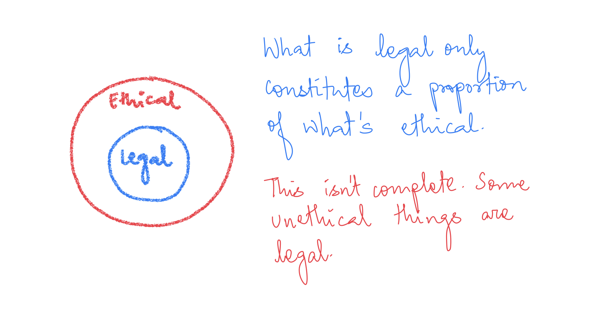

At times in your life, you will arrive at a point when you need to decide between the two equally good sounding options. You will feel one of the choices is "right". Other isn't. One of the picks will result in instant gratification. The other will give you long term benefits. Arguments exist for both sides, but you, probably like me, remain confused.

I have thought over this question for a long time. It keeps biting me. I arrived at some conclusion; you're welcome to question it. My ascertainment and the rest of this article is based on anecdotes and some limited literature.

------------------------------------------------------------------------

[Prof Biswanath Swain](https://www.linkedin.com/in/biswanath-swain-93b792126/?originalSubdomain=in)'s philosophy class was my first introduction to these complicated concepts. He started the course by noting the difference between law and ethics. If you were to understand them with Venn diagrams, laws would lie inside the circle of ethics. Therefore, even if something isn't explicitly prohibited, it's not the ethical thing to do.

> What is legal only constitutes a proportion of what's ethical. This rule isn't complete. Some unethical things are legal, unfortunately.

Next, he taught us about the various ethical perspectives. Law of Means. Aristotle. Egoistic Approach. More like them. However, utilitarianism stood out to me. It was a bit different from the others. It understood that decisions would lead to some people's happiness and others' suppression of interests. It suggested looking for "maximum happiness of maximum number". Another argument attacked it, saying this logic of utilitarianism could justify genocides. That argument is overblown, but I got the idea. This theory could not give me *exactly* correct answer to what is right.

Few years later, I took a [business ethics live-workshop class](https://philpapers.org/rec/RAMILC) by Profs G Venkat Raman, Swapnil Garg and Sneha Thaplial.[^1] We discussed [Volkswagen dieselgate](https://en.wikipedia.org/wiki/Volkswagen_emissions_scandal) fiasco, which was unfolding right before our eyes. Before taking that course, I had concluded that Volkswagen's managers were blamed for the debacle. However, after reading the case materials, I realised it was more than that. They were not the only ones who had wronged.

[^1]: Venkat Raman, G., Garg, S., & Thapliyal, S. (2019). Integrative live case: A contemporary business ethics pedagogy. *Journal of Business Ethics*, *155*(4), 1009-1032. [PDF](https://link.springer.com/content/pdf/10.1007/s10551-017-3514-6.pdf).

The most striking point was when the company asked the customers to bring back the car so that Volkswagen could plug out the questionable diesel device. The consumers refused to bring the cars back. They didn't want low mileage cars -- who cares about pollution more than the government itself!

I read about Martin Winterkorn[^2] and other executives' opinions. They weren't grossly wrong -- car companies need to sell their cars. Regulations about air pollution are stringent, and consumers demand high mileage at a low price on extreme ends. They broke the law by hiding that the cars were polluting in the real world. However, it didn't affect them a lot as a company. The sales barely dropped in the US and remained more or less the same elsewhere.

[^2]: Martin Winterkorn was CEO of of Volkswagen AG, the parent company of the Volkswagen Group, chairman of the supervisory board of Audi, and chairman of the board of management of Porsche Automobil Holding SE. Winterkorn was criminally indicted over the emissions cheating scandal in the United States on 3 May 2018 on charges of fraud and conspiracy. In April 2019 he was criminally indicted on charges of fraud in Germany. He is currently a fugitive of justice in the United States, and is wanted by the Environmental Protection Agency for Conspiracy to Defraud the United States, Conspiracy to commit wire fraud, Conspiracy to violate the Clean Air Act, and three counts of Wire Fraud. Source: [Wikipedia](https://en.wikipedia.org/wiki/Martin_Winterkorn).

Then, I also watched the movie and read the case of Enron. A plethora of things that went wrong. Before the stock price toppled, they were sky high -- an excellent point for shareholders. "The management's duty is to its shareholders", according to Milton Friedman. Managers are supposed to make the checklist that enhances shareholder values and wealth.

> I am a management student, so I do picture myself in such a situation someday. What would I do? More importantly, what should I do?

To prepare for that day, I decided to build on a framework to determine the ethics based on my limited understanding. At the very least, I won't regret choosing an apple over an orange twenty years down the line. I borrowed a large part of it from Bhagwat Gita, an excellent life book that first my mother suggested I read, and always kept a copy with me ever since.

------------------------------------------------------------------------

First, I should decide what my *karma* is --- the purpose.[^3] The Matrix (movie series) showed that even a program has its karma and purpose. I am here for a specific task which I should pursue at all costs. A CEO must increase shareholder value. A family guardian must take care of family members. A police officer must guard the city and its residents. *Yama* must let people die when it's their time.[^4] It's their sacred duty.

[^3]: Many people, especially westerners, think of *karma* as the principle of cause and effect. That is somewhat true. *Karma* in Sanskrit stands for duty. It is only an obvious corollary that your actions determine the results. That doesn't mean *only* your actions determine the results, there are more factors at play. Hinduism says rebirth as a human occurs every 8,400,000 births and that includes being reborn as a different species. I probably don't believe in rebirths; certainly not that my actions in human life are going to determine my happiness as an amoeba in next one.

[^4]: Yama is Hindu god of death, dharma (righteousness) and the world of dead. [Wikipedia](https://en.wikipedia.org/wiki/Yama).

Then, I should understand that my stay here is forever. It is a long journey that I must undertake. Even I want to reference immortal *atman* (soul) being reborn here, but that would make it very dramatic.

> These two rules (karma and immortality) would lead you to a definite answer in most cases. Right or not, that's another debate -- who decides what's right anyway -- but at least you won't have regrets.

Keep in mind two things: your duty and the axiom everything is a part of the journey. It will help you decide what is right: when you have to choose between the options, X and Y, choose the one which is your duty to, not forgetting the long-term impact of the decision.

------------------------------------------------------------------------

To exemplify, consider the case of Volkswagen. Winterkorn and other executives were supposed to do what would give them the highest returns for their shareholders. Then the question is, what did they do wrong? They undertook something illegal, something which would not enhance shareholder value in the long term. And as I stated earlier, shareholder values not only consist of wealth but are more than that. They did something illegal in their business -- their karma. So, they failed in their karma.

But what happened with Enron? They didn't do something illegal in their business *per se* (at least in their mind). Their mistake was that they didn't think about the impact in the long term. They increased shareholder values for a short period. Still, they harmed the company in the long run, knowing beforehand that bloating stock prices isn't a lasting solution. That's a violation of the second rule that businesses last long.

These two rules (karma and immortality) would lead you to a definite answer in most cases. Right or not, that's another debate -- who decides what's right anyway -- but at least you won't have regrets.

------------------------------------------------------------------------

Thanks for stopping by my digital garden. If you're visiting for the first time, here's a quick guide. You can find my academic [publications](https://www.harsh17.in/publications/), fun [projects](https://www.harsh17.in/project/) I\'ve tried, stuff I\'d like people to [care](https://www.harsh17.in/talk/) about, some random [musings](https://www.harsh17.in/blog/) and [notes](https://www.harsh17.in/note/) on my favourite things.

If anything looks useful to you, [please tell me](mailto:hello@harsh17.in).
