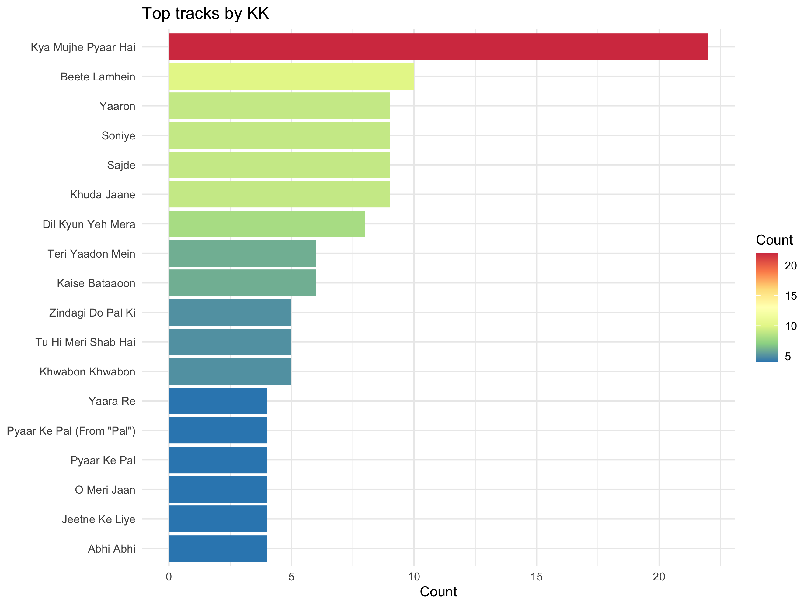
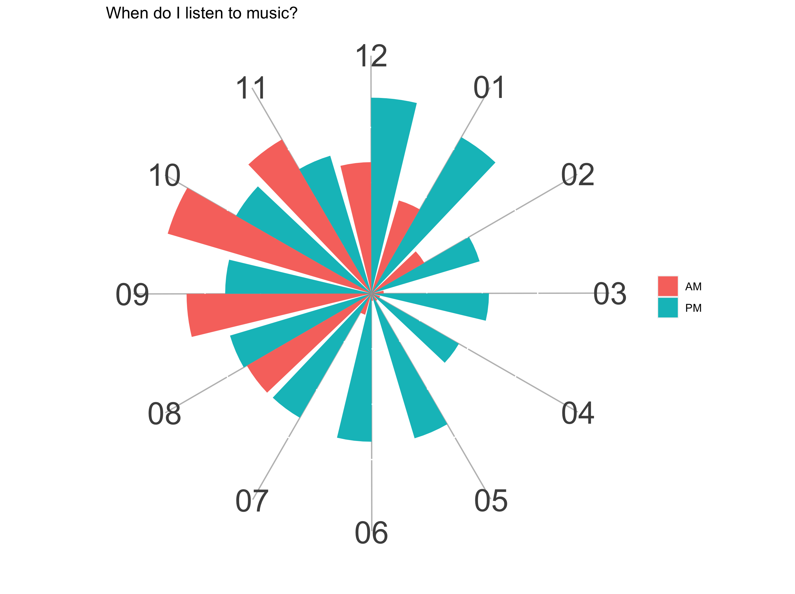

I have been using Spotify for two years now. I was always curious to know my listening trends, which is why I started using last.fm and other tools like that. However, they didn't give me exact information as to what I listened -- the insights Spotify gave me were limited to what Spotify thought! I couldn't know more about which artists I listened to, what were the top songs from that artist and so on.

Therefore, I looked up for my listening data on Spotify (thank you, GDPR!) and then made some nice plots for inferences.

## Getting Streaming History

Spotify allows you to download all your data through its [accounts webpage](https://www.spotify.com/us/account/privacy/). First, you need to request for all your data. This step will take something between a day or a fortnight depending how much you listen. For me, it took two working days and I got two files on streaming. Again, for heavy listeners, there will be more files.


# Let's Play Some Music!

First, we will load the streaming history files in R. If there are multiple files, read them all one by one like I've done here. Finally, combine all of them together. Don't forget to remove the ones you don't need -- it takes a lot of run-time memory.


```r
history1 = fromJSON("StreamingHistory0.json", flatten = TRUE)
history2 = fromJSON("StreamingHistory1.json", flatten = TRUE)
 
st = rbind(history1,history2)
rm(history1,history2)

# what does the dataframe contain.
head(st)

           endTime     artistName            trackName msPlayed
1 2019-07-26 03:23    A.R. Rahman Ok Jaanu Title Track   206250
2 2019-07-26 03:26    A.R. Rahman            Enna Sona   213632
3 2019-07-26 03:27    A.R. Rahman             Jee Lein    42292
4 2019-07-26 03:39 Vishal Dadlani              Adhoore   104396
5 2019-07-26 09:25        Karthik            Behene De    11719
6 2019-07-26 13:03 Vishal Dadlani       Swag Se Swagat   235944
```

## Artists

To find out which artists I listen to most, let me make a visualisation for the same.



  


  
  ```r
  st %>%
  count(artistName, sort = TRUE) %>%
  top_n(15) %>%
  mutate(artistName = reorder(artistName, n)) %>%
  ggplot(aes(x = artistName, y = n)) +
  geom_bar(aes(fill=n),   
           stat="identity") +
  scale_fill_distiller(palette="Spectral") +
  xlab(NULL) +
  coord_flip() +
  labs(x = "Artist",
       title = "Artists I listened most to",
       fill = "Count") +
  theme_minimal()
  ```
  * count(artistName, sort = TRUE) is going to count all the artists as their total count is going to tell me how many I listen to.
  * top_n(15) is going to give me top 15 entries.
  * mutate(artistName = reorder(artistName, n)) will reorder the tibble, sorted by their counts.
  * geom_bar() is used for barplots, scale_fill_distiller() is used for colourful and continuous scale. Rest functions are for cosmetic reasons.



As you can observe, I listened most to Arijit Singh, Pritam and AR Rahman. The top non-Indian artist here is Post Malone and Billie Ellish -- and only two in top 15. This is not surprising as I mostly like Bollywood artists as they mix classical and pop really well.

## Tracks

Again, I will make a visualisation and use it for inference. The functions and explanations are the same as in artists.



  


  
  ```r
  st %>%
  count(trackName, sort = TRUE) %>%
  top_n(15) %>%
  mutate(trackName = reorder(trackName, n)) %>%
  ggplot(aes(x = trackName, y = n)) +
  geom_bar(aes(fill=n),   
           stat="identity") +
  scale_fill_distiller(palette="Spectral") +
  xlab(NULL) +
  coord_flip() +
  labs(y = "Count",
       title = "Tracks I listened most to",
       fill = "Count") +
  theme_minimal()
  ```



In contrast to my top artists, far more non-bollywood songs feature in my top tracks. In fact, three out of top-five tracks are non-Indian.

It is probably because I mostly listen to bollywood and a select few from other genres; but when I do listen other genres, I quickly grow to love them.

## Tracks by Artists

Considering my listening history of artists and tracks give two different pictures, let me see which songs do I really listen to by my top artists.

One line needs to be added for selecting the artists: `filter(artistName == "KK")` before `count()` and after `st`.



  


  
  ```r
  # by KK
  st %>%
  filter(artistName == "KK") %>%
  count(trackName, sort = TRUE) %>%
  top_n(15) %>%
  mutate(trackName = reorder(trackName, n)) %>%
  ggplot(aes(x = trackName, y = n)) +
  geom_bar(aes(fill=n),   
           stat="identity") +
  scale_fill_distiller(palette="Spectral") +
  xlab(NULL) +
  coord_flip() +
  labs(y = "Count",
       title = "Top tracks by KK",
       fill = "Count") +
  theme_minimal()
  ```



## Time of Listening

Finally, I want to what time of the day I listen to most. Now, I could’ve made a barplot but then I remembered of a neat “clock plot” I saw once on [Reddit (r/dataisbeautiful)](https://www.reddit.com/r/dataisbeautiful/). I wanted to replicate it with my own Spotify history.

First, I will take end times in a separate data frame for further use. I’ll reformat it in date-time format using `as.POSIXct()`, and change the time zone to India’s Asia/Kolkata.


```r
df = as.data.frame(st$endTime)
colnames(df) = "endTime"
df$endTime = as.POSIXct(df$endTime,format="%Y-%m-%d %H:%M",tz="GMT")
attributes(df$endTime)$tzone = "Asia/Kolkata"
```

Then, I’ll add additional columns in the dataframe for hour, minute and seconds of time when I finished listening.


```r
df$period = format(df$endTime, "%p")
df$hour = format(df$endTime, "%I")
df$month = format(df$endTime, "%b")
```

Then, I’ll modify the data frame and make it into a count-table by hours.


```r
df_at = df %>% add_count(period,hour) %>% distinct(period, hour, n)
```

Finally, I’ll make the clock plot. I use `coord_polar()` to convert into polar coordinates. The `theme()` is used for cosmetic reasons.


```r
ggplot(df_at, aes(x = as.factor(hour), y = n, fill = period)) +
  geom_bar(stat = "identity", position = "dodge") +
  coord_polar(theta = "x", start = 0.26) +
  xlab("") + ylab("") +
  theme(axis.ticks = element_blank(), axis.text.y = element_blank(), 
        panel.background = element_blank(), panel.grid.major.x = element_line(colour="grey"),
        axis.text.x = element_text(size = 25), legend.title=element_blank()) +
  labs(title = "When do I listen to music?")
```



I listen most in the morning between 8 AM and 12 PM. As the day proceeds, my listening also falls, virtually stopping in the afternoon. It picks up again in the evening and stays at a relatively constant level till around 10 PM.

### Did you like this small exploration? Why don't you try your own and see what you find for your own music!

Please feel free to contact me if you encounter any errors. My email: hello@harsh17.in.
