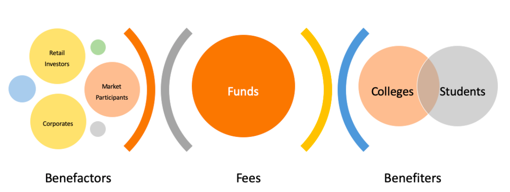
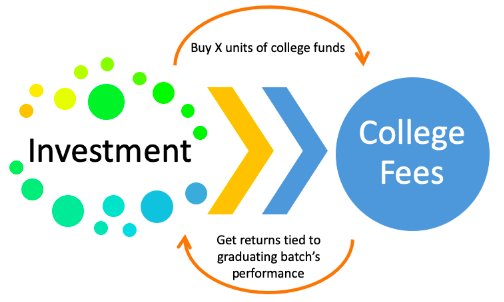

Funding education is probably the most heavily debated topic in recent years, with both sides having equally strong views. Some say education is the state's duty and a citizen's right; others call it the individual's responsibility. But the consensus is that school education is the government's responsibility.

We all know the quality of education in government schools and how competition has made them inefficient. In his book "Free to Choose", Milton Friedman proposed an excellent solution: divide the total government expenditure on school education by the number of students. Allow everyone to use their share to pay for school fees. The schools can then get the funds back from the government. The students would be wary of spending their coupons on bad schools, fostering competition between the schools. Simple yet effective.

> This article is not about funding schools. It is about college education that many won't consider the government's responsibility.

Now, I don't think it's justified to burden the government with the educational expenses of college students. A peasant earning a meagre income shouldn't pay (indirectly) for the education of a future engineer who probably will not help that peasant directly. Everyone who benefits from training should pay for it by themselves. In that spirit, a flexible payment method - like easy access to loans or paying fees when we get jobs are the best solution.

## Sadly, not all have access to loans. 

There could be myriad of reasons — poor or incomplete credit history, inaccessible banks and whatnot. A system where one pays college tuition when they start working is excellent but unfeasible for the colleges as they require money for operations. I had another - in my opinion, better - idea on how to fund a college education.
Every college can make a general fund for each batch of each programme. Everyone (corporates, companies, anyone) can buy units of these funds — something like mutual funds. Then, the entire fund's value divided by the number of students is each student's share. Suppose the fees turn out to be more than an individual student's share. In that case, the student can pool in extra money (and also understand that his course isn't as valuable as the fees charged). 

Why would anyone buy units of these funds? Well, the student will have to agree to "return" a portion of their salary - say 10%. It would be like the Swedish pension scheme where a working professional is paying for the education they received years ago.

## Not all students will be able to return, as not all will be employable.

The return rate can be higher for those college programmes, with an agreement with student to return higher to the fund back. These "colleges funds" will be valued by the market, considering the most recent developments (assuming the efficient market hypothesis is true to an extent). The colleges get their fees irrespective of fluctuations in the graduate's job outlook since these college funds will launch at the start of every academic year. The investors undertake all risks for the gestation period (when the student is in college). These risks are represented in the "returns" - what portion of their salary a graduate has to return.

This solution can keep all stakeholders - colleges, students and corporates - happy together. But, of course, there are severe ramifications to this plan. Who will ultimately manage this fund? Do colleges have capabilities to handle schemes like these? These are all genuine but solvable questions. When it comes to implementation, I'm confident we can get experts who have sufficient abilities to execute such funds.

I'm also reasonably confident this isn't going to be implemented anytime soon. We couldn't pull off the coupons in the school system despite their showcased success. I'm not so optimistic about this getting executed.
