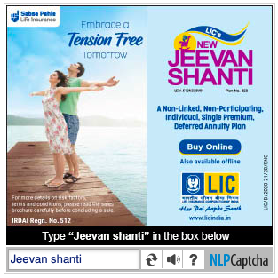

I realised IRCTC's captcha system is a brilliant move. Why? Well, you can't do away with captcha systems. They are everywhere identifying robots from humans. At the same time, people don't want to see ads, and everyone uses ad-blockers specifically for that purpose. Why not integrate something indispensable with something disliked?

That's what IRCTC did.

You will have to read the ad to know the captcha code. By asking you to type "Jeevan shanti" as code, it naturally anchors you to choose this LIC insurance product over others when you buy insurance products next time.

The system is provided by [Simpli5d](https://nlpcaptcha.in/en/index.html), which also boasts of customers like Axis Bank, Tata, Visa, Volkswagen, and many more.
