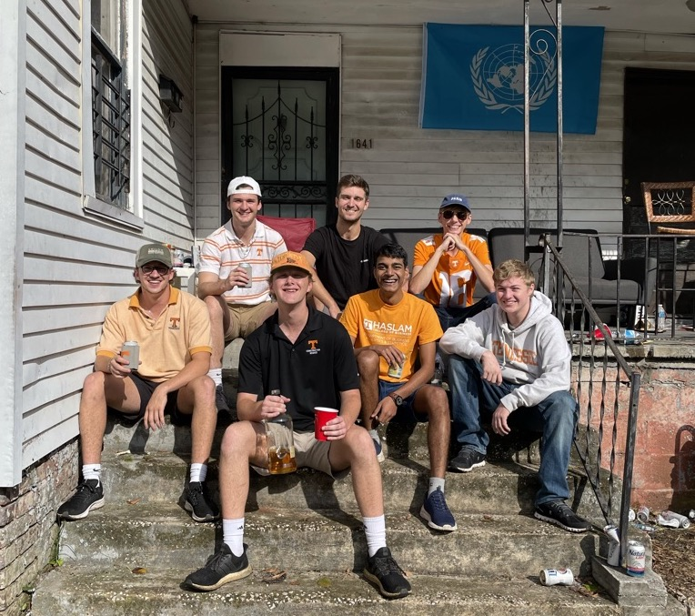

I recently moved to United States (USA or America as everyone calls it) for my PhD at the Haslam College of Business, University of Tennessee. Travelling during the pandemic is a major safety issue. Though vaccinations are common these days and I am fully vaccinated, I can't assure the same for all my fellow passengers. Airlines require and provide masks and sanitisers during travel but we all know its not enough. With these little risks, I left my home on July 20, 2021 to start the new phase of my life.

US surprised me with the ease they had with COVID-19. Maybe the high vaccination rates or too much exposure to COVID-19 was the reason they were so confident. I was distancing away from crowds but the Americans didn't have that [reluctance](#masks-and-vaccination).

In the next few paragraphs, I will write about a few uncanny things I learnt about USA. Some are cultural shocks, others are technological shocks.

# Masks and Vaccination

It was probably a smart decision by CDC to stop the mask mandate as its enforceablity is seriously dubious if the general population doesn't *trust* its effective. The vaccine hesitancy really caught my eye. Unlike India where vaccine supply was the limiting factor on how many people were vaccinated, Americans chose not to get vaccinated despite easily available vaccines.

I had some tangential idea of it as India actually has one of the lowest vaccination hesitancy rates, but seeing it unfolding in front of my eyes was surprising. Most Indians think vaccines are important, safe and effective. However, Americans tend to doubt the importance, safety and effectiveness of vaccines. [Source.](https://ourworldindata.org/vaccination#how-many-people-support-vaccination-across-the-world)

Thankfully, with the fear of the Delta variant the vaccination rates are picking up. (On a sidenote, I still wonder if they should increase the gap between the dosages (for Pfizer or Moderna vaccines) to make them more effective.)

# Public Transport

Public transport is not a popular option for travelling within United States. Transport systems do exist in major cities but their frequency of operation is surprisingly low. For traveling between states, you either have the option of ill-timed bus services like Greyhound or claustrophobic flights. Amtrack railways are only present in around thirty cities.

My experience with interstate buses wasn't positive. I booked a Greyhound bus from Knoxville, TN to Columbus, OH and the bus was seven hours late! The operator on duty shared it was due to acute shortage of drivers. [More on employment.](#employment) I was satisfied with KAT buses (Knoxville local transport), though their frequency of once in an hour could certainly be improved.

Cars are the primary mode of transport here. Most residents own a car and use them as their primary transport --- no matter the distance to cover. In India, we use cars for traveling within cities or between two cities if the timings of railways or buses aren't as per our convenience. Since public transport are an inferior alternative in US, cars are the end-all-be-all medium of travel.

Absence of public transport is enraging in certain instances. For my new apartment, I needed to buy a some furniture but couldn't figure how to transport them from the store to my home. Everyone expected me to have a truck!? When I enquired how people move their furniture if they do not have trucks, they suggested me to check out U-Haul. U-Haul rented me trucks but I had to drive them myself. How would I know how to drive a truck!?

# Payments

Almost everyone here has a credit card and that's the backbone of payments. However, if you are new in the system like I was and do not have social security set up yet, you cannot get a credit card. Further, credit card payments are not instantaneous and free. I had a habit of scanning the ubiquitious [UPI](https://en.wikipedia.org/wiki/Unified_Payments_Interface) QR codes for payments and I expected the payment system to be free, fast and safe.

Recently Venmo and Cashapp became popular which are like Paytm wallet that we had in India before 2014. However, you are still linked to one app only and cross-app transfers are not possible. Their best payment system is ten years behind the current payment system of India. Google had [recommended](https://www.firstpost.com/tech/news-analysis/google-writes-letter-to-us-federal-reserve-to-adopt-upi-like-payments-mechanism-draws-cheers-among-indian-entrepreneurs-7782441.html) Federal government to implement the Indian UPI-like system in US. I hope they launch something like it soon.

# Food

Servings in US are way more than a typical meal. Unfortunately, there are no half-servings either. For \$6.99, we get a plate full of food that you can eat once, pack, reheat and eat again, pack, reheat and eat again.

Later, I learnt that the servings are huge because many cannot afford to have three square meals and therefore aim to complete their daily calorie requirements with a single meal. Serving half of the food for half the price, and consuming them twice in a day would be a healthier alternative.

It is very easy to spot unhealthy food. McDonalds and Burger King are affordable and easy to find. However, fresh fruits, vegetables, salads, meat, etc. is much more expensive and elusive. How come fresh uncooked chicken is more expensive than a chicken burger!?

# Wastages

**Water:** The shower knobs in bathrooms cannot control the intensity of water flow; only the temperature. Guess the amount of water that's simply wasted during temperature adjustment or even during shower. (Sometime in November 2021 my roommate Jack told me I could control the temperature actually. The knob that controlled temperature also controlled water flow. Bad design, but at least that's something.)

**Electricity:** The electrical plugs do not have a switch for the socket. If its plugged in, its switched on. Imagine the electricity wasted because you didn't unplug your rice cooker or oven. In fact, certain equipments are never switched off at all!

**Plastics:** In India, I was charged for every single plastic bag to deter me from using plastics and using my own bags. In US, I brought five items and the shopkeeper gave me six bags --- for free.

### Employment

Economic impact payment [may](https://www.barrons.com/articles/us-unemployment-labor-shortage-fed-51627664723) have some effect on it, but there are so many places looking for people to hire. McDonalds, Walmart, Aldi, or literally any place that requires humans for service is currently hiring. All this, while the unemployment is so high!

### Identity

In India, we had Aadhaar that is used for all identification. We can get it easily, it is linked to all biometric prints and its basically a QR code and a number. Even that number can be masked with temporary numbers!

In comparison, US has something called Social Security number that people put in their best to hide. If the number is leaked, there could be dire consequences. Why can't they be masked? For identification required during travel, if you do not have a driving licence, you have to rely on your passport for identification. I do not think carrying passports while travelling everytime is optimal.

Carrying these identification's physical copy is risky and unsafe. You can lose them or end up exposing them to unintended audiences. In India, I could have a single Digilocker account which carried all my papers and documents that were accessible for more than identification. I wish US launches some similar digital identification for all.

> These shocks make me appreciate how far have we (India) come today. Internet certaily has been the driving force. I have deeply believed India is the future and would be the place where the world would look up to in the next decade. All these only make my conviction stronger.
