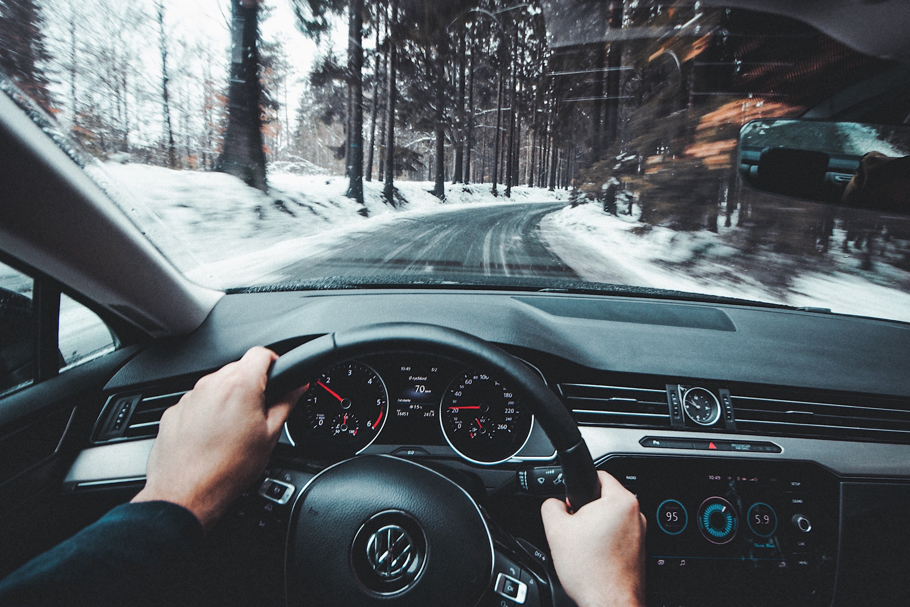
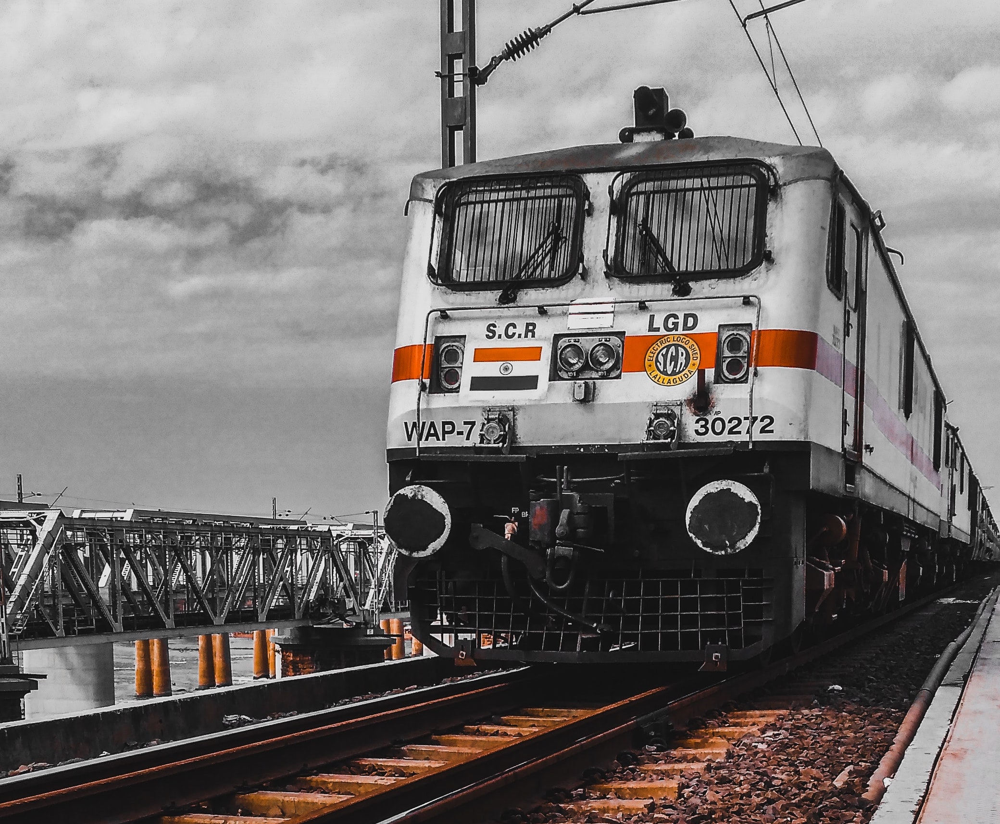
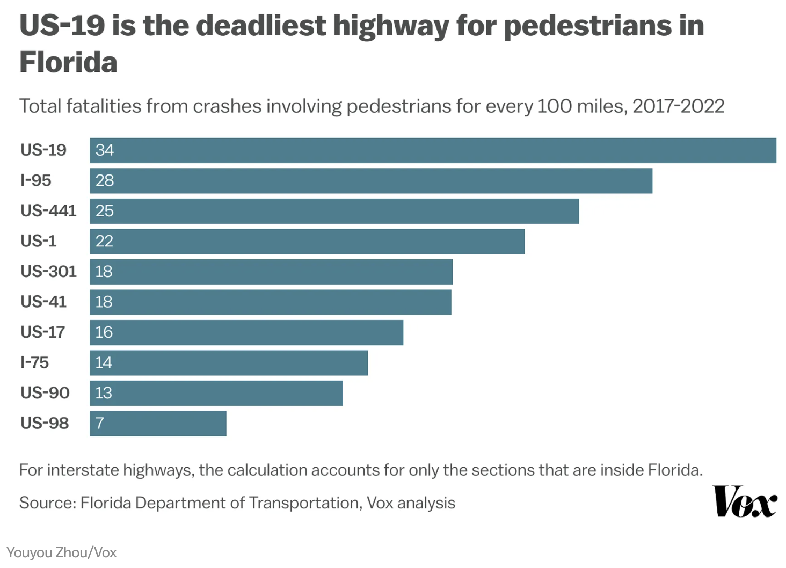

Driving is probably the riskiest adventure you do all through the day. In fact, Americans spend over 71 billion hours on the open roads in a year.[^1] The risk of accident while driving is much higher than most other adventures we undertake. Skydiving? One in 500,000.[^2] Mountaineering? One in a thousand.[^3] Driving? One in 400.[^4] Still, cars are the preference in the US. I guess habits are more potent than reason.

[^1]: According to American Driving Survey conducted by AAA Foundation for Traffic Safety. See [Zeke Hartner, WTOP](https://wtop.com/dc-transit/2019/02/highway-stars-survey-shows-americans-spent-71-billion-hours-on-the-open-roads-in-a-year/) for more details.

[^2]: Statistics show that there is one tandem student fatality for every 500,000 tandem jumps. See [Oklahoma Skydiving](https://oklahomaskydiving.com/blog/how-safe-is-tandem-skydiving/) for more details.

[^3]: [Rauch et al. (2020)](https://www.ncbi.nlm.nih.gov/pmc/articles/PMC6981967/) found an incidence of 2.5 accidents per 1000 mountaineers or 5.6 injuries per 10,000 hours of mountaineering. I have rounded the number for the purpose of my argument.

[^4]: According to [Esurance](https://www.news9.com/story/5e6fca6cf86011d4820c3f2d/what-are-your-chances-of-getting-into-a-car-accident), the chances of an average American into a car accident during a 1,000 mile long trip are 1 in 366. I have rounded the number in my argument.

# Europe vs the United States

Public transport in Europe is built differently. You'd see colossal parking lots for people flying out of the cities at the airports. The general trend is to get to the airport and then fly out. Contrast this with the US: people just drive through states with their luggage.

There are good reasons for their choices, of course. Gasoline is cheaper in the US than in most of the world, thanks to billions of dollars spent researching how to make shale oil useful.[^5] Road connectivity in US is probably the best I've seen so far.[^6] The interstate system connects almost all cities and almost every region is accessible.

[^5]: [Bloomberg](https://www.bloomberg.com/news/articles/2021-06-17/after-blowing-300-billion-u-s-shale-is-finally-making-money) has an excellent article on the topic: "After Blowing \$300 Billion, U.S. Shale Finally Makes Money".

[^6]: My Chinese friends disagree but I can only confirm once I visit China myself.

In contrast, Europe provides the best locality for air travel. The area is full of mountains and difficult to drive terrain. Small-sized countries have at least one airport in their capital cities, and flights between countries are economical for obvious reasons.

# Indian Railways: The Lifeline of India

Indian railway systems are economical for very different reasons. The peninsula allowed for dense railway tracks around the country. Coincidentally, high population density and high overall population ensure ridership volumes. The system is not profitable, but it doesn't have to be.

The profitability of public utilities is a capitalist (and possibly American) concept. They wouldn't be "public utilities" if they were profitable --- they'd be business ventures. Some activities are not worthwhile for business, but we do them because they are necessary. Wars are largely non-profitable, but we still have them. Then why not public transport?

# Pitfalls of Car Dependency

However, the biggest reason is that not everyone can afford private transport. Cars are expensive, even if you ignore gas prices. Every month, you would spend \$200 on insurance, another \$200 on a parking permit --- and that's aside from the \$500 you pay for your car loan. In contrast, I can travel from any place to any place in India for a little over \$20. In many European countries and cities, they are free!

Disadvantaged communities do not have equal access to necessities. I understand Right to Travel isn't a fundamental right, but the existence of government goes beyond ensuring fundamental rights. Milton Friedman identified four essential government roles in his book Free to Choose. The fourth one was helping disadvantaged communities in the best possible way --- the government's indirect support or direct activities.

Some communities cannot travel from one place to another in the US only because they cannot afford a car. A single flight costs a fourth of their monthly income. Wouldn't Friedman be sad about this reality?

Another limitation is innovation. Somehow we have stopped being creative about public transport. New technology in travel is mainly incremental than revolutionary. Bullet trains are almost sixty years old now. The boring company started an initiative, but it's experimental and not scalable. (It is in LA only because Musk lives in LA; there are no plans to expand.) We strive for improving our train speeds or have Twitter spats over leg space. We have accepted that they are expensive and stopped innovating to reduce the price!

# The Future of Public Transport

An excellent public transport system also helps the world be greener. It is easier and cheaper to design electric buses and trains than electric cars. Elon Musk's Tesla is a strong force on making cars electric, but it will be a long while. Musk's original electric vehicles plan is to iterate from a sports car like Ferrari to a general-purpose car like Honda Civic. We are still around the sports car stage, and having all-electric vehicles would be a long shot.

A thriving public transport system is essential to the development of a country. It normalises opportunities for everyone and supports the environment. Some day if I had to design a country's public transport system, I would look at the road transport in the US, railways in India and flights in Europe for inspiration.

---

# America's deadliest road: New Port Riche, Florida 

*Added on November 12, 2022.*

There is something I would like to add to this post. Today, Dea shared a video on America’s deadliest road. US-19 in New Port Riche, Florida. A group of researchers found 60 pedestrian hotspots in the US. This 1 km stretch topped their list.

It has got a lot to do with how the cities are designed.

> Along the road is a panoply of American consumerism: Walmart, Publix, tattoo parlors, chain hotels, motels, 7-Elevens, multiple Dunkin’s, medical equipment stores, condemned buildings, strip clubs, auto body repair shops, oil change places, custom paint job businesses, chain restaurants, deserted property waiting to be redeveloped, and a mini-golf course where you can feed baby alligators, fenced in near the sidewalk.

> Walk along this road, and you might begin to notice the danger. The speed limit is 45 to 55 miles per hour, but the cars are often going much faster. The crosswalks are so few and far between that a simple act — crossing the street to get to a business a few hundred feet away — might mean walking over half a mile to reach the nearest crosswalk. Even with sidewalks set back from the road, it’s clear that US-19 wasn’t built for pedestrians.

### Why is it this bad?

Experts would tell you that speed is the first cause. When drivers ride at 15 miles per hour (25 km per hour), they have broad peripheral vision. They only need 25 feet of distance to respond and stop. The peripheral vision narrows at 50 miles per hour (80 km per hour). They require 118 feet of distance to react and stop—three times the speed results in almost five times the length needed to stop. The pedestrian fatality risk increases to 85% from 2% at 15 miles per hour.

Another cause is the number of lanes. 97% of the cities that had pedestrian fatalities had multiple lanes. This stretch of road has eight lanes. Once you start crossing, you must ensure you get all eight lanes. [Chicken road crossing game, anyone?](https://app.codemonkey.com/games/V12KldVD) The more lanes, the more the risk. The road is also straight as a ruler. There are no curves or bends to slow down the cars. The road is also wide. The cars can go at 80 km per hour without any problem. The posted speed limit is 45 miles per hour (72 km per hour).

Arterial roads are a problem too. It is a design where car-centric design mingles with residential neighbourhoods. 

> These roads make up only 13% of the US road network but are sites of 40% of all pedestrian fatalities. 

Since the distance between the two crosswalks is a km or around 3300 ft, people resort to jaywalking. (By the way, the more appropriate term is crossing at a location where there is no signal. Jaywalking is a term invented by automobile lobbyists to blame pedestrians for their deaths. Before the 1930s, crossing the road anywhere you wanted was socially and legally acceptable.)

You can learn more about it in this Vox video.

<iframe width="560" height="315" src="https://www.youtube.com/embed/0-nthHT-J1k" title="YouTube video player" frameborder="0" allow="accelerometer; autoplay; clipboard-write; encrypted-media; gyroscope; picture-in-picture" allowfullscreen></iframe>

### What can be done?

We have to start reducing the number of lanes. Highways may have eight lanes, but residential areas should not have over a lane. Additionally, install street parking and sidewalks, with several additional crosswalks.[^7]

[^7]: The city design can determine a lot about pedestrarian and bike safefy. Check out this TED talk where Jeff Speck explains how to make cities more [walkable](https://www.youtube.com/watch?v=6cL5Nud8d7w). There has to be a reason to walk, the walk has to feel and be safe, the walk has to be pleasant and comfortable, and the walk has to be interesting.

The government of Florida is spending millions on getting this [fixed](https://www.tampabay.com/news/pasco/2022/09/26/deadliest-road-pasco-county-getting-millions-safety-upgrades/). The mayor is also envisioning to add pedestrian and cyclist bridges, avoiding the need to cross the road altogether.

### Map of New Port Riche, Florida

<iframe width="100%" height="450" frameborder="0" title="Felt Map" src="https://felt.com/embed/map/Untitled-Map-n8Z2x23BQMOVHwilWpTblB?lat=28.179733&lon=-82.750579&zoom=12.579"></iframe>
 

