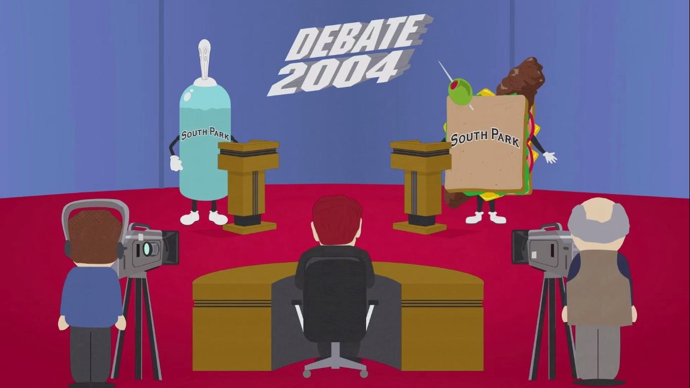

There are three types of arguments.

# You can argue about stuff that happened in the past.

Did you do the right thing? Was it best for everyone, especially the other person in the argument? Most often, this ends up being a blame game. Blame games are value clashes. At all costs, identify such an argument, realise if it's a blame game and avoid it like the plague.

# You can argue about things that are happening right now.

Did we choose the right restaurant for lunch? Is this burger good? Most often, these are opinion clashes. Your preferences are likely different from the other person. Appreciate the diversity of opinions and realise it's likely not an argument. It is a discussion.

# You can argue about things in the future.

These are choices you have to make --- together with the other person. You must explain your preferences, and the other person does the same. It is the only argument worth having, the one with a potentially useful result.

In such cases, make an effort to reach an understanding. We might still have differences --- fundamental value differences --- but strive for common ground. Believe it or not, you will always have some common understanding of the issue. Start from first principles of why it makes sense for them and formulate when you start diverging.

The end goal is not to reach an agreement but to be aware of each other's understanding.

