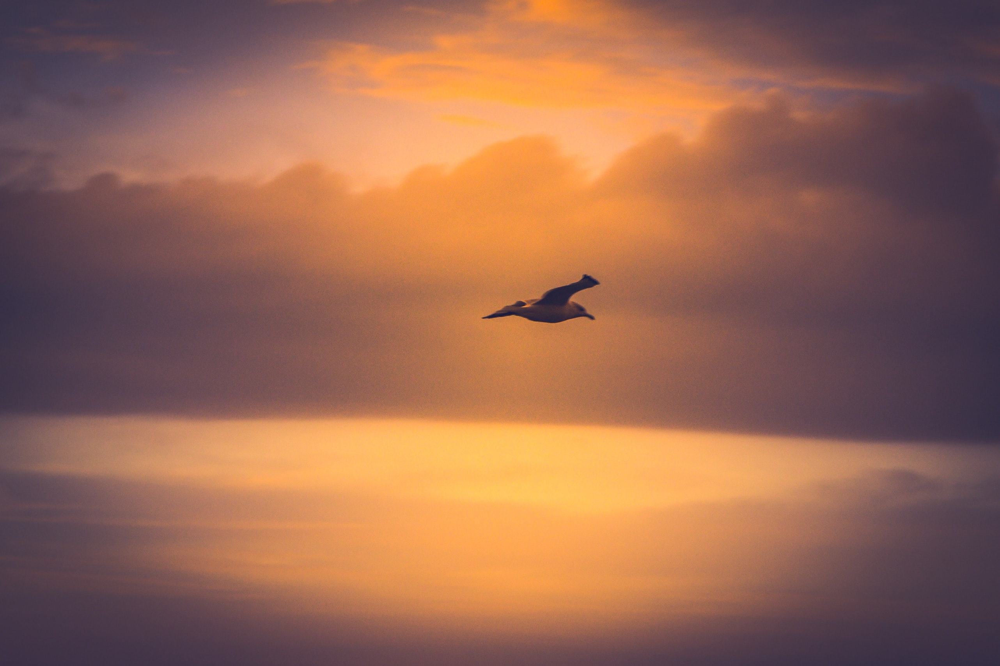

**जब मैं छोटा था, शिवमंगल सिंह सुमन की ये कविता मेरे बड़े करीब थी। "कनक-तीलियों से टकराकर, पुलकित पंख टूट जाऍंगे" मुझे आज भी झकझोर कर रख देता है। छोटी आशाओं को पूरा करने की कोशिश में हम कब सोने के पिंजरे में कैद हो जाएंगे, हमें एहसास भी नहीं होगा। लेकिन मैं पंक्षी हूँ उन्मुक्त गगन का, या मेरी सांसों की डोरी तनेगी, या मैं अकुल उड़ान करूँगा।**

------------------------------------------------------------------------

हम पंछी उन्मुक्त गगन के\
पिंजरबद्ध न गा पाऍंगे\
कनक-तीलियों से टकराकर\
पुलकित पंख टूट जाऍंगे ।

\
हम बहता जल पीनेवाले\
मर जाऍंगे भूखे-प्यासे\
कहीं भली है कटुक निबोरी\
कनक-कटोरी की मैदा से ।\
\
स्वर्ण-श्रृंखला के बंधन में\
अपनी गति, उड़ान सब भूले\
बस सपनों में देख रहे हैं\
तरू की फुनगी पर के झूले ।

\
ऐसे थे अरमान कि उड़ते\
नील गगन की सीमा पाने\
लाल किरण-सी चोंच खोल\
चुगते तारक-अनार के दाने ।

\
होती सीमाहीन क्षितिज से\
इन पंखों की होड़ा-होड़ी\
या तो क्षितिज मिलन बन जाता\
या तनती सॉंसों की डोरी ।

\
नीड़ न दो, चाहे टहनी का\
आश्रय छिन्न-भिन्न कर डालो\
लेकिन पंख दिए हैं तो\
आकुल उड़ान में विघ्न न डालो ।

