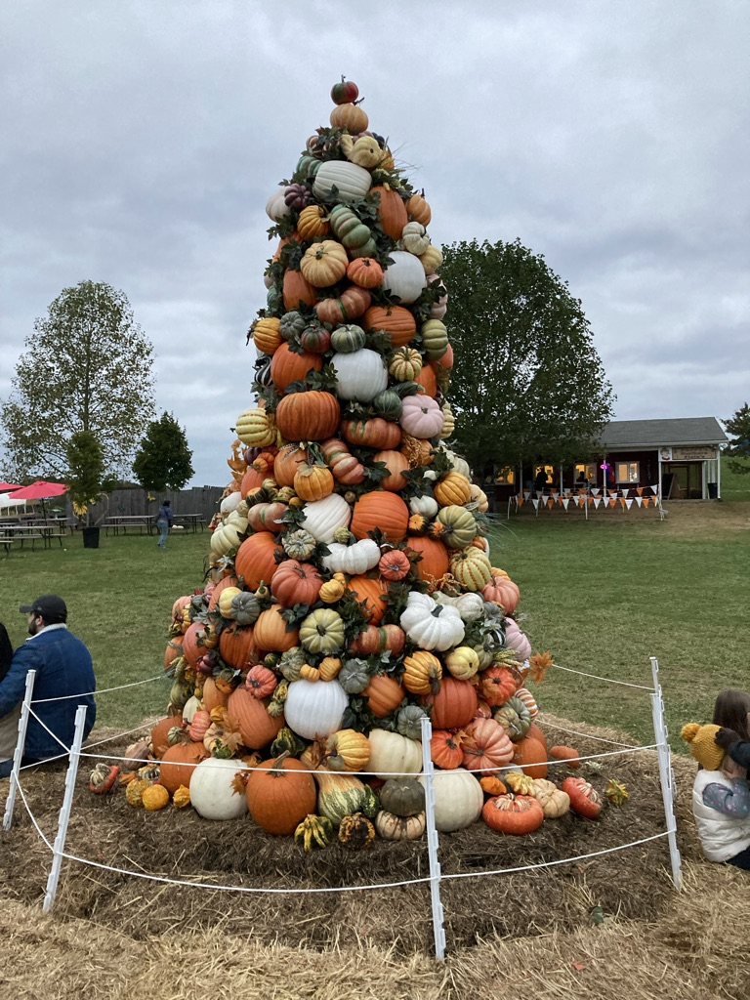

People tell me I'm too optimistic. Maybe. But why not?

Things are bad. We know that; everyone knows that. But you can choose to look at the positives. Granted, we'll sometimes be cherry-picking. But not always. Life is like a box of chocolates; there will be good things about every negative thing and bad about most positive things. I want to be happy, so I look at the positives.

But the situation isn't as dire either. Historian [Howard Zinn](https://www.goodreads.com/book/show/16192.You_Can_t_Be_Neutral_on_a_Moving_Train) beautifully explains why we need to be a little more hopeful.

> To be hopeful in bad times is not just foolishly romantic. It is based on the fact that human history is a history not only of cruelty, but also of compassion, sacrifice, courage, kindness.
>
> What we choose to emphasize in this complex history will determine our lives. If we see only the worst, it destroys our capacity to do something. If we remember those times and places---and there are so many---where people have behaved magnificently, this gives us the energy to act, and at least the possibility of sending this spinning top of a world in a different direction.
>
> And if we do act, in however small a way, we don't have to wait for some grand utopian future. The future is an infinite succession of presents, and to live now as we think human beings should live, in defiance of all that is bad around us, is itself a marvelous victory.

The crowd is often angry not at how things happen but at the individuals involved. Usually, it is because we already have an opinion on how things should be and are irritated to see the other way. It is maybe worthwhile to understand that they are trying their best. Or maybe, they didn't realised the extent of their actions. Do you think through all your decisions before you take them?

There's a small story that I want to share from [The Little Prince](https://www.goodreads.com/book/show/157993.The_Little_Prince), who is on a tour of the world. On the first asteroid that he visits, he meets a strange king. The king has an uncontrollable urge to command everything. However, unlike present-day dictators, he is wise and prudent. When the prince meets him after a long journey, he yawns, facing him.

> "It is contrary to etiquette etiquette to yawn in the presence of a king", the monarch said to him. "I forbid you to do so!"
>
> "I cant help it. I can't stop myself", replied the Little Prince, thoroughly embarrassed. "I have come on a long journey, and I have had no sleep."
>
> "Ah then" the king said. "I order you to yawn. It is years since I have seen anyone yawning. Yawns, to me, are objects of curiosity. Come, now! Yawn again! It is an order."

The king expects an obedient pupil. He is disobeyed but with respect. The king doesn't realise that he wants a charming subject. Everyone following his benevolent rules quickly gets boring. It isn't that he wouldn't like order in his state, but if everyone follows his rules strictly, then it is disinteresting.

Later on, he is impressed by the prince's naturality. He offers him the position of Minister of Justice in his court. The little prince declines: "there is nobody here to judge".

One of the reasons why we do choose to look at the negatives is because we judge the results instead of being [curious](/stoned-to-death-at-the-public-square/) about the path that lead to it.

The final reason why we should look at the positives is because it is genuinely more fun. My friend told me she didn't like the Netflix adaption of Jane Austen's Persuasion. It its attempt to appeal to current generation of viewers, the producers had diluted the essence of story. Many elements that stood out --- Anne Ellliot's innocence and inability to take a stand for herself --- is far more vivid in the novel than in the movie.

Dialouges have changed too. "Now we're worse than exes, we're friends," no one would say that in the nineteenth century. The [colour-blind casting](https://en.wikipedia.org/wiki/Color-blind_casting) takes away authenticity too. It is difficult to imagine such a diverse household at that time in history. She's mostly right.

What she does miss is that the movie, nonetheless, is fun. The dialouge about exes and friends made me laugh out loud. It is true the language doesn't fit nineteenth century Britain, but does it have to? The elements of the movie add up for entertainment, not authenticity. Wouldn't we be happier if we enjoyed the movie as it is without having notions of what it should be like? Dakota Johnson certainly pulls it off well.

Next time when you encounter an unexpected situation, cut them some slack. Be a little more optimistic. Maybe they will miss the deadline, but they will still do it. In the long run, that's always a better problem to have.[^1] Prof Sean is right: "Be one standard deviation more positive than the most positive person you know".

[^1]: This idea of missing the deadline but achieving the target comes from [Gwynne Shotwell, President and COO of SpaceX](https://www.youtube.com/watch?v=1b-vAeYTxRA "Gwynne Shotwell, President and COO of SpaceX").
