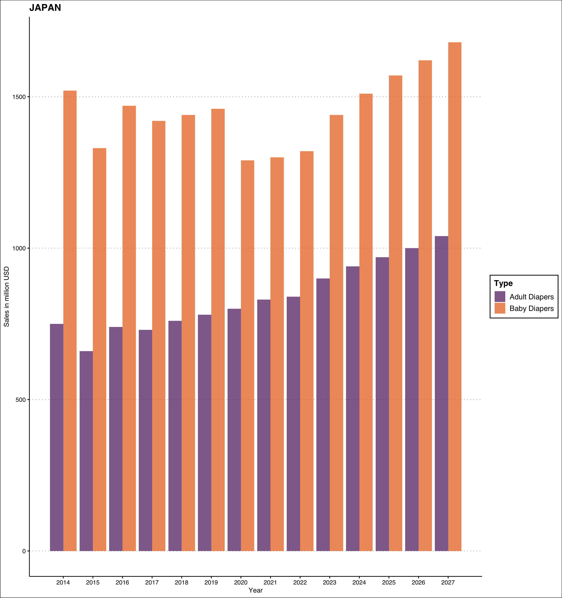
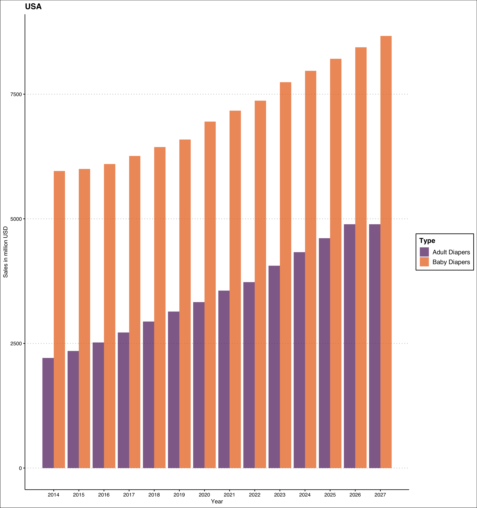
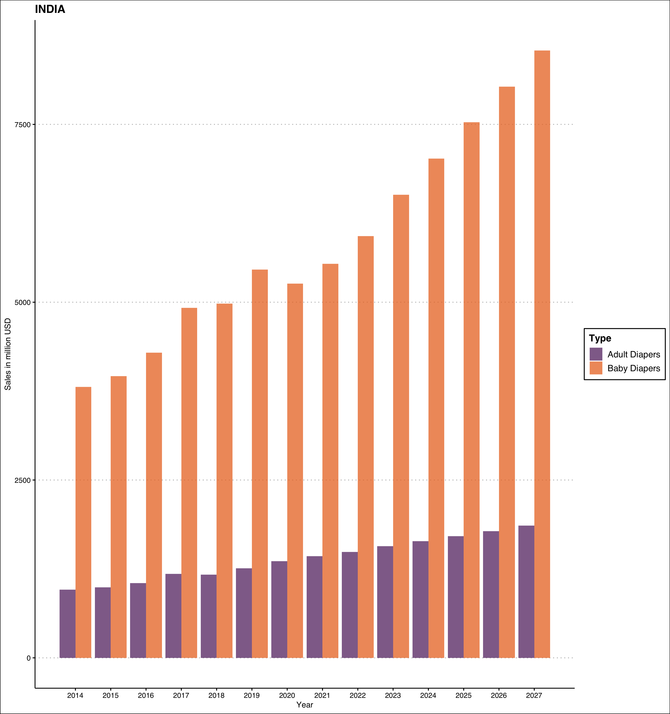
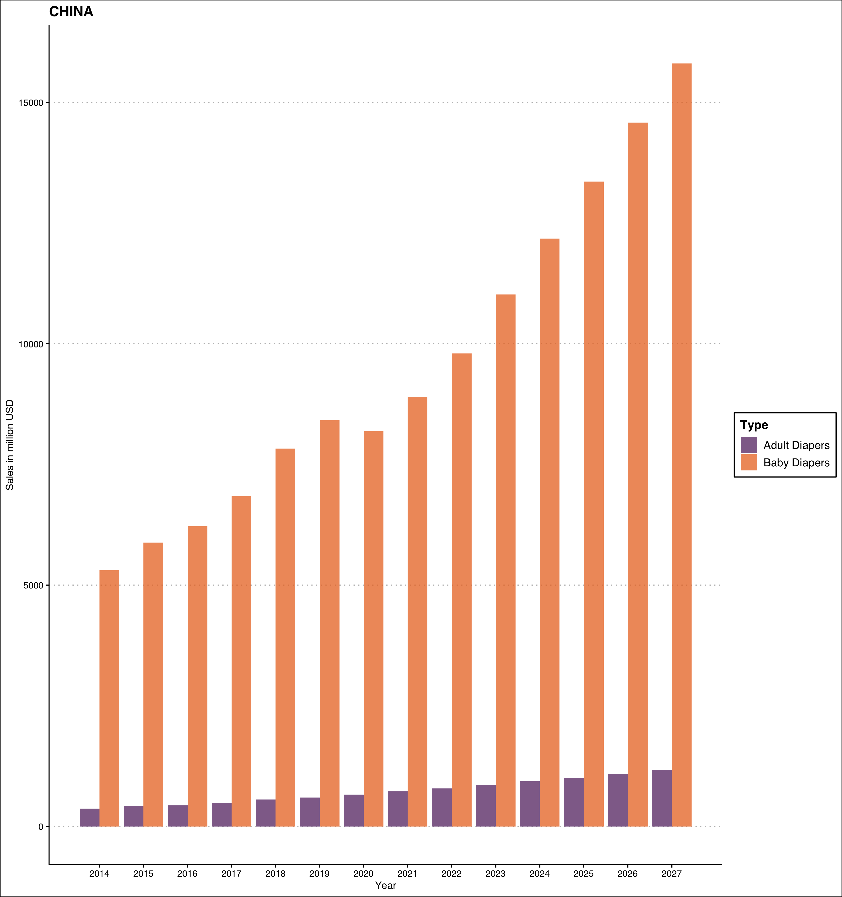
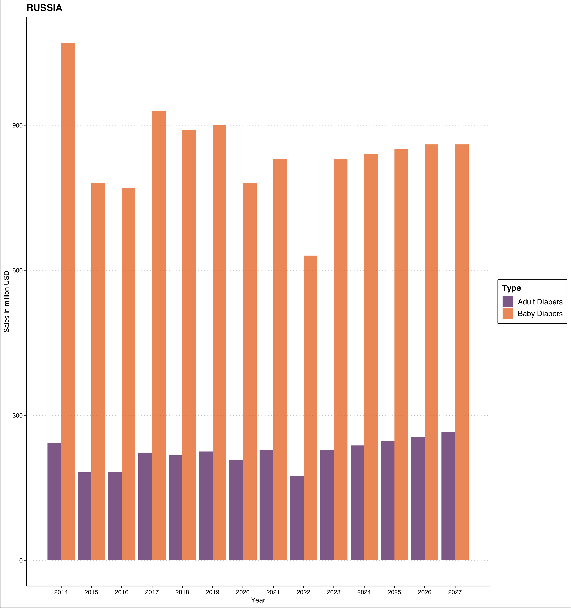

Population collapse is a theory that says if the growth rates continue to decline the way they are decreasing right now, we would reach population zero. It is a stage where the population neither grows, nor declines. That is, the number of births plus in-migrants equals the number of deaths plus out-migrants. While this may sound cheerful, you may not have considered the pitfalls yet. The smaller size of working adults would result in lower taxes and thus lower funds for welfare. The welfare that old and young desperately need.

While I had learnt about the concept of population collapse in my population studies class. Until YouTube showed me this video.

<iframe width="560" height="315" src="https://www.youtube.com/embed/_U2kR6TOQcY" title="YouTube video player" frameborder="0" allow="accelerometer; autoplay; clipboard-write; encrypted-media; gyroscope; picture-in-picture" allowfullscreen>

</iframe>

One measure of population collapse, according to [\@elonmusk](https://twitter.com/elonmusk) at least, is the ratio of baby diapers sale to adult diapers sale.[^1] [Japan](https://www.wikiwand.com/en/Aging_of_Japan) is leading all the way while [China](https://www.wikiwand.com/en/Aging_of_China) is closely following it.

[^1]: Incontinence, if you're being pedantic.

Sometimes it also leads to [innovative products](https://www.marketplace.org/2016/08/29/japans-changing-culture/):

> The company, she said, took into consideration that Japanese seniors, already petite by American standards, tend to become even more so with age. The average height of a Japanese woman, notes Yamanaka, is 157 centimeters (5 feet, 1 and a half inches), "however, this senior citizen, 50s and 60s, the average height is 152 centimeters, (just under five feet), five centimeters shorter," she said.

> "So we make products which is more suitable for them --- this height. For example refrigerators and washing machines designed for them to easily take things out."

> Because of their stature, products designed elsewhere can be inconvenient for a smaller Japanese population, requiring climbing or reaching to access wet clothes in a washing machine easily.

> "In Japan, most people have backache," Yamanaka said.

> In rural areas, many Japanese live in houses with two stories. And stairs. "And these people will clean up their house, stairs, holding up vacuum cleaners. And for them, the average weight, four kilo, was very heavy." Almost nine pounds. So Panasonic created a lighter vacuum.

```{r, echo = FALSE, warning = FALSE, message = FALSE}
tweetrmd::tweet_embed("https://twitter.com/harshbutjust/status/1589866512890093568")
```

A few days ago, I was discussing this topic with a friend. She was concerned that her maid in New Delhi had too many children, beyond what she could support. Over population, especially if with the economically weaker section of population, can get pretty severe. However, I think this is a short-term view. I would prefer a [long-term view](https://www.wikiwand.com/en/Longtermism). If the population growth rate keeps decreasing at its current pace, we can have problems.

If you are curious about population declines, I can recommend you some good starting points.

-   [Population decline, Wikipedia](https://www.wikiwand.com/en/Population_decline)

-   [Zero population growth, Wikipedia](https://www.wikiwand.com/en/Zero_population_growth)

-   Coleman, David, and Robert Rowthorn. "[Who's afraid of population decline? A critical examination of its consequences.](https://onlinelibrary.wiley.com/doi/epdf/10.1111/j.1728-4457.2011.00385.x)" *Population and Development Review,* 37 (2011): 217-248.

-   [Ranked: The 20 Countries With the Fastest Declining Populations](https://www.visualcapitalist.com/ranked-the-20-countries-with-the-fastest-declining-populations/)

## Is the sale of baby diapers 👶 increasing faster than adult diapers 🧓?

When I decided to look at the data for this, I found mixed results. The ratio of adult diapers to baby diapers sold varies a lot between the countries.

For countries with rapidly ageing population like Japan, it is almost approaching 0.6, while for young countries like India and Bangladesh, it is much smaller. See the table below for the sales and ratio calculated for the year 2021.

```{r, echo = FALSE, warning = FALSE, message = FALSE}
library(reactable)
library(tidyverse)
diapers = readRDS("/Users/harshvardhan/Desktop/Dump/diapers/data.rds")
diapers %>% 
  filter(year == 2021) %>% 
  select(-year) %>% 
  pivot_wider(names_from = c("type"), values_from = volume) %>% 
  mutate(ratio = round(adult/baby, 2)) %>% 
  mutate(country = stringr::str_to_title(country)) %>% 
  mutate(country = replace(country, country == "Usa", "USA")) %>% 
  reactable(.,
            columns = list(
              country = colDef("Country"),
              baby = colDef("Baby Diapers", 
                            format = colFormat(prefix = "$", digits = 0, separators = TRUE)),
              adult = colDef("Adult Diapers",
                             format = colFormat(prefix = "$", digits = 0, separators = TRUE)),
              ratio = colDef("Ratio of Sales")
              ),
            defaultSorted = "ratio",
            defaultSortOrder = "desc")
```

There is a confounding effect of accessibility as well. Adult diapers are not readily available in developing countries very easily. Even though they are available, people may not like wearing them because it makes them feel infantile. This stigma associated with diapers --- diapers are for kids not adults --- would be playing a role of their low sales in young countries, which generally also happen to be developing countries.

With this caveat in mind, let us get down to exploring these numbers as a time-series. The orange bars represent sale of baby diapers in millions of USD, while the purple bars represent sale of incontinence or adult diapers.[^2]

[^2]: Funny story: my first research project in PhD was with a company that manufactured incontinence diapers. If I had learnt about this before, I would have asked them their perspective.

### Japan 🇯🇵

> The glaring example is Japan, a country ageing really fast. The sale of baby diapers is growing at 10.2%, while adult diapers are growing at 8.1% --- quite close.



### United States of America 🇺🇸

> Both are growing, but it is clear that adult diapers is growing faster. USA's absolute sales volume is much higher for a country of 331 million.



### India 🇮🇳

> India is one of the youngest countries right now. The baby diapers sale is increasing fast but adult diapers? Not so much.



### China

> I cannot understand China's data well. Period.



### Russia

> I've no clue if sales are increasing or decreasing 🤷



### Data

All data is sourced from [Statista](https://www-statista-com.utk.idm.oclc.org/outlook/cmo/tissue-hygiene-paper/united-states#revenue). Thanks to the University of Tennessee, I have free access to Statista. Libraries are the best! If you need the data for all years between 2014 to 2027, let me know.

------------------------------------------------------------------------

The code to generate the plots can be found [here](https://gist.github.com/harshvardhaniimi/2d47c68f1d2e06778c3a1094b1a0acc7).
