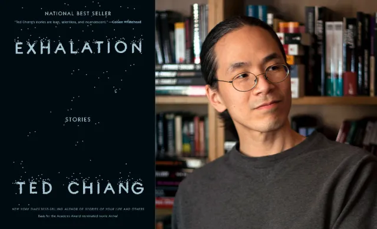

You rarely come across a story so powerful that you experience so many different feelings --- at the same time. Ted Chiang's "[The Truth of Fact, the Truth of Feeling](https://devonzuegel.com/post/the-truth-of-fact-the-truth-of-feeling-by-ted-chiang-subterranean-press)" does that. It evokes several strong feelings, one after another, that will leave you soul-searching.

Memories are tricky. I should know that; I'm terrible at remembering things. In interviews, I'm never worried about strengths and weaknesses questions. I already know my answer. I'm terrible at remembering things, so I take extensive notes and use Reminders extensively.

But from what I know, I'm not alone in my suffering. Some are too shy to admit, and most are too ignorant to accept. Stories are probably one way to experience this fallibility of memories.

This summer, I read the book "[The Sense of An Ending](https://www.nytimes.com/2011/11/13/books/review/the-sense-of-an-ending-by-julian-barnes-book-review.html)" by Julian Barnes. The narrator, Tony, has a memory problem as well. He warns us, the readers, that he is not to be trusted. He's only telling us the story "how he remembers it". It may not be accurate and definitely won't be complete.

The storytelling is engaging. I finished the book in about two weeks, thanks to my 40-minute commute to my [office](https://www.harsh17.in/hp22/). The story's ending drags longer than you'd expect, and everyone keeps telling Tony that "he doesn't get it and should stop trying". But he's old and persistent. Finally, he gets that his memory is not accurate. His brain skipped essential parts that changed the story's course.

Today, I finished Ted Chiang's story. I don't remember when I sent it to my Kindle, but it must have been around a month ago. When I started reading it, I had no recollection of what it was --- whether it was an essay or a blog or a story. But I was instantly hooked on it.

In a fictional world, a company has developed a device called Remem, which can offer people digital lossless memory forever. Like Black Mirror, you can record everything you see and recall it by sub-vocalising it. You say, "the time when I went on my first coffee walk with Meenal", and you get that memory out in the corner of your eye.

With this lifelong memory, a lot of disputes are settled instantly. The caseload in courts is small, and *whodunnits* are not fun anymore.

In a parallel story, albeit in a different century, a tribe deals with Europeans' newfound interest in their daily matter. Jijingi is young and becomes friends with the Christian missionary, Moseby, who is teaching the village about God. The God. The reason for European prosperity and wealth. Jijingi learns to read and write with Moseby --- the only kid in town to do so.

Learning how to read and write is not natural. Jijingi has questions about words and why we need spaces between words. Over time, he becomes more mindful of the transitions between words. He learns words, sentences and paragraphs. He learns:

> And words were not just the pieces of speaking; they were the pieces of thinking. When you wrote them down, you could grasp your thoughts like bricks in your hands and push them into different arrangements. Writing lets you look at your thoughts in a way you couldn't if you were just talking, and having seen them, you could improve them, make them stronger and more elaborate.

What is the point of writing for him? What is the point of recording their life for the millions of Remem users?

Perhaps, the answer lies in understanding what memories are. As we have established, memories are not perfect. Recordings --- written or digital --- provide a point of verification. But more important than that, they help in closing the feedback loop. They help in "forgive and forget".

You would believe near-perfect memory would be a lifesaver but think again.

> What might it be like to have a perfect memory? Arguably the individual with the best memory ever documented was Solomon Shereshevskii, who lived in Russia during the first half of the twentieth century. The psychologists who tested him found that he could hear a series of words or numbers once and remember it months or even years later. With no knowledge of Italian, Shereshevskii was able to quote stanzas of The Divine Comedy that had been read to him fifteen years earlier.

> But having a perfect memory wasn't the blessing one might imagine it to be. Reading a passage of text evoked so many images in Shereshevskii's mind that he often couldn't focus on what it actually said, and his awareness of innumerable specific examples made it difficult for him to understand abstract concepts. At times, he tried to deliberately forget things. He wrote down numbers he no longer wanted to remember on slips of paper and then burnt them, a kind of slash-and-burn approach to clearing out the undergrowth of his mind, but to no avail.

Psychologists distinguish between **semantic memory** --- knowledge of general facts --- and **episodic memory** --- recollection of personal experiences. We've been using technological supplements for semantic memory ever since the invention of writing: first books, then search engines. By contrast, we've historically resisted such aids in episodic memory; few people have ever kept as many diaries or photo albums as they did ordinary books.

We have to forget a little bit before we can forgive. When we no longer experience the pain as fresh, the insult is easier to forgive, making it less memorable. This psychological feedback loop makes initially infuriating offences seem pardonable in hindsight. Memory logs take this away from us.

The narrator mentions a powerful story where he remembers his daughter, Nicole, saying, "You're the reason she left! You drove her away! You can leave too, for all I care. I sure as hell would be better off without you." And to demonstrate her point, she stormed out of the house.

Moseby has a more straightforward reason for why she writes. "**verba volant, scripta manent**". He explains to Jijingi: in Tiv, you would say, "spoken words fly away, written words remain". That's why he carries the written sermons and a copy of his bible even though he remembers them. To be correct.

Jijingi doesn't have a good reason why people should write to remember. His language Tiv has two words for describing what's correct.

> Our language has two words for what in your language is called 'true.' There is what's right, **mimi**, and what's precise, **vough**. In a dispute, the principals say what they consider right; they speak mimi. The witnesses, however, are sworn to say precisely what happened; they speak vough. When Sabe has heard what happened, he can decide what action is mimi for everyone. But it's not lying if the principals don't speak vough, as long as they speak mimi.

As part of his research, the narrator goes through Nicole's memory of him (Remem allows people in the memory to have access to the memory). He finds that it wasn't her who said those hurtful words. It was him. He is shattered to pieces.

Sometime later, Europeans demanded that the tribes be consolidated. With over a hundred tribes, it was difficult to administer rules for them. They ask them to get reorganised into eight sects. Heads of clans meet, Jijingi observes.

Sabe, Jijingi's clan's head, believes they should join a specific clan based on their lineage. Another clan claims the same lineage to the same ancestor. Since they cannot decide the exact lineage, the question remains unsettled.

Jijingi discusses this with the European missionary, Moseby. Moseby takes him to the European capital, which has genealogy records. Jijingi finds that Sabe is wrong. He goes to Sabe, and Sabe politely declines: Europeans trust paper more than people.

> Sabe stopped walking and turned to face Jijingi. "Questions of kinship cannot be resolved by paper. You're a scribe because Maisho of the Kwande clan warned me about the boys from the mission school. Maisho wouldn't have looked out for us if we didn't share the same father. Your position is proof of how close our clans are, but you forget that. You look to paper to tell you what you should already know, here." Sabe tapped him on his chest. "Have you studied paper so much that you've forgotten what it is to be Tiv?"

Jijingi had become invested in getting his matters factually correct or the facts right --- like Europeans. However, he failed to realise the actual purpose those memories served. European assessment was vough; it was exact and precise. It wasn't enough to settle the question. The question of which clan to join had to be right for the community; it had to be mimi.

Writing is an instrument of technology. Like Remem. When people start logging their thoughts and actions, they take precedence over memory, though it might not be the best in every situation.

For a culture that transmits history through oral means, it is easy to revise history to suit the present needs. The idea that historical accounts shouldn't change is a product of literate cultures' reverence for the written word. Anthropologists have long recognised that oral cultures understand the past differently. For them, their histories don't need to be accurate so much as they need to validate the community's understanding of itself. So it wouldn't be correct to say that their histories are unreliable; their records do what they need to do.

After all, history is the present's memory of the past. It needs to complete the feedback loop.

This short story drove me through many emotions. I didn't know how these two stories would come together. They might not; I'm reading Kafka on The Shore, and Murakami's stories do not come together.
