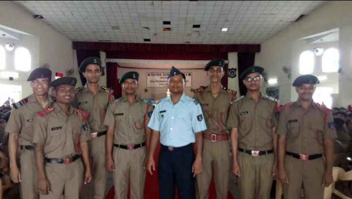

In my high school, vacations were a treasure. We would eagerly wait for those 52 days of summer break after those long six months of studies to meet family and friends. There would be another 28 days break in autumn, full of festivities like Diwali, Durga Puja and Chat. Either way, we would get excited looking forward to it.

As the start date of vacation came closer, there was a unique turn of events that I would not understand until I was in grade 12 --- until I was the school captain.

The food consumption in our mess was calculated on a per capita basis. There was a fair understanding of how much a cadet eats in a day. The same "per-capita food consumption" would be multiplied by 800 times, while accounting for another 25 cadets' worth of food for the variability.[^1]

[^1]: The exact numbers vary depending on the present strength of the school.

One day in grade 12, I was talking with the Mess manager to understand what should be the mess menu for the coming week as some vegetables currently on the menu were in shortage (or eggs, I don't remember). While discussing the alternatives, I realised he had decreased the number of students in his calculation. From 800 students, he was only counting 650 students. That's a pretty stark difference!

Initially, I thought it was a calculation mistake. How naive I was! When I pointed this out to him, he explained:

> Students' general food consumption decreases as we draw close to a vacation. Instead of eating the whole plate, they would reduce their diet in anticipation of home food. Additionally, they would rather eat outside, in the paid canteen, spending their savings before leaving for home. After all, they would get home food and a full bank as soon as they reached home!

This was startling to me. I didn't have the slightest clue! In hindsight, it was obvious. Even I did it. But I definitely didn't reduce my Chicken curry consumption --- I knew that. Curiously, I asked him about Chicken consumption during those weeks.

> Chicken consumption doesn't change. I guess that's tasty enough that students do not cut their appetite. We notice an increase in rice consumption during those days. We have to plan for extra rice and curry during those days.

Wow!

Remembering home and reducing consumption sounds like a childish thing to do. Seven years after my high school graduation, I found myself doing the same.

------------------------------------------------------------------------

In my high school classroom, we wrote the details about the day at the corner of our blackboard (green board, to be technically correct). What's the date today, what class was this, what's the class strength and how many of us were present, who was the class teacher and what quote of the day, and so on. JK Sinha sir, our class teacher, was particularly nitpicky that we do it regularly and do it right.

When you were close to the vacation start date, there was a new addition: DLTGH, or Days Left to Go Home. The count began from 30 days before the vacation start date. We looked at the countdown with the same excitement as many of us look up to NASA or ISRO launching a new satellite.

When the number was closer to zero, like seven or so, we couldn't begin anything significant. We had no concept of homework in my high school, so that was out of the question anyway. I didn't play a lot. I wouldn't undertake any new personal project. I wouldn't start reading a new book. Everything would be postponed until after vacation, or AV as we would say it.

------------------------------------------------------------------------

Today, I was at [Chaiyos](http://www.chaiyosrestaurant.com). It's a Thai restaurant near my home in Knoxville. I asked for lo mein with spice level 8. I thought it'd make me feel homely. But I was wrong.

I couldn't finish the entire plate though I'm sure I could do it any other day. What was different today?

I was counting DLTGH. Same symptoms. Loss of appetite. No interest in starting something new. Pushing things to a later time.

------------------------------------------------------------------------

**Our Headmaster,** **Wing Commander Shamim Akhtar, with some us appointments, right before the school assembly started.**

From left to right: Sarabjeet (Nalanda House Captain), Manoranjan (School Sports Captain), Mayank (School Adjutant), Sudhanshu (School Vice-captain), Wing Commander Shamim Akhtar, IAF (then Squadron Leader, Headmaster sir), me (School Captain), Ehtesham (School Academics Captain) and Pratik (School Co-curricular Captain).
