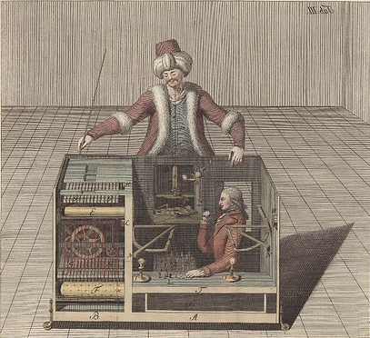
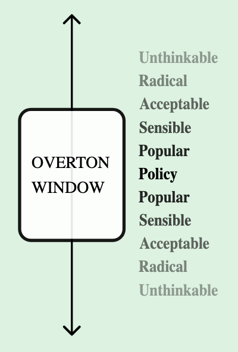

I wonder how this AI thing is going to shape up in the near and distant future. Many have said, and I agree, that there hasn't been such a revolutionary growth in productivity since the industrial age. Paul Graham was likely the first one to point this out. He [tweeted](https://twitter.com/paulg/status/1598698665337561088?s=20), "The striking thing about the reaction to ChatGPT is not just the number of people who are blown away by it, but who they are. These are not people who get excited by every shiny new thing. Clearly something big is happening."

Elon Musk likely tweeted about it as well. I mean, according to Sam Altman he should be credited for raising the humanity's ambition again after so long. He's right: we had completely forgotten humanity's role as explorers since the moon landing. It's as if the moon landing was only to shove it in Russia's face. But let's be honest. It was more than that. It was the first time we humans ever step foot outside our home: Earth.

We shouldn't stop here. [Coop](https://www.youtube.com/watch?v=HO6kDl6afDI) says, "Mankind was born on earth. It wasn't meant to die here." Mars is just the beginning. We have a long way to go. Explore the world beyond our solar system. Become multi-planetary species, multi-galaxy species. We aren't getting there until something fundamental improves.

History is testimony to the fact that fundamental changes are cyclical. The oldest one was probably agriculture. Once people realised they could farm crops like wheat and millets, and domesticate animals for milk and meat, civilisation was born. Maybe civilisation isn't the right word. Settlements? You get the point.

A few centuries later came something new: industries. People realised the importance of "pooling". Money could be pooled by many people to venture into riskier ventures. Pooling distributed risk and returns --- making things palatable to bigger groups than just kings and aristocrats.

Pooling also resulted in governmental reforms. Opinions "pooled" together to become ideologies. These ideologies resulted in fractions within the society, while taking away power from the hitherto central sovereign. The ideologies resulted in political parties that easily filled the void left by the incumbents, usually the monarch. Democracy became the norm.

But not positives came out of "pooling". Like yin and yang, there are good and bad of all innovations. Hatered pooled in as well and we had "international" terrorist organisations. (Like agriculture resulted in abuse of soil ecosystem and underground water.)

For the last few decades, we had slowed down in our innovations. Don't get me wrong: we created personal computers, iPhones and the internet. But it could only take us thus far. Until AI entered the picture.

Picture reminds me, have you seen the movie Interstellar? Do you remember how dead navy seals' minds were installed into multi-purpose robots built by NASA for helping the humans explore the vast space while the earth was dying? Maybe, just maybe, we don't need to do that if we are able to build a general-purpose AI.

> TARS and CASE are the two robots which are part of the Endurance crew in Interstellar movie.

There are naysayers to general-purpose AI, or Artificial General Intelligence (AGI). Naval Ravikant is one that I can recall. According to him, all the problems we're solving with AI are pretty closed-form problems. Beating a human at GO isn't too surprising: after all, there's a strategy to win and with enough computations the strategy can be statistically estimated.

What would he say about ChatGPT? I don't know. Haven't seen anything from him yet. But I imagine he'd say something along the lines of the Chinese room thought experiment.

Imagine that there is a person locked inside a machine. It is not you, but you're the lab technician tasked to study this "machine", which is not actually a machine. Something like the [Chess-playing mechanical turk](https://www.wikiwand.com/en/Mechanical_Turk) which beat humans at Chess but was later found to be operated by an actual Turk operating it sitting inside.

> Mechanical turk being operated by a human chess player.

Anyway, you start exchanging messages with this machine. The messages are in Chinese. You fully understand Chinese but the person sitting inside can't even read or speak 普通话 (Mandarin). He simply has a notebook (in English) which tells him what characters to respond with when he recieves a particular set of characters.

The experiment continues for a year. Possibly more. You as a researcher have begun exchanging love letters with this "machine". (Why does everyone want to talk about love and sex with the AI? Sometimes even AI wants to: like when the New York Times author spent two hours [chatting](https://archive.ph/cltPt) with Bing AI.) The machine responds likewise. The person sitting inside the room has no clue he's responding to love letters.

Would you say this "machine" is a form of AI? Of course not --- it's manually operated by a human, like Chess-playing turk.

But forget for a moment that it's a lab subject communicating and it is, in fact, a machine responding. Does a seemingly understandable and romantic message mean anything to the writer machine? Or is it simply regurgitating the response it can statistically predict best, using the notebook he's provided with?

[Stephan Wolfram](https://writings.stephenwolfram.com/2023/02/what-is-chatgpt-doing-and-why-does-it-work/) was surprised to see how ChatGPT could be so good with it's responses. It is indeed surprising. It is predicting token by token what should come next after responding a specific token. This ability of [self-attention](https://jalammar.github.io/illustrated-transformer/), i.e. focussing on parts of speech, that relate to something else is a relatively new innovation. Google invented the transformers in 2017, that improved its translation abilities manifold. (It sucks that translation is still that bad.)

ChatGPT is so good because it has been manually trained to do so. Human feedback on responses helps statistical models tremendously. [OpenAI Used Kenyan Workers on Less Than \$2 Per Hour: Exclusive \| Time](https://time.com/6247678/openai-chatgpt-kenya-workers/) (\$2 per hour isn't low by Kenyan standards, I must add.)

Google seems to be losing the battle. Like most incumbents of power. Even Machiavelli recognises it: "It must be considered that there is nothing more difficult to carry out, nor more doubtful of success, nor more dangerous to handle, than to initiate a new order of things." (Chapter 6, *The Prince*). Microsoft won the battle of launching a minimum viable product. But there war is still on.

Though it is difficult to say if it is a war or simply a competition. There is more evidence for the latter. Google and Meta were simply afraid of releasing such powerful generative AI tools to the general public. It could have dire consequences. In his book Zero to One, Peter Thiel posits how it is more difficult "going from zero to one" --- creating something new --- rather than "going from one to n" --- copying or scaling something that already exists

Even OpenAI wasn't sure of launching ChatGPT. Sam Altman's decision wasn't appreciated by many in the company, including some in his executive team. But their belief in "Overton window" resulted in others yielding. (Few people know that ChatGPT was available in [OpenAI playground](https://platform.openai.com/playground) long before and can still be used with almost zero downtime.)

The Overton window, named after Joseph Overton, is a model that describes the range of ideas and policies that are considered acceptable to the public at a given time. It is useful to identify the range of ideas or models that are acceptable to the public, and then to work within that range to make decisions that are more likely to be accepted. By doing so, decision-makers can increase the chances of success and minimize resistance or backlash from the public.

> Overton Window is a model that describes the range of ideas and policies that are considered acceptable to the public at a given time.

We loved ChatGPT since it was launched. It was the talk of the town. Even though we were slightly concerned about some jobs vanishing, the general sentiment was positive.

Sam acknowledges this "AI taking over jobs" hypothesis. He supports the idea of Universal Basic Income (UBI) as a potential solution to help those displaced jobs using this new technologies. It could be funded in part by the companies that benefit most by this automation, and by government.

I'm not so sure of UBI. It's not a silver bullet. People do jobs for multiple reasons; money is just one of them. Work gives identity. Doctors proudly say that they're doctors. It also gives a meaning to life. A fisherman would prefer a freshly caught fish over some half-eaten fish given to him for free. A teacher works hard to change a student's life, at least when they're devoted to their work.

It is also just a matter of time when the non-productive workers living on UBI become the majority and start voting themselves more money. Pooling would again cause fractions and the the bigger pool would ask for a bigger fund.

It's also quite expensive. If we choose to give \$25,000 per year as UBI (approx the poverty line of US) to 40 million people (population under poverty line), it'd cost the state exchequer \$1 trillion. Or around 5% of US GDP. That's more than what US spends on millitary (3.5% of GDP).

But I still didn't answer the question I started with: what would the world look like when the AI becomes commonplace? I don't wanna guess. Sorry, I do have guesses but I don't wanna tell you. There are hundreds of pundits online speculating and my guesses are as bad/good as their's.

What I do know is that I shouldn't miss to ride this wave. My surfing teacher told me: "when you see a wave coming towards you, there are two options. You're either gonna be hit by it or you can ride it. Timing is important for catching it, and balance is important for staying afloat. But the most important is not missing a good wave."

I'm not missing the wave.

