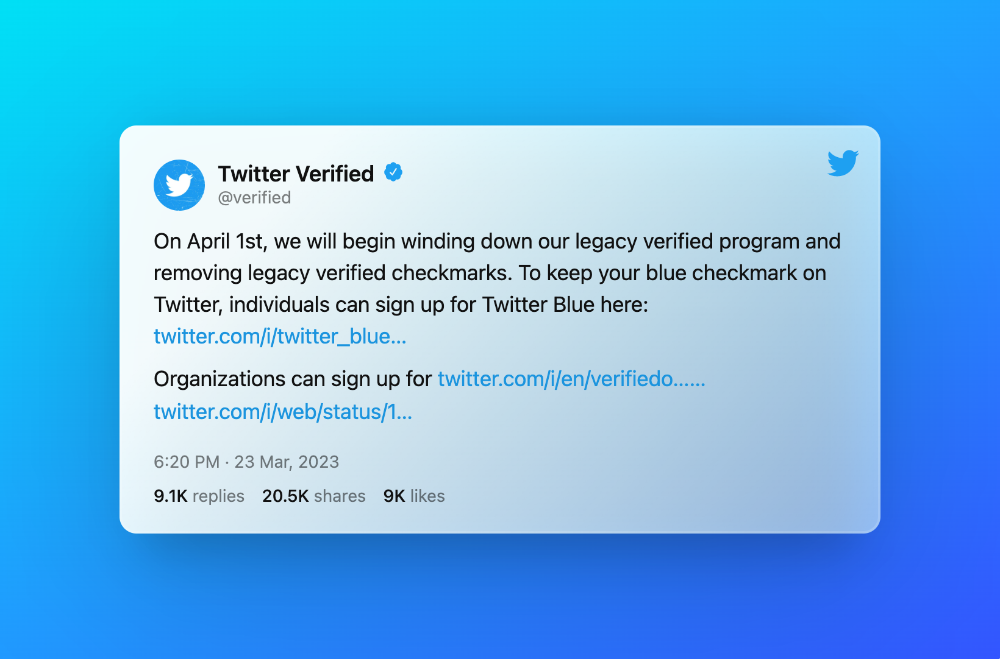
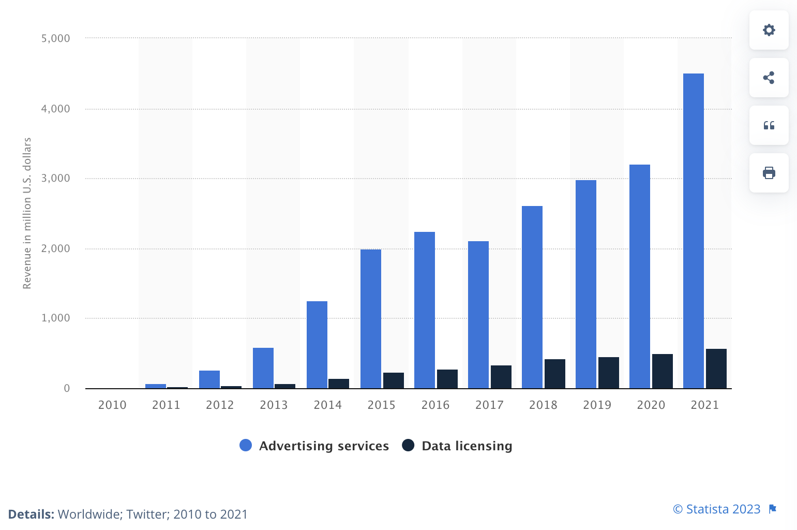

<link href="index_files/lightable/lightable.css" rel="stylesheet" />

<link href="index_files/datatables-css/datatables-crosstalk.css" rel="stylesheet" />

<link href="index_files/dt-core/css/jquery.dataTables.min.css" rel="stylesheet" />
<link href="index_files/dt-core/css/jquery.dataTables.extra.css" rel="stylesheet" />

<link href="index_files/crosstalk/css/crosstalk.min.css" rel="stylesheet" />

<link href="index_files/lightable/lightable.css" rel="stylesheet" />

Around half a year ago, Twitter made an exciting announcement about a new paid subscription service called Twitter Blue. For \$8 per month (or \$11 per month via mobile purchase), users can sign up for a host of exclusive features, including a blue badge, prioritized conversation ranking, fewer ads, bookmark folders, custom navigation, tweet editing, undoing tweets, and more.

As handy as these features, the service is not yet fully available to all users, as it can only be purchased via the iOS app or web, not Androids. It’s unclear what the tangible benefits for common users are, except for a visibility boost. In my opinion, being able to edit tweets is unnecessary — you don’t need the ability to edit, you just need to forgive yourself.

While launching a half-baked service is not a new phenomenon in the tech industry, it’s concerning for a utility service like Twitter, which has a global user base, not to have an Android version. Twitter’s largest market is India, which is predominantly an Android market. Moreover, the prices for Twitter Blue are quite steep - who would pay ₹9,400 per year for a social media platform?

### Starting today, the original Twitter verification marks are gone.

On April 1, Twitter is stripping away the legacy verification badges from the platform in favor of the paid badges associated with Twitter Blue subscriptions. Then starting April 15, the platform apparently will no longer promote non-paying Twitter users via its recommendation algorithm on the For You feed. (The inability to participate in the polls sucks.)

> 

While these changes may seem concerning, they are part of Twitter’s ongoing efforts to increase revenue and create a more sustainable business model. Majority of their past earnings were from advertisements.

> Annual revenue of Twitter from 2010 to 2021, by segment. Advertising revenue has been increasing while data licensing revenues are relatively constant. Source: [Statista](https://www-statista-com.utk.idm.oclc.org/statistics/274566/twitters-annual-revenue-by-channel/).

It remains to be seen how these changes will affect the user experience on the platform and whether they will be beneficial in the long run.

> Legacy verification badges on Twitter provided credibility and legitimacy to users, but with the introduction of paid badges, some may view the process as exclusive and biased towards those who can afford it.

The decision to no longer promote non-paying users via Twitter’s recommendation algorithm on the For You feed has raised concerns among influencers. This change may disproportionately affect smaller accounts and marginalized communities, who may not have the resources to pay for Twitter Blue subscriptions.

But not all are excited about it. In fact, most Twitter Blue subscribers are nothing close to influencers — over 20% has fewer than a hundred followers. Notable figures and outlets, from LeBron James to the White House, have said they won’t be paying for verification.

So, any Tom, Dick and Harry will have the blue checkmark but not the government agencies, celebrities, and influential figures. We’re gonna see a return of “real” prefixes in profile names.

### Who uses Twitter Blue?

[Travis Brown](https://github.com/travisbrown/blue/) has collected data on Twitter Blue users from its launch.

> We compiled this list by combining two approaches. The first uses a Twitter profile scraper that is one of the components of the Hassreden-Tracker project, which was supported by Prototype Fund in 2022. The second involves searching the Twitter API for tweets by Twitter Blue subscribers, with queries designed to cover areas of the Twitter graph that the first approach may miss (for example non-English-language accounts).

I thought it would be interesting to see who are they. Here’s the exploration! [You can download the R Markdown from my Github](https://github.com/harshvardhaniimi/personal-website/blob/main/content/blog/2023-04-01-twitter-blue/index.Rmd).

### Reading in the data

Data source: <https://github.com/travisbrown/blue>.

Since the doesn’t have column names, I will add it. Using `janitor`, I will clean the names. It’s [clean_names()](https://github.com/sfirke/janitor) function is an absolute blast. It converts `CAPITALS` and spaces to `small_letters_with_underscores`. Pretty standard. [See the code on my Github.](https://github.com/harshvardhaniimi/personal-website/blob/main/content/blog/2023-04-01-twitter-blue/index.Rmd)

#### Data

Here are the first ten rows of the data frame. I am using `kable` for printing a good looking table. (Later on, I will use `DT` for an interactive table where you can sort, filter and search.)

<table class=" lightable-paper" style="font-family: &quot;Arial Narrow&quot;, arial, helvetica, sans-serif; margin-left: auto; margin-right: auto;">
<thead>
<tr>
<th style="text-align:right;">
account_id
</th>
<th style="text-align:left;">
screen_name
</th>
<th style="text-align:left;">
legacy_verification_status
</th>
<th style="text-align:right;">
follower_count
</th>
<th style="text-align:left;">
date_blue_sub
</th>
<th style="text-align:right;">
time_blue_sub
</th>
<th style="text-align:left;">
sub_status
</th>
</tr>
</thead>
<tbody>
<tr>
<td style="text-align:right;">
12
</td>
<td style="text-align:left;">
jack
</td>
<td style="text-align:left;">
V
</td>
<td style="text-align:right;">
6548240
</td>
<td style="text-align:left;">
2022-11-10
</td>
<td style="text-align:right;">
1668066884
</td>
<td style="text-align:left;">
U
</td>
</tr>
<tr>
<td style="text-align:right;">
18
</td>
<td style="text-align:left;">
Adam
</td>
<td style="text-align:left;">
NA
</td>
<td style="text-align:right;">
4
</td>
<td style="text-align:left;">
2022-11-10
</td>
<td style="text-align:right;">
1668092307
</td>
<td style="text-align:left;">
S
</td>
</tr>
<tr>
<td style="text-align:right;">
22
</td>
<td style="text-align:left;">
rabble
</td>
<td style="text-align:left;">
NA
</td>
<td style="text-align:right;">
18606
</td>
<td style="text-align:left;">
2022-11-10
</td>
<td style="text-align:right;">
1668111426
</td>
<td style="text-align:left;">
U
</td>
</tr>
<tr>
<td style="text-align:right;">
41
</td>
<td style="text-align:left;">
drx
</td>
<td style="text-align:left;">
NA
</td>
<td style="text-align:right;">
130
</td>
<td style="text-align:left;">
2023-03-03
</td>
<td style="text-align:right;">
1677853595
</td>
<td style="text-align:left;">
B
</td>
</tr>
<tr>
<td style="text-align:right;">
58
</td>
<td style="text-align:left;">
Darkside
</td>
<td style="text-align:left;">
NA
</td>
<td style="text-align:right;">
6065
</td>
<td style="text-align:left;">
2022-11-18
</td>
<td style="text-align:right;">
1668748244
</td>
<td style="text-align:left;">
B
</td>
</tr>
<tr>
<td style="text-align:right;">
59
</td>
<td style="text-align:left;">
Tim535353
</td>
<td style="text-align:left;">
V
</td>
<td style="text-align:right;">
9369
</td>
<td style="text-align:left;">
2022-11-11
</td>
<td style="text-align:right;">
1668139623
</td>
<td style="text-align:left;">
B
</td>
</tr>
<tr>
<td style="text-align:right;">
76
</td>
<td style="text-align:left;">
marciadorsey
</td>
<td style="text-align:left;">
V
</td>
<td style="text-align:right;">
19598
</td>
<td style="text-align:left;">
2022-11-11
</td>
<td style="text-align:right;">
1668142394
</td>
<td style="text-align:left;">
B
</td>
</tr>
<tr>
<td style="text-align:right;">
294
</td>
<td style="text-align:left;">
ario
</td>
<td style="text-align:left;">
NA
</td>
<td style="text-align:right;">
5783
</td>
<td style="text-align:left;">
2022-11-10
</td>
<td style="text-align:right;">
1668076741
</td>
<td style="text-align:left;">
B
</td>
</tr>
<tr>
<td style="text-align:right;">
295
</td>
<td style="text-align:left;">
joshk
</td>
<td style="text-align:left;">
V
</td>
<td style="text-align:right;">
149304
</td>
<td style="text-align:left;">
2023-02-23
</td>
<td style="text-align:right;">
1677191326
</td>
<td style="text-align:left;">
B
</td>
</tr>
<tr>
<td style="text-align:right;">
324
</td>
<td style="text-align:left;">
chrisfralic
</td>
<td style="text-align:left;">
V
</td>
<td style="text-align:right;">
41137
</td>
<td style="text-align:left;">
2022-12-16
</td>
<td style="text-align:right;">
1671171125
</td>
<td style="text-align:left;">
B
</td>
</tr>
</tbody>
</table>

Here’s a brief detail on columns.

<table style="width:99%;">
<colgroup>
<col style="width: 16%" />
<col style="width: 67%" />
<col style="width: 14%" />
</colgroup>
<thead>
<tr class="header">
<th>Column Name</th>
<th>Description</th>
<th>Example Values</th>
</tr>
</thead>
<tbody>
<tr class="odd">
<td>account_id</td>
<td>Account Identifier</td>
<td>12<a href="#fn1" class="footnote-ref" id="fnref1" role="doc-noteref">1</a>, 18, 22</td>
</tr>
<tr class="even">
<td>screen_name</td>
<td>Username</td>
<td>jack, Adam, rabble</td>
</tr>
<tr class="odd">
<td>legacy_verification_status</td>
<td><code>B</code> for Business accounts, <code>G</code> for Government accounts and <code>V</code> for Verified but type not specified</td>
<td>B, G, V</td>
</tr>
<tr class="even">
<td>follower_count</td>
<td>How many followers do they have?</td>
<td>6548240, 4, 18606</td>
</tr>
<tr class="odd">
<td>date_blue_sub</td>
<td>Date they first got Twitter Blue</td>
<td>2022-11-10, 2023-03-03</td>
</tr>
<tr class="even">
<td>time_blue_sub</td>
<td>Time they first got Twitter Blue</td>
<td>1668066884, 1668092307</td>
</tr>
<tr class="odd">
<td>sub_status</td>
<td>
Current Twitter Blue status.

<code>B</code> for Subscribed to Twitter Blue, <code>U</code> for Unsubscribed, <code>S</code> for Permanently suspended, <code>D</code> for Self-deactivated
</td>
<td>B, U, S, D</td>
</tr>
</tbody>
</table>
<section id="footnotes" class="footnotes footnotes-end-of-document" role="doc-endnotes">

<ol>
<li id="fn1">
I find it funny that Jack Dorsey, the founder of Twitter doesn’t have the first account. Who got it? Some engineer in his team?<a href="#fnref1" class="footnote-back" role="doc-backlink">↩︎</a>
</li>
</ol>
</section>

Let’s dive in to the analysis.

### Popularity of Twitter Blue

}}index_files/figure-html/unnamed-chunk-4-1.png" width="672" />

Twitter Blue added most number of users in the first two weeks of launch. The next peak is in the second week of 2023. What’s that for?

Tell me in comments, if you know.

### Who are the subscribers?

#### Blue Subscribers with Most Followers

The list of Blue subscribers is pretty interesting.

Here’s the list of Blue subscribers with over a million followers. I am filtering only the users who are still subscribed to the service. (So users who “tried” the service for a month aren’t included.)

To make the table interactive where users can sort and search, I used `DT`. I like `DT` for it’s simplicity. Its function `datatable()` is great for creating interactive tables easily. I’ve tried picking up several other table packages in the past like `kable`, `gt` is good for beautiful tables but they’re not interactive, yada yada.

Of the top-10 most popular accounts on Twitter, only Elon musk is the subscriber. This kinda speaks to the popularity of the service.

> Twitter accounts with most followers worldwide as of January 2023. All numbers are reported in millions. Source: [Statista](https://www-statista-com.utk.idm.oclc.org/statistics/273172/twitter-accounts-with-the-most-followers-worldwide/).

### How many followers do Blue subscribers have?

For this task, I am going to break down the follower count into smaller groups. Since most Blue subscribers do not have a huge fan following (Elon Musk, again, is an exception), it is a necessary step — else, histograms wouldn’t look relevant.

}}index_files/figure-html/unnamed-chunk-6-1.png" width="672" />

<table class=" lightable-paper" style="font-family: &quot;Arial Narrow&quot;, arial, helvetica, sans-serif; margin-left: auto; margin-right: auto;">
<thead>
<tr>
<th style="text-align:left;">
Number of Followers
</th>
<th style="text-align:left;">
Number of Blue Subscribers
</th>
</tr>
</thead>
<tbody>
<tr>
<td style="text-align:left;">
0-100
</td>
<td style="text-align:left;">
110K
</td>
</tr>
<tr>
<td style="text-align:left;">
100-1K
</td>
<td style="text-align:left;">
194K
</td>
</tr>
<tr>
<td style="text-align:left;">
1k-10k
</td>
<td style="text-align:left;">
184K
</td>
</tr>
<tr>
<td style="text-align:left;">
10k-100k
</td>
<td style="text-align:left;">
71K
</td>
</tr>
<tr>
<td style="text-align:left;">
100k+
</td>
<td style="text-align:left;">
14K
</td>
</tr>
</tbody>
</table>

Blue seems to be more popular among the less popular accounts on Twitter. That’s interesting.

#### How many accounts have less than 10 followers?

25,550 accounts have fewer than 10 followers. Out of that, 3,480 have zero followers. Who are these people and what’s the value of using Twitter Blue for them? Is it just an act of curiosity — are they simply [early adopters of the service](https://www.harsh17.in/gartner-hype-cycle/)? Or are they in strong defiance of old Twitter, grabbing the opportunity of premium Twitter as soon as it shows up? Maybe they’re just very expensive bots.

Here’s a histogram of number of followers for accounts with fewer than 1,000 followers.

}}index_files/figure-html/unnamed-chunk-8-1.png" width="672" />

This is especially interesting because the average number of followers for an active Twitter user is around 159 (in the US). For someone willing to pay extra for a service, you would expect them to be heavy users. You wouldn’t expect them to be lurkers; they’d be core users.

On the other hand, 391 million Twitter accounts have no followers at all.

### Types of Accounts: Business, Government and Society

}}index_files/figure-html/unnamed-chunk-9-1.png" width="672" />

It feels like almost all the subscribers are Musk fanboys. There are almost no government accounts, very little business accounts and a few celebrities (who probably wanted to try the Blue service).

### How many of the original Blue Subscribers are still using it?

The data has a column called `sub_status` which has this detail.

}}index_files/figure-html/unnamed-chunk-10-1.png" width="672" />

### Who left Twitter Blue?

A vast majority of unsubscribers (122,823) are regular users. My guess is they were experimenting with the service as [early adopters](https://www.harsh17.in/gartner-hype-cycle/). 499 of them were verified accounts who later chose not to continue their verification. 21 of the unsubscribers are businesses, and eight of them are government agencies.

Here’s the list of government agencies: TimWattsMP, UNDPEurasia, RepRaulGrijalva, DenverOEM, JoaquinCastrotx, TDEM, SteveScalise, EPAMichaelRegan .

### Conclusion

Twitter Blue, the premium subscription service offered by Twitter, saw a massive surge in subscriber numbers immediately following its announcement. However, this momentum was short-lived, and the rate of new subscriber additions declined significantly, with one exception. In January, something extraordinary happened, which resulted in a notable increase in new subscribers.

It’s worth noting that out of Twitter’s top-10 most followed accounts, only Elon Musk has a Blue account. While some celebrities and businesses do have Blue accounts, they are vastly outnumbered by regular Twitter Blue users.

Interestingly, a significant percentage of the group that initially signed up for Blue has already left the service. However, it’s difficult to determine the exact number, as apparently [Twitter is not actively removing verified badges](https://mashable.com/article/twitter-blue-subscriptions-lower) even after people stop their subscription.

What are your thoughts on this? Do you find these trends surprising or expected? Share your insights in the comments below!

The codes for this project can be found on my [Github](https://github.com/harshvardhaniimi/personal-website/blob/main/content/blog/2023-04-01-twitter-blue/index.Rmd).
