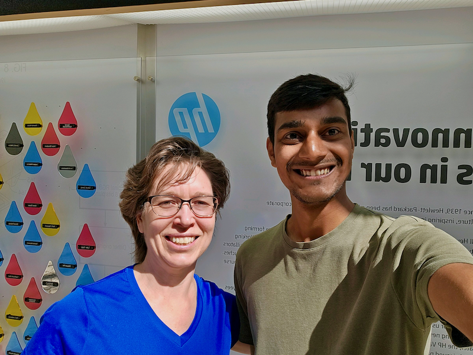
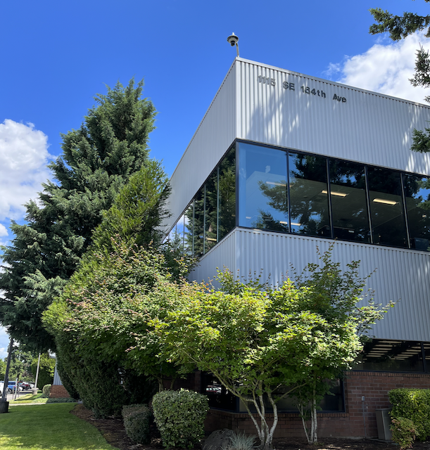
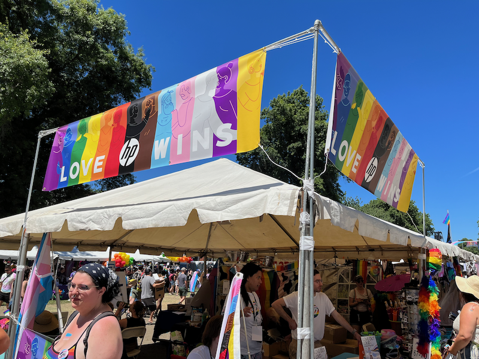
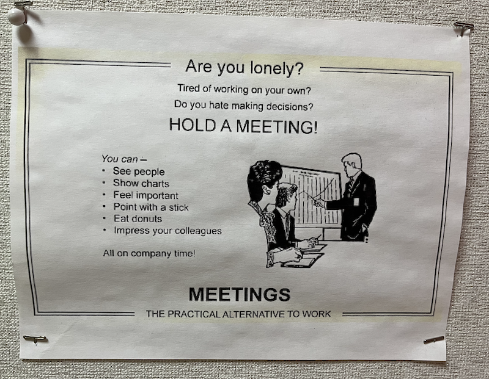
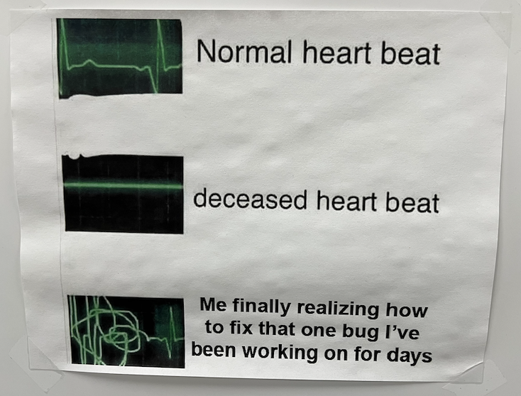
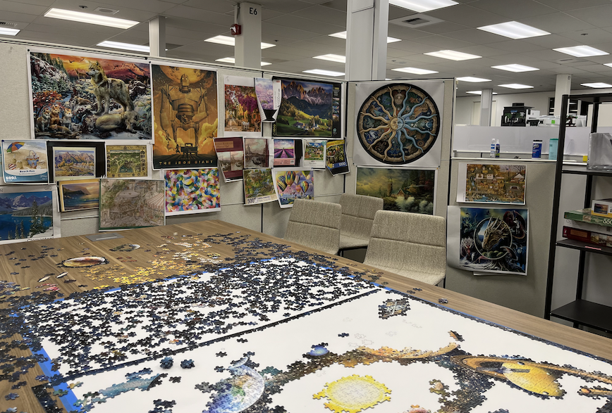

Wow, what a ride! My 15-month time at HP Inc. feels like a full-on sprint through a techno-maze. Machine learning forecasting models for over 18,000 products in HP Print? Bring it on! 📊

My team was full of experts in supply chain modelling, machine learning and more. I worked closely with Cara Curtland, Jerry Hwang, Kevin Kacmarynsky, Barrett Crane and more from the SPaM team. Enjoyed learning from Pedro, Frederic, Chuck and Shawn. ✨

I was an eager intern ready to tune up models and push them to production. Last summer was all about the grind: understanding the codebase, optimizing the processes, and leveling up. This summer? Cranking up the machine learning parts, rolling it into production, and seeing it all play out. 🦾

Forecasting is like playing a game at different difficulty levels. There's the Product Platform level (easy-peasy), the Base Product level (now we're talking), and the SKU level (hardcore mode). My battleground? The Base Product level, turning it into SKU-level forecasting. In fact, we were the first to make SKU-level forecasts with ML for Print at HP. Achievement unlocked! 🎖️

Improving the ML model wasn't just about tinkering with the hyperparameter knobs. Encoding categorical variables, handpicking features -- all this geeky stuff boosted the accuracy. Imagine tweaking a custom rig: every little change gives more horsepower, especially when you're on a monthly cadence with demand forecasting. 🚚

Data? Oh boy, it's like a jungle out there. We used existing demand features, information about products and geographies, and a few engineered product life cycle variables. This summer, my work was to include channel partner inventory, sell-in and sell-through volume. I carved bikelanes through the jungle, built an ETL pipeline, and churned out something our ML pipeline could use. 🚵

The real boss-level challenge? Loading the forecast into our Integrated Business Planning (IBP) tool for use by all planners. We're talking about 18,000 SKUs across 45 geographies! When it all clicked? Party time! 🌎

On the tool front, my arsenal grew with Python, Pandas, SQL, Terminal, and more. We used SQL pipelines for extracting and loading the data, LightGBM (tree-based model) for forecasting with various custom tune-ups for modelling, Jupyter Notebooks to keep all our steps documented, and finally MLFlow to track all our experiments. You don't realise the importance of last step till you start playing with fifty experiments. 🐍

My Terminal command prowess improved too. From just `cd ..`, now I can do a lot more than `grep` searches, and `rm -rf .`. (If you don't know what you're reading, DON'T write and press enter.) Also learnt about symbolic links which are seriously neat. ☠️

HP's culture is the secret sauce. People aren't just colleagues, they're allies in a shared quest. My favorite mantra from my mentor Cara? "Fail Fast. Celebrate errors and innovations equally." That's not just talk; it's HP's working principle. Dare to fail, dare to innovate. ❤️

Thursdays were our geek fests: "Coding is Cool" sessions, filled with Python wisdom, SQL tricks, and yes, even ChatGPT experiments. And [my cat Kaya](https://huggingface.co/spaces/harsh17/shiny-cat) was the star of the show. 🐈 *flicks tail*

<iframe
	src="https://harsh17-shiny-cat.hf.space"
	frameborder="0"
	width="850"
	height="450"
></iframe>

All in all? An epic journey. HP, you've been a masterclass in innovation. SPaM, you've been an awesome ally. I look forward to continuing to work closely with the team while making my research my primary focus for the year. 🫡

Thanks for the XP, the lessons, and the code commits. Here's to the next git branch of my life! 🚀

> Me with Cara, my mentor, in front of the patent wall which celebrates the patent holders at HP's Vancouver office. Some had over 500 patents!

### Some shots from office...

> HP Vancouver Office, Summer 2023

> I also volunteered at HP's booth during Portland Pride Parade 2023

