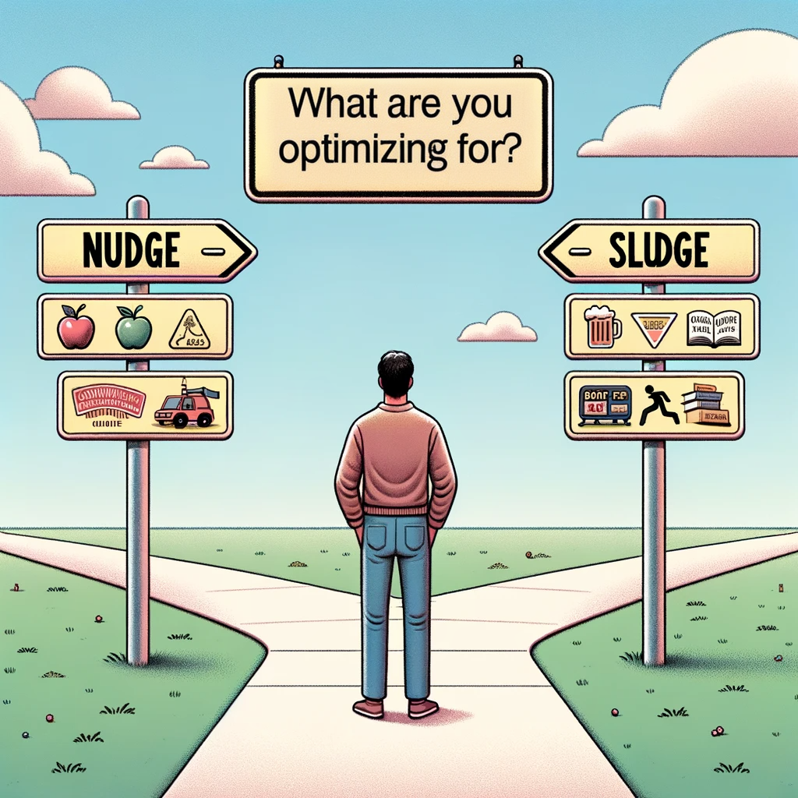
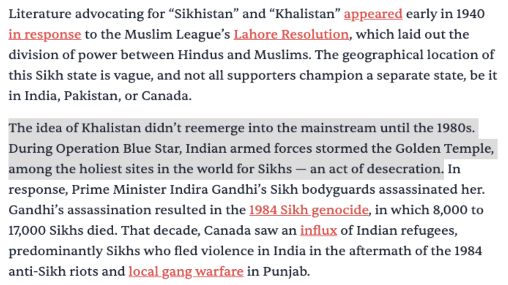

> When a measure becomes a target, it ceases to be a good measure.
>
> --- Goodhart's Law

Every waking moment, our brain is incessantly solving complex problems, making decisions that range from the trivial to the transformative. While we might not consciously label this process as 'optimization', that's exactly what it is. We are optimizing for our 'happiness' (either short-term or long-term.) Amidst these myriad decisions, the looming question remains: What are we optimizing for?

To unpack this, we first need to understand the tools that guide or obstruct our choices: nudges and sludges. I'll argue that our optimizations don't serve us well, particularly when happiness is the metric. The idea of nudges and sludges from [Nudge: Improving Decisions About Health, Wealth, and Happiness](https://www.goodreads.com/book/show/3450744-nudge) by Dr Richard H Thaler.

A nudge is an element or feature that subtly guides human behavior towards a particular action without limiting choices or significantly changing economic incentives. For example, placing healthy foods at eye level in a grocery store is a nudge to encourage healthier eating habits. Nudges can be powerful tools for encouraging positive behavior while preserving freedom of choice.

On the other hand, a sludge is essentially the opposite of a nudge; it's a friction or barrier that makes it harder for people to accomplish something. Think about convoluted process when you have to "unsubscribe" to a service.[^1] They are usually put in place to dissuade people from taking certain actions.

[^1]: In the context of subscriptions, they are often called "dark patterns".

When examining if something is being indirectly optimized for, look for these nudges or sludges. They'll often reveal the underlying objectives and biases of a system or piece of content. Let's look at a few examples to understand how they shape our lives.

I reside in Knoxville, specifically around the University of Tennessee campus in Fort Sanders. The locale, bursting with bars and places to score alcohol or weed, speaks volumes about what people optimize for --- mostly intoxication. Meanwhile, cafes and libraries --- places that inspire creativity and growth --- are few and between.

Our environment nudges us towards wasting our youthful energy on fleeting pleasures rather than anything enriching. What's the sludge here? The university library closes 8 pm on weekends, implicitly pushing students towards less scholarly activities.

But does it have to be this way? Universities and societies could change their 'nudges' to encourage lifelong learning, community building, or well-being, thus optimizing for more than just short-term pleasures. Jane Jacobs, the famous urbanist, once said: if a public space exists, people will use it.[^2]

[^2]: The exact way I had heard of it was "If you build a place for people to sit, they will come and sit".

Similarly, the food landscape is an optimized mess. Fast food chains here are ubiquitous, making it harder to opt for a healthy meal. This isn't universal; in other countries like Italy and Turkey, communal eating is more the norm. It's almost as if the U.S. prioritizes speed over substance, even in diet. [Jhonny Harris](https://www.youtube.com/watch?v=FovIyqov1uA) did an interesting video on bread in the U.S. which exemplifies how long-lasting bread is the goal, not the nutrients it provides.

Even the focus is mainly on calorie counts, often sidelining other vital nutrients. In India, the discussion on calories was limited to economics where it was used for defining poverty line and minimum wages, which is calculated based on an expectation of 2320 kilocalories a day.[^3] An old article in Times of India had also [identified](https://timesofindia.indiatimes.com/business/india-business/how-many-calories-do-we-really-need/articleshow/2050829.cms) the direct limitations of such metrics.

[^3]: The recommendation is set by the [Indian Council of Medical Research](https://www.downtoearth.org.in/news/governance/as-told-to-parliament-july-18-2019-low-dietary-intake-in-rural-urban-india-65716) (ICMR). According to the data presented in parliament by Smriti Irani, Minister of Women and Child Development, the average consumption is lower than this.

I have seen better alternatives. While I was visiting Massachusetts General Hospital, Boston, I saw their cafeteria had a different kind of rating: red for items you should eat once in a while, yellow for items that you may eat occasionally, and green for items that you can eat three times a day. These cover some additional distance when used with calories, but still misses the point: balanced diets will make us healthy. It doesn't solve the core problem that finding healthy food is hard in the U.S. due to systematic reasons, as I had written about it [previously](https://www.harsh17.in/food-choices-in-america/).

Let's take media coverage, where the nudge-sludge dichotomy manifests subtly. Nudges and sludges appear here through various means: vocabulary used (activist or terrorist?), tone (casual or gloomy?), and hyperlinks. These also indicate publisher biases.[^4] Writers often hyperlink to specific aspect of a story, directing the reader's focus and understanding. Consider this article from [The Juggernaut](https://www.thejuggernaut.com/canada-india-tension-hardeep-singh-nijjar-killing) on alleged assassination of a [Sikh extremist in Canada](https://www.washingtonpost.com/world/2023/09/25/hardeep-singh-nijjar-killing-video/).

[^4]: See this interesting interactive chart on [media biases](https://adfontesmedia.com/interactive-media-bias-chart/).

As you can see, the article by [The Juggernaut](https://www.thejuggernaut.com/canada-india-tension-hardeep-singh-nijjar-killing) is loaded with hyperlinks to let the reader know of more details. However, if you read a little more closely, you would see that all hyperlinks are about a specific cause: what led to the creation of [Khalistani movement](https://www.wikiwand.com/en/Khalistan_movement). The part I've highlighted --- specifically about Operation Blue Star --- has absolutely no leads anywhere. What's that? Why would the Indian armed forces "desecrate" a holy shrine? Doesn't this point require more elaboration?

When you Google Operation Blue Star, you'll find that it was a military operation initiated by the Indian government in June 1984, aimed at flushing out Sikh militant Jarnail Singh Bhindranwale and his associates from the Golden Temple. What the article doesn't mention is that the operation was a response to escalating demands for Sikh autonomy and Bhindranwale taking refuge in the Temple to evade arrest. The military's heavy-handed tactics were necessitated by the militants' advanced armaments and their use of civilians as human shields.

The absence of such crucial information reveals a biased presentation, reinforcing my point about media outlets and their optimized way of telling stories. Just like the environment nudges our behavior, hyperlinking in articles nudges our understanding. Writers choose specific aspects to focus on, molding our perspective and often leading us to question, "Why aren't people talking about this?". This not only shows the media's role in shaping narratives but also highlights how readers, as citizens, have their own ideas on what should be optimized for, muddying the waters further.

Another example: Pet food is often engineered for output parameters like solid poop rather than focusing on holistic health or taste for the animal.

Take Bobi, the world's oldest dog who lived to be 31 years and 165 days old. He didn't live on specialized dog kibble but ate food from his owners and resided on a farm. This contrasts with the more typical approach of feeding pets nutrient-optimized kibble in apartment settings, which may not necessarily cater to the overall well-being of the animal but certainly makes waste management easier.

These cases illustrate Goodhart's Law in action. Whether it's media narratives or pet food, once a particular metric is targeted for optimization, it often loses its effectiveness as a well-rounded measure of success. In sum, we live in a world where optimization is often misguided, targeting metrics that are convenient rather than holistic. From the urban designs that nudge us toward short-term pleasures, to the media landscapes that shape our perceptions in selective ways, we're constantly guided by forces that don't necessarily have our well-being at heart.

The problem is that these optimizations are often narrowly focused, neglecting the broader picture. By being mindful of the nudges and sludges in our environment and questioning what exactly is being optimized for, we can aspire to create systems that are more aligned with our own goals and values. In doing so, we may avoid falling into the trap outlined by Goodhart's Law, recognizing that no single metric can capture the complexity of human experience.
