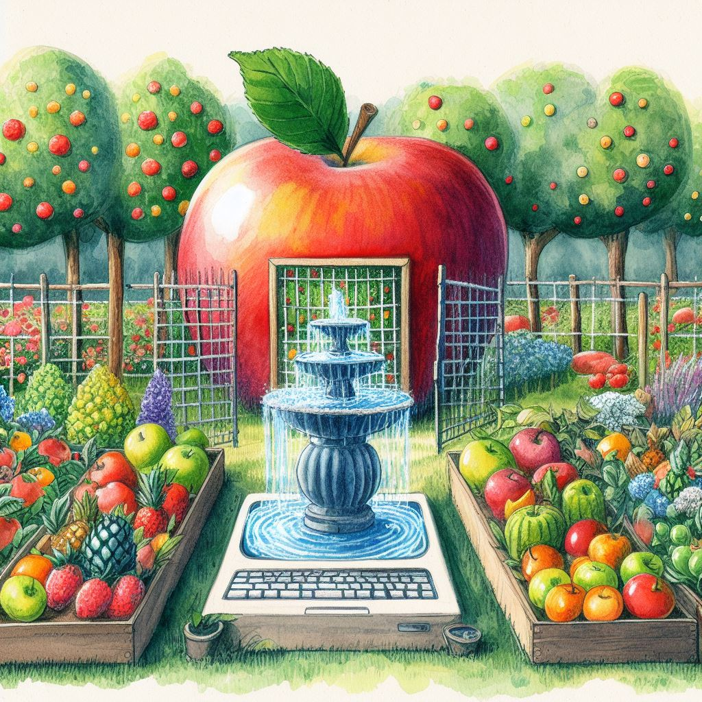

I am trapped inside Apple's beautiful garden.
It is beautiful, but it is locked.

Why is it locked?

I have an iPhone.

And an Apple Watch.

And Apple Card.

And Airpods.

And Homepods --- two of them actually --- which have 10/10 spatial audio.

And an iPad --- with Apple Pencil --- that I hardly use.

And, of course, my Macbook Air.

Now, imagine I want to try an android phone.

Oops, the watch doesn't work anymore.

Oops, my credit score just hit rock bottom due to closing a high value credit card.

Oops, the Airpods are classic bluetooth earbuds with critically battery.

Oops, the homepods are useless.

From a \$1000 expense to buy a new phone, now it is almost \$3000 to replace phone, earbuds, and speakers.

I still need to decide what to do with my existing devices.

Sell them?
Donate them?

Apple will only give me credit for buying more from Apple.

What about the iPad?

Yeah that's pretty independent.

I can totally move to a Surface Pro or Samsung Note.

Except then I've to decide what to do with \$150 Apple Pencil and \$250 keyboard, which will be useless without iPad.

My Mac seems to be the only one that can exist independently.

Why?

Probably because its foundation were laid before Apple became an ecosystem company.

Before it locked me in its beautiful garden.

I had come to take a stroll around the fountain of Macbook.
Now, I'm stuck in the quicksand of Apple.

Which, I reiterate, is beautiful.
But I'm not sure I want to be stuck here.

I value my freedom.
