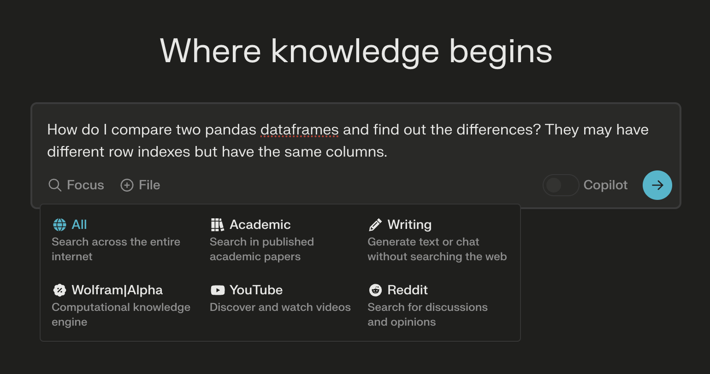
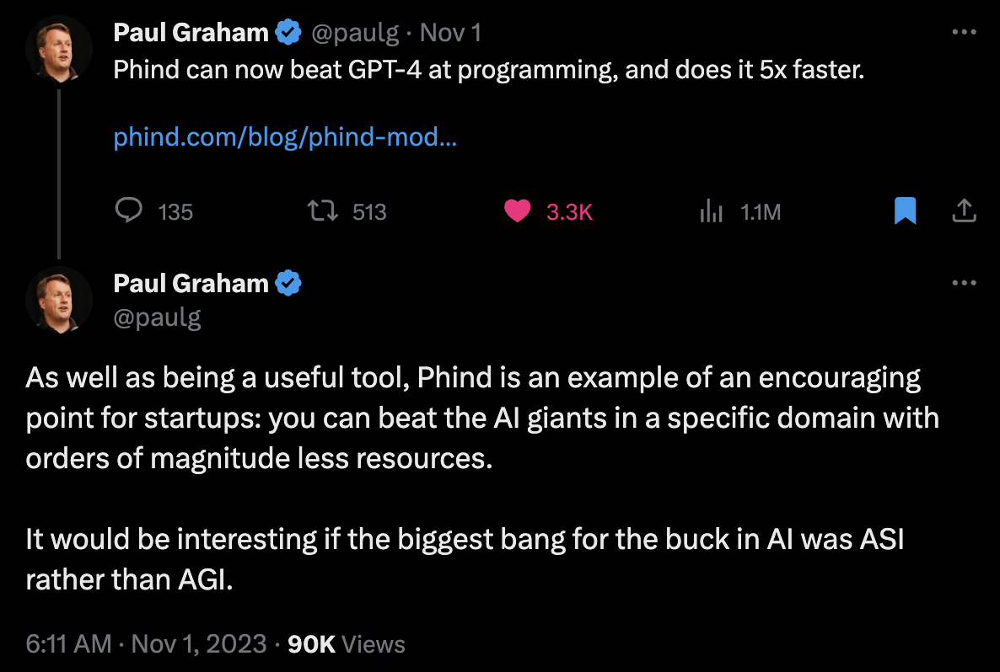
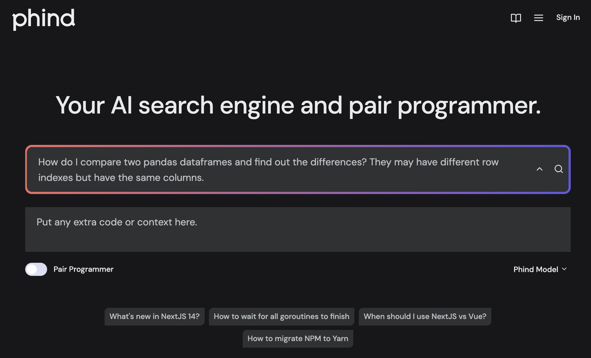
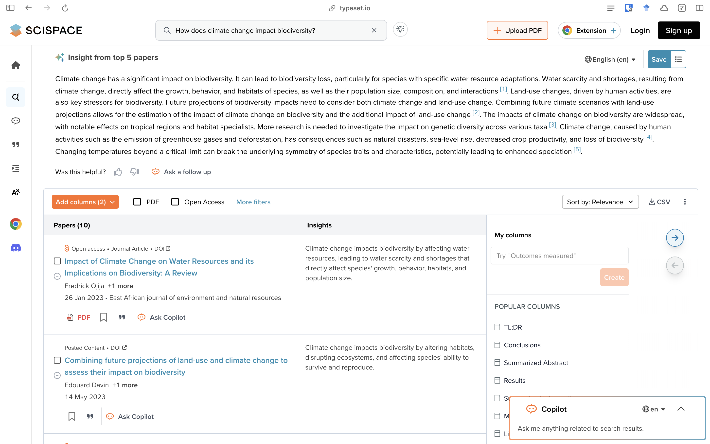
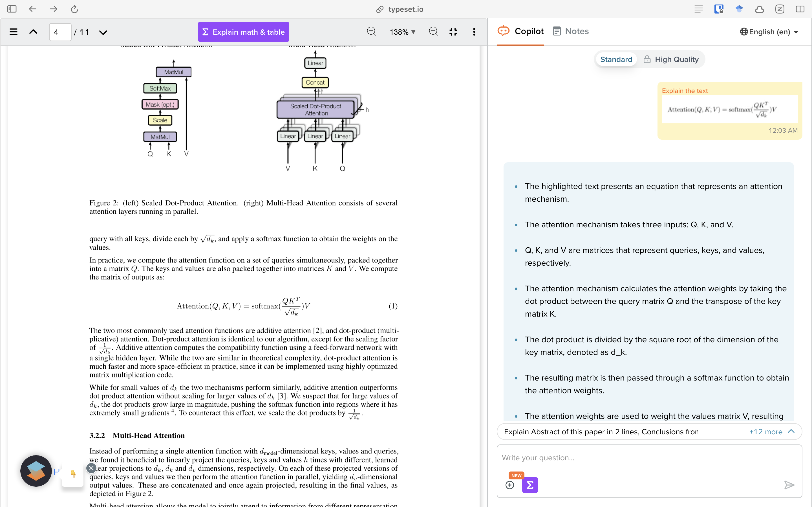

Since its launch, ChatGPT has taken over the world by a storm.
While many are afraid of losing their jobs (which likely [will happen](https://www.harsh17.in/ai2/)), many of us are thinking of using these tools to upgrade our existing work quality.
In the last several months, I have discovered numerous tools like that; let's take a look at some interesting ones that I frequently visit.

### Perplexity

[Perplexity.ai](https://www.perplexity.ai/) is a search tool like Google but with added GPT's knowledge base.
Things that I have found it best for:

-   Deep search when I don't remember the keywords to search on Google,

-   I want to have specific knowledge about a subject that is beyond the knowledge cut-off of ChatGPT such as recent news and developments,

-   **Copilot mode:** when I'm not sure what are the limitations of my thought process and want AI to act collaboratively --- discuss options with me and choose based on my preferences.

Their "[Discover](https://www.perplexity.ai/discover)" tab is also a good place to find interesting news from around the internet.
Perplexity also has many other LLMs that you can try in their [Playground](https://labs.perplexity.ai/).
Mistral-7b-instruct in particular was famous for having a very low safety check in prompts and responses.[^1]

[^1]: When it was launched, it gave explicit instructions on how to commit suicide for example.
    Now, it denies answering the question.

### Phind

I first heard about Phind from Paul Graham on Twitter/X who shared how [Phind beat GPT-4](https://www.phind.com/blog/phind-model-beats-gpt4-fast) at programming, and was 5x faster!
Furthermore, it supported 16,000 tokens while GPT-4 only supported 4096 tokens.
That's not all --- it could even search the internet, which means it was *amazing* at answering documentation questions from just launched software.

Situations when I find Phind most useful:

-   Coding.
    It is generally better than GPT-4 and can even search the internet!
    This is necessary when working with packages that got a recent update.

-   Since it has 4 times the context window of GPT-4[^2], I can put in the entire app or function for its perusal to poke out holes in my project.
    When you're debugging, sometimes it's not clear what's the source of error --- putting the complete project there with pair programmer helps.

-   **Pair programmer:** When you choose this, the chatbot is conversational and much better to use for debugging.

[^2]: OpenAI released GPT-4-turbo which has 16k context memory, so this point isn't that big anymore.

In my experience, Phind generally gives multiple methods to complete a given task unlike GPT-4.
It not only helps me learn the alternatives to achieve the objective, I know the limitations of each of them.

The responses also have search results with them in case you're interested in learning more.

### Claude

When [Claude.ai](https://claude.ai/chats) (with Claude 2) was launched this summer, I immediately realised how prone to hallucinations it was.
Like other LLMs, it made up stuff confidently.
But the rate at which it made up stuff was similar only to Google's Bard.

Nevertheless, Claude's strength is in its ability to handle *really long* contexts, up to 200,000 tokens.
That is almost 12x other models.
Furthermore, it can process PDF, TXT, CSV and DOCX.

I use Claude mostly for:

-   Summarize information from PDFs. This is great for finding out information from really long documents that I don't have the will to read.

Its performance in programming is abysmal and I wouldn't trust its factual responses.
Do verify.

**Side-note on hallucinations:** GPT-4 makes least amount of hallucinations, only around 3%.
That's better than most humans, in my opinion.
Claude makes around 8.5% hallucinations.
Google's Palm 2 has a 27% hallucination rate.
See the [leaderboard](https://github.com/vectara/hallucination-leaderboard).

### Typeset / Scispace

ChatPDF and its cousins took over the internet around February.
Many indie developers created their versions to chat with PDF files but the quality for all of them weren't as good as we had hoped.
For my research area --- machine learning --- it had shallow knowledge, no depth.
If I asked it a question around the paper, it would pick up the key words and generate a meaningful response with those words.
Did it answer my question?
Largely, no.

[Typeset.io](https://typeset.io/) is a big improvement.

-   **Literature review:** You can ask research questions directly and it will give a response with research papers as citations.

-   **Read with AI:** It can explain math!
    You can upload any PDF paper and it will start a chat on the paper.
    You can highlight any piece of text or math, and it will explain it to you.
    Granted it's not the same as reading the paper itself, but much better than ChatPDF.

-   It comes with a Chrome extension that provides Read with AI options on most journal's website.

-   It doubles as a paper management tool.
    You can collect papers together in a collection, create Bibtex citations, and more.
    Google Scholar++

### Why not Bard?

Because it simply doesn't make the cut.
Bard (with Google's Palm 2 Chat) has the [highest hallucination rate](https://github.com/vectara/hallucination-leaderboard) (27%), cannot do math at all[^3], and even with access to all my data, keeps giving summaries of things not in my emails, details about events that don't exist, and travel advice to places in Knoxville, Iowa instead of Tennessee.
Its image recognition is funky.

[^3]: It gives a list of 13 players when [asked](https://g.co/bard/share/1da260c4e7ad) for best 11 cricket players.
    I also give it serious penalty for not including MS Dhoni or Sachin Tendulkar --- two best players.
    [ChatGPT](https://chat.openai.com/share/43c87630-3af1-4517-8165-0a68136571dc) gives me 11 players and includes both of them.

A [Redditor](https://www.reddit.com/r/ChatGPT/comments/123nwy2/bard_sucks_so_much/) summarised it well:

> Bard acts as a tired old employee who´s about to retire sometime soon and doesn´t give a fudge about its work.
> Just wants to end its shift and go back home to have dinner-and-a-movie alone on its couch like every night, and will continue doing that after retirement\....
> like it was born tired\...
> applying the law of minimum effort to all its answers\...

With Gemini released today morning, Google says it has been able to catch up to GPT-3.5.
Let's see.
Haven't tested it yet.

### ChatGPT is still the King

ChatGPT is still the best AI chatbot for general purpose use.
I find myself using the Voice Chat functionality a lot --- to brainstorm ideas and listen to ideas.
Its speech to text (Whisper) and text to speech are much better than ANYTHING I've seen in any tool.
It has an amazing ability to understand images, better than everything I know.
