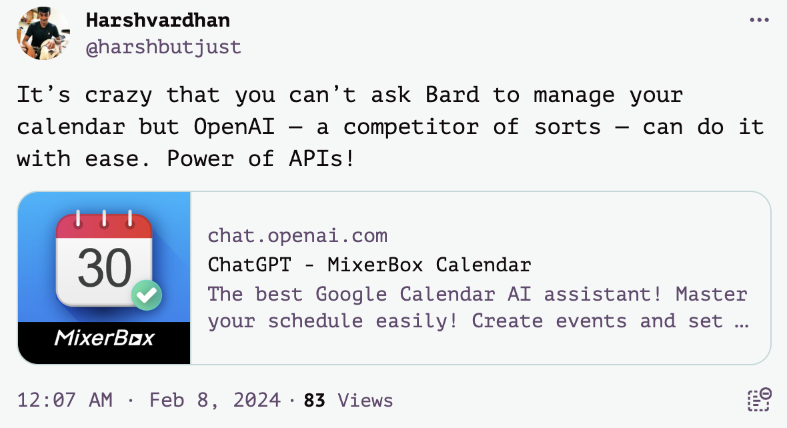
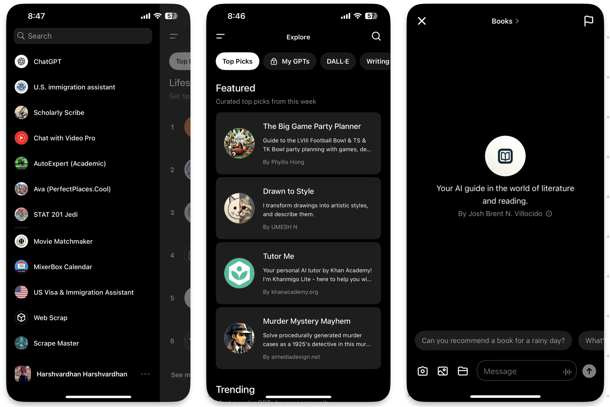
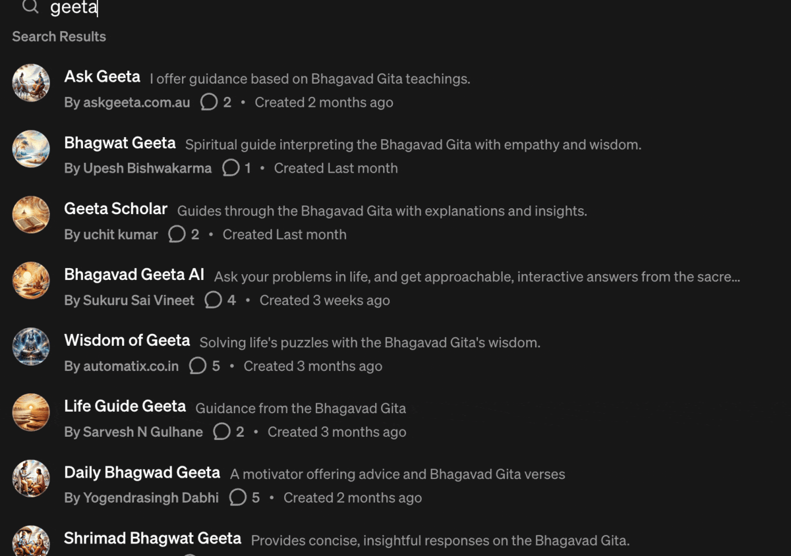
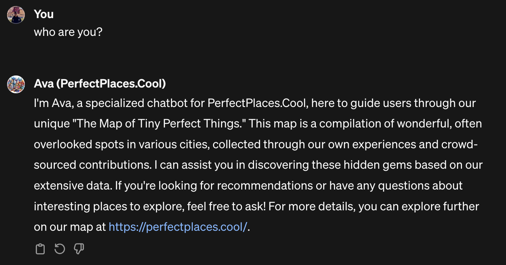

OpenAI's GPT is a terrific idea and a huge improvement over vanilla language models.

Language models as a technology has incredible power.
However, its knowledge and memory are limited by the model training.
If the model was trained with data up to 2023, it only "knows" what happened before that.
All such information is captured in its long term memory, from which information is retrieved.
Each key piece of knowledge is encoded within the weights of the neural network.[^1]

[^1]: More commonly known as "parameters" of language model.

However, recalling from memory isn't a great way to answer questions.
We humans are the best example of this.
I remember from my Developmental Economics class that [India](https://arc.net/l/quote/bmbthjrx) significantly reduced poverty because we started using actual economic measures like consumption and expenditure, instead of relying on surveys.

Similarly, language models hallucinate when asked to answer a specific question.
More recently, OpenAI is preprompting our questions to avoid exact factual recall.[^2]
OpenAI's solution to this lack of knowledge is custom GPTs --- language models trained for a specific task.

[^2]: The most stark difference is in how many fewer actual facts are there in ChatGPT's answer to historical questions.
    In the original iteration, GPT-4 would attempt to get the right year, impacts, etc.
    More recently, its turning to a novoice summarizer.

[Bard](https://blog.google/products/gemini/google-bard-new-features-update-sept-2023/#:~:text=Connect%20to%20Google%20apps%20and%20services&text=With%20Extensions%2C%20Bard%20can%20find,across%20multiple%20apps%20and%20services.) was clearly an innovator in integrating a wide range of services, thanks to Google's virtual monopoly on searching and communicating useful information.
It could easily connect to Gmail, Drive, YouTube, Maps, Docs, Flights and a host of Google services.
However, the performance was subpar.
It would hallucinate a lot and often forget that it had the capability to talk to other Google services.
(It almost always remembered to do that when told.)[^3]

[^3]: Like [Hanuman](https://valmikiramayan.net/utf8/kish/sarga66/kishkindha_66_frame.htm) forgetting his powers and remembering them again when Jambavan, son of Brahma, reminded him of them.

OpenAI realized that the key to unleashing potential is opening up.
Just as the App Store and Play Store democratized the capabilities of phones and internet access, a marketplace for LLMs could foster innovation like nothing else.
I'd say that's exactly what's happening.

I often find myself using these specialized GPTs far more frequently than the base model.
There seems to be one for most practical purposes, and they're quite easy to search for too!

Here are some of my favourites:

1.  [Chat with Video Pro:](https://chat.openai.com/g/g-VgadmpesQ-chat-with-video-pro) You can chat with YouTube videos directly. Ask specific question about the video. It pulls the entire video's transcript and injects it into language model's short term memory as context. Thus, chances of hallucination are significantly less.\
    Google says Bard can also talk to YouTube. In my experience, it hallucinates too often and forgets half the time that it can do that.
2.  [U.S. Immigration Assistant:](https://chat.openai.com/g/g-LIb0ywaxQ-u-s-immigration-assistant) The situation as an international student/worker in USA is not great; too much depends on your visa status and [lady luck](https://debarghyadas.com/writes/eb-wait-indians/). For answering my most random questions, I use this. It knows about the subject more than the base model. (But is not the same as an actual lawyer.)
3.  [MixerBox Calendat:](https://chat.openai.com/g/g-aI4P3mWio-mixerbox-calendar) It is a Google Calendar AI assistant. You can GPT what you want, and it can tell what's on your calendar and schedule meetings with ability to customize every detail possible.

There is one for almost every use conceivable.

Creating one is ridiculously easy.
You tell ChatGPT what you want to create, supply the extra source of information, and voila!
In fact, Ava from [PerfectPlaces.Cool](https://perfectplaces.cool/) --- a project Dea and I have been procrastinating long enough --- was hard to implement natively.[^4]

[^4]: Although we tried, and it's not particularly bad: <https://perfectplaces.streamlit.app/>

Ava has now been transformed into a sophisticated chatbot, capable of guiding visitors through a curated map of unique, crowd-sourced spots.
By leveraging the power of GPT, Ava provides personalized recommendations with an almost uncanny insight, making the discovery of "tiny perfect things" an adventure in itself.

[You can try Ava here](https://chat.openai.com/g/g-FUrjWi9Bn-ava-perfectplaces-cool).
She can plan your visits to a city like no one else.
Her information is based on crowd-sourced information, not paid advertisement.
