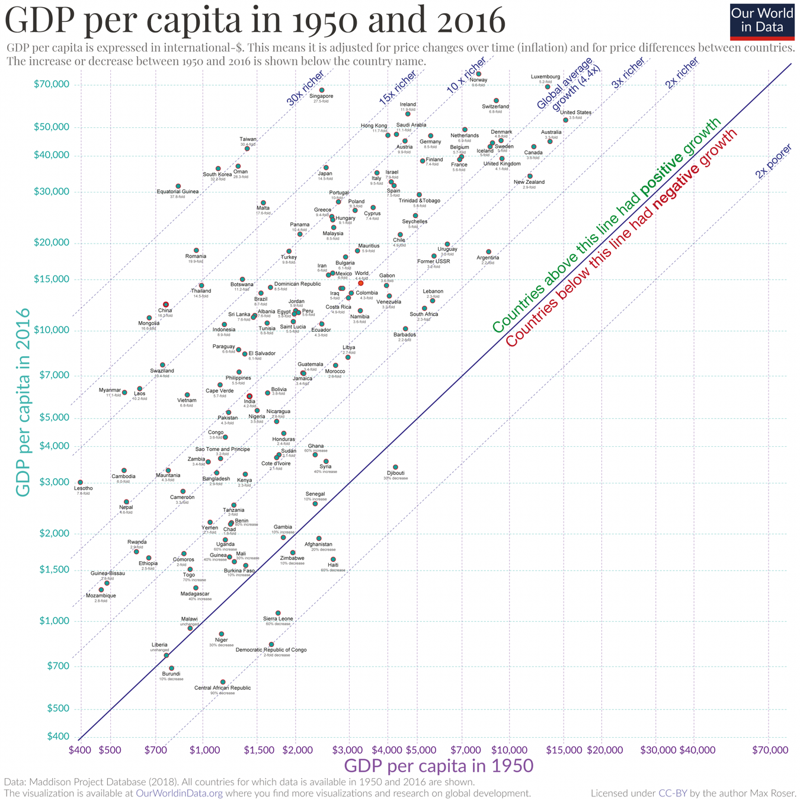
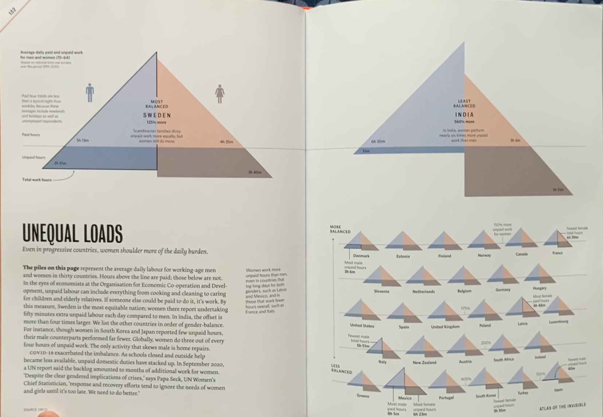

> The world has enough for everyone's need, but not enough for everyone's greed.
>
> --- Mahatma Gandhi

Every once in a while, it is crucial to review where we are and where we are headed.
You might be in a habit of doing a yearly or a monthly review.
Shouldn't we do a century-long review?
Would we deem the values we take for granted today still relevant in a world where we are knees dip in [polycrisis](https://www.bsr.org/en/blog/2023-delivering-just-sustainable-business-polycrisis)?

### Perils of GDP as KPI

> It's a five-minute bike ride to the train station.
> On brisk mornings like this, I wear gloves and pack a warm coffee for the commute.
> My work buddy Lucy gets on two stops down, always with a pair of scones, wheeling her bike next to mine in the locker downstairs before joining me in the sunny coach section.
> Half an hour later, we unload the bikes and race each other along the greenway to our office.
> Twice a week, this; twice a week, we co-work from a cafe in the suburbs.
> The rest of the week is ours to enjoy.
>
> --- [Betsy Ruckman](https://grist.org/looking-forward/the-growing-popularity-of-degrowth/)

The capitalist system, with its emphasis on growth and efficiency, often quantifies success in terms of Gross Domestic Product (GDP), which is the total value of goods and services produced over a specific time period within a country.
Yet, as we scrutinize the [Philips Curve](https://en.wikipedia.org/wiki/Phillips_curve)---an economic concept that suggests an inverse relationship between rates of unemployment and corresponding rates of inflation---we must ask: Does our relentless pursuit of economic indicators, such as GDP and low unemployment, overshadow the quest for happiness and well-being?[^1]

[^1]: Stagflation in 1970s has effectively [disproven](https://www.brookings.edu/articles/the-hutchins-center-explains-the-phillips-curve/) the validity of Phillips Curve.
    In fact, this spurred a debate on the role of expectations in the economy.
    Raghuram Rajan, who has worn many hats including RBI Governor, Chief Economist at IMF, and now a professor of finance at Chicago Booth, correctly identified the role of expectations on inflation in India.
    While criticized at the time, he managed to bring inflation expectations to 4 ± 2% in India --- a significant feat for a developing country.

    Nevertheless, most central banks including the [Fed](https://www.stlouisfed.org/open-vault/2020/january/what-is-phillips-curve-why-flattened) and RBI use this critically in deciding their monetary policy.

> I think this is a good time to clarify that I am not against economic growth.
> However, I think the discussion should be "till when" rather than "yes/no".
> You can note in the graph above how the richest country have grown significantly.
> Maybe, it's time for them to slow down and focus on metrics other than GDP.
> This graph also tells us how some countries need to grow really fast, especially those that have [substantial poverty](https://ourworldindata.org/poverty-growth-needed).

[Simon Kuznets](https://en.wikipedia.org/wiki/Simon_Kuznets), the economist who developed the first comprehensive set of measures of national income, stated in his [report to Congress](https://fraser.stlouisfed.org/title/national-income-1929-1932-971) in 1937 about the limitations of GDP:

> The valuable capacity of the human mind to simplify a complex situation in a compact characterization becomes dangerous when not controlled in terms of definitely stated criteria.
> With quantitative measurements especially, the definiteness of the result suggests, often misleadingly, a precision and simplicity in the outlines of the object measured.
>
> ... additional difficulties will be suggested to anyone who wants to penetrate below the surface of total figures and market values.
> Economic welfare cannot be adequately measured unless the personal distribution of income is known.
> And no income measurement undertakes to estimate the reverse side of income, that is, the intensity and unpleasantness of effort going into the earning of income.

In 1962, he further added:[^2]

[^2]: Simon Kuznets.
    "How To Judge Quality".
    The New Republic, 20 October 1962.
    [PDF](https://static1.squarespace.com/static/5536fbc7e4b0d3e8a9803aad/t/554d19f6e4b0005c69696961/1431116278720/Kuznets_How+to+judge+Quality_1962.pdf).

> Distinctions must be kept in mind between quantity and quality of growth, between costs and returns, and between the short and long run.
> Goals for more growth should specify more growth of what and for what.

My problem is that we don't have a discussion on quantity and quality, short-run and long-run, and cost of "reversal" if at all possible.
None of that is factored into the calculation of GDP.

### What counts as "work"?

Take, for instance, the stark contrast in how Sweden and India approach unpaid labor.
The following graph is from the beautiful [Atlas of The Invisible](https://www.atlasoftheinvisible.com/).

On the left, we have Sweden --- the most balanced country where the average amount of paid and unpaid work for men and women are close: women do 125% more unpaid work.
On the right, we have India --- the least balanced country where the average amount of paid and unpaid work for men and women are miles apart.
Women do nearly six hours of unpaid work where as men do less than an hour.

In Sweden, policies and societal norms acknowledge and strive to compensate for this often-invisible work---such as caregiving and household chores---which is crucial for societal sustenance.
Conversely, in India, traditional gender roles often dictate that this labor remains unrecognized in economic terms, despite its fundamental role in the fabric of daily life.
This unpaid labor, although not accounted for in a country's GDP, is essential for the functioning of society.[^3]
[^4]

[^3]: Data Source: [OECD](https://data.oecd.org/emp/hours-worked.htm), according to the book.
    Though India is not an OECD country so I'm not sure where was non-OECD countries' data sourced from.

[^4]: This point is also reverberated in the recent news where women are avoiding [pregnancy](https://www.cleveland.com/news/2023/11/why-is-the-us-birthrate-so-low-how-about-the-cost-of-child-care.html) as childcare costs are astronomical and family support --- taken for granted for decades --- is non-existent in capitalist countries like USA.

This disparity invites a broader question: How do we value labor and life?
Bhutan's pioneering [Gross National Happiness index](https://www.grossnationalhappiness.com/) serves as a reminder that there are alternatives to GDP that encompass the richness of human experiences.[^5]
This index includes measurable factors like psychological well-being, health, education, and environmental quality, providing a more holistic snapshot of societal health.

[^5]: It is kind of funny that Bhutan decided to use "Gross National Happiness" over GDP in 1970s but didn't actually start measuring its happiness until 2008.
    Movie Rec on the topic: [Agents of Happiness](https://www.npr.org/sections/goatsandsoda/2024/02/04/1228505757/agent-of-happiness-bhutan-documentary-film-gross-national-happiness).

Such metrics dare to quantify the qualitative, challenging the traditional capitalist metrics by including the welfare and happiness of the population.
The documentary film "[Agent of Happiness](https://www.npr.org/sections/goatsandsoda/2024/02/04/1228505757/agent-of-happiness-bhutan-documentary-film-gross-national-happiness)" follows Bhutanese bureaucrats who survey citizens about their level of happiness.
Specifically, it follows one bureaucrat named Amber Kumar Gurung as he asks people 148 questions to assign them a happiness score from 0 to 10.

### Benefits of Slow Life: Peace

However, beyond the metrics lie the lived realities of individuals.
[Michelle Huang](https://x.com/michellehuang42/status/1761963751505354804?s=20)'s reflections on her move to rural Japan offer a poignant narrative on value and values.
She speaks of a deeper connection to consumption, where waste management becomes a personal responsibility, not an abstract service.
This echoes a sentiment that perhaps true value lies in our consciousness of our impact on the world and the legacy we leave behind.

Huang's journey is a microcosm of a larger narrative that questions the hypnosis of societal competitiveness --- a crucial ingredient of capitalism.
It's an existential vertigo that forces us to confront our priorities and desires, to distinguish between what is authentically sought after and what is imposed upon us by societal expectations.

### Beyond Capitalism

I'm definitely not the first person to think on these terms.
I was motivated to write my thoughts down upon reading this simple piece by [Claire Elise Thompson](https://grist.org/looking-forward/the-growing-popularity-of-degrowth/) on Grist.
European Parliament organised [Beyond Growth](https://www.bsr.org/en/blog/a-credible-future-beyond-growth) conference in Brussels that was attended by thousands.
Then there's also that "[Slow Down: The Degrowth Manifesto](https://www.goodreads.com/en/book/show/127462058)" by Kōhei Saitō that I intend to read soon.

But the lessons are clear to me:

In our global reassessment of value, we must consider the teachings from these varied experiences.
From Sweden's recognition of unpaid work to India's cultural norms, and from Bhutan's happiness index to the simple, yet profound, life in rural Japan, there are lessons to be learned.
We must craft economic systems that not only measure but also honor the full spectrum of human activity and happiness.

Capitalist metrics may have served us well in one era, but as we evolve, so too must our systems.
It's time to redefine what we value and find new ways to measure the true wealth of nations: the well-being of its people.

<iframe style="border:none;" width="100%" height="590" src="https://www.are.na/harsh/anti-capitalism-and-pro-degrowth/embed" title="Harsh&#39;s Are.na Channel on Economics et al.">

</iframe>
