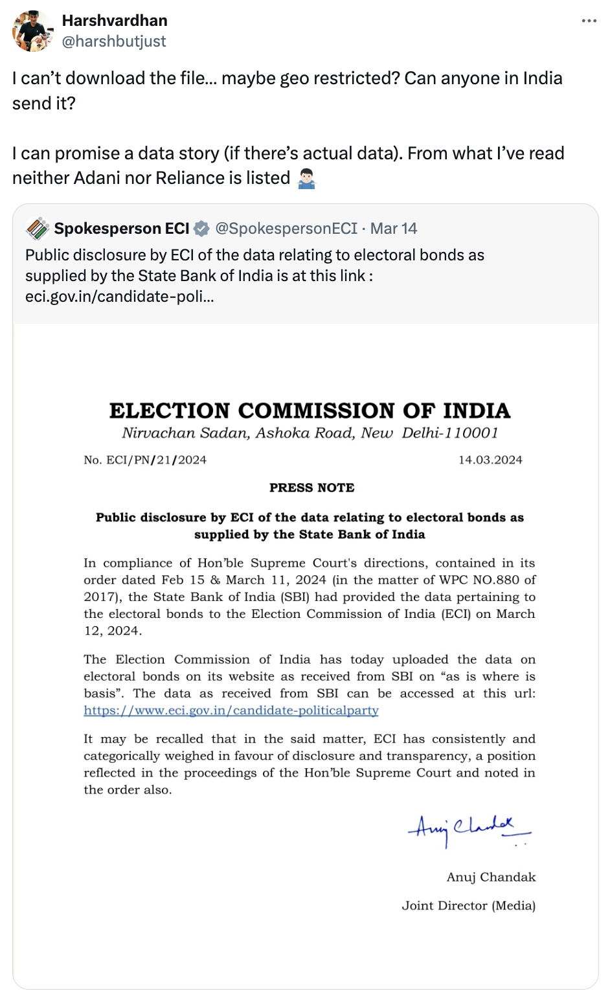

## Political System in India

For a fully functioning democratic government, it is essential to have clear insights into political parties that are involved.
In India, any citizen of India can stand for the elections and anyone can start a party.
Thus, we have thousands of parties that contest local, state, and national elections.

[Election Commission of India](https://en.wikipedia.org/wiki/Election_Commission_of_India) is the constitutional body empowered by Article 324 of the Indian Constitution, and vested with the power to supervise, direct, control, and conduct all elections to national parliament, state legislatures, local municipal bodies, including the offices of President and Vice-president of India.

The President and Vice-president have nominal powers according to the Indian constitution.
The president is the head of state, akin to British monarchy, and they are the final signees to make a bill the law of the land.
Vice-president, on the other hand, has slightly more powers; they conduct the activities of *Rajya Sabha* (Upper House).
Upper House doesn't mean it is more powerful than the Lower House (*Lok Sabha*); in fact, I'd argue it has less powers, particularly regarding economic bills as they must be initiated and passed by *Lok Sabha* before reaching *Rajya Sabha*.
Even in terms of strength, *Lok Sabha* has 545 seats whereas *Rajya Sabha* has 245 seats.

The election commission is the guardian for elections.
Before every election, it releases Moral Code of Conduct for political parties, which guides how should all parties involved behave.
During the election period, it has absolute control over all state machinery and can call to action even paramilitary help if necessary.

## Are politicians rich?

Election commission has long sought to reduce the influence of money from elections.
The commission appoints Indian Revenue Services (IRS) officers from the Income Tax Departments as Election Observers (Expenditure) for all elections, most notably in R.K.
Nagar constituency in [Chennai](https://www.newindianexpress.com/states/tamil-nadu/2017/Mar/31/deployment-of-observers-in-rk-nagar-a-new-national-record-election-commission-1588080.html) in 2017.
There are strict limits on how much can political parties spend.
Even the campaign period has been reduced from 21 days to 14 days, in order to cut down on monies spent by parties.

The commission also requires all candidates to submit an affidavit on their assets owned before the elections (when they sign up for elections), which is made public immediately.
Any lies results in criminal prosecution.
(BJP *Rajya Sabha* MP Sushil Kumar Modi presented the *Parl Commission Report* which calls for disqualification and stricter punishments.)

The affidavit data has resulted in some interesting insights like PM [Narendra Modi](https://myneta.info/LokSabha2019/candidate.php?candidate_id=12914) owns no immovable properties like a house or a vehicle, but most of his money is in cash, certificate of deposits, and four gold rings.
His net worth is around ₹ 2 crore (around \$250,000), and has no pending criminal cases against him.
[Rahul Gandhi](https://myneta.info/LokSabha2019/candidate.php?candidate_id=9208)'s net worth is around ₹ 15 crore (around \$1.8 million).
Association for Democratic Reforms (ADR) has created an easy to use website collating information from everyone's affidavit.
I implore you to explore the details at <https://myneta.info/>.
The present government has also been publishing ownership details of all ministers since 2013, data for which is [available here](https://www.pmindia.gov.in/en/assets-and-liabilities-of-the-union-council-of-ministers/).

If it is still not obvious to you, let me spell it out for you: most politicians in India are really rich.
(Although the impact of having a higher net worth on winning elections isn't clear. According to ADR, there's no significant correlation between the two, indicating voters take a holistic view of the candidates. I suspect this conclusion.)

## What about political parties?

Indian political parties may have several income sources, some of which they have to report, while others they don't.
For instance, they have to report all voluntary donations that are larger than ₹ 20,000, sale of assets, membership fees, interest income, etc.
They don't have to report contributions from meetings, and most importantly "Electoral Bonds".
We will come back to Electoral Bonds shortly.

Election expenditure in India is also one of the highest in the world.
For example, in 2019 General (Federal) Elections, an estimated ₹ 55,000 crore (\$8.6 billion) were spent.
That is higher than \$6.5 billion that was spent in US Presidential Elections in 2020.
So, a developing country spends more in elections than a developed country.
LOL.

## Transparency in Electoral Funding: Electoral Bonds

In 2017, the then Finance Minister Arun Jaitley introduced "The Finance Bill, 2017" in *Lok Sabha*, where it was classified as a "money bill".
Recall that *Lok Sabha* can introduce and pass economic bills, and they can't not be approved by *Rajya Sabha* if they have been passed by *Lok Sabha*.
Around that time, BJP (ruling party) didn't have majority in *Rajya Sabha* and thus the bill became an act without ever being introduced in the upper house.
The bill involved amendments to four key laws: the Representation of the People Act, the Income Tax Act, the Reserve Bank of India Act, and the Companies Act.

"[Corporate-Political Party Bond](https://www.deccanherald.com/india/corporate-political-party-bond-716378.html)", as Deccan Herald called them, would be financial instruments that anyone can buy and send to any political party of their choice.
Once these bonds are brought and transferred, they would completely blind everyone to the knowledge of political funding, innocuously hiding the detail of WHO donated to WHO.
A more insidious move, hidden in edits to the Companies Act, was to remove the 7.5% ceiling on the proportion of profits of a company that could be donated to a political party.
Furthermore, the provision that required companies to disclose the name of political parties to whom they had donated, and how much, was completely scrapped!
Adding salt to the injury, both parties would still get tax exemptions.
Another LOL.

The two amendments when taken together could result in shell companies being created for the sole act of political funding.
Now even mafia, gangs, and dubious foreign entities can easily fund Indian political parties.
Is that what Jaitley meant by "Transparency in Electoral Funding" in his budget speech?
Or what the government notification titled "The Scheme of Electoral Bonds to cleanse the system of political funding in the country"?
It seems in the complete opposite direction to me!

## Opacity of Electoral Bonds

Soon, ADR (the NGO behind <https://myneta.info/>), Common Cause (another NGO), and the Communist Party of India (Marxist) filed petitions with Supreme Court of India opposing the scheme.
In 2019, Election Commission opposes the scheme, citing concerns about transparency in political finance.
ECI also discloses that it had shared these concerns in a letter to the Union government dated May 16, 2017.
ECI also shares concerns regarding how the scheme could prevent information regarding foreign funding from coming out, "which could lead to Indian policies being influenced by foreign companies."

Supreme Court, on ECI's recommendation, asks political parties to submit all details of donations, donors, and bank account numbers to ECI in a sealed envelop.
But the information was still behind bars for common citizens.
Right to Information was the last resort.
All the while, more and more political funding was coming from "unknown" sources (primarily electoral bonds).

All while the popularity of electoral bonds was higher than ever.
In FY 2021-22, 97% of income of *Trinamool Congress* (West Bengal) was from unknown sources!
[Source](https://www.newindianexpress.com/nation/2017/Jan/24/69-of-funds-for-india-political-parties-from-unknown-sources-report-1563076.html).

| Party                                    | Total Income  | Unknown Sources | \% Unknown Sources |
|-----------------------|-----------------|-----------------|-----------------|
| Dravida Munnetra Kazhagam                | 318.745 crore | 306.025 crore   | 96%                |
| Biju Janata Dal                          | 307.288 crore | 291.096 crore   | 95%                |
| Bharat Rashtra Samithi                   | 218.112 crore | 153.037 crore   | 70%                |
| YSR Congress Party                       | 93.724 crore  | 60.0168 crore   | 64%                |
| Janata Dal (United)                      | 86.555 crore  | 48.3617 crore   | 56%                |
| Samajwadi Party                          | 61.011 crore  | 3.66 crore      | 6%                 |
| Shiromani Akali Dal                      | 25.414 crore  | 12.1987 crore   | 48%                |
| All India Anna Dravida Munnetra Kazhagam | 25.263 crore  | nil             | 0%                 |
| Maharashtra Navnirman Sena               | 6.7683 crore  | 5.0762 crore    | 75%                |
| Telugu Desam Party                       | 6.028 crore   | 3.667 crore     | 61%                |

## Supreme Court Strikes Back!

On February 15, 2024, the Supreme Court of India (SCI) declared the Electoral Bond Scheme and the provisions of Finance Act 2017 related to it, unconstitutional.
It found the act in violation to Right to Information of citizens.
Furthermore, it directed the State Bank of India (SBI, a government-owned bank that issues, sells, and cashes electoral bonds) was asked to share complete details on issuance and redemption with ECI.
ECI would then put the details on its website for public knowledge by March 13, 2024 (two days ago from today).

Since 2024 General Elections are due in a month, the details would be a major news.
SBI asked for extension, which was denied by SCI, and the data was made available at <https://eci.gov.in/>.
(The site is geo-fenced to Indian IP addresses, I think.)

But I managed to get the data, thanks to my Twitter circle.



We have the data, now.
Yayy!
But so what?

## Biggest Beneficiaries: Political Parties

I wanted to identify who are the contributors and who are they contributing to.
But once I had the data, I realized it was essentially worthless without the mapping between the donors and receivers!

For the starters, we can find which parties benefitted the most from the scheme.
Even without looking at the data, I can say it would be the ruling party BJP as it is the largest party, incumbent, initiated the scheme, and generally friendly to corporate interests.

```{r include = FALSE}
library(tidyverse)
library(readxl)
library(scales)
```

```{r echo=FALSE}
data_path = "/Users/harshvardhan/Library/CloudStorage/Dropbox/Personal/personal-website/content/blog/2024-03-15-who-s-funding-the-politics-in-india/Electoral Bonds Raw Data.xlsx"
df_party = read_excel(data_path, 
    sheet = "by Party", col_types = c("date", 
        "text", "numeric")) %>% 
  janitor::clean_names()

# Aggregate to find the top-10 purchasers
top_parties = df_party %>% 
  group_by(name_of_the_political_party) %>% 
  summarise(total_amount = sum(denomination), .groups = 'drop') %>%
  top_n(10, total_amount)

# Filtered data for the plot
filtered_data = df_party %>%
  group_by(name_of_the_political_party, year(date_of_encashment)) %>% 
  summarise(amount = sum(denomination), .groups = 'drop') %>%
  filter(name_of_the_political_party %in% top_parties$name_of_the_political_party)

# Join with top_comp to get the order
filtered_data = filtered_data %>%
  inner_join(top_parties, by = "name_of_the_political_party") %>%
  arrange(desc(total_amount)) %>%
  mutate(name_of_the_political_party = factor(name_of_the_political_party, levels = unique(name_of_the_political_party)))

# Prepare the data in the form of a cumulative sum for stacking in the area chart
filtered_data = filtered_data %>%
  arrange(name_of_the_political_party, `year(date_of_encashment)`) %>%
  group_by(name_of_the_political_party) %>%
  mutate(cumulative_amount = cumsum(amount))

# Custom function to format numbers in crores
label_crores = function(prefix = "", suffix = "") {
  function(x) {
    paste0(prefix, scales::comma(x), suffix)
  }
}

ggplot(filtered_data, aes(x = `year(date_of_encashment)`, y = cumulative_amount / 1e7, fill = name_of_the_political_party)) +
  geom_area(position = 'stack') +
  scale_fill_viridis_d(option = "F", direction = -1) + 
  theme_minimal() +
  labs(title = "Total Encashments by Top-20 Parties (2019-24)",
       x = "Year", y = "Cumulative Total Amount (in Crores)", fill = "Political Party") +
  theme(axis.text.x = element_text(angle = 45, hjust = 1, family="Helvetica"),
        legend.position = "bottom",
        legend.box = "vertical") +
  guides(fill = guide_legend(ncol = 2, byrow = TRUE, keywidth = 1, keyheight = 1)) +
  scale_y_continuous(labels = label_crores(prefix = "Rs ", suffix = " Cr"))
```

BJP is the biggest beneficiary, while Mamta Banerjee's Trinamool Congress (which gives me really bad vibes from their conduct in Bengal elections) is the second highest.
Considering that 97% of their funding came from electoral bonds, I'd argue that their case is more important than BJP.

## Biggest Donors: Corporations

The largest corporate buyers of electoral bonds can be known from the data, but little can be understood without knowing who they gifted their electoral bonds to!

```{r echo = FALSE}
# Load data from Excel
df_companies = read_excel(data_path, 
  col_types = c("date", "text", "numeric")) %>%
  janitor::clean_names()

# Aggregate to find the top-10 purchasers
top_comp = df_companies %>% 
  group_by(purchaser_name) %>% 
  summarise(total_amount = sum(denomination), .groups = 'drop') %>%
  top_n(20, total_amount)

# Filtered data for the plot
filtered_data = df_companies %>%
  group_by(purchaser_name, year(date_of_purchase)) %>% 
  summarise(amount = sum(denomination), .groups = 'drop') %>%
  filter(purchaser_name %in% top_comp$purchaser_name)

# Join with top_comp to get the order
filtered_data = filtered_data %>%
  inner_join(top_comp, by = "purchaser_name") %>%
  arrange(desc(total_amount)) %>%
  mutate(purchaser_name = factor(purchaser_name, levels = unique(purchaser_name)))

# Prepare the data in the form of a cumulative sum for stacking in the area chart
filtered_data = filtered_data %>%
  arrange(purchaser_name, `year(date_of_purchase)`) %>%
  group_by(purchaser_name) %>%
  mutate(cumulative_amount = cumsum(amount))

# Custom function to format numbers in crores
label_crores = function(prefix = "", suffix = "") {
  function(x) {
    paste0(prefix, scales::comma(x), suffix)
  }
}

# Create a stacked area chart
ggplot(filtered_data, aes(x = `year(date_of_purchase)`, y = cumulative_amount / 1e7, fill = purchaser_name)) +
  geom_area(position = 'stack') +
  scale_fill_viridis_d(option = "F", direction = -1) + 
  theme_minimal() +
  labs(title = "Total Bond Purchases by Top-20 Corporations 2019-24",
       x = "Year", y = "Cumulative Total Amount (in Crores)", fill = "Purchaser Name") +
  theme(axis.text.x = element_text(angle = 45, hjust = 1, family="Helvetica"),
        legend.position = "bottom",
        legend.box = "vertical") +
  guides(fill = guide_legend(ncol = 2, byrow = TRUE, keywidth = 1, keyheight = 1)) +
  scale_y_continuous(labels = label_crores(prefix = "Rs ", suffix = " Cr"))
```

Perhaps the most striking thing about the list of donors is the names it does not include.
The Adani Group, the giant conglomerate whose value has grown by almost 1,000 percent since Mr. Modi took power, appears nowhere.
Mukesh Ambani, Asia's richest man, does not either, although his Reliance Industries has a roundabout connection to the third-largest donor listed, Qwik Supply Chain.
Reliance released a statement saying Qwik is not a subsidiary of any Reliance company.

The biggest purchaser is [Future Gaming and Hotel Services](https://www.thehindubusinessline.com/news/national/santiago-martins-future-gaming-emerges-as-top-buyer-of-electoral-bonds/article67953666.ece), which snapped up ₹1,368 crore (\$165 million) in bonds.
That is many times greater than the profits it has reported in any year!
The company's owner, Santiago Martin, often styled as India's "lottery king," was under investigation for money laundering.

The second largest contributor is [Megha Engineering and Infrastructures Limited](https://www.thequint.com/news/politics/electoral-bonds-megha-limited-pp-reddy-telangana-bjp-brs-congress#read-more) (MEIL/Megha) which purchased bonds worth ₹ 996 crores (\$120 million).
The current owner, [PV Krishna Reddy](https://www.dnaindia.com/business/report-meet-man-who-lives-in-diamond-house-wealth-increased-by-rs-24700-crore-in-one-year-his-business-is-pp-reddy-3065317) whose wealth increased by ₹ 24700 crores in a year, is among the richest 100 people in India.
His house "Diamond House" literally looks like diamond.

The third largest contributor, Qwik Supply, whose registered office is at Navi Mumbai's Dhirubhai Ambani Knowledge City (DAKC), brought bonds worth ₹ 410 crore.
To put in perspective, the firm had a revenue of ₹ 500 crore in 2022-23.
The company spent almost all of what it earned on funding elections.

The entire list will leave you gasping for more information.
Nirmala Sitharaman, our finance minister, dismissed any allegation of *quid pro quo*, saying that there was nothing to establish a link between raids by investigative agencies and funding, and that any such charges were mere "assumptions".

## What else?

There's not much more that we can explore here without relying on other information.
But many questions remain:

1.  Did any company get *quid pro quo* benefits after its funding?
2.  How did Reliance/Adani support the governments? I'm very certain they supported BJP (and maybe also the opposition). But how? Why do they not feature in this dataset? Did they just donate cash (which wasn't reported in electoral bonds but reported thorough "known" sources of funding)?
3.  Now that the program is scrapped, what happens to the uncashed funding amount?
4.  Will SBI also release the funding graph, beyond just the two tables?
5.  Will Supreme Court also force more data release like this? Will it also force the companies to declare their donations like they used to before 2017?

I'll sit back and relax while more people take a look at this dataset.
In 4-5 hours of work, I learnt so much about election funding; those who have spent months researching this topic will come up with much better insights.

I hope you learnt something about election funding in general.
Here are a set of related [bookmarks](https://arc.net/folder/5BDF73D2-1562-4214-A83D-8973DE7E4AB9) that may interest you.

## Datasets

Thanks to Rishabh Anand, I got the access to the complete dataset as well as a crowdsourced version which is investigating corresponding raids by federal authorities, or winning significant government contracts.

1.  For this analysis, I used the raw data which you can access here. <https://github.com/harshvardhaniimi/personal-website/blob/fe7f928810a8e883a6507bd3c4c602a0d2c69854/content/blog/2024-03-15-who-s-funding-the-politics-in-india/Electoral%20Bonds%20Raw%20Data.xlsx>
2.  For easier viewing, I'm also uploading the same raw data with two pivot tables in a Google Sheet. <https://docs.google.com/spreadsheets/d/1XqqWKoVtQwrNxsKlSiXBFZnCOyoAERBvHreUZ7PB-9I/edit?usp=sharing>
3.  Finally, there have been some collaborative efforts to crowdsource information. <https://docs.google.com/spreadsheets/d/17iCn40APazZ_v0Ce17l51ZlYNf0tweCaywTjK6Pfef8/edit#gid=0>

Let me know in comments what you think about it or send me an email to hello\@harsh17.in :D
