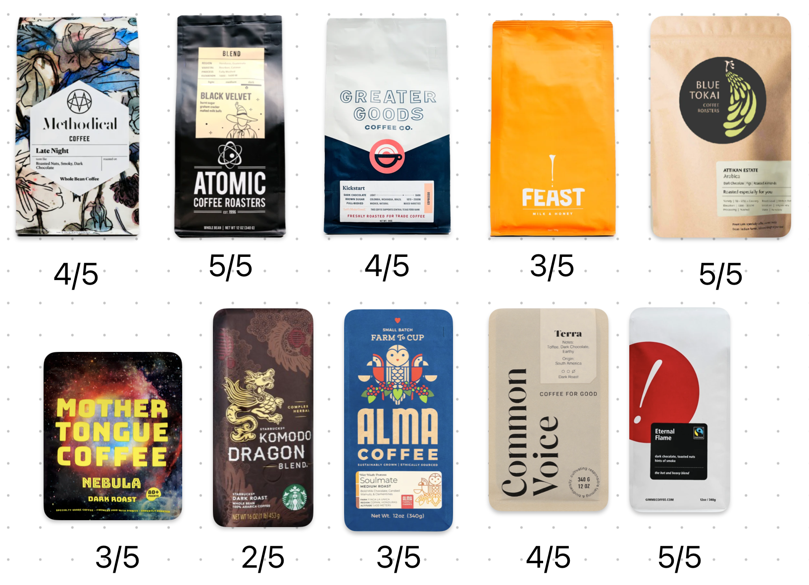
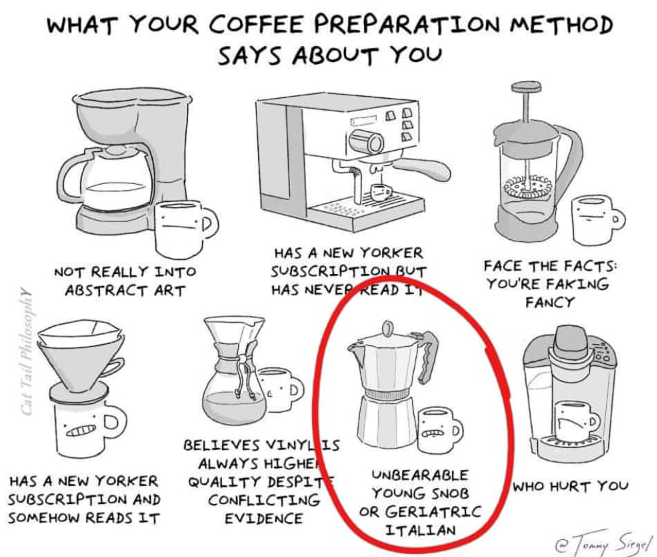

Ever since I began chronicling my coffee journey, things have become intriguingly more flavorful. ☕

The roots of a coffee bean can dictate much of its taste profile. For instance, single-origin coffee, where beans are sourced solely from one region, usually outshines blends, which mix beans from multiple origins.

The environment in which coffee grows, specifically the soil and climate, further impacts its flavor. African coffee, primarily from Kenya 🇰🇪, Ethiopia 🇪🇹, and Rwanda 🇷🇼, offers a delightful fruity sweetness. Conversely, South American beans (primarily from Colombia 🇨🇴 and Brazil 🇧🇷) impart a nutty, caramel-like note. As for Asian varieties (from Indonesia 🇮🇩, Vietnam 🇻🇳, India 🇮🇳), they bear a subtle spice kick, which explains the scarcity of such origins in American cafes.

My favourite beans so far have been [Blue Tokai's Attikan Estate](https://bluetokaicoffee.com/products/attikan?variant=40088519901239) (grown in Biligiriranga Hills in Karnataka 🇮🇳), [Atomic Coffee Roasters' Black Velvet](https://atomicroastery.com/products/black-velvet) (grown in Honduras & Guatemala), and Gimme! Coffee's [Eternal Flame](https://gimmecoffee.com/eternal-flame-fairtrade/).

> Coffee beans I've tried so far. [Blue Tokai's Attikan Estate](https://bluetokaicoffee.com/products/attikan?variant=40088519901239) (grown in Biligiriranga Hills in Karnataka 🇮🇳), [Atomic Coffee Roasters' Black Velvet](https://atomicroastery.com/products/black-velvet) (grown in Honduras & Guatemala), and Gimme! Coffee's [Eternal Flame](https://gimmecoffee.com/eternal-flame-fairtrade/) have been my favourite. Starbucks must've used additional flavours or syrups as their beans neither smelled good, nor tasted good. (Not all [Starbucks](https://www.harsh17.in/seattle/#starbucks-reserve) are bad though.)

The roasting process also plays a crucial role in shaping coffee's taste. Coffee seeds are inherently bitter, and roasting mellows this bitterness, unveiling the true flavors. Hence, light roasts are often more bitter than dark roasts, a fact contrary to common belief.

Given the profound influence of beans, their freshness significantly affects the overall experience. Freshly roasted beans boast a robust aroma and taste compared to month-old ones, like those you might encounter at Starbucks. Typically, high-quality beans retain their taste for two weeks, or up to four weeks when stored in an airtight container. While some people resort to refrigeration for longevity, I've not found substantial differences.

Then comes the pivotal step that Baristas are celebrated for---brewing. There exist at least ten diverse brewing methods.

My experiments have led me to the Moka pot, French Press, Drip coffee (pour over), and Aeropress. (The latter two didn't make it to the meme.) As a Latte aficionado, Aeropress resonates best with me. Using the Moka pot has also been fun, although it stayed back at my mother's place in India after my visit last December.

However, none of these methods can produce a satisfactory espresso shot. For that, one either needs to invest in a dedicated espresso machine or visit a decent cafe (not Starbucks; their beans were are a deal-breaker).

Finally, the brewing technique, as emphasized by [James Hoffman](https://www.youtube.com/channel/UCMb0O2CdPBNi-QqPk5T3gsQ), is paramount. I'm still honing this step, so stay tuned for more!
