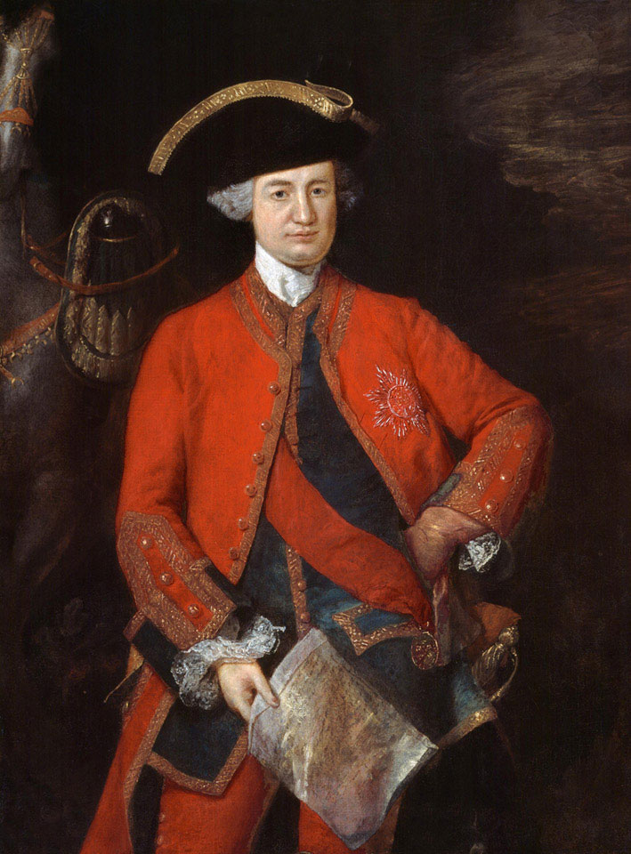
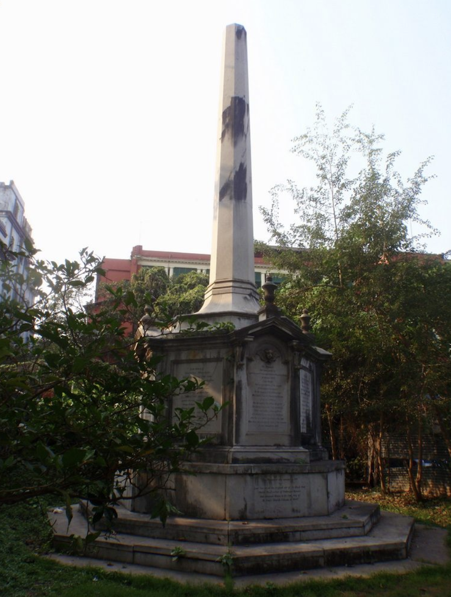
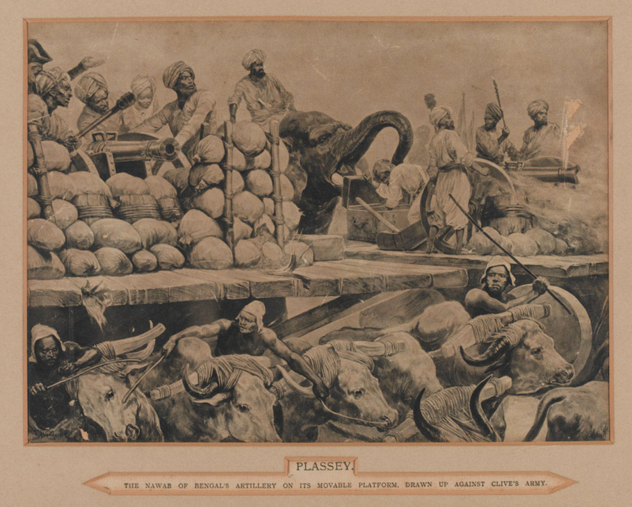
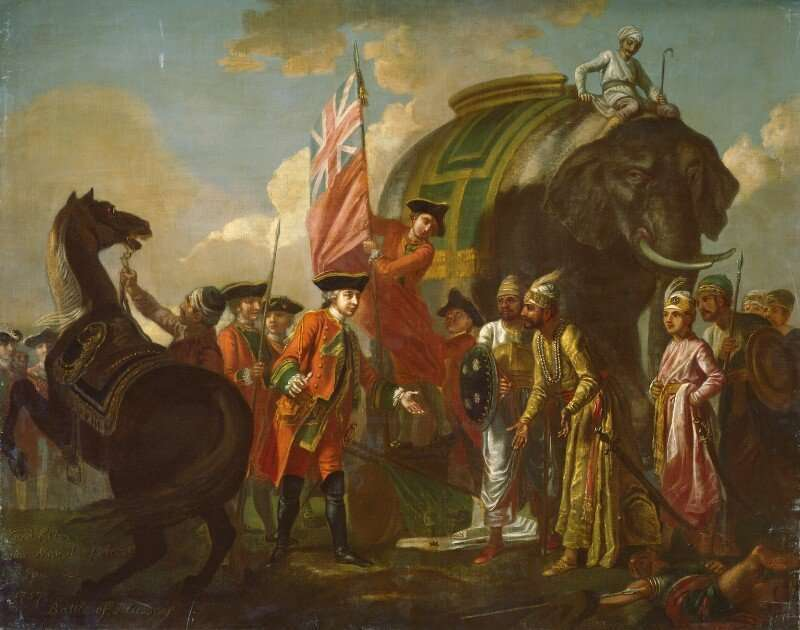

When "Clive of India" gained importance in the East India Company --- and managed to survive more than two years in India where most Company officers died from diseases and change in climate, etc. --- he realized the importance of India in making Britannia, more specifically him, rich.
To him, India was a little more than a treasure of riches, waiting to be "looted" and plundered to exhaustion.

> Robert, Lord Clive.
> 1764.
> Oil on canvas by Thomas Gainsborough.
> Source: [National Army Museum, London](https://collection.nam.ac.uk/detail.php?acc=1963-05-12-1).

With the Seven Years War (1756-63) ongoing, the British government didn't want to lose to either the French or the Spanish.
News reached from their intelligence of a possible attack by French navy in one of the colonies.
While the British government assumed it was India, more specifically Bengal, the French actually attacked Canada.
All these extra millitary resources and weaponary reached Robert Clive, a East India Company official's hand.

Clive's first mission was to support the British in the war by attacking the French post in Chandernagar.
Nawab had tried to send help but the governor of Hooghly was bribed to remain inactive and prevent the Nawab's reinforcements to Chandernagar.

Jagat Seth et al., a prominent Indian banker group lead by a man whose name literally translates to "World's Banker", realized what was happening and inspired Clive to attack the Nawab of Bangal, Siraj ud-Daulah.
Jagat Seth's methods were quite advanced for its time.
In 16-17th century India, it wasn't easy to transfer wealth --- gold, wheat, and even taxes --- from one city to another.
While the Mughal Emperror Akbar had established certain protection along the route for traders and travellers en route between major cities, it was nowhere close the "safe".
There was enough risk that Jagat Seth's plan worked.

Jagat Seth's group had bankers in most major cities in India including Kolkata, New Delhi, Mathura, Allahabad, Agra among others.
Instead of physically transfering the wealth, traders could carry a "Certificate of Deposit" from one city's bankers which could be encashed in the second city.
Usually charging around 15-20% commission on the gross amount, they made huge profits.

Jagat Seth promised Robert Clive that his group would not only fund the attack against the Nawab, but would also pay the company and Mr Clive a million pounds each.
To give you a perspective, that is almost a billion dollars in today's currency.
Clive couldn't possibly say no; it was too good an offer to let go.
If he lost, he would still have enough for an early retirement; if he won, he would have enough for his coming three generations, and then some.

What did Jagat Seth have against the Nawab?

No one particularly liked Siraj ud-Daulah.
He enjoyed watching people drown by throwing them overboard.
He lived a lavish life and created unpredictable changes to the laws of land, based on his whims.
Jagat Seth didn't like it --- it was bad for his business to the East India Company, which still needed to have reliable partners to trade in an unfamiliar territory.

Jagat Seth had high confidence in getting back his borrowings to the company than if made to the Nawab.
They both understood the concepts of finance and contracts.
This becomes a lot more obvious in a few decades when the Marathas and Company have almost the same millitary might but Company wins simply because they could keep encashing Bengal and easy loans from Jagat Seth.

British had been losing the first few days, thanks to Nawab's superior army with 50,000 soldiers, 40 cannons and 10 war elephants.
As opposed to this, the British had only 30,000 men.

On June 20, 1757, when the British attacked Bengal, they lost badly to Nawab's army.
Siraj ud-Dhaula captured British soldiers in Fort Williams, Kolkata, and confined them in a small dungeon known as *Kaala Paani* or "black hole".
John Zephaniah Holwell, the chief magistrate, claimed that 146 captives were crammed into an 18 by 14 feet space, though modern estimates suggest about 65 were present.
The cell had only a small window for light and air, leading to severe dehydration and crushing among the prisoners.
By the next morning, when the cell was opened, Holwell reported that only 23 survived, describing the survivors in dire terms.

> Black hole of Kolkata memorial in present day Kolkata.
> [Atlas Obscura.](https://www.atlasobscura.com/places/the-black-hole-of-calcutta)

So how did Robert Clive win?

June is the month of Monsoon.
Its the time of rain.
As nature had it, it rained heavily for the next two days and the British covered their gunpowder and artiliery to save it from the rain while the Nawab's army couldn't.
Mir Jafar, Siraj ud-Daulah's Commander betrayed him too.
As soon as Clive realised that they had crucially missed covering their artillery, he attacked early morning and defeated Nawab with almost zero resistance.

> Siraj ud-Daulah's failure to bring tarpaulins rendered his cannons inoperable in the rain.
> Assuming the British faced the same issue, his general, Mir Madan, initiated a cavalry attack.
> However, the British cannons were still functional, and their counterattack fatally wounded Mir Madan and significantly impacted the Nawab's army.
>
> Process Engraving after Richard Caton Woodville, 1900.
> Source: [National Army Museum, London.](https://collection.nam.ac.uk/detail.php?acc=1961-10-51-1)

Soon after, Nawab was forced to sign Diwani --- the East India Company now had right to tax the state.
It was the dawn of colonial rule in India.

Siraj ud-Daulah met his terrible fate at the hands of Miran, the son of Mir Jafar.
Mir Jafar was appointed new Nawab of Bengal but he functioned as a puppet ruler for the Company.
He does realize his mistake a decade later when he takes up against the Company again in the Battle of Buxar in 1764, but the East India Company's army defeat the combined forces of the Nawab of Bengal, the Nawab of Awadh, and the Mughal Emperor.

> Robert Clive and Mir Jafar after the Battle of Plassey, 1757 by Francis Hayman.
> Source: [National Portrait Gallery, London](https://www.npg.org.uk/collections/search/portrait/mw01347/Robert-Clive-and-Mir-Jafar-after-the-Battle-of-Plassey-1757).

Following their victory, the treaty acknowledged Mir Jafar as the Nawab of Bengal, while the British gained territorial control within and around the Maratha Ditch, as well as Zamindari rights from Calcutta to the coast.
Mir Jafar agreed to compensate for the British naval and army losses.

The Battle of Plassey was a significant triumph for the British, both politically and economically.
Francis Hayman's painting above vividly illustrates this victory, contrasting the robustly fluttering Great Union Flag with the defeated, disheveled green and white flag, symbolizing the contrasting destinies of the British and their opponents.

This painting also is the first thing you see if you visit [Clive's estate today](https://www.nationaltrust.org.uk/visit/wales/powis-castle-and-garden/the-clive-museum-collection-at-powis-castle).
The event depicted in the painting never actually happened; the transfer of power was a private event that happened in Clive's war tent.
In fact, the painter Francis Hayman never even set foot in India.
