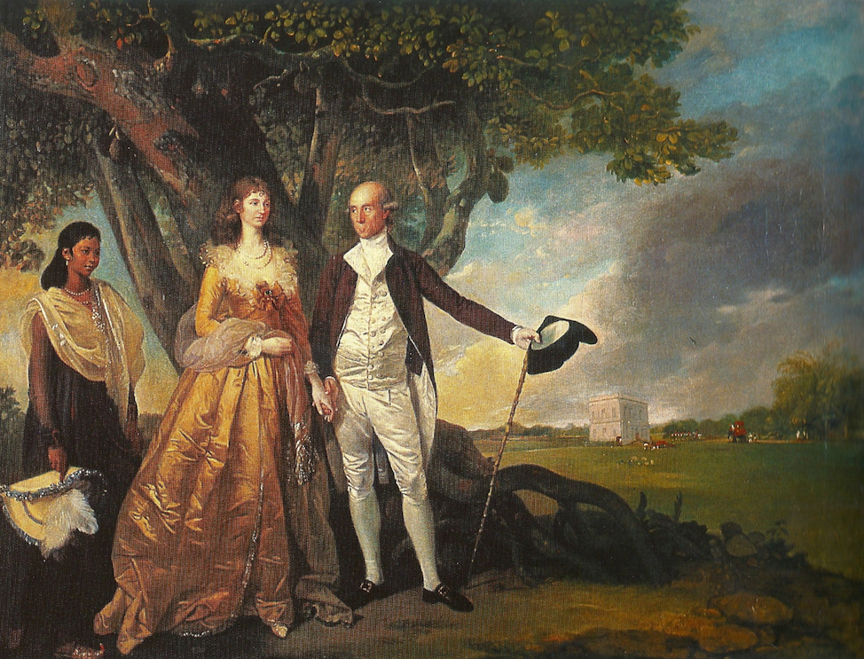
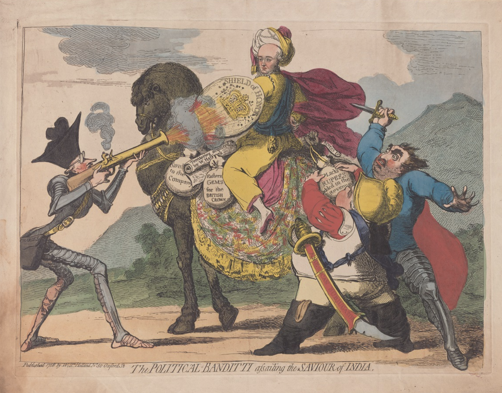

Warren Hastings deserves a special mention in the history of Colonial India.
While Robert Clive thought of India as nothing more than a treasure trove ripe for plunder to exhaustion, Hastings saw an ancient and venerable culture that deserved praise, respect, and most importantly attention of the west.

> I love India a little more than my own country.
> --- Warren Hastings

He became fluent in Urdu, Persian, Bengali, and a good working knowledge of Sanskrit though never really mastered it.
He made the first translation of [Bhagawat Geeta](https://www.harsh17.in/the-song-of-the-lord/).
He christened "Asiatic Society" with the help of Sir William Jones, who started a series of translations of Indian classics in Sanskrit to English.

While the Brahmins refused to teach Hastings (and Jones and virtually every White guy) Sanskrit in the name of religion, Hastings found a doctor who taught him enough Sanskrit to start reading Ramayana, Mahabharata, and Kalidas' *Abhigyan Shakuntalam*.
Jones' translation of *Shakuntalam*, which he called Sacontalá or The Fatal Ring, became widely popular in Europe.
Johann Wolfgang von Goethe, a towering figure in German literature, published an epigram about Shakuntala in 1791, and in his Faust he adopted a theatrical convention from the prologue of Kālidāsa's play.

Hastings also realized that the Indian laws were highly inadequate for the needs.
Royal courts didn't have enough resources or even uniform laws; cases were judged based on *panch*, who were local elders brought together as a jury.
With help from Jones' team, he translated *Manusmriti* in English which became a leading document for Indian (specifically Hindu) personal laws.
Even today, Indian laws for the Hindus on marriage, adoption, and taxes are derived from this book written between 200-150 BC.

Asiatic Society also translated other crucial works: Hitopadesha "Beneficial Advices" contains tales of wisdom written in Sanskrit between 800-950 CE, Rigveda and other vedas written before 2000 years BC, Ain-i-Akbari which is Mughal Emperor Akbar's biography, Jataka Tales which are tales from Buddha's times written around 500 BC.

Hastings' love for India was in sharp contrast to Clive, as I mentioned before.
Clive, who had garnered huge fan following in the East India Company and the British Parliament after his wins in [Battle of Palassey](https://www.harsh17.in/battle-of-palassey/), saw Hastings as an adversary whose approach "understanding" India needed to be checked.

Hastings, respectful of indigenous customs and traditions, was crudely labelled "Orientalist", while others inspired by the Whig brand of westernising "devil's land".
Hastings impeachment trials began soon after in 1787 and lasted till 1795, dubbed "probably the British Isles' most famous, certainly the longest, political trial".
He was caught in the whirlwind of political attacks from all directions: Whigs led by famous philosopher and "statesman" Edmund Burke, were a faction trying to embarrass the William Pitt's government, all intensified by the climate of deluge created by Robert Clive.

> In the cartoon by James Gillray, Warren Hastings is portrayed as the "Saviour of India," while exaggerated figures resembling political adversaries Burke and Fox assault him, symbolizing the intense political conflict and allegations of corruption that marked his time as Governor-General of India.

At Hastings\'s impeachment, his treatment of the Oudh queen-widows (Begums) provoked some of the most emotive outbursts from Burke, always a champion of princesses in distress.
His speeches were full of "love-passion" for the wronged Begums, and even seasoned MPs could not recollect weeping "so heartily and copiously on any public occasion".

Hastings was accused of personally instigating physical torture of the imprisoned eunuchs and of starving the Begums into submission.
The accusations against Hastings were unfounded. The Begums, showing no ill will, sent messages of support during his trial, which he later used as evidence to counter the impeachment charges.

Thomas Macaulay, who destroyed Indian education system in the name of "modernizing" it, was highly critical of Hastings.
He accused him of becoming "beloved by both the subject many and by the dominant few" and "enjoyed among the natives a popularity...such as no other governor has been able to attain." How is this an accusation?

It's important to note that my appreciation of Hastings isn't an endorsement of the British rule in India. 
East India Company and British government destroyed India through all means possible --- but one has to accept that Hastings' policies were a refreshing.
Someone did realize the ancient culture of India and its rightful place in the world.

He survived through the trials and finally received an standing ovation from the parliament.
His final speech went like:

> Indians have been misrepresented as sunk in the grossest brutality and defiled with every abomination, thereby justifying British attempts to reform them, nay to \'coerce\' them into goodness.
> It will be better to leave them as they are...
>
> Among the natives of India, there are men of as strong intellect, as sound integrity and honourable feelings, as any of this Kingdom. 
> I regret that they are not sufficiently noticed, sufficiently employed nor respected...  Be it your Lordship\'s care...to lessen this distance...and by your example make it the fashion among our countrymen to treat them with courtesy and as participators in the same equal rights of society...

The parliament got the wrong guy.
It should have been Robert Clive.
