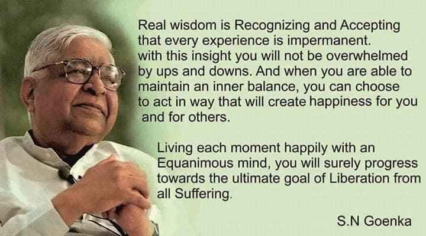

Between Dec 15 and 25 of 2022 I attended a meditation course called Vipassana.
Vipassana is a Pali[^1] word that means "seeing things as they are".
The course promised me to teach how to have a clear awareness of exactly what is happening as it happens.
It is a form of "mindfulness meditation".

[^1]: Pali is an old Indian language that was derived from Sanskrit but used by commoners (Sanskrit was mostly used by priests for worship, etc.).
    Most of Buddha's teachings are in Pali or Prakrit, which is a sister language to Pali.

### What is Vipassana?

It is an ancient Indian technique for calming your mind and was discovered as early as 2000 BC, when it was described in Rig Veda.
Over time, people added to the method or removed parts from it, and it eventually disappeared into void.
Common additions were focussing on a symbol, a god, or a chant.
Any addition to something this pure only makes it impure.

Around 600 BC, Buddha rediscovered the technique during a period of intense meditation and used it to attain enlightenment.
On the night he attained enlightenment, he was practicing Adhisthan (sitting of self-determination), where he determined he won't move until he attains enlightenment.
Learning the benefits of the technique, he then taught Vipassana to his disciples and it was passed down through the generations.

Over time, the practice of Vipassana faded away in India but was sustained by a small group in Myanmar led by Sayagya U Ba Khin.[^2]
It was revitalized by a Burmese-Indian teacher named S.N.
Goenka in the 20th century.

[^2]: It is an interesting story how Buddhism spread from India to the world.
    [Ashoka the Great - Rise of the Mauryan Empire Documentary](https://www.youtube.com/watch?v=Ed6UZtVTI64) is a good start.
    It also tells the story of King Ashoka the Great, who was ferocious general known for killing millions, but eventually converted to Buddhism and practised non-violence.

### The Elephant

An elephant is a powerful creature.
Weighing over 6000 kg (14,000 pounds), they can easily crush humans with a single foot when they go wild.
However, once we gain control over them, we can make them work for us.
They can lift heavy logs and arrange them for us.

Our mind is similar.
It is very powerful.
It can be used constructively when in control of us, or destructively when we let it control us.

### The Art of Living

Buddha taught that the ultimate peace can be attained by being equanimous and realizing the temporary nature of reality.
Attachments to material possessions, desires, and relationships causes suffering, and that true happiness and peace can only be achieved by letting go of these attachments and accepting the impermanent nature of all things.
By practicing mindfulness and detachment, we can cultivate a state of equanimity that allows us to remain calm and peaceful in the face of life's challenges.

Being equanimous to the outcomes means not being attached to the results of our actions, accepting whatever happens with a peaceful mind.
During Vipassana, I became aware of the sensations of my body and how they changed from moment to moment.
This experience allowed me to realize the temporary nature of all sensations, including emotions.

For example, I may feel happy in one moment and then feel sadness in the next, but both emotions come and go, just like physical sensations.
By accepting this impermanence and not being attached to any specific outcome, I was able to cultivate a more peaceful and equanimous mindset.

### S.N. Goenka's Story

S.N. Goenka came from a wealthy Marwari family whose ancestors had relocated from India to Myanmar for business opportunities.
Despite his success, Goenka suffered from frequent migraines and other mental health issues.
To manage his pain, Goenka's doctor prescribed a regular dose of morphine, but the situation only worsened over time.
Desperate for a solution, Goenka turned to religion and read various Indian texts, including the [Bhagwat Geeta](/the-song-of-the-lord/), which had long recited since childhood but to no avail.

One day, Goenka came across a Vipassana camp run by Sayagya U Ba Khin.
Intrigued by the practice, Goenka decided to attend the camp and was immediately cured of his migraines and other health issues.
He was so struck by the transformative power of Vipassana that he became a lifelong practitioner.

A few years later, Goenka's parents fell ill, both mentally and physically, and were losing control of their bodies and memories.
They were living in India, so Goenka returned home to teach them the practice of Vipassana.
Some other villagers also joined in and they, too, experienced the benefits of the practice.

This was the beginning of the modern Vipassana movement.
As word of its effectiveness spread, more people started to seek out Goenka's teachings.
Today, Vipassana is practiced by millions of people all over the world and is widely recognized as one of the most powerful mindfulness meditation techniques.

### My Experience of Vipassana

Vipassana, as taught by Buddha, is a practice that is devoid of religious or spiritual overtones.
During the first three days, I focused on being mindful of my own breath, paying attention to the sensations in the area above my upper lip and nose.
This helped me to improve my ability to concentrate and focus.

On the fourth day, I was introduced to the practice of Vipassana.
Using the skills I developed in the first three days, I started to scan my body from head to toe, becoming aware of sensations and emotions as they arose.
Over the next few days, I worked on increasing my ability to scan my body and recognizing the impermanence of sensations and emotions.

I become happy, angry, or sad as my mind jumped from meditation to a past memory or a future desire.
I was eagerly looking forward to eating Paani-puri.
I noticed how my body sensed thouse memories and desires.
I saw those sensations come and go.
I realised their nature of temporary visits.

> Buddha said that your mind will remember how it felt even though the original stimulus would go away.
> Every sensation is temporary.
> But the resulting desire is lasting/permanent.
>
> This desire would cause cravings.
> Those cravings would lead to consumption and even deeper desires.

By the fifth day, I learned how to be indifferent to all emotions and understand that my happiness and sadness are the result of my attachment to sensations.
The rest of the program was focused on continued practice and letting go of known desires.
The process can be intense, but it has helped me to gain a deeper understanding of my mind and the impermanence of emotions.

Rest of days are mostly practice.
For me, those days were instrumental.
On day 7-8, I kind of felt like I was gonna boil with all the heat I felt during the meditation.
Their explanation is that it's your mind getting rid of known desires.

### Day-by-day Summary

This is for my own note.
I would recommend you to visit [Dhamma's website](https://www.dhamma.org/en/index) and schedule a session with them.
I am not qualified to teach Vipassana.

Nobel Silence has to be practiced at all times.
Only when the body is quiet can we quieten our mind.
Thus, we would not communicate with anyone including via talking, eye contact, etc.

If you have questions regarding your practice, you can visit the teachers during their office hours.
They also schedule a check-in session every two days in small groups of 6-8 students.

Day 1

-   Focus on the triangle area.
    Just keep your focus there with no other motives.

-   If you get distracted, no worries.
    Go back to the triangle.
    No regrets.
    Or blaming.

Day 2

-   See if you can identify which nostril you are breathing in from.

-   You could be breathing in and out from the left nostril, right nostril, or both nostrils.

Day 3

-   Repeat Day 2 instructions.

-   I learnt that my nose has three chambers.
    The top chamber goes into my skull.
    The middle chamber regulates how much air goes in.
    The lower chamber has some hair growth.

Day 4

-   Vipassana Day

-   Scan your body from the top of the head to the toes, focusing on every inch of the skin, looking for ANY sensation.

-   It doesn't matter what sensation it is.
    It could be an itch, it could be a sensation of numbness, it could feel like an ant walking, it could be the touch of clothes on skin.

-   Don't imagine sensations if you can't feel any.
    Wait for some time if you can't detect any sensation, but if you can't feel anything, move on to the next patch on your body.

-   When you do feel a sensation, don't stop to explore it.
    Move on to the next patch of skin.

-   My mind blew up the first time I moved my focus from the lower triangle to the top of the head.

Day 5

-   Repeat Day 4 instructions from today onwards.

-   Move your attention from the top of the head to the toes of the feet.
    Then back from the toes of the feet to the top of the head.

-   Actually, the order doesn't matter.
    What matters is that every inch of the skin is covered.
    This order only ensures that.

Day 6

-   Sittings of Adhisthan (Self-Determination) start from today.

-   In these three one-hour-long sittings (of the total ten hours of meditation), ensure that you do not move your body at all.

-   Don't punish your body by managing the unbearable pain.
    The objective is to train your mind not to get distracted and move, not self-flagellation.

Day 7

-   Instead of moving your focus inch by inch, move it body part by body part, if you can.

-   The goal is to expand your ability to know.

-   If you are unable to focus on an entire body part at once, don't get disheartened.
    Try again every few iterations.

Day 8

-   Meditation in Pagoda: If you want, you can meditate in pure silence without distractions in your cell in the Pagoda.

-   Repeat focussing on the body, part by part, instead of inch by inch (if you can).

-   Expand to focus on more body parts at once.
    Eventually, the entire body.

Day 9

-   Expand your attention from body parts to the whole body, if possible.

-   If you can scan your whole body at once, do that 1-2 times.
    Then, return to scanning the body inch by inch, part-by-part, and eventually the whole body again.

-   When you're able to do all the steps above: after scanning the entire body, focus on the spinal cord/backbone for any sensations.
    Start from the hippocampus area and go down to the tailbone.

Day 10

-   Maitri Divas

-   Noble silence is lifted, and you can communicate with fellow meditators.

-   Remember: Meditation is a powerful tool and thus be used for positive outcomes.
    Therefore, this final step is important.

-   Always end your meditations by telling yourself / chanting: *May all beings, living or non-living, visible or invisible, be at peace.*

### Vipassana Reforms Lives of Prisoners in India

Tihar Jail in New Delhi is notorious for its living conditions.
The jail is overcrowded with petty as well as ferocious criminals.
It has 20,000 prisoners lodged inside as against a capacity of 10,000.
Some were locked in for smuggling hard drugs like Cocaine while some were there for murdering three people in five minutes.
The jailers (prison guards) were trained in outdated style of valuing punishment over transforming them internally.
This would typically result in high rates of rearrests and prisoners do not learn how to live real people in natural environment, and the jail environment is very different from the real world.

Kiran Bedi, the first women Indian Police Service officer, was made Inspector General (IG) of Delhi Prisons in 1993.
She introduced many activities to engage and change lives of prisoners there.
She permitted regular communication and meetings with family.
Quality of food improved drastically.
Prisoners were happy but such surface changes would be short-lived.

The core at these changes was Vipassana, the long-term transformation tool, which started with a suggestion from a police officer who had managed his own anger issues with this ancient tool.
One thousand prisoners participated in a course conducted by Mr. S. N. Goenka in Tihar Jail, New Delhi, in 1994.

The impact of the project was profound.
Inmates who participated in the Vipassana meditation courses reported feeling more calm, centered, and in control of their emotions.
They also reported a reduction in stress, anxiety, and aggression, and an improvement in their relationships with others.

Moreover, the project helped to reduce the incidence of violence and drug abuse within the prison.
Inmates who participated in the Vipassana courses were less likely to engage in fights or other violent behavior, and the overall atmosphere of the prison became more peaceful and harmonious.

Seeing its positive results the government of India recommended that [every](https://prison.dhamma.org/en/guidelines-for-vipassana-meditation-courses-within-correctional-facilities/) prison in the country should organize ten-day Vipassana courses for inmates.

Prisoners continue to participate in Vipassana courses every month, at a permanent Vipassana center established in Tihar.
Thousands of police officers have also attended Vipassana courses, at the meditation center in the Police Academy in New Delhi, and at other centers throughout India.

Here are some videos on the topic.

#### TED Talk

<iframe width="560" height="315" src="https://www.youtube.com/embed/ixu4Kd5R1DI" title="YouTube video player" frameborder="0" allow="accelerometer; autoplay; clipboard-write; encrypted-media; gyroscope; picture-in-picture; web-share" allowfullscreen>

</iframe>

#### Documentary of Tihar Jail where Vipassana was popularised by Kiran Bedi

<iframe width="560" height="315" src="https://www.youtube.com/embed/WkxSyv5R1sg" title="YouTube video player" frameborder="0" allow="accelerometer; autoplay; clipboard-write; encrypted-media; gyroscope; picture-in-picture; web-share" allowfullscreen>

</iframe>

------------------------------------------------------------------------

#### *Every moment aware, every moment equanimous.*
