Welcome to the story of my 10-day nature escape, a journey from Maupin to Moab that promises a delightful mix of adventure, discovery, and tranquillity. Join me as I traverse vibrant landscapes, make friends with Frank, and delve into the history of Moab along the way.

I present to you not just the well-captured visuals of my experiences, but also the essence of my journey, as I revisit the star-studded nights, adrenaline-filled days, and the soulful quiet in between.

### Day 1 - First Steps and Pawprints

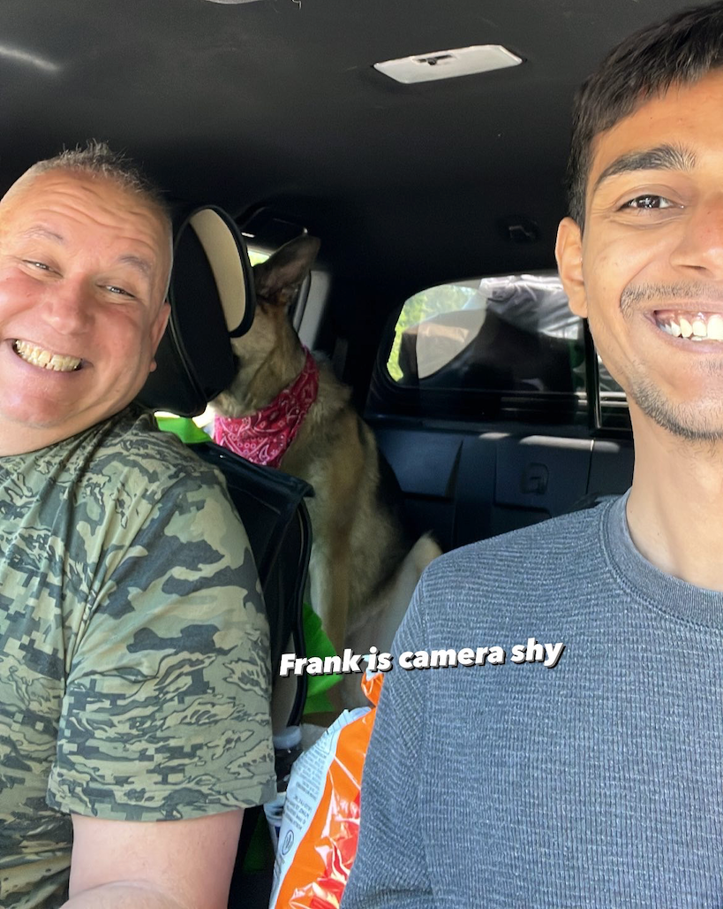

Our journey kicked off with camping near Maupin, OR. The real star of the show, however, was Frank. Richard's German shepherd, he's an adorably confused guard dog who bravely barks at newcomers, only to cover them in affectionate licks moments later. Maybe he needs to revisit his guard dog training manual!

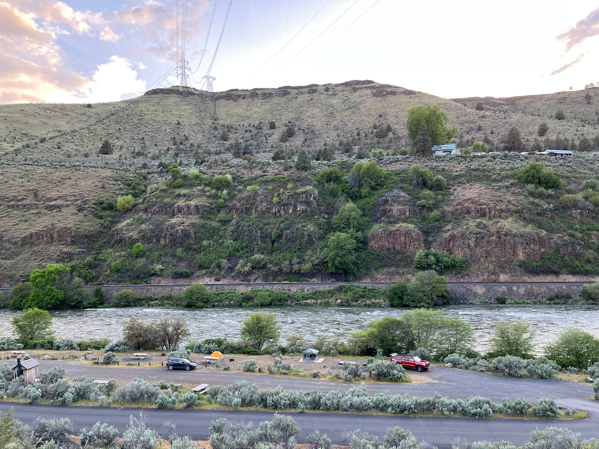

> Our camping spot near Maupin.

## Day 2 - An Intimate Introduction to Idaho

We nestled into a somewhat nondescript camping spot, nestled 27 miles from Boise and just 10 miles from Idaho City. It wasn't spectacular, but it offered a calm and peaceful night under the starlight nonetheless.

During my journey, I crossed through a town named Madras, which made me think of its relation with Madras (Chennai), the south Indian city.

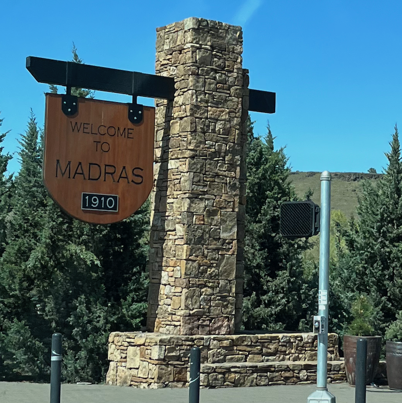

### Day 3 - Moab Magic Begins

Arriving in Moab was like stepping into a scene from a landscape painting. After two days of camping, a shot shower and cozy bed at Field Station felt great.

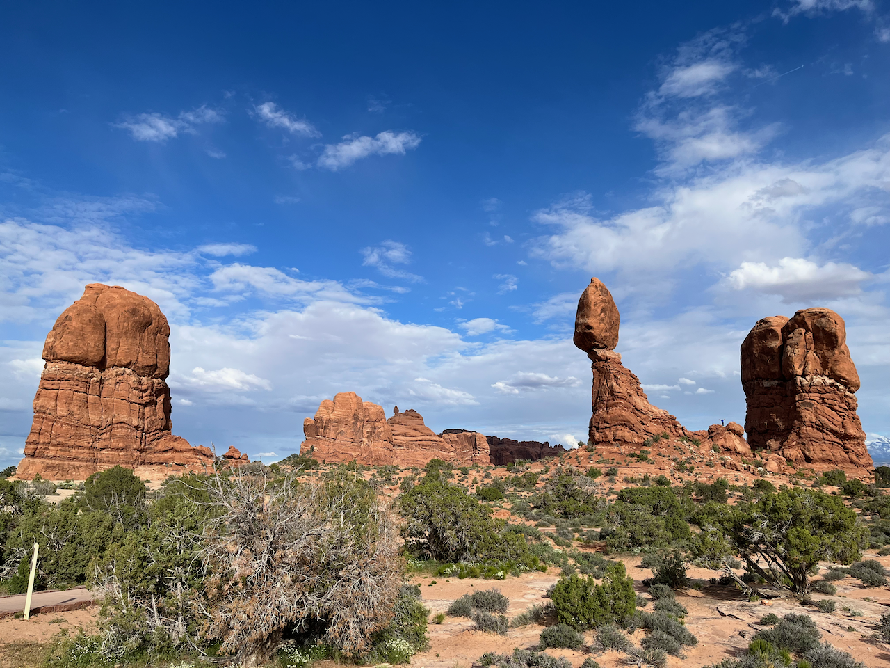

Our car ride around Arches National Park was a spectacle best appreciated after 4pm, a tip for those keen to avoid crowds and entrance fees. When I later embarked on a bike ride, over 50 cars were queued for entry.

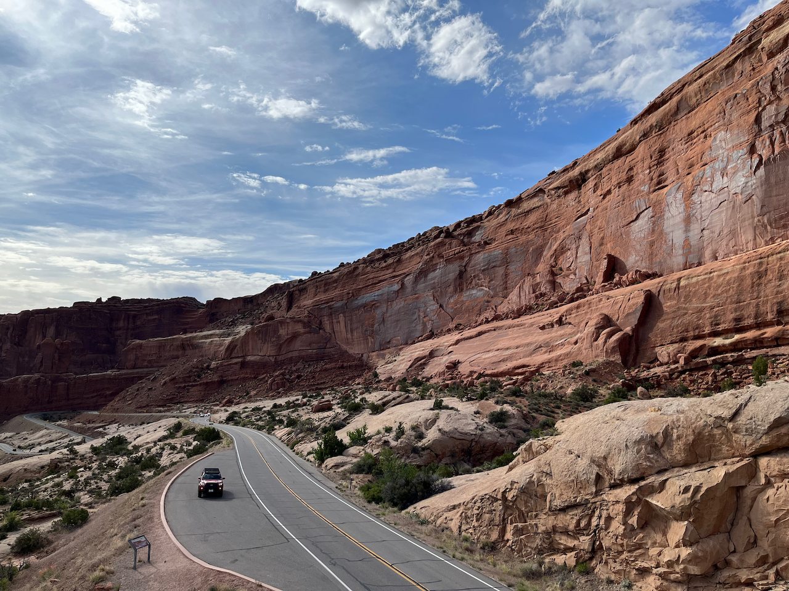

## Day 4 - Biking Bliss in Moab

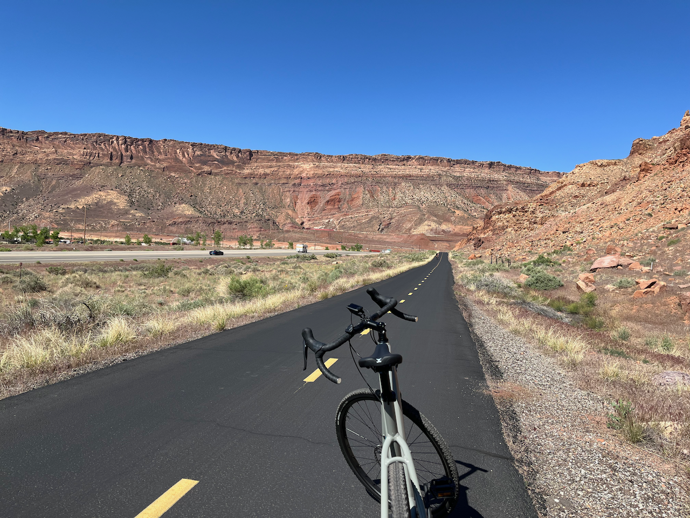

A day dedicated to biking around Arches National Park and greenways offered a thrilling ride amidst breathtaking scenery. The evening was spent at the Sunset Grill, learning about Charles Steen's history and how Moab emerged from the Uranium mining industry.

Charles Steen, a determined yet struggling miner in the 1960s, embarked on a quest for uranium, lured by the US government's \$10,000 reward. In his last-ditch effort, digging seventy feet into the earth, he struck gold - or rather, uranium! His discovery dramatically transformed his family's lifestyle, from washing laundry at the Colorado river bank to sending it via flight to Denver.

Steen swiftly erected a luxurious \$250,000 mansion in Moab, complete with a pool, greenhouse, and servants' quarters. His lavish lifestyle included a private plane and weekly dancing lessons in Salt Lake City. However, his generosity was legendary, hosting annual parties for all Moab residents and making substantial donations to a local hospital.

His monumental find put Moab on the map, dubbing it the "Uranium Capital of the World," and creating plentiful jobs. He was even elected to the Utah State Senate in 1958. But fate had a twist in store. When the country no longer needed his ore, Steen suffered significant financial setbacks, declaring bankruptcy in 1968.

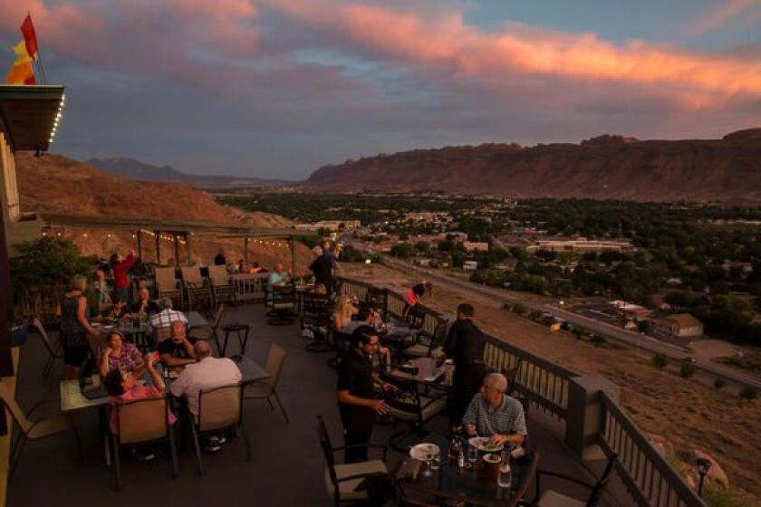

Despite losing his riches, Steen's legacy lives on. His mansion, now the Sunset Grill restaurant, stands as a testament to his influence, overlooking Moab just as Steen once did. From rags to riches and back to rags, Steen's story remains etched in the annals of Moab's history.

## Day 5 - Brewing Stories and Adventures

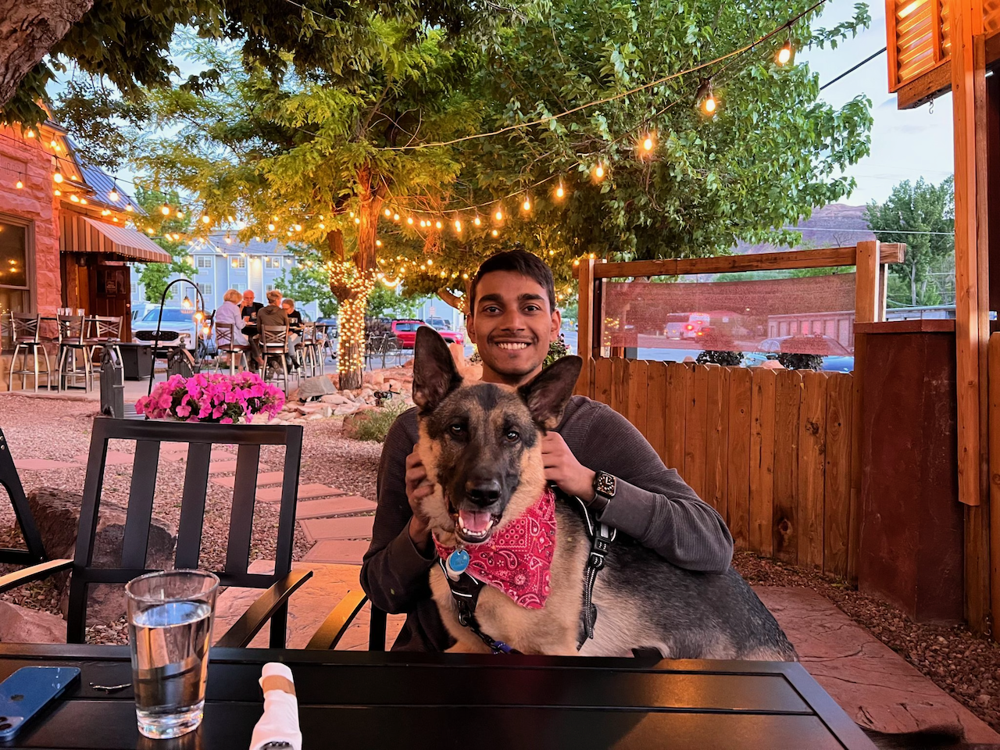

From visiting the Moab Brewery to hiking in Corona Arch, the day was a mix of exhilarating exertion and soothing relaxation. Richard's 4x4 off-roading took us halfway through Poison Spider Trail, offering strong adrenaline rush.

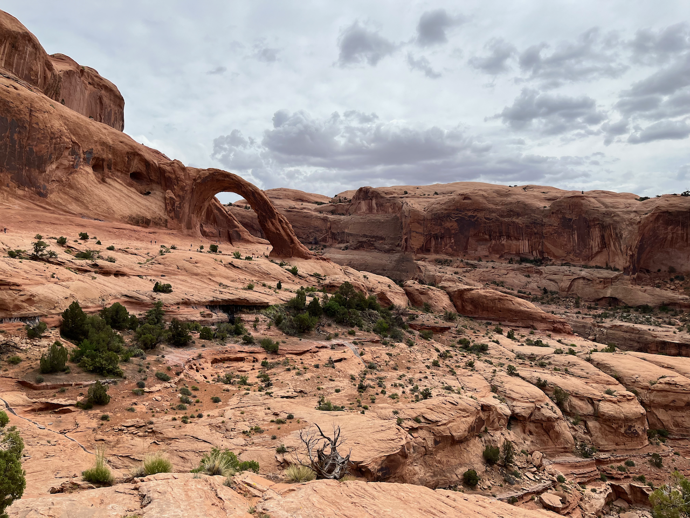

> Corona Arch Hike, Canyonlands National Park.

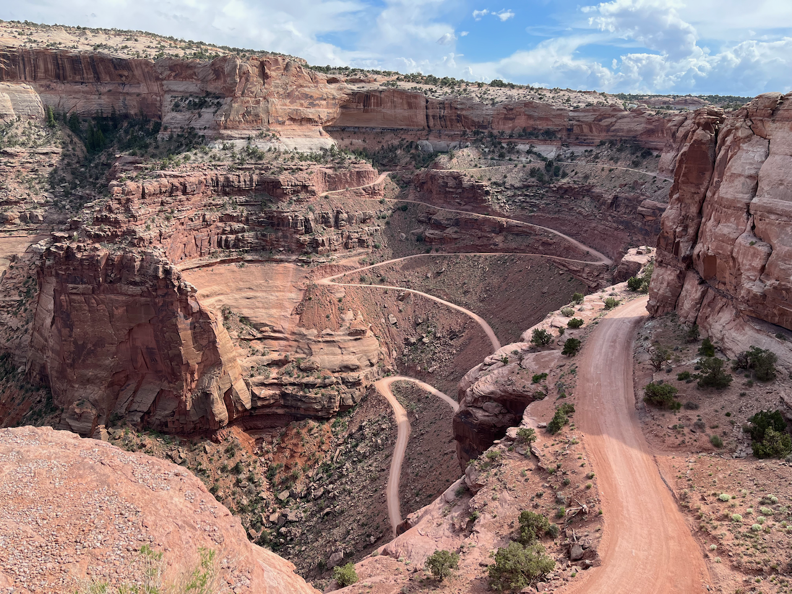

> Historic Uranium mines. You can see the paths used by transportation trucks that are now used by OHV and ATV vehicles.

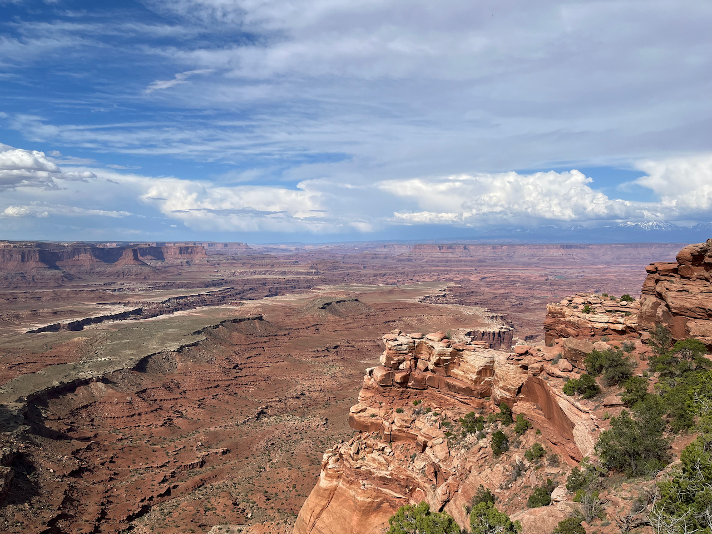

> Island in The Sky (such a cool name!), the north end of Canyonlands National Park, provides breath-taking panoramic views of the canyons.

## Day 6 - Glenwood Springs Reprieve

After the previous day's exploits, the camping at Glenwood Springs was an opportunity to unwind, accompanied by the incredible storytelling of Ted Chiang's Exhalation. I almost finished the book long dwindling in my reading list, as Dea knows.

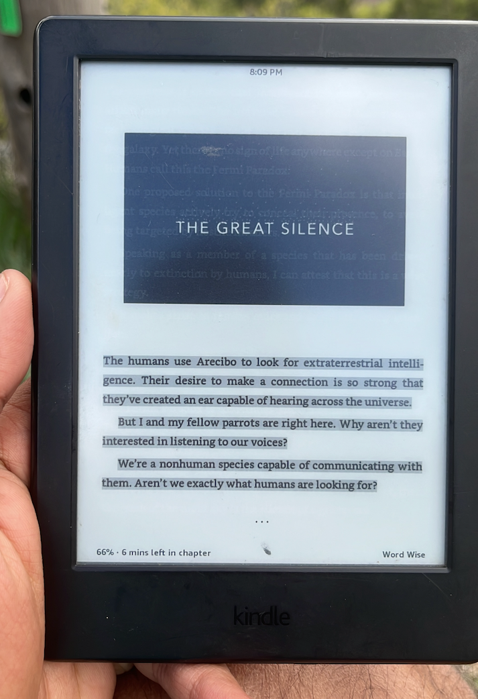

> Ted Chiang's Exhalation has an awesome set of short sci-fi stories. Some are truly astounding like The Merchant and The Alchemist, Exhalation, The Truth of Fact..., and Omphalos. Ted Chiang is amazing at weaving stories.
>
> One story had previously encouraged me to write the blog on memory: <https://www.harsh17.in/infallible-memory/>

## Day 7 - Hot Springs and High Stakes

The day was a cocktail of exhilarating white-water rafting and the serene Iron Mountain Hot Springs, creating a blend of adventure and tranquility unique to Glenwood Springs.

My home state, Jharkhand in India, also has a few hot springs. However, they're so badly maintained and unclean that I hardly ever wanted to visit them. I've taken notes from the Iron Mountains, let's see what becomes of it!

## Day 8 - The Thrill on the Hill

What could be more exhilrating than an amusement park perched on the edge of a mountain? The rides, terrifying yet thrilling, boosted my adrenaline levels to all-time highs.

## Day 9 - A Slice of Idaho

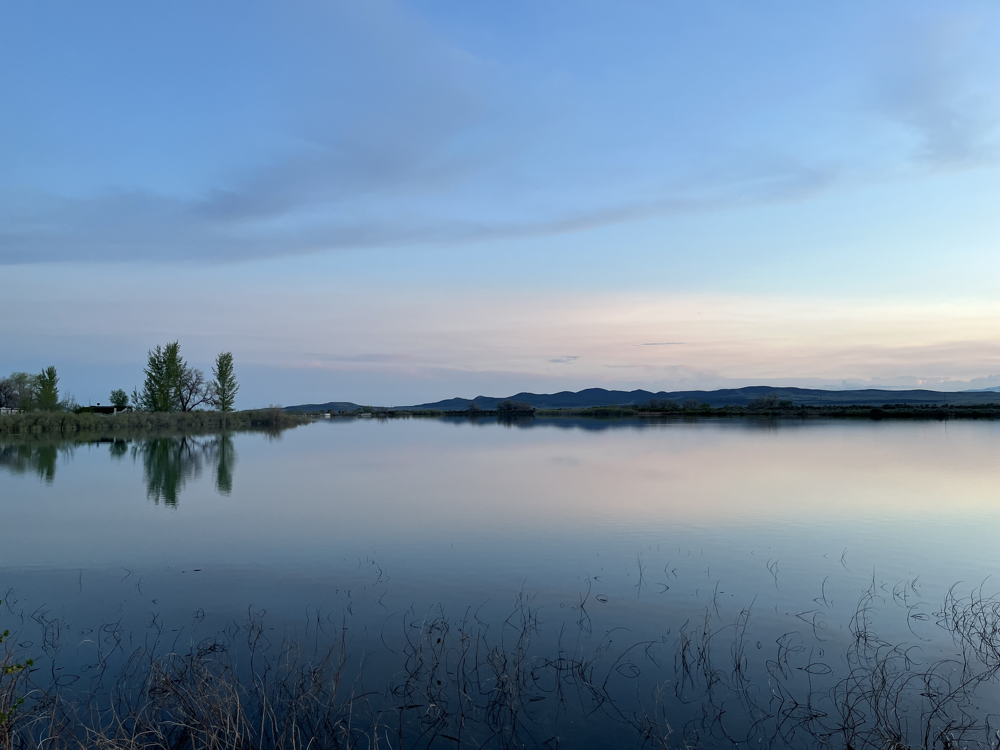

Our penultimate day found us camping near Boise amidst flatlands where cows offered their own unique soundtrack to the starlit night.

It was the clearest sky I've seen in my life. In India, I could see maybe a hundred at best. Now, I can literally see millions of them with my naked eye. It makes me appreciate the job of astronomers. It's seriously like finding a needle in a haystack --- tracking their movements, even identifying them. (To identify them, I use [SkyView Lite](https://apps.apple.com/us/app/skyview-lite/id413936865), a free app.)

## Day 10 - Wolf Creek Grand Finale

We saved the best for last - camping at Wolf Creek, arguably the most picturesque spot of our trip. It was a fitting finale to an unforgettable journey that etched an indelible memory on our hearts.

## Conclusion

As I conclude this journey, a vibrant canvas of experiences, sights, and sounds unfurls behind me. From our first pawprints in Maupin to the grand finale at Wolf Creek, each day was a unique chapter in this unforgettable journey. The thrill of white-water rafting, the serenity of the hot springs, the adrenaline rush of off-road driving and the giant swing, and the tranquillity under the Idaho starlight and hot springs -- all these experiences have etched themselves into the core of my being.

This trip was more than just an escape into the wild; it was a passage into history and size of our vast, vibrant nature, specifically the United States countryside. As I pack up my memories along with my camping gear, I carry with me a renewed sense of wonder and a heart full of gratitude for this magnificent life.

Until the next adventure, keep exploring, stay curious, and never stop appreciating the beauty of the world we live in.

------------------------------------------------------------------------

*May all beings, living or non-living, visible or invisible, be at peace.*
