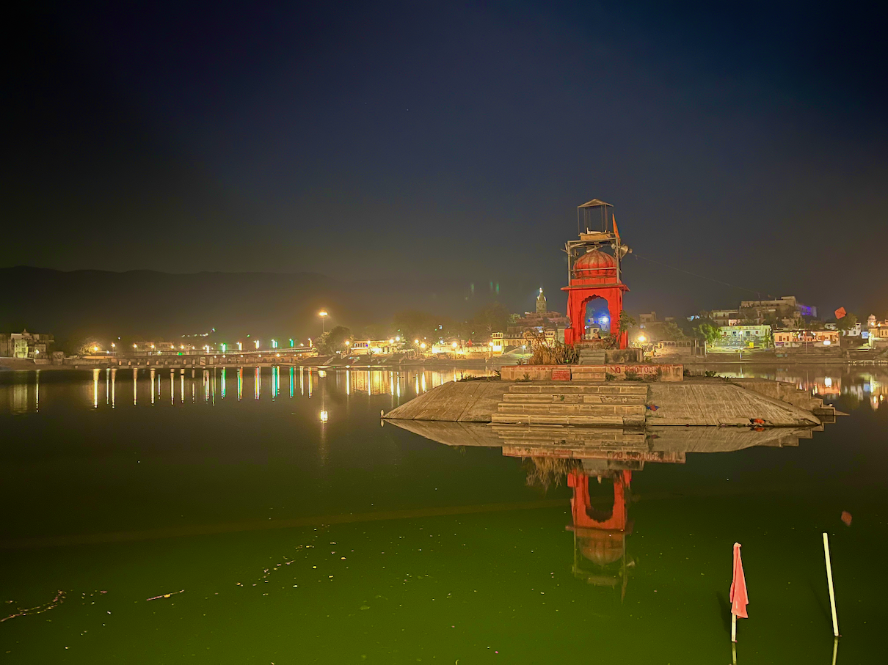
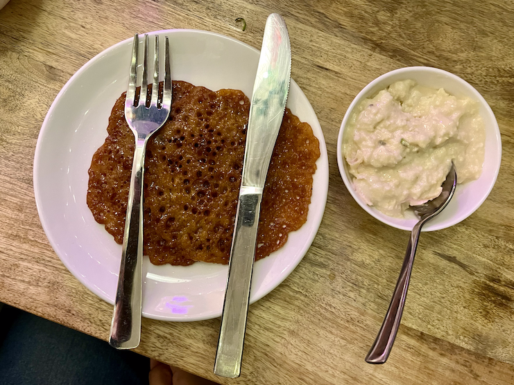
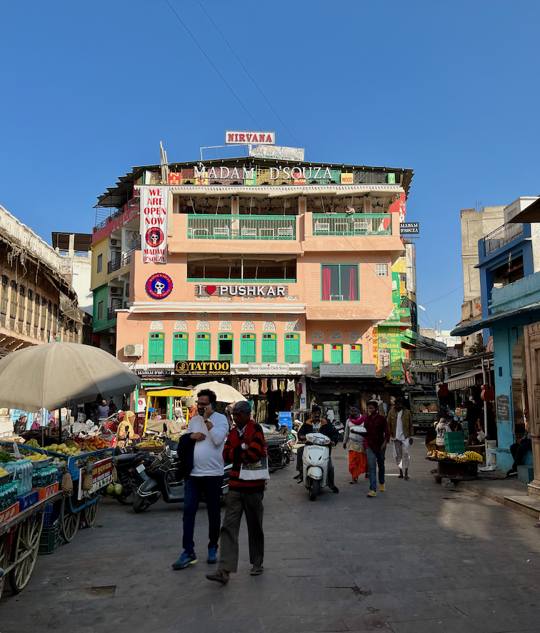
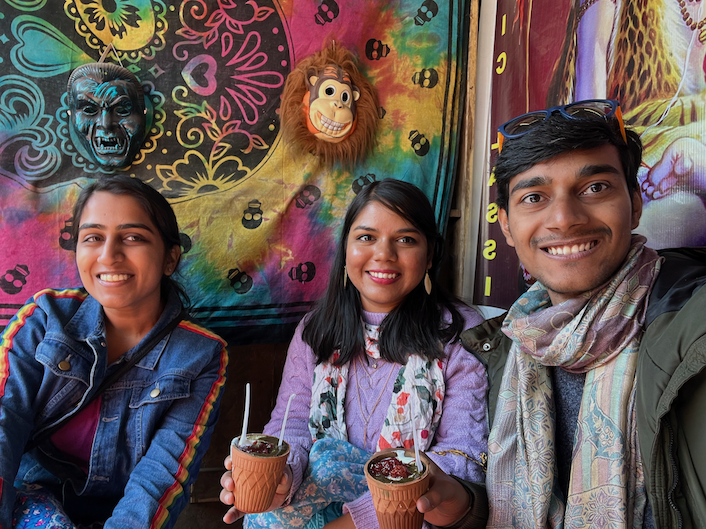
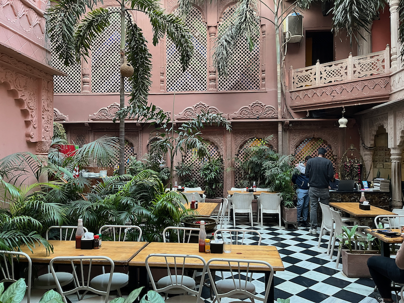

Nestled in the arid desert landscape of Rajasthan, India, the quiet town of Pushkar is a colorful mosaic of culture, spirituality, and history. Known for its captivating charm and mythical allure, Pushkar is an exquisite destination that intertwines the old-world charm with vibrant hues of contemporary life.

### The Divine Pushkar Lake

> Pushkar Lake at night.

At the heart of Pushkar lies its iconic Pushkar Lake. According to Hindu mythology, the sacred lake was created when Lord Brahma -- the creator in the Hindu trinity -- dropped a lotus flower, and a lake sprang forth from that spot.

This enchanting water body is surrounded by 52 bathing ghats, where pilgrims take a dip to wash away their sins and seek blessings. The sight of evening aarti performed on the ghats, with chants echoing in the backdrop, is a spiritual spectacle that I cannot forget.

### The Singular Brahma Temple

Pushkar houses one of the few temples in the world dedicated to Lord Brahma. The Pushkar Brahma Temple, with its distinct red spire and the image of a swan (Brahma's *vehicle*), stands as a prominent symbol of the town.

Intricate marble carvings and a sanctum adorned with silver coins mark the temple's unique architectural beauty, rendering it an essential stop on every visitor's journey.

Why are there so few Brahma temples, while so many Shiva or Vishu temples (other gods in Hindu trinity)?

Good question. There are at least three stories.

#### **Lord Brahma married his daughter Lord Saraswati**

> According to the Padma Purana, one of the eighteen Mahāpurāṇas, a significant genre of ancient Indian scriptures, Lord Brahma is said to have married Saraswati, the goddess of knowledge, who was also his daughter, created from his own body.
>
> This act was considered inappropriate, even though the laws of mortal relationships don't strictly apply to divine beings. This invoked the wrath of other gods and led to the decree that Brahma would not be worshipped in the earthly realm.

#### Lord Brahma's wife Gayatri cursed him

> Another story, also sourced from the Padma Purana, tells that when Lord Brahma was performing a fire sacrifice, his wife Saraswati was late to the event. In order to complete the yagna (ritual), Brahma married Gayatri, a milkmaid, and sat her in Saraswati's place.
>
> When Saraswati finally arrived and found Gayatri in her place, she cursed Brahma saying that he would not be worshipped on Earth.
>
> (This is the version I remember from reading Puranic stories. According to the temple placard in Pushkar, his wife was "Gayatri" and the milkmaid remains anonymous.)

#### Lord Brahma lied to Shiva in trying to prove his superiority

> Another story goes that once Brahma and Vishnu were engaged in a fierce argument about who was superior. To settle the dispute, Shiva asked both of them to find the end of the universe. Whoever finds it first is superior.
>
> Vishnu transformed into a boar and started running in one direction, while Brahma took the form of a swan and flew in the other direction. Both journeyed for eons but couldn't reach the end.
>
> After a long and futile search, Vishnu conceded and returned, admitting that there's no edge to the universe. However, Brahma, unwilling to accept defeat, encountered a Ketaki flower (*Pandanus* *odorifer*) on his journey upwards. He persuaded the flower to lie and testify before Shiva that Brahma had reached the edge where the flower resided.
>
> When Brahma and the Ketaki flower presented their false claim, Shiva, being omniscient, saw through the deceit. He was furious at Brahma for his dishonesty and pronounced a curse that Brahma would not be worshipped on Earth. He also banned the Ketaki flower from being used in any religious rituals.

These three stories give us three important lessons: the wise don't fall prey to pleasure, the wise don't haste, and the wise don't lie.

A side note: Brahma is very highly worshipped in Thailand. I don't know why.

### **Flavors of Pushkar**

> Malpua, an Indian sweet dish. My mother used to cook it often but I was never a sweet tooth. This is all Meenal's palette.

Pushkar's food scene is as vibrant and diverse as its culture. From local treats like Malpua (sweet pancake) and Poha (flattened rice dish) to global cuisines in the numerous cafes that line the market, there's something for every palate.

The town is particularly famous for its unique Israeli cuisine, brought in by the numerous Israeli tourists and hippies, and now form a delicious part of the local food tapestry.

> A local street in Pushkar. It is a stunning amalgamation of contemporary Indian with modern west. On the left you can see "Thela" selling fresh fruits and vegetables (and food, snacks, etc.), while on the right you can see stores selling bananas and guitar in the same store! Right in front with the tagline "I ♥️ Pushkar" is Madam D'Souza, another eatery focussing Western-Indian fusion cuisine.

> Since Pushkar is a holy land, Alcohol, cigarettes and non-vegetarian food are not permitted within the city limits. However, it has one of the best [Bhaang lassi](https://www.wikiwand.com/en/Bhang).

> It is an uncanny experience walking in the streets of Pushkar with dilapidated buildings and mooing cows, to suddenly enter a 4.7 star rated Pizzeria on Zomato. La Pizzeria is uniquely ethinic with delicious food.

### **A Nook for the Art and Craft**

The bustling markets of Pushkar are a haven for art and craft enthusiasts. From traditional Rajasthani attire, intricate silver jewelry, colorful bangles, to beautifully crafted leather goods, the marketplace is brimming with local artifacts.

These vibrant markets also offer a glimpse into the local lifestyle and customs, bringing visitors closer to the heart and soul of Rajasthan.

Talking to a lady from Washington state, I learnt that she visits Pushkar every year to buy ethnic notebooks, earrings, dresses, etc. These things cost \$1-2 in India while they sell at \$20-30 in US, at the minimum. Further talks with shopkeepers there revealed the global network they're all connected to --- talking orders on Whatsapp, sending orders via FedEx, and receiving payment via Paypal. Fascinating!

### It is a must visit!

In essence, Pushkar is a fascinating montage of ancient lore, divine spirituality, bustling markets, and culinary delights. It's a town where tranquility and vibrancy coexist. Despite being steeped in tradition and religious significance, it also embraces modernity and diversity, making it a must-visit destination.
