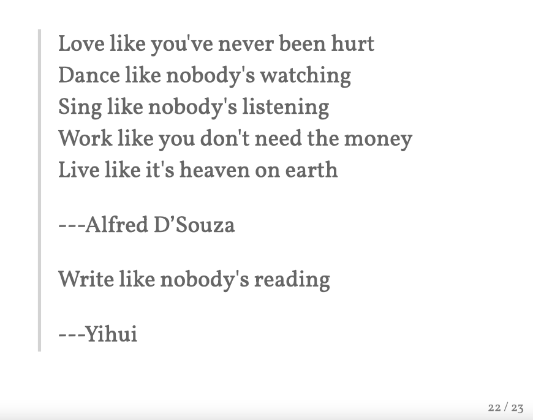

This year, I am participating in [useR 2021](https://user2021.r-project.org), the R conference. It is my first conference so I expect to miss out on a few things but still hope to learn as much as I can. I am relatively free for the next week so learning as much as possible from the conference will be my central focus. 

Sadly, I didn't realise I had to register for tutorials separately — I thought one registration was all that's needed. I cannot attend the tutorials but it is likely that the authors would upload materials on their personal website, where I can pick up when needed. The complete session plan is [here](/docs/useR_2021_schedule.pdf).

### Yihui Xie: Blogging and Writing Books

Yihui met John Kimmel who inspired him to write his first book. During his PhD, he wrote the `knitr` package. Writing the complete documentation would take a lot of time so he decided to write a book instead on the package. The same pattern follows till today. A package is written; alongside some limited documentation a detailed book is written.

The content of the first book (on `knitr`) included package documentation, Stackoverflow and mailing list questions, and some internal workings of the package.

Yihui liked Chapman and Hall (editors and publishers) so much that he till today publishes book with them. In fact, he [recommends](https://yihui.org/en/2018/08/bookdown-crc/) it to most `bookdown` users.

A critical problem with using books as alternative to documentation is the inability to update. Software and packages are subject to constant updates and improvements that cannot be pushed to books so easily. If it is an online Bookdown book, it is relatively simple. Blogdown was subject to multiple updates because the underlying Hugo updates. Such changes can be reflected with some difficulty on the [Blogdown](https://bookdown.org/yihui/blogdown/) book but that's impossible with printed books. 

**Solution?** Apart from a disclaimer in the printed book to check the current version, I cannot think of anything more. I suspect hardly anyone buys the printed copies of the books as the free version is available online.

In the presentation, I got the idea of changing the permalinks on my website to `year/month/slug` format instead of the current `/slug` format. After sleeping over it, I decided against it because I frequently update my old blogs and sometimes also change publishing dates (some may call it wrong practice). Therefore, for consistency and unbroken URLs, I will continue with `/slug`.

Yihui mentioned about the talk by David Robinson on "The unreasonable effectiveness of public work", available on the Rstudio [website](https://www.rstudio.com/resources/rstudioconf-2019/the-unreasonable-effectiveness-of-public-work/). I will watch it soon.

He had some tips to share on blogging:

- Only after publishing more than 30 posts should you really consider themes. As a beginner, do not spend a lot of time on this. I use [Hugo Apero](https://github.com/hugo-apero/hugo-apero-docs) for this website, and thanks to Yihui and [Alison Hill](https://alison.rbind.io), I do not have to worry a lot about my themes.
- Enable comments so that there is a dialouge between the author and the readers. My experience with comments hasn't bee great. Around three years ago, I used to host my site on Wordpress and had comments enabled. The comment fields were filled with spam, even inappropriate spam. Further, I have found putting my email directly has provided me better engagement. (Once I received comments via email from halfway across the world and it made my day!)
- Probably pagination in the list of blogs is not a good option. Yihui says he likes to see what all have you written at a glance and clicking next after every five articles breaks flow. I have increased my articles on a page to 20, which I believe is a good balance between currency and flow.

I am definitely going to be more casual about my blogs from now on.

[Slides](https://slides.yihui.org/2021-useR-journey.html)

