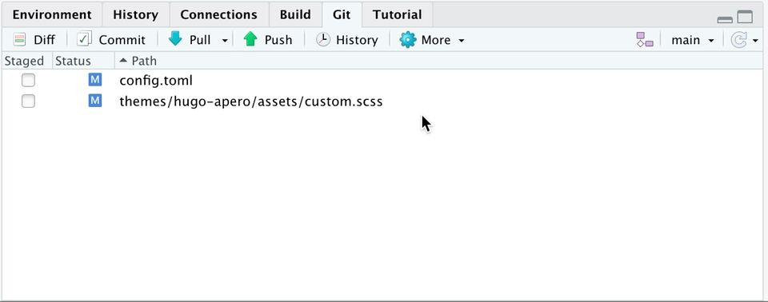

<<<<<<< HEAD

Every once in a while, you will end up changing something in your local files that you do not want to commit to Github repository. How do you release that commit from R Studio?

This is particularly helpful if you tried uploading a file larger than 100 mb and Github rejected it. Analysis paralysis.

### TL;DR

1.  Ensure you only have commits that you want to delete in the Git pane. Then go to Git tab.
2.  Click on <i class="fas fa-cog"></i> (machine-like icon) and select "Shell...".
3.  In Shell, type: `git reset HEAD~`.
4.  Keep hitting the statement as many times as you have commits.
5.  Voila.

### Full Steps

First, ensure you have only the actions you do not want to commit.

I want to commit the second file (this blog post), so I will commit it and push it to the [repository](https://github.com/harshvardhaniimi/personal-website). Then, I will go the <i class="fas fa-cog"></i> (machine-like icon) and click on "Shell...".

=======
>>>>>>> e13183b6c00c9e1571f650c602331ea9bf26f51e
