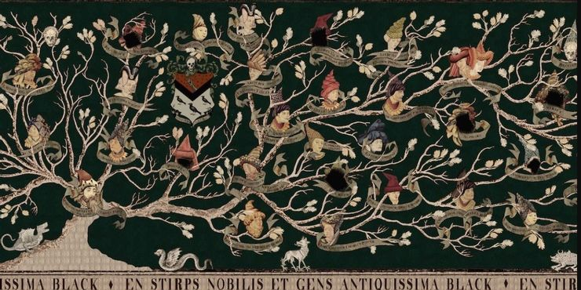

When I first saw Sirius Black's family tree in Harry Potter: Prisoner of Azkaban many years ago, I thought of creating my own. I started mapping and went two generations back --- that was all that my family remembered. Mummy said, "People remember two generations up and two generations down. That's it." I was determined, but there was no obvious way.

Some pundits in our ancestral village had a record of our family tree that we could access after paying a nominal fee. I was excited, but my father was not. "Too much travel for too little information", he said. I never expected he might be correct.

Around 30 million people have purchased DNA test kits to trace their ancestry. However, there are so many "fine print" details that it is almost impossible to know how accurate they are.

There are two ways to trace ancestry. First is genealogy, where you trace your family tree --- like I tried. You build a chart of your parents, grandparents and so on. The graph would grow at an exponential rate in a normal situation: `\(2^n\)`. Currently, I am at `\(n = 0\)`. It's only me. A generation before me would be two people, `\(2^1\)`; a generation before them would be four people, `\(2^2\)`, and so on.

The second method is to track the genome. My genome constitutes 47 stretches of DNA: 23 pairs of chromosomes from each parent and one mitochondrial DNA from the mother. There are 118 DNA fragments that I got from Papa. When I track my ancestry this way, I get 189 pieces from my grandparents, 260 from my great grandparents and so on.

These genome contributions look promising at first. One hundred eighteen stretches of DNA vs two genealogical parents; 189 stretches of DNA vs four genealogical parents. But what our human mind misses is that the first grows exponentially while the second grows linearly.

}}index_files/figure-html/unnamed-chunk-1-1.png" width="672" />

We have more information from our genealogy around the tenth generation than our DNA. By the fourteenth generation, the ratio is 16 to 1, meaning many of my ancestors didn't pass me any DNA at all! So tell me, what do we know from DNA?

Considering my ancestors lived for 60 years on average, that gives me about a thousand years of genetic information from my DNA. But not all of that is reliable. We are 50% certain about our DNA results at just four generations down the line. Using DNA for my ancestry is worse than a coin toss just three hundred years down the line.

With a little extra effort and emotional pleading to Papa, I can get at least five or six generations worth of information. Why bother with DNA ancestry at all?

It is common knowledge DNA can store more information than modern computers. A curious soul would naturally ask: where did we lose this ancestral information? Partly because of mathematics of how DNA transfers happen and how much is retained in the child. Not all info is ancestral, and not all information is copied. It is also presumptuous to assume most of the information in our DNA is about ancestry. Nature doesn't care about our parents; it cares about survival.

But there is a more interesting answer too. Our DNA gains permanent and non-permanent changes during our lifetime due to our behaviour. We can control what information is passed on to future generations. This recent discovery about epigenetics has revolutionised many aspects of genetic study.

If our behaviours can change the encoding in the fundamental unit of life, imagine the potentialities for the future generation.

If most of DNA information is lost after just a few generations, we should concentrate our efforts on maintaining our own genealogy directory. In the long run, physical directories retains more ancestral information than DNA. We should also take results of genome DNA kits with a pinch of salt. So to answer the question, "how much can we know about ancestors?". Well, probably not a lot.
