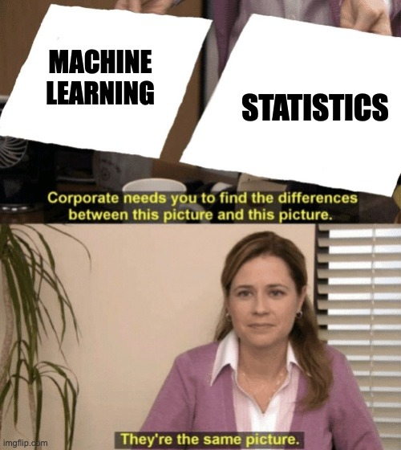

I interviewed [Prof Emre Demirkaya](https://scholar.google.com/citations?user=vCG5bM0AAAAJ&hl=en) from my department at the University of Tennessee. This was part of my seminar course on research by [Prof Sean Willems](https://seanwillems.com/) (my advisor too 🚀). This essay is my reflection on our conversations.

------------------------------------------------------------------------

# Career Path and Research Questions

Prof Emre did his undergraduate in mathematics. As he learnt more mathematics, his interest grew in applying those learnings to practical problems. After finishing his undergraduate, he joined Applied Mathematics at USC. After completing his comprehensive exam, he chose a field to try coding and simulations. He decided to work on machine learning and statistics with Prof Jinchi Lv at Marshall School of Business, USC.

I also asked him why he chose to join a business school for research and not an engineering school as his research area is more theoretical than most researchers. He believed statisticians work on applied real-world problems; they're not always in engineering schools. They are either biostatisticians working in art and sciences schools or analysts working at business schools.

> Machine learning is statistics. I don't get it when people disguise the beautiful mathematical equations and proofs with a coded blackbox.

For a large part, he believes, and I resonate with him, computer science research on machine learning and statistics-based research on machine learning are related. Though their favourite journals are different, they solve the same problem. They are different sides of the same die.

For a large part, the research questions that he worked on during his PhD came from his advisor. He was lucky to be involved in multiple areas of research. Even today, his work during PhD drives his primary research interests. The problems he is working on --- knockoff designs, feature selection and model selection --- are heavily researched but far from settled.

He was interested in coding. He started to code his research methods and simulation studies for research in R.

# His Research: Knockoffs

We also discussed his research, and he patiently explained the mathematical parts of his research to me. I found his paper[^1] lucidly written but containing dense mathematical notations, many of which I saw first. Knockoffs are methods to reduce the number of features. Finding a good feature that makes theoretical and practical sense is called *discovery*. The benefit of using knockoffs is that they are more immune to false discovery, i.e., finding a feature that looks important but isn't essential.

[^1]: Fan, Y., Demirkaya, E., Li, G., & Lv, J. (2019). Rank: large-scale inference with graphical nonlinear knockoffs. *Journal of the American Statistical Association*. [arXiv](https://arxiv.org/abs/1709.00092).

The goal is to increase *true discovery rates* or reduce *false discovery rates*. Knockoffs create a replica variable for a variable in question. Then, the RANK algorithm tests the importance of the original variable by analysing its knockoff. Using that algorithm, we know how many false discoveries we are making. Thus, tweaking the knockoffs can bound our false discovery rate, which is remarkably useful.

# Publishing

I asked him another more straightforward question, "how do you decide which journal to publish?". "It is a difficult question", he chuckled. Typically, he looks at the articles already published in a journal to gauge the kind of papers they accept. Once we start referring to journals, we will get a closer hint on which journals consider which papers as "interesting".

His advice was to read the papers published recently by that journal and then decide if your article is like theirs. Old articles by that journal might not be suitable; new editors and managers change their research directions often. Some journals require that papers have a rigorous discussion on theoretical aspects while others focus on simulation results.

![The methods to communicate research findings has changed significantly over the century. Earlier, it used to be centered around selected universities, some Royal Societies and occasional private institutions like RAND. Today, the dynamics have significantly changed. Growth of computing is an important catalyst too. Blogs and personal websites have supported individual control. Publications are searched through Google Scholar instead of a librarian. Package documentation websites are more read than foundational paper on the topic. I wondered if journal publications are going to lose their importance to quality online literature available for free.](images/publications.png)

> The methods to communicate research findings has changed significantly over the century. Earlier, it used to be centered around selected universities, some Royal Societies and occasional private institutions like RAND. Today, the dynamics have significantly changed. Growth of computing is an important catalyst too. Blogs and personal websites have supported individual control. Publications are searched through Google Scholar instead of a librarian. Package documentation websites are more read than foundational paper on the topic. I wondered if journal publications are going to lose their importance to quality online literature available for free.

I asked him if he considers the possibility that research published on the open internet on blogs and Github would eat away the fiefdom of academic journals. He doesn't think that is a possibility. The system does have some issues: peer-review isn't a golden standard. But that doesn't mean blogs and Github can rule. arXiv and SSRN may work better in some instances, significantly better than low-tier journals. However, the top journals, which are a handful and have very high impact, aren't going away anytime soon. Blogs would help popularise research, but they cannot replace top journals anytime more quickly.

# Disseminating Research: Methods as Packages

Since Prof Emre's research focussed on developing methods, he built a large codebase including many novel functions from his study. I asked him if he considered publishing those functions as a package. That would enable others to use his method and make it more accessible and popular among practitioners.

He sometimes says researchers publish all their codebase online. Sometimes, those who want to apply the methods must develop them themselves or ask the authors for their codes. Applied researchers would have to modify existing theoretical approaches to suit their use cases.

He doesn't publish his functions as a package because he doesn't have enough time to prepare them. Writing packages for the methods he developed takes a back seat with the time crunch. I understand why this happens --- little incentive --- but dislike the result. Prof Emre agrees that more people would read, use, and cite the work if the package were made available. However, such works are usually done by large teams of researchers where some graduate students convert the codebase to a software package full time.

# Advice for Younger self in Grad School

-   Start your research early.

-   Take more classes outside of my major.
