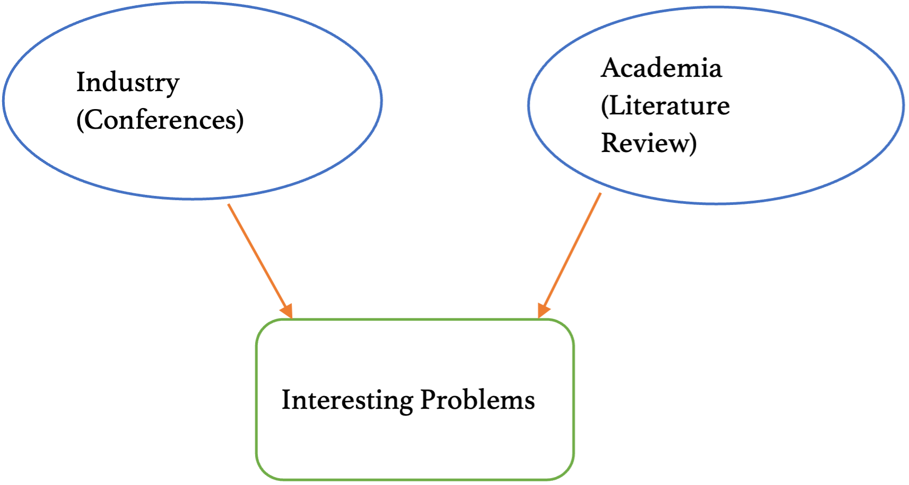

I interviewed [Prof Mike Galbreth](https://haslam.utk.edu/experts/michael-galbreth) from my department at the University of Tennessee. This was part of my seminar course on research by [Prof Sean Willems](https://seanwillems.com/) (my advisor too 🚀). This essay is my reflection on our conversations.

------------------------------------------------------------------------

# Interesting Problems

I ponder how professors or field experts think about research questions. How do they identify if something is "interesting" to follow for research? Cachon (2016)[^1] presented a variety of methods to decide what is considered necessary in operations management. I started Prof Mike's interview with the same question.

[^1]: Cachon, G. P. (2012). What is interesting in operations management?. *Manufacturing & Service Operations Management*, *14*(2), 166-169. [PDF](https://pubsonline.informs.org/doi/pdf/10.1287/msom.1110.0375).

The first parameter he checks is the relevance of the topic for the industry. For example, he attended conferences and met several practitioners concerned about reverse logistics. People were returning more items brought over by e-commerce than ever. Companies found it costly as customers expected free returns. He decided to study the problem in detail, which became his research area.

Another method to look for insights from the industry is to know people. People working in retail routinely encounter non-trivial problems and look to academia for inspiration. By staying in touch with them, we can understand and find exciting research questions.

# Approach to Research

Continuing to the next question, I asked his general research approach. What's the next step after identifying an interesting problem? He explained his two-pronged procedure of finding research problems.

First, he communicates with the industry professionals to exchange as many details as possible on the problem. Why do they care about the situation? What is the quantified harm or benefit to the company? What circumstances cause the pain? Is it industry-wide or specific to this company? How are they handling it right now? Most importantly, would they be willing to share data for him to try a solution?

Second, he looks at the academic literature for existing solutions. He always finds that some tangentially related solutions exist but cannot be applied without significant novel modifications. Studying the literature is also crucial for another critical activity: publishing. We cannot publish a paper on something that only we find interesting. The problem's solution needs to justify why the issue is worth solving and how your solution is placed in the myriad of existing solutions.

He added, "People decide by page four if they want to reject a paper. You must get their attention with the abstract and introduction while maintaining sufficient rigour to keep them engaged." That was enlightening for me. So far, I had considered "methods" the zest of paper and assumed to be the most engaging. However, I realized people might not even read that section if my abstract and introduction were not lucrative enough.

# Mental Toolkits

With so many different problems, I was curious about how he built his mental toolkit to deal with them. Every issue would require an experience with a new method: game theory, network optimization, auction theory, econometric theories and so on. How does he keep himself updated on all such forms?

Prof Mike explained that there are several aspects to it. He built a solid foundation during his doctoral studies by taking many economics and game theory courses --- which are helping him with his current research. However, the most common and practically necessary skill is self-teaching essential tools. One way to self-learn is to find a well-written paper in Management Science on this method. This paper would introduce him to the topic while also engaging with a practical case study of its application.

Sometimes, we find people with the specific skillset required to do those analyses. For example, if he feels limited on the mathematical rigour required for a problem, he collaborates with researchers who are good at such mathematical tools. His advice is to pick up many tool-related courses during my graduate school, as this is likely the only time I will have to learn.

# Finding Your Niche

It is also essential to find an active research area. A booming research field with new tools and advances every day would always be more lucrative than otherwise. A mature area will have fewer novel topics and more incremental research. However, a field like healthcare or food waste will continue booming.

You might encounter significant resistance when you are a pioneer in a field. Like you might hear back from the editor, "Food waste? No one studies food waste." However, once you convince the academics how is this topic exciting and impactful, you'd be in a great place. His advice is to find issues that haven't been thoroughly researched, requiring only incremental improvements.

For example, supply chain contracts have been researched for years. We can make significant contributions, but those would still be incremental. In contrast, a field like diversity in operations --- gender diversity, ethnic diversity --- hasn't been well researched, and its impacts are not well known to practitioners or even academics.

# Academic Publishing

Moving on, I asked him about his opinions on publishing: how editors determine the general direction of that journal and even the research field. The editors decide which papers get selected into the journal. It might be good to research the papers that an editor accepts and target our article accordingly. Sometimes these journals could look like a closed community --- editors taking work only from their friends --- but that is a rarity. Most editors are honest and look for excellent outcomes.

![The methods to communicate research findings has changed significantly over the century. Earlier, it used to be centered around selected universities, some Royal Societies and occasional private institutions like RAND. Today, the dynamics have significantly changed. Growth of computing is an important catalyst too. Blogs and personal websites have supported individual control. Publications are searched through Google Scholar instead of a librarian. Package documentation websites are more read than foundational paper on the topic. I wondered if journal publications are going to lose their importance to quality online literature available for free.](images/publications.png) 

> The methods to communicate research findings has changed significantly over the century. Earlier, it used to be centered around selected universities, some Royal Societies and occasional private institutions like RAND. Today, the dynamics have significantly changed. Growth of computing is an important catalyst too. Blogs and personal websites have supported individual control. Publications are searched through Google Scholar instead of a librarian. Package documentation websites are more read than foundational paper on the topic. I wondered if journal publications are going to lose their importance to quality online literature available for free.

I asked him another question about online publishing. With the advent of the internet, more people publish their research works like software directly online through their website or Github. This bypasses the entire chain of checks: peer-review, limitation on acceptances, among others. There will be zero rejection as we can directly put our work online. Do you think this "open knowledge" will consume "locked" knowledge restricted to journals? In other words, does he consider this new wave of publishing a threat to academic journals?

He gave a thoughtful answer: it is hard to imagine academia without publication journals. These "open knowledge" projects gain sudden popularity but do not have a lasting impact. This medium does not have a mechanism to check for scientific rigour. Although a lower-ranked journal might lose its impact, it is unlikely that top-10 journals in the field would be less critical any time soon.

He reiterated what we learnt in our class: publishing in one of the top-4 journals should be the goal as a PhD student. That is what people would look for when hiring for research. Classes and conferences are essential, but the main goal is to put a paper in one of those top-4 journals. He explained how if someone didn't have an article in one of the top journals, he would likely not receive an invitation for a job talk.

Therefore, it is necessary to start early for research.

# His Research: Product Returns

We also discussed his research paper "How much do online consumers value free product returns? Evidence from eBay", published in 2017 in the Journal of Operations Management.[^2] Interestingly, the research found that having a forward shipping charge (delivery fees in consumer-speak) impacts what people order. Selling something for \$100 with a ten \$10 delivery fee is inferior to the same product priced at \$110 but no delivery fees.

[^2]: Shang, G., Pekgün, P., Ferguson, M., & Galbreth, M. (2017). How much do online consumers really value free product returns? Evidence from eBay. *Journal of Operations Management*, *53*, 45-62. [SSRN](https://papers.ssrn.com/sol3/papers.cfm?abstract_id=3020380).

Based on the quoted product return fees, I learned how consumers behave irrationally --- but not as irrationally as expected. A product sold with a free return policy was considered more friendly than a product that considered all sales final. However, this incremental value was not enormous as hypothesized --- lingering around 5% for most products. This insight was critical for practitioners: they now know the impact of returns is not as high as expected. Methodically, they used regression analysis while controlling for variables such as product price, etc., to determine this conclusion.

# Disseminating Research to Industry

Excited by the novelty of this conclusion, I asked if he knows of any company or an individual seller who used his findings to change their return policy. He said he presented his results to Home Depot and numerous conferences. He isn't aware of any company currently exercising their policy with his research, though.

Then, I asked him how he shares his results with the industry professionals --- it is unlikely that they would be reading the Journal of Operations Management. He shares that he does two critical things to disseminate research. First, he participates in many conferences where he meets practitioners and tells them about his research. Second, he writes columns in practice magazines in a column titled "View from Academia", simplifying conclusions from his study.

Third, which he would like to do more about, is collaborating with the PR department of the University of Tennessee, where they could hire professional writers to convert dense research papers into executive summaries to be published in alumni magazines and online. However, taking this last step is not very common. People should do that more often, but academics are not incentivized.

# Advice for Younger self in Grad School

-   Take as many tool classes as you can while not overloading yourself
-   Start on research as early as possible. Don't get to the third year and wake up one day that you need to do research.
-   Find a professor with whom you enjoy working. You will be spending a lot of time together, and you need to be joyful working with him.
-   Find a research problem that is active and not well established completely.
-   Enjoy your time while you are still a student. This is probably the last time you will have fun without a direct job as a professor or researcher.
