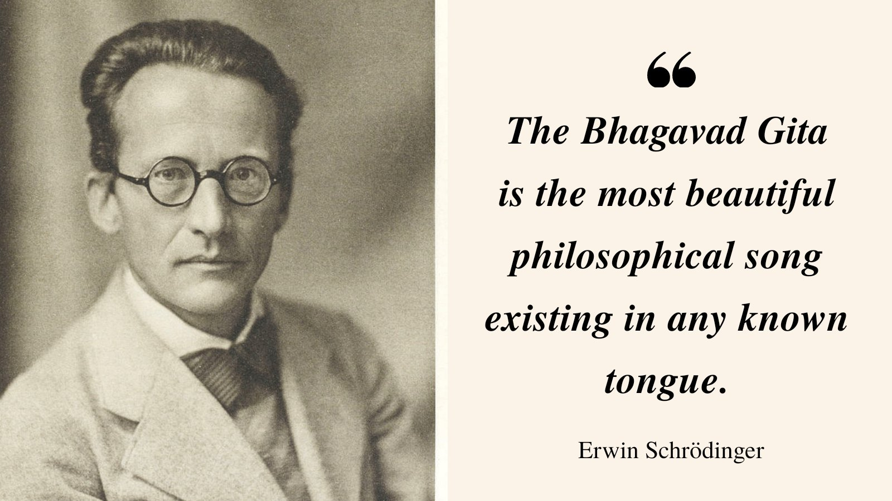

Many years ago, Schrodinger figured out that imaginary numbers are the only way we can make sense of reality. Professor F Dyson described it best in his recent lecture[^1]:

[^1]: Freeman, D. (2009). Birds and Frogs. *Chinese Journal of Nature*. [PDF](https://www.ams.org/notices/200902/rtx090200212p.pdf).

> ...But then came the surprise. Schrodinger put the square root of minus one into the equation, and suddenly it made sense. Suddenly it became a wave equation instead of a heat conduction equation. ...And that square root of minus one means that nature works with complex numbers and not with real numbers.

Imaginary numbers are actually very real. Consider trigonometry. The angles and ratios are real right? You can write them using exponents of irrational numbers (something that cannot be counted) raised by imaginary numbers (something that doesn't *exactly* exist).

`\(\exp(ix)\)` can be decomposed with `\(\sin (x)\)` and `\(\cos(x)\)` using the following formulas.

$$
\exp(ix) = \cos (x) + i \sin(x) \\
\exp(-ix) = \cos(x) - i \sin(x).
$$

Now, add up the two equations to get the value of `\(\cos(x)\)` and `\(\sin(x)\)`.

$$
\cos(x) = \frac{\exp(ix) + \exp(-ix)}{2} \\
\sin(x) = \frac{\exp(ix) - \exp(-ix)}{2}.
$$

I used this trick all the time to solve my high school trigonometry problems. But this also means that a real angle and ratio can be represented in terms of quantities we can't define as easily in real life. Isn't this beautiful?

The only way to make sense of reality is to borrow from the imaginary world. In our effort to do so, we will create apparently non-sense tools that speak well with what we do know. Some day we will be able to reconcile all of that knowledge together. There is a lot we do not know.

