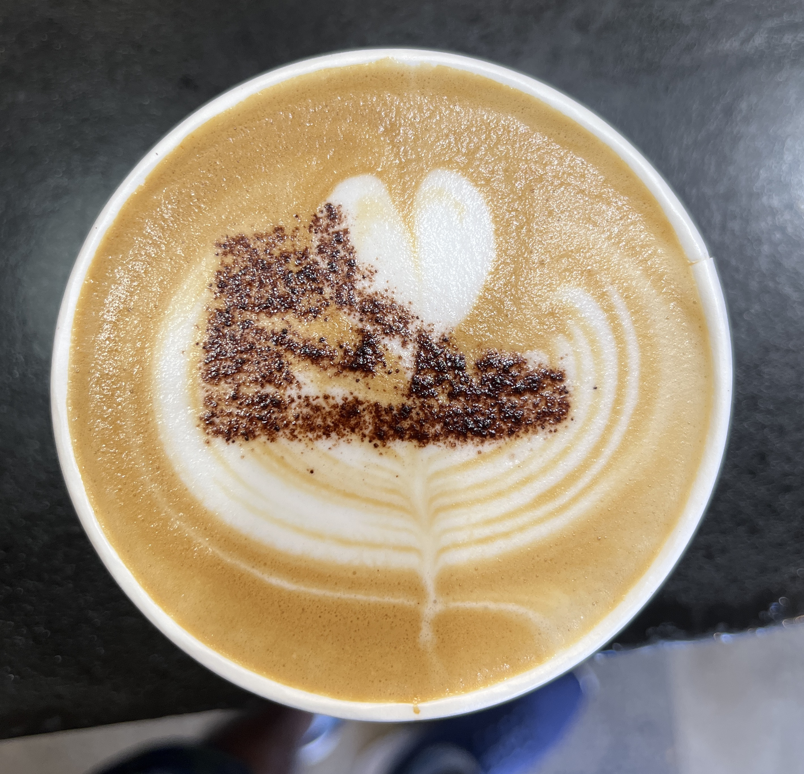
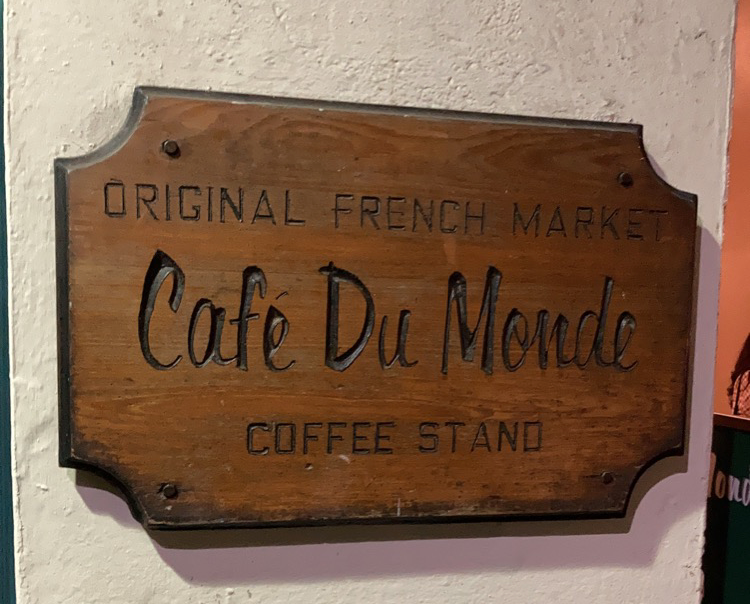

## History of Coffee

Coffee has a funny history of how humans started consuming it. Sometime around 800 AD, one shepherd in Ethiopia wandered around with his goats and sheep. He noticed that his cattle behaved funny when they ate a particular shrub. They didn't sleep for long and were generally excited for the rest of the day. They kept bleating long into the night.

He brought the plant to some monks, who made a drink out of it. There --- we had coffee.

A historian named Wolfgang Schivelbusch, in his book "Taste of Paradise", presented the effects of coffee in Europe and the Arab world. Drinking coffee had two direct consequences. First, making coffee (or even tea) requires boiling water. Boiling water to make drinks was not standard at all before the advent of coffee. As you know, boiling water is the surest method to kill most disease-causing germs, including viruses, bacteria and parasites. Suddenly, there was an incredible boost in public health. The incidence of water-borne diseases fell drastically.

Second, caffeine in coffee has psychological effects as well. The drug helps in thinking linearly and making them more productive. This point doesn't require further elaboration for most coffee or tea drinkers.

This likely played a role in Arabs developing sweeping advancements in science, mathematics, theology, philosophy, and engineering --- commonly referred to [Islamic Golden Age](Islamic%20Golden%20Age%20-%20Wikipedia%20https://en.wikipedia.org/wiki/Islamic_Golden_Age). Algebra, geometry, trigonometry, astronomy, optics, biology and more.

Caffeine enters European culture in the 1650s. Before caffeine became commonplace, people were drunk all the time. Why? It was safer than water. Water had many potential microbes, but fermented drinks were safe to consume. Even kids regularly drank ciders.

With coffee and tea from Asia to Europe, Europe saw its renaissance. The advancements were quick. With the public health boost of boiling water, these drinks, clubbed with the psychological benefits of caffeine, led to many developments, like the age of enlightenment. It became the new popular drink, replacing alcohol-based beverages.

## Coffee Breaks

A necktie manufacturer named Wigwam Weavers in Denver had lost most of their excellent workers to World War 2. They hired older adults who weren't drafted in the war but weren't skilled at knitting the intricate patterns in ties. Then, they hired women for the job. Women were terrific at the position. However, they could only do it for a few hours.

The company managers called them for a meeting and asked: what can we do to make you more efficient? They asked for "coffee breaks", though they didn't call it that at the time. Overnight, productivity and quality shot up.[^1]

[^1]: You can learn more about it from this video: [**What Michael Pollan Learned from Quitting Caffeine for 3 Months**](https://www.youtube.com/watch?v=mAPG18zNtXk&t=3s). Michael Pollen is the author of the book [This Is Your Mind on Plants](https://michaelpollan.com/books/this-is-your-mind-on-plants/).

## Rediscovering Coffee

Dea reintroduced coffee to me this summer. Of course, I had always enjoyed coffee. It is far better than Chai (चाय), which most Indians are hooked. Around Portland, we went around trying new cafes and their coffees. At the time, I couldn't spot any difference between any coffee.

Even today, I need help to spot the difference between coffee from different regions. I can identify different roasts better than a coin flip --- light roasts are bitter, while dark roasts are chocolaty.

There is so much more to it. Like coffee, blends are cheaper than single-origin coffee but often taste less good. Most cafes, including Starbucks, have only blends. Only some blends are good. But, *generally*, single-origin coffee tastes better than blends.

Soon, I wanted to try more types of coffee. I was looking for a new hobby, and making my fancy coffee sounded like an excellent one to pick up.

Oh, by the way, when I say coffee, I mean Latte. I am not an espresso person. This significantly reduces the types of coffee I can try at a cafe, as they generally only have options for drinks espresso.

## Coffee I've Made

On Dea's recommendation, I got a subscription to [Trade Coffee](https://www.drinktrade.com/app). Trade Coffee They send me a coffee every few weeks whenever I'm on the verge of finishing the last pack. They asked my preferences before I began, and I rated coffee after I tried them. Then, based on my ratings, they optimise finding the next best coffee from their inventory.

Here are the coffees I've tried.

## Cafes in Knoxville

These are some of the cafes I've tried in Knoxville.

## Cafe Du Monde, New Orleans

Their [Café au lait](https://en.wikipedia.org/wiki/Caf%C3%A9_au_lait) might be the only reason why I would visit New Orleans ever again.

## Other Interesting Stuff about Coffee

-   [The sensory experience of making coffee](https://arun.is/blog/sensory-experience-coffee/)
-   [Arabica Coffee Bean Varietals](http://www.coffeeresearch.org/agriculture/varietals.htm)

------------------------------------------------------------------------

