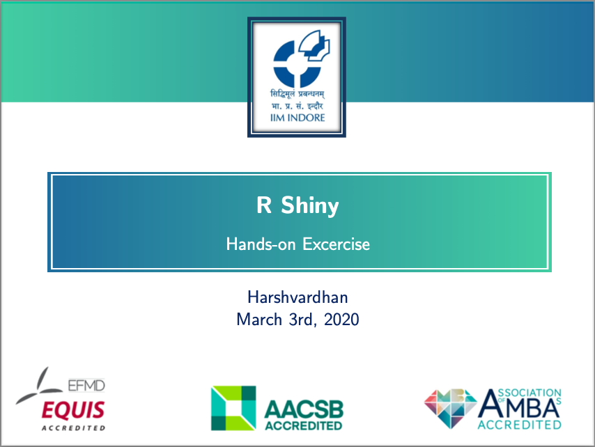

### Post-modern Report

-   M Harshvardhan. (May 2020). Post-modern Report. Overleaf Gallery. [Sample Report - PDF](docs/report_template.pdf) Accessed at: <https://www.overleaf.com/latex/templates/post-modern-report/pwhvgwghscqv>

### IIM Indore Report Template

-   M Harshvardhan. (May 2020). IIM Indore Assignment Template. Overleaf Gallery. [Sample Report - PDF](docs/immi_report_template.pdf) Accessed at: <https://www.overleaf.com/latex/templates/iim-indore-assignment-template/ypwbsqfbxbgw>

### IIM Indore Official Slides Template

-   M Harshvardhan. (June 2019). [IIM Indore LaTeX Slides Template](/docs/slides_iimi_template.pdf). For Internal-use Only.

The IIM Indore slides template was shared with faculty members by Prof Sujay Mukhoti and Prof Pritam Ranjan.
