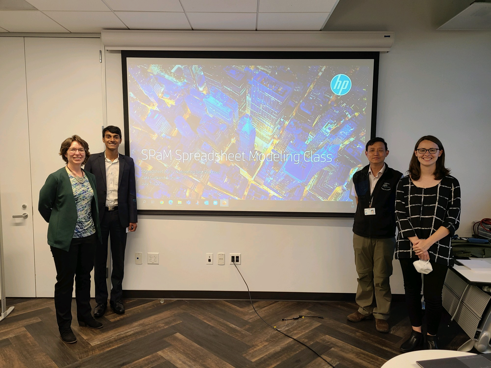
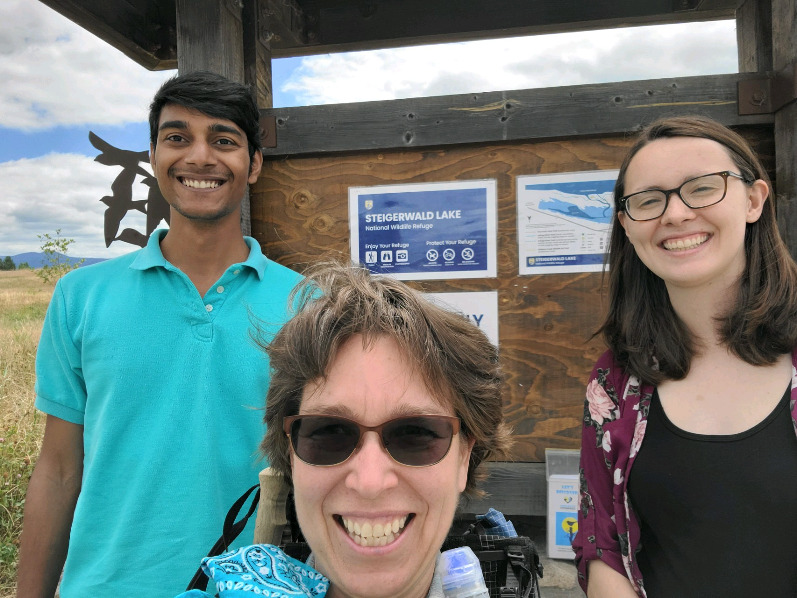
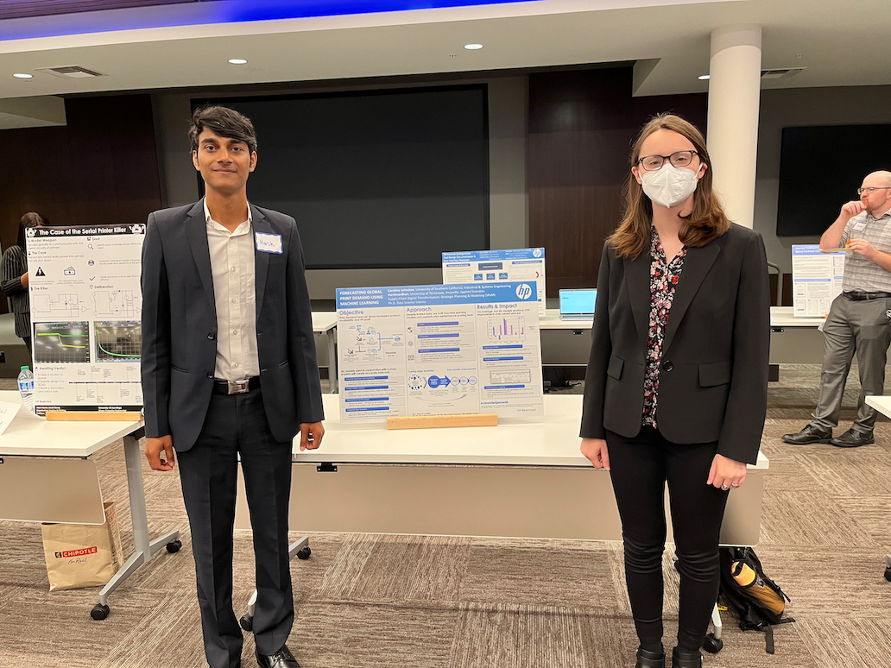

This summer was an amazing experience for me. I spent three months toying with different machine learning models building large-scale forecasts for HP's print business. I went in with hardly a year of experience in Python and came out with deep understanding of how Python works, internally and visually. From mostly textbook examples of regression and time-series forecasting, I went to creating forecasts for thousands of products that HP produces worldwide.

## Project

My internship project was on using machine learning to forecast the demand for printers worldwide. HP manufactures and sells over 10,000 print related products in over 170 countries. Forecasting their demand accurately is important as inaccuracies in demand forecast would have cascading effects on supplies forecast. [Caroline Johnston](https://twitter.com/carol_marge_j?lang=en), my co-intern from the University of Southern California, and I tuned the models for better demand signal recognition.

Caroline's experience in Python came in handy whenever I was stuck with something simple like wrangling data frames or something complicated like modifying an object's internal variables.[^1] She's a terrific partner to work with. We (largely Caroline) also designed holistic metrics to synthesise business and ML accuracy results. We worked on automatic data quality error detection. In the process, we used Python, SQL and Tableau to get the job done.

[^1]: When I say simple, I mean simple. Like, why does `pandas` require `iloc` to have `[]` instead of `()` ?

## Team

The steep learning rate was not at all a problem. Why? People. I was working with the [Strategic Planning and Modelling](https://www.wikiwand.com/en/HP_SPaM) team, abbreviated internally as SPaM.[^2] The SPaM team has an extensive experience in supply chain analytics. They have worked on several mission-critical projects over the last 40 years and my project was no different.

[^2]: The acronym was popular before spam emails became a problem. The word wasn't in general lingo back when HP SPaM was founded in 1989.

My manager, Barrett Crane and my project mentors, Cara Curtland and Jerry Hwang were available and cared for us to succeed in the internship. They took out time to help us understand it well. Even today, there's rarely a meeting with Jerry where I don't learn something new about Python, Jupyter and ilk.

Shawn Tay, another SPaMster, taught me ways to think about my career. He suggested that I look at my career as a project *consultant*. Currenlty, I'm working on a project with HP where I've to maximise my contribution so that the *client* would be happy and satisfied. In the process, I should aim for upskilling myself continuously. A better consultant would get a better project, which would make them a better consultant. It is a continuous improvement loop.[^3]

[^3]: I believe this idea comes from a book that either Caroline or Shawn mentioned, but I don't remember the name.

Cara took us on many team lunches where we got to discuss things outside of our work: scouts, camping, hiking, nutrition bars and more. Shawn and Cara also organised an Excel workshop where we learnt interactive spreadsheet modelling. I also got the opportunity to talk about data manipulation in the session!

Cara is an avid hiker and she took us on a hike nearby at the [Steigerwald Lake Wildlife Refuge](https://www.fws.gov/refuge/steigerwald-lake) which was scorching hot but fun!

## InternStellar Award

Our internship project got the first runners-up at the HP InternStellar Award competition, in the technical contribution category.[^4] This is Caroline and me at the final poster fair for Interns.

[^4]: The winner developed a method that could print on *any* fiber rather quickly. I'm perfectly fine with the second position; he deserved it.

## Pacific Northwest

Pacific Northwest United States is beautiful.
