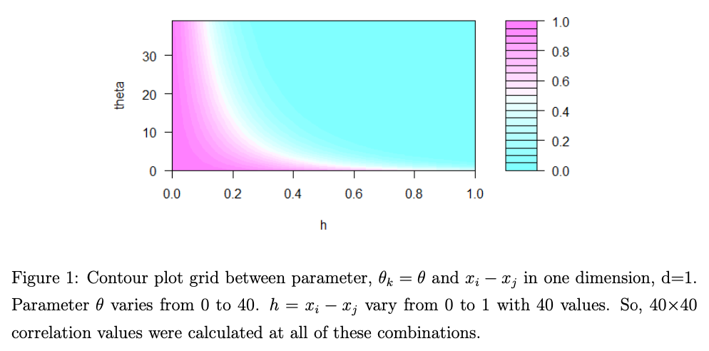

### Gaussian Models and Correlation Structures

-   Studied different forms of Gaussian models and their theoretical foundations
-   Studied various correlation structures and understood their sensitivity to hyperparameters
-   Performed simulation-based research to quantify and compare stabilities of correlation structures
-   Compared prediction accuracy and reliability of major R packages for Gaussian process modelling
