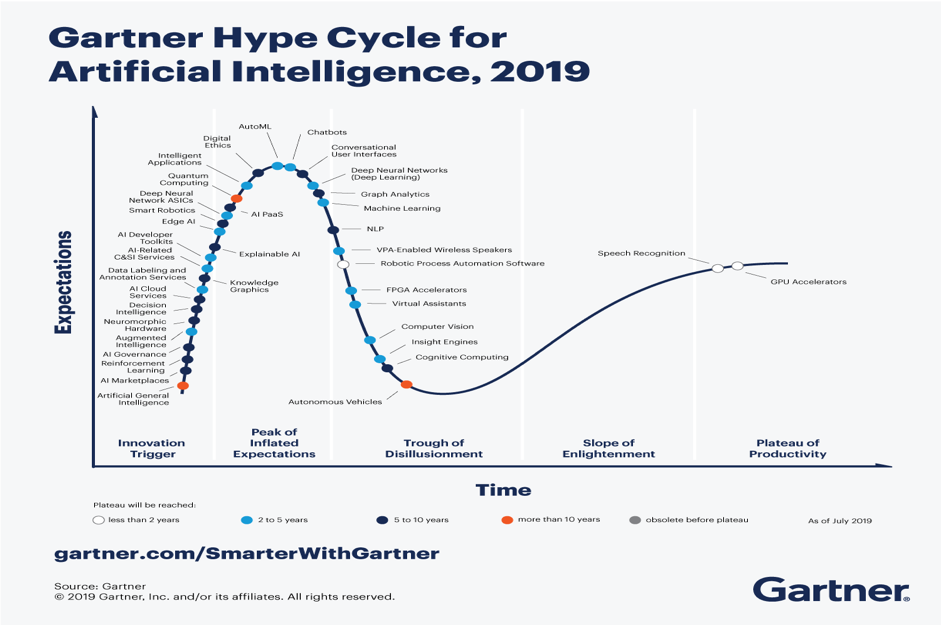

When a new technology makes it to the headlines, it is vital to understand which of those are commercially viable and which are futile attempts of modernisation. Gartner hype cycle helps understand the evolution of technology and its use cases. Every year, Gartner releases multiple hype cycles – each focusing on some new technology. The hype cycle for Artificial Intelligence is one such tool (others being on emerging technology and marketing).

There are five stages in the hype cycle progression – innovation trigger, peak of inflated expectations, the trough of disillusionment, the slope of enlightenment, plateau of productivity. 

Innovation trigger technologies are technologies that haven’t evolved themselves beyond concepts. There aren’t any direct use cases, but the technology seems promising. The peak of Inflated Expectations occurs after innovation is triggered. Now that the technology is highly marketed, everyone has expectations – which vary from what the technology can perform. There are hundreds of success stories, accompanied by thousands of failure stories. 

The trough of disillusionment occurs when people’s interest in technology wanes. People realise that these technologies just had great fanfare and aren’t that useful. Only the players with deep pockets and endurance continue with technology. The slope of enlightenment is when the technology’s use cases and details start taking shape into definite forms. Players slowly realise the cost-benefits of adapting and accommodating the technology. 

Finally, the plateau of productivity occurs when the technology becomes mainstream, generally accepted by businesses and taken for granted.

Consider computer (personal use home computers, to be technically precise). In 1969, when Honeywell Kitchen Computer was launched, it started the home computing era. But sadly, none were sold – thanks to its high price. But that rolled a movement of what a computing device could do. Everyone could sense it would make the difference, but no one had crystallised their vision of how. That could be termed as a computer’s innovation trigger. It was then marketed as a personal finance device, automation device, and so on. It was expected to reduce costs manifold – marking its entry to the peak of inflated expectations. None of that was practically possible. 

Data entry for commercial purposes was cumbersome; home automation would keep the device always on, pushing up electricity bills and heating it up. It was realised that all the marketing might not be accurate, and it’s all disillusionment. However, in less than a decade (1977), Apple II was launched. This changed the perception as well as the reception. People began realising that many processes were possible and software like Lotus brought it mainstream. So, it joined the slope of enlightenment. Soon they entered the plateau of productivity. Rest, as they say, is history.

But then, there is a natural question: how to use the Hype Cycle to our advantage? Well, typically, industry players see how they can leverage the technology available at their disposal – and the right time for it. Different industries are differently affected by any new technology. Moreover, the players in the industry have different risk appetites.

A risk-taking player is ready to reap the benefits of being an early adopter. They will adopt technology in its innovation-trigger phase. A manager who intensely invests in cost-benefit analyses would probably wait for the peak of inflated expectations and trough of disillusionment. A start-up would likely work with an inflated expectations technology. In contrast, an established firm would probably invest during the trough of disillusionment. The slope of enlightenment is when every firm would adopt the technology if they can afford to. When it reaches the plateau of productivity, it will likely be mainstream and not using it could mean a competitive disadvantage.

According to Gartner’s 2019 survey of 3000 CIOs, more enterprises are entering the third era of IT infrastructure. A majority of the expenditure was targeted towards increasing customer engagement via digital channels, making “Digital Business” a driving concern. The survey found that 33%companies evolved their digital endeavours, up from 17% the previous year. The CIOs are “making a leap from IT-as-a-craft to IT-as-an-industrial-concern”, says Andy Rowsell-Jones, VP, Gartner.

With a wide variety of digital interactions available through digital channels, organisations must expand beyond traditional engagements. This is further supported by reduced cost and better consumer experience for the organisations. The spending by the corporate houses also remains relatively steady. CIOs, on average, expected that their IT budget will grow by 2.9%, which is slightly less than 2018’s 3% growth rate.

This Gartner Hype Cycle [highlights](https://www.gartner.com/smarterwithgartner/top-trends-on-the-gartner-hype-cycle-for-artificial-intelligence-2019/) how AI is reaching organizations in many different ways.

## Example of technologies in each phase

### AI Marketplace (Innovation Trigger)

AI marketplace is an online marketplace to buy and sell technology, Artificial Intelligence and Machine Learning based algorithms online for anybody to use. A typical AI marketplace has algorithms spanning technologies like text mining, computer vision, and speech recognition, among others. These marketplaces intend to link AI services with each other, thus increasing the supply of AI-based technology for general use. Bundling of services at the same platform (which is typically online) costs way lesser than traditional AI deployment on case to case basis.

These marketplaces can be open source as well as proprietary. For example, [GenesisAI](https://www.genesisai.io) is open source, whereas [Infosys](https://www.infosys.com/services/applied-ai/insights/ai-marketplace.html) provides the same as proprietary software. These developments are mostly on the paper; however, entry of Infosys is an exciting episode in its progress.

It is difficult to predict to what extent will the AI marketplace would grow. But considering the expected global [growth](https://www.fortunebusinessinsights.com/industry-reports/artificial-intelligence-market-100114) of AI market to $202 billion by 2026 (CAGR 33%), it is destined to grow beyond expectations – typical of innovation trigger technologies.

### Chatbots (Peak of Inflated Expectations)

Chatbots are the basis of computer-human interactions in the present world. These interactions are mostly text-based, however, sometimes these can be voice-based. Earliest chatbots (deployed in customer service to answer mundane questions) were a simple decision based (or exaggerated flowcharts). However, newer chatbots have intelligent engines working behind them that try to understand individual user demands. 

There are success stories as well as failure stories, typical of technology in this phase. Facebook, for example, allows business listed on it to use basic chatbots for free, which has significantly reduced the burden of some critical business. Google’s Duplexis the latest example of how chatbots have developed in recent years and their hopeful influence in future.

Chatbots are growing – and fast. According to Market Research Engine [Report](https://www.marketresearchengine.com/chatbot-market-report) on Chatbot Market the global chatbot market is expected to explode in coming years. It’ll exceed more than $994 million by 2024, growing at a CAGR of 27%. Banks are further likely to automate their customer interaction by [over 90%](https://www.juniperresearch.com/press/chatbots-a-game-changer-for-banking-healthcare).

In the US alone, users of smart speakers and assistants like Amazon Alexa, Google Assistant and Siri grew by [40%](https://voicebot.ai/2019/03/07/u-s-smart-speaker-ownership-rises-40-in-2018-to-66-4-million-and-amazon-echo-maintains-market-share-lead-says-new-report-from-voicebot/) to reach 66.4 million users in 2018. The expected rise of smart speakers, this is going to improve further.

### Virtual Assistants (Trough of Disillusionment)

Virtual Assistants are self-employed people and provide professional administrative, technical or creative assistance remotely from home offices. They are usually independent contractors and are typically employed as a freelancer, therefore cheaper than traditional assistants. Their typical job includes managing their client’s emails, travel schedule, etc. A few years earlier, they were thought to be transformational in personal assistance. However, these jobs are slowly losing their hype of being the game-changer. [Zirtual](https://global.zirtual.com) and [VaVa Virtual Assistant](https://vavavirtual.com) are popular virtual assistant portals. 

In the US, there was a sudden boom in the hiring of Virtual Assistants. According to an infographic by [Valuewalk](https://www.valuewalk.com/2018/09/rise-virtual-assistant-industry/). the number of people identifying themselves as virtual workers increased by 79.7%. Majority of it was fuelled by low operational cost, higher productivity and ability to telecommute to work. The supply side is filled by freelancers, most of which are college students. In my personal experience in Latvia, I saw a big group of the student taking this up as their summer job.

There are no current technologies in the slope of enlightenment phase (see Figure 2). Most technologies end up being till trough of disillusionment phase with two being in the plateau of productivity phase. This could be because of two reasons. 

First, AI in itself is a new buzzword. Most technologies haven’t figured out their business uses. The experiments till now have been huge investments and with not many scalable economy-wide or industry-wide applications. Second, those technologies which reached the plateau are not new. Speech recognition and GPU based acceleration have been worked on at least for a decade. Further, the only technology which is expected to reach the plateau in less than two years is Robotic Process Automation which has been worked on for quite some time now. All other technologies take at least two years to be exploited further.

### Speech Recognition (Plateau of Productivity)

It is a field of computational linguistics that develops algorithms that convert text to speech aided by computers, and understand speech by humans, turning them to text understandable by machines. The most basic of speech recognition have voice-based interaction systems. 

These technologies were thought to be a game-changer but changed with time. These are recognised to have strong use cases today. Examples include Google Assistant, Cortona, etc.

The first steps to speech recognition were undertaken in 1952 by Bell Labs when their machine Audrey could recognise digits 0 to 9 with 90% accuracy (when done by inventor), or 70-80% for other users. However, the development shot and today’s computers are able to recognise millions of words with almost no difficulty.

---

A version of this article was submitted as assignment in Prof Saurabh Kumar's course Information System for Managers at IIM Indore.
