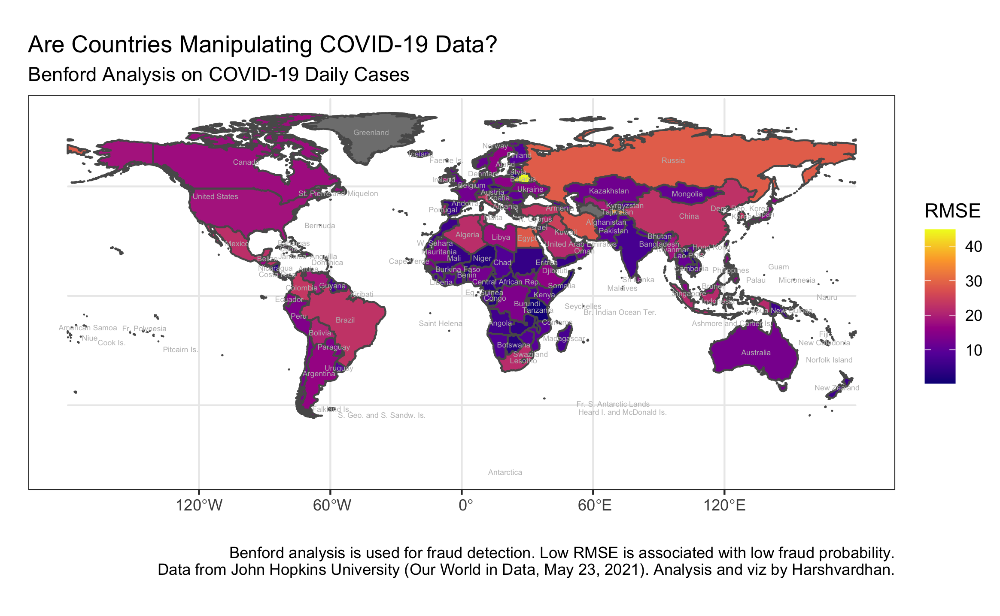

Are COVID-19 numbers reported by countries altered? I test the validity of COVID-19 new daily cases for every country using Benford's Law. Since the pandemic gained global centre stage, there has been a surge in data manipulation accusations. Independent media agencies questioned country-level data, and all of us made our own conclusions if the data is correct.

Benford's law tells us that in many naturally occurring collections of numbers, the leading digit is likely to be small ([Wikipedia](https://en.wikipedia.org/wiki/Benford%27s_law)).

Take any naturally occurring dataset. If you count the frequency of the first digits, 1 appears around 30 per cent of the time, 2 appears for 18% of the time, ..., and 9 appears around 5 per cent of the time. This amazingly simple "law" can be an authoritative proof to start an investigation --- following natural justice, we shouldn't call anyone guilty of manipulation just on this violation.

Mathematically, the digits' occurrence probability can be modelled using Benford's Distribution, with the following probability distribution function.

$$
P(d) = \log_{10}(d+1) - \log_{10}(d) = \log_{10}\left(\frac{d+1}{d}\right) = \log_{10} \left(1 + \frac{1}{d}\right)
$$

The probability of each digit comes out exactly as the following.


The law is so universal that the Income Tax Department uses it to detect fraud, legal cases have admitted it as evidence, regulators analyse prices to see cartel-like behaviour, forensics use it to identify deep-fakes and doctored videos, among others, and in our case, COVID-19 data reported by countries. The Netflix TV-series "[Connected](https://www.imdb.com/title/tt12753692/)" did an episode "Digits" on Benford's Law. It is absolutely brilliant and you should watch it.

## Approach

My approach is simple and direct. Using the COVID-19 data available at [Our World in Data (John Hopkins University)](https://github.com/owid/covid-19-data/tree/master/public/data), I modelled each country's daily cases using R and found first-digit distribution using the [benford](https://cran.r-project.org/web/packages/benford/index.html) package in R. 

I measured how much they differed from the expected proportion as Root-Mean-Square-Error (RMSE). A lower RMSE value would mean more accurate data reporting.

## Results

Explore the world map below to see evidence of manipulation for each country.

  

> R Codes

  
  ```r
  ##### Map plot
  
  library("sf")
  library("rnaturalearth")
  library("rnaturalearthdata")
  
  world = ne_countries(scale = "medium", returnclass = "sf")
  world1 = merge(world,world1,by.x = "iso_a3", by.y = "iso")
  
  world_points<- st_centroid(world)
  world_points <- cbind(world, st_coordinates(st_centroid(world$geometry)))
  
  ggplot(data = world1) +
  theme_bw() +
  geom_sf(aes(fill = rmse)) +
  geom_text(data= world_points,aes(x=X, y=Y, label=name), col = "grey", check_overlap = T, size = 1.5) +
  scale_fill_viridis_c(option = "plasma") +
  labs(x = "", y = "", fill = "RMSE", caption = "Benford analysis is used for fraud detection. Low RMSE is associated with low fraud probability.\nData from John Hopkins University (Our World in Data, May 23, 2021). Analysis and viz by Harshvardhan.", title = "Are Countries Manipulating COVID-19 Data?", subtitle = "Benford Analysis on COVID-19 Daily Cases")
  
  ggsave("country.png")
  ```

## As of May 23, 2021

The countries with very little evidence of manipulation --- RMSE less than 3 --- are the following. 

> Comoros, Somalia, Dominica, Republic of Congo, Vatican, Solomon Islands, United Republic of Tanzania, Samoa, Vanuatu, Marshall Islands, Federated States of Micronesia.

The countries with very strong evidence of manipulation --- RMSE more than 22 --- are the following. 

> Belarus, Tajikistan, Netherlands, Russia, Egypt, Iran, Iraq, Qatar, South Korea, Colombia, Italy, Turkey, Honduras, Brazil, China, Kuwait, Mexico, Algeria, El Salvador.

My home, India, doesn't show strong evidence of manipulation (RMSE = 7.32). China (RMSE = 22.6) and Russia (RMSE = 28.9) show major evidence of manipulation. **These results are as on May 23, 2021 and can change in future. Use the app below for live results.**

If you are curious about any specific country, I made a Shiny app for each country on live data. Check it out below or [here](https://harshvardhan.shinyapps.io/covid19benford/ "Shiny App").

<iframe height="900" width="100%" frameborder="no" src="https://harshvardhan.shinyapps.io/covid19benford/"> </iframe>

The above app takes in live COVID-19 cases data from Our World in Data and analyses using R Shiny. Therefore, the numbers and graphs are updated frequently.

[Here](https://docs.google.com/spreadsheets/d/1Pn6tmOBceBvypNUY537RY0FpWiShsHiwMEjWnFSORaY/edit#gid=0) is the complete list of countries and their RMSE values (as of May 31, 2021). The codes for the Shiny app and generating the plots, etc. are included in this Github [repository](https://github.com/harshvardhaniimi/benford-covid-19).

Of course, much detailed analysis is required to conclude anything confidently. Benford's Law can give misleading conclusions like [2020 US Elections](https://www.reuters.com/article/uk-factcheck-benford/fact-check-deviation-from-benfords-law-does-not-prove-election-fraud-idUSKBN27Q3AI), and it might as well be the case here. This is only a first-level analysis. Beyond first-order, expert eyes are required to find how fair is Benford in this case.

