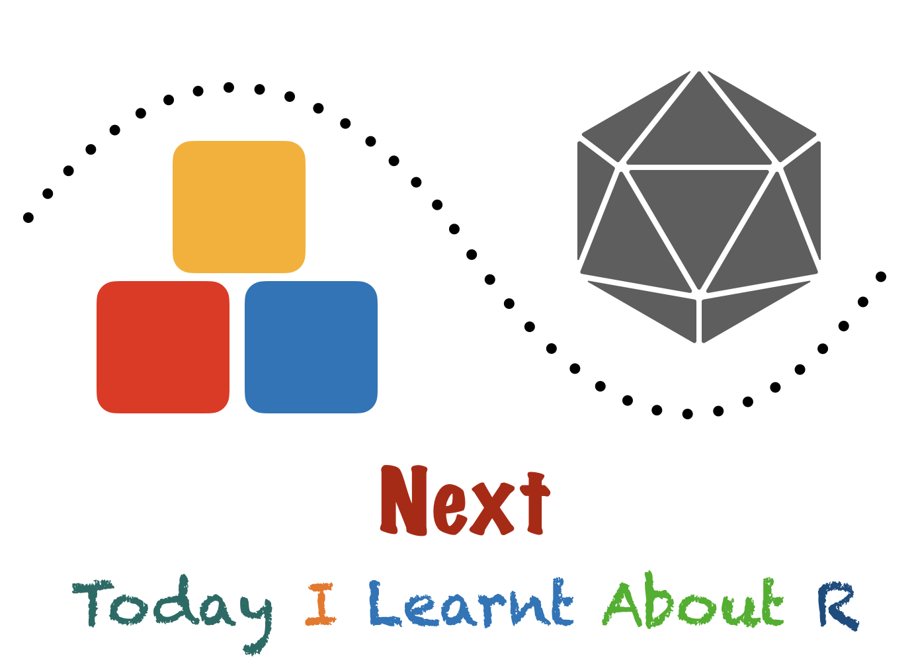

Next is my short and sweet newsletter about a curated collection of R-related works. It is posted at 9:30 AM (Eastern Time) every Wednesday. The content is pretty straightforward.

**Five stories. Four packages. Three jargons. Two tweets. One meme.**

# Why do I do this?

To learn more about R and statistics, I follow many blogs and people on Twitter. I felt a strong urge to share all I remember with as many people as possible. Blogs had limited readership and were published intermittently. So to bring me to a routine, I started this newsletter. Every Wednesday, I put together some old exciting articles and new impressive innovations in an email sent to more than a hundred learners.

There was a solid latent demand: the letter gained a hundred learners before rolling out the first issue. Several positive reviews are a testimony that people like this.

# Where can you read past editions?

You can read past editions on [Revue](https://www.getrevue.co/profile/harshbutjust).

# Where can you sign up?

[Right here!](https://www.getrevue.co/profile/harshbutjust)
