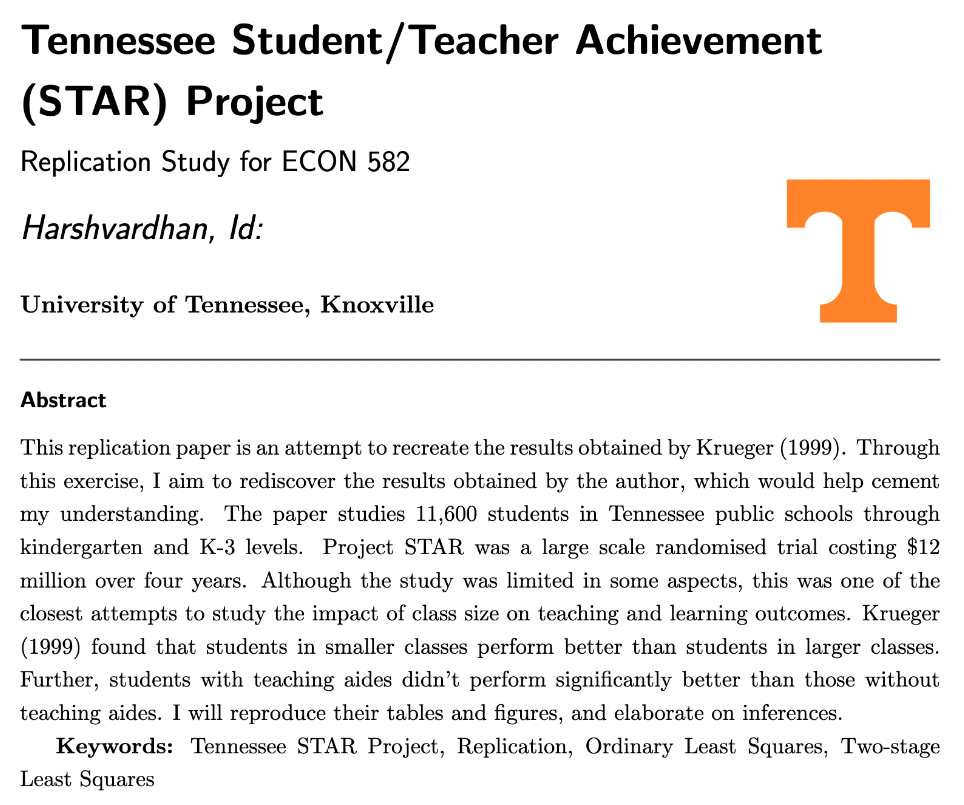

The Tennessee Student/Teacher Achievement (STAR) Project was a large scale ran- domised experiment on class size conducted in Tennessee schools. The students and teachers were randomly assigned to one of the three class types: small class (13-17 stu- dents per teacher), regular-size classes (22-25 students) and regular classes with teacher's aide (22-25 students). Over the four years, 11,600 students were part of the study from 80 schools. The randomisation (random assignment of teachers and students to one of these classrooms) happened at the school level.

This paper and STAR project aimed to discover the importance and impact of class size on learning outcomes. Colloquially speaking, it is hypothesised that smaller classes, i.e. classes with a low student-teacher ratio, have better learning outcomes. Krueger (1999)[^1] aimed to quantify the learning outcomes based on the class size using the Project STAR dataset. Stanford Achievement Test (SAT) and Tennessee Basic Skill First (BSF) tests were used as the proxy variables for student achievement or learning outcome.

[^1]: Alan B. Krueger, Experimental Estimates of Education Production Functions, The Quarterly Journal of Economics, Volume 114, Issue 2, May 1999, Pages 497--532, <https://doi.org/10.1162/003355399556052>

Krueger (1999) considers that class-size dummy variable and regular-size-with-aide dummy variables together can explain the effect on student achievement --- while con- trolling for other student-teacher related attributes (controlled covariates) and the school where the student is enrolled. The average percentile score with SAT measures the out- come of student achievement. Class size dummy and regular-class-with-aide are taken directly from the project database. The control variables are included as covariates such as gender, age, among others. School-related effects are included as a separate control variable in the study.

For more details, see the [project report](/docs/tennessee_STAR.pdf).
