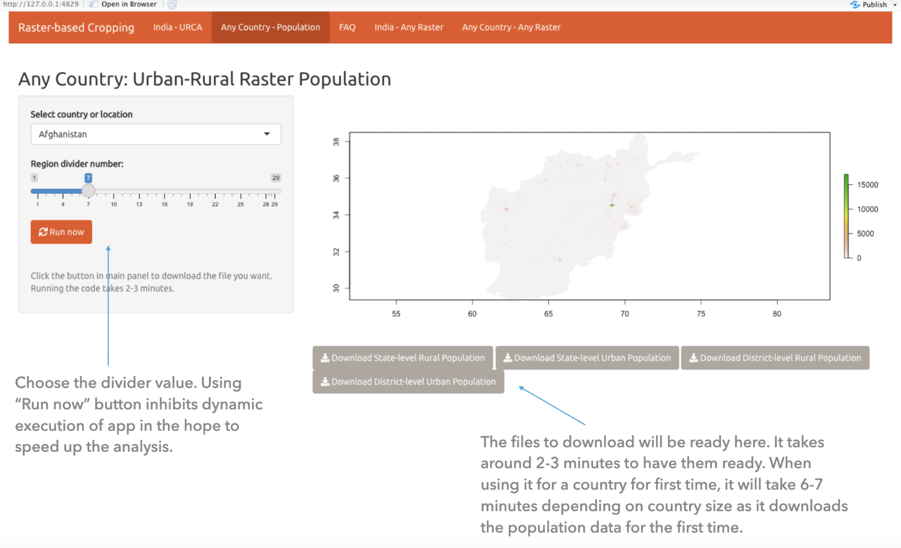

```{r setup, include=FALSE}
knitr::opts_chunk$set(echo = TRUE)
```

I worked on this project with [Asar](https://www.asarforindia.org/) between April and June 2021 to create a Shiny app. Having a full-time job didn't leave much time for side projects, and this project never reached fruition. This app has limitations --- primarily computational --- but can be helpful to researchers in finding urban and rural populations at the country level, state level, district level, or any of the 30 classes. The limitations are on computing power. My laptop, [despite its prowess](/how-fast-is-m1/), not good enough. Probably we need a cluster or Google/AWS computational resource.

# **How to use it?**

Consider you want to find how many people in Nigeria live in a rural setting. You need to select Nigeria and set the level to 1. You will see a map and an option to download spreadsheets of urban and rural populations. What about the Abia state of Nigeria? Shift the divider value to 7, and you will have the urban-rural population of every state in Nigeria. It's not complicated. It's slow but not complicated.

The divider value represents the level of detail till which you need the data. For a Taluka (in India) or a block (in US), you would choose 25. For state level data you would choose 3.

The app works for 2020 data but extending to other years is trivial. I haven't already done it because rasters quickly explode in sizes beyond the computational power of my laptop.



```{r, echo = FALSE}
xfun::embed_file("/Users/harshvardhan/Documents/Old/Asar/Uploaded to Github/Slides.pdf")
```

**The [Github repository](https://github.com/harshvardhaniimi/raster-population) contains codebase and related datasets/databases for Population Raster App.**

# **How does this app work?**

-   The original raster to be aggregated is regional/country-level population, sourced from Worldpop (<https://www.worldpop.org/geodata/listing?id=75>).

-   Choose the level of the urban-rural catchment.

-   (Features below are not implemented yet)

-   Partitioning raster could also be Urban-rural classification, Time-to-healthcare unit, etc.

-   The level of partitioning will be decided by the user in runtime.

**The current app supports Urban-Rural classification for more than 200 countries and regions for 2020.**

------------------------------------------------------------------------

# Limitations of Current Version

-   The app is as slow as snail. I can probably fix this with some degree of caching but working on `sf` data is generally slow. Additionally, the data from `worldpop` is surprisingly granular. That aggregation would require several levels of analysis.
-   It only supports urban-rural classification for partitioning. Implementing other rasters for partitioning is not trivial.
-   It only works for year 2020. Making it work for other years is trivial but probably not as a great idea because it will make the app even slower.

# Future Work

## High Priority

-   Redesign the app with partitioning raster instead of country as focus. Instead of having the choices at the navigation bar, the users should see a single screen where they choose the country and the partitioning raster (possibly multiple partioning rasters).

-   Improving runtime speed (AWS web hosting and better caching can be explored). Currently, the app downloads population and mappings of the country for the first time and reuses them when required.

For example, when you search the population for Latvia for the first time, it will download the relevant files and save them for future use. Next time someone uses the app again for Latvia, the processing will be faster as the files are already available offline.

## Low Priority

-   Include support for years other than 2020. This is not a difficult thing to pull off but would require extensive computing resource, beyond what a laptop can provide.

## P.S.

I do not work or engage with ASAR anymore. I had to drop this project due to other commitments. This app is useful despite its limitations.
