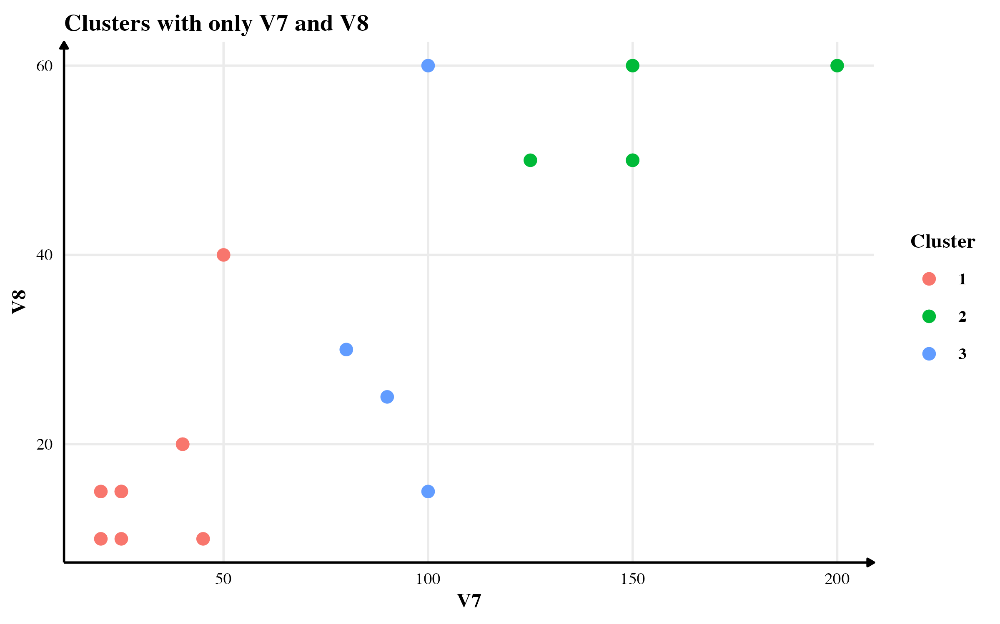
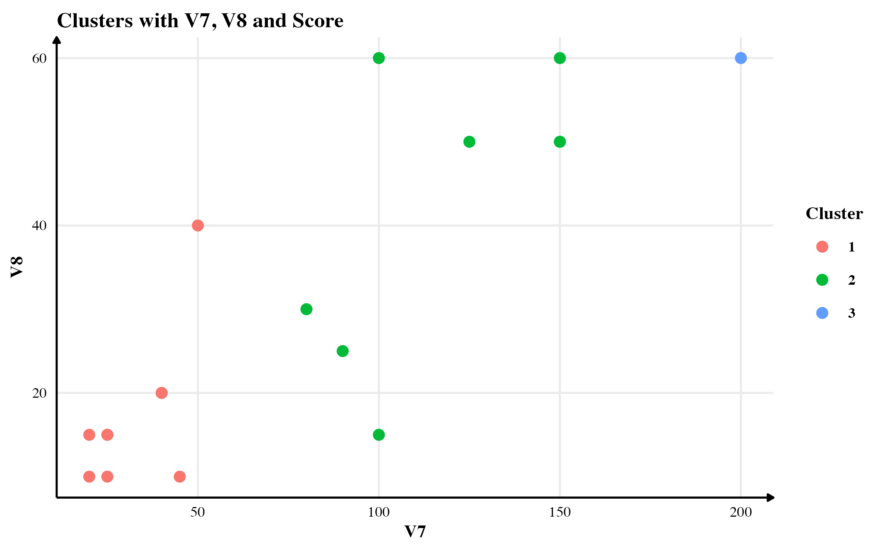
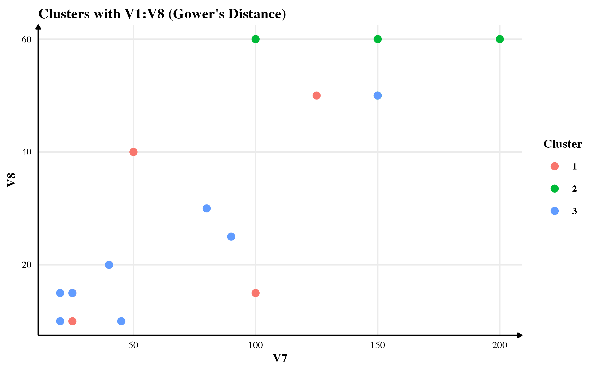

**For details, read the complete report. This project was part of [Prof Wenjun Zhou](http://web.utk.edu/~wzhou4/)'s Machine Learning class at University of Tennessee.**

# What is it?

Most clustering algorithms work for numerical variables where the variables are assumed to be continuous and random. In this short monograph, I proposed a probability-based distance measure for computing dissimilarity between observations for discrete variables thought to be randomly distributed. As their probabilities are derived empirically, there is no underlying assumption on their distribution.

# How do I do it?

Consider two discrete random variables $X_1$ with $u$ different classes and $X_2$ with $v$ different classes. Let $\{c_{11}, c_{12}, \dots, c_{1u} \}$ be the set of different classes of $X_1$. Similarly, let $\{ c_{21}, c_{22}, \dots, c_{2v}\}$ be the set of different classes of $X_2$. The empirical probability of event $X_1 = c_i$ is $\frac{m}{n}$, where $m$ is the frequency of $c_i$ observed in $X_1$ and $n$ is the total number of observations.

Assuming that the sample is representative of the population, we can calculate the empirical probability of each class for each variable. Once we have those probabilities, we can calculate the joint probability for an observation that I call "score". This score is a number between 0 and 1.

## Interpretation

The score of zero is asymptotically possible but impossible in real-world analysis. If the researcher assumes no prior knowledge about the variable, only the existing classes observed in the data can be used as a possible class. In that case, the score cannot be zero for any observation. However, if the researcher assigns a non-zero probability to a class that wasn't observed in real data, we can have zero probability for some classes. A score of one is possible only when all observations are precisely the same.

In most general cases, the value for each observation would lie between zero and one. The closer the values are to each other, the closer they are to each other (although this is not guaranteed, as we will see in the following example.)

# Pros and Cons

The proposed method is amazing if we do not assume any prior probabilistic distribution for the variables. Since it relies on empirical distribution, it estimates the class probability for a discrete variable only based on available observations. However, this benefit comes at a (potential) cost. A biased sample will significantly affect the empirical probability and thus the score. It may not be reliable in such cases.

It is also possible that this method will lead to combinatorial explosion and thus very small values of the score. When calculating the empirical probabilities, we will typically have small values --- less than 0.3 if there are three classes, say. If there are five such variables, the "average" score would be $0.3^5 = 0.00243$, which is very small.

This limitation has an easy fix. We could easily scale the score by multiplying it by a large $C$ to bring it on the same scale as the rest of the variables. This will ensure that the clustering algorithm doesn't penalise this variable for a small default value.

# Quick Example

Let me illustrate the method with a small example. Consider the following data with three discrete variables and no continuous variable.

The variables have different probability distributions. The probability of being a Male is $2/5$; being a Female is $3/5$. The probability of the City being New York is 2/5; Shanghai, Boston or New Delhi are all equal to 1/5 each. The probability of the favourite colour being Blue is $2/5$; Black, White or Red are at $1/3$. Finally, being an executive is $3/5$, and the probability of being a non-executive is $2/5$.

Assuming that all variables are independent of each other, the probability that a person is Male who lives in Shanghai, whose favourite colour of Blue and who is an executive is $2/5 * 1/5 * 2 /5 * 3/5 = 12/625 = 0.0192$. I call this joint probability an observation's score. We could repeat the exercise for all the observations, and we will obtain the results presented in the last column of the table.

This continuous measure that I call "Score" can measure dissimilarity between observations. Note that the method doesn't guarantee a differentiable score. Even observations with which we get precisely the same can differ from one another. However, observations with very different scores would inevitably be different observations. The latter property is more critical when deciding which cluster an observation belongs to.

# Simulations

In this section, I will compare the clusters found using three methods: (1) using only continuous variables, (2) using continuous variables and the score, and (3) using Gower's distance. For the purpose of this simulation, I will use `flower` data available in `cluster` package in R.[^1]

[^1]: For more details, see [https://cran.r-project.org/web/packages/cluster/cluster.pdf](https://cran.r-project.org/web/packages/cluster/cluster.pdf}.). This dataset was first published by Struyf, Hubert and Rousseeuw (1996).

# Results

### Clusters with only continuous variables

The clusters obtained from the continuous variables seem to have accounted only for V7 in differentiating between the observations. See the figure below for a scatter plot.

### Clusters with continuous variables and my proposed "score"

### Clusters with Gower's Distance

The clusters obtained from Gower's Distance is presented below.

# Conclusion

In this short monograph, I presented a new distance metric based on empirical joint probability. With a small simulation on `flower` data, I showed how effective it is as compared to not using categorical variables at all. I also compared the results with Gower's distance-based clustering. I found that the results from the three methods do not match exactly. My method shows some improvement over not using categorical variables. However, Gower is a smart guy and his method performs better than my naive method. :)
