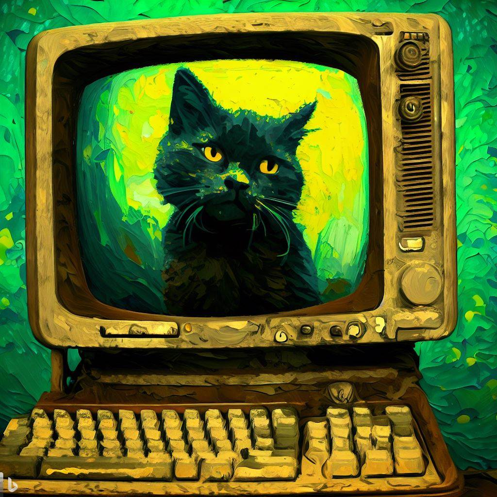

Imagine chatting with your pet cat, discussing non-violence with Mahatma Gandhi, or seeking therapy from a virtual counselor named Isha. I created a GPT Chatbot which lets you engage in conversation with various personalities from history and beyond, all from the comfort of your own Terminal.

Curious to know how it works? I'm here to walk you through the entire process, step by step. *Avast ye, let's weigh anchor and set sail!*

## Getting Started

First things first, you'll need to get your hands on the chatbot. Simply follow these straightforward steps:

1.  Clone the repo or [download the zip from GitHub](https://github.com/harshvardhaniimi/gpt-chatbot) (look for the green button on the top right).

    

2.  Install the requirements by running `pip install -r requirements.txt`. You must execute this in the same Python environment as your usual Python.

    For Anaconda users, this would mean running `conda env list` to get list of all environments. Then choose the right environment with `conda activate env_name`.

    

3.  Obtain OpenAI API keys from <https://platform.openai.com/account/api-keys> and place them in the Python script called `openai_keys_user.py`. (The benefit of keeping keys in a separate file is that you can share the app without its keys.)

4.  Navigate to the directory where you downloaded the repository. You can use `cd path/to/folder` for this.

    

5.  Run the script with `python3 app.py`.

6.  That's it! Now you're ready to choose a personality to talk to and have a blast.

Remember, if you need help, feel free to ask ChatGPT or comment below.

### Mahatma Gandhi

### Gary, my Cat

I really want to have a cat but it's too much responsibility. Further, wild \>\> pets.

Gary is fascinating to talk to. I've noticed that talking to the cat (`cat_prompt.txt`) is especially enjoyable when using GPT-4, though the current app is based on GPT-3.5-turbo. Once I gain access to the GPT-4 API, I'll be sure to update the app accordingly.

I asked Gary to describe itself.

## How does it work?

You might be wondering how this chatbot works. Well, it's all thanks to the OpenAI API, which is responsible for generating text. Here's `app.py`: [gpt-chatbot/app.py](https://github.com/harshvardhaniimi/gpt-chatbot/blob/main/app.py)

The code outlines the core functions needed to run the chatbot, generate responses, and manage conversation flow. The primary function in this implementation is \`response(), which takes a list of messages as input and generates a response using the GPT-3.5-turbo model from OpenAI.

The messages are structured as a list of dictionaries containing a "role" (either "system", "user", or "assistant") and the message "content". The function returns the generated message and its role. To add a message to the list of messages, the add \_message() function is utilized, taking the current list of messages, a new message, and the role associated with the message as arguments.

The `execute_chatbot()` function handles user interaction, providing a choice of chatbot personalities and managing the conversation loop. Depending on the user's choice, a system message is created to define the chatbot's personality.

Then, the conversation loop begins, utilizing the `response()` and `add_message()` functions to generate responses and manage the flow of the conversation. The user can type 'exit' at any time to end the conversation.

## What's Next?

In wrapping up, this chatbot serves as a fun and adaptable space for users to engage with a variety of AI personalities, such as a wise therapist, renowned historical figures, and even a quirky talking cat. The showcased code is a testament to how straightforward and efficient the process can be with the help of GPT-3.5-turbo and OpenAI's API.

As I'm always looking for ways to improve and expand this chatbot, I would love to add more personalities to chat with. If you have any suggestions or ideas for new characters and improvements, don't hesitate to open an issue on the GitHub repo.

------------------------------------------------------------------------

*ChatGPT and Gandhi's advices were used in writing this post.*
