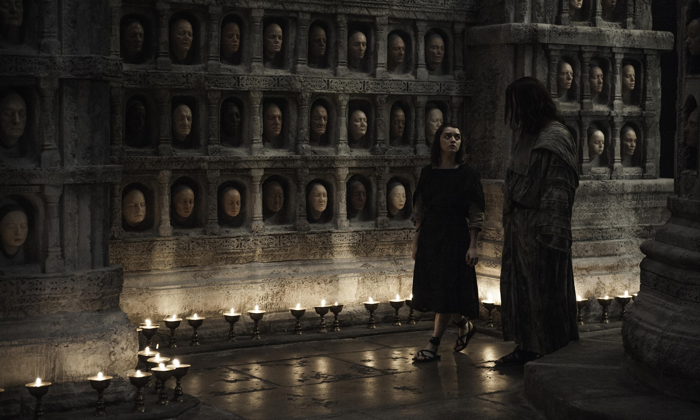

In the bustling realm of deep learning, classifying facial images accurately by age, gender, and race presents a unique set of challenges. Taking these challenges head-on, a novel project based on FairFace dataset with 108,501 images, was undertaken that aimed at creating a classification model with a two-stage method, utilizing just a fraction (15%) of the complete dataset. Using a Variational Autoencoder (VAE) to project images to a latent dimension and then training a Convolutional Neural Network (CNN) classifier on the VAE-generated encodings, the project attempted to streamline the process of image classification.

Variational Autoencoders (VAEs) are central to the facial analysis model developed in this project. As a class of generative models, VAEs utilize deep learning to reduce the dimensionality of data, thus helping to project facial images into a latent space. Here, meaningful features are extracted and used to enhance the accuracy of image classification. The unique selling point of VAEs lies in their capability to learn and encode essential aspects of the data in a condensed and more manageable form. This approach is efficient, particularly when dealing with limited datasets, as it not only conserves computational resources but also optimizes the use of available data.

By training the autoencoder on just 15% of the dataset, the VAE successfully captures significant features, leading to improved performance in downstream classification tasks. An added advantage of VAEs is their inherent stochasticity, making them generative models. This allows the VAE in this project to generate new data, thereby augmenting data and enriching the diversity of facial image representations. Moreover, these latent space representations lend themselves to transfer learning, accelerating the training process and optimizing computational resources for other related tasks. This synthetic data generation capability of VAEs improves the performance of downstream tasks and aids in creating datasets for research, taking into account privacy concerns.

Although the project did not yield the desired performance in terms of classification, it did pave the way for future improvements by leveraging larger datasets and increased training times. Obvious in the hindsight, the Random Forest model, used as benchmark, underperformed in comparison to the proposed model. This indicated that despite its limitations, the developed model surpassed the baseline and showed potential for use in other related tasks.

In essence, the project offered invaluable insights into the construction and application of autoencoder models in the world of deep learning. It demonstrated the power of transfer learning, paving the way for faster, more efficient models capable of extracting pre-trained features for a variety of tasks. The project stands as a testament to the ongoing journey towards achieving fairness in AI and ensuring enhanced facial recognition systems through learning richer representations.

Link to Github: [cosc-525/final-project at main · harshvardhaniimi/cosc-525 (github.com)](https://github.com/harshvardhaniimi/cosc-525/tree/main/final-project)
