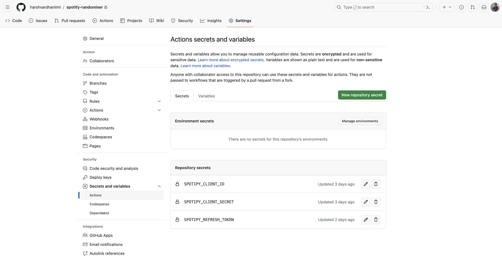

```{r echo=FALSE}
knitr::opts_chunk$set(eval = FALSE)
```


As of today, I have 3,455 songs in my liked songs in Spotify (kinda [Trippy](https://open.spotify.com/track/39PmNHf8HzUmhxrql2J6Rf?si=823380d6f55343ed) to say). Needless to say, I [really like](https://open.spotify.com/track/7heMX7gyHP0mhTlNgd7Lxd?si=fccfd1c68adc40d7) listening to songs. I have many playlists in my library but almost all playlists require my active attention to maintain.

I have maintained my playlists religiously. Historically. Not recently. I have grown reliant on Spotify's algorithm to suggest me songs. However, the reliance on algorithm has various pitfalls.

First, it tends to "predict" what songs I'm likely to not hit skip at. I am not sure that's a parameter I'd personally optimise for. I want to discover new songs. Discover Weekly has never satisfied me. They are way too weird for my taste. They're sometimes Tamil songs by artists that I listen to -- I'd skip them without second thoughts, simply because it's highly unlikely I'd enjoy it. (Though that's not universally true.)

Second, once Spotify learns what songs I like, it will recommend me the same ones over and over. Its algorithm is much better than YouTube for music but still, lacking in scope for me, when I am trying to explore from my own library.

Third, there are many songs that Spotify's algorithm recommended me or I Shazamed but have't listened to it at all since adding to my library. Spotify tends to play songs that are more recent in my library and have played them. Here's Spotify's nine year old article on how their [Shuffle](https://engineering.atspotify.com/2014/02/how-to-shuffle-songs/) works.

Long story short, I needed a way to handle it myself. I needed something that would:

1.  Look at my songs library and identify songs that I added to my library more than 90 days ago.
2.  Create a weighted sample from those songs. The longer the song has been in my library, the more likely it should be to be picked up.
3.  Randomly choose 100 songs from the weighted sample of all the old songs.
4.  Repeat the process every week so that I get 100 songs playlist every week.
5.  Automate all the above steps so that it all works automatically.

I designed a complete system for myself. The system will look through my library, identify the songs that I liked long ago (more than 90 days ago), create a weighted sample of them based on how old they are from today, and then draw 100 songs from it.

In case you are interested, here is how I did it. The complete code is at [Github](https://github.com/harshvardhaniimi/spotify-randomizer). In this blogpost, I am going to describe the major challenges, how I overcame them, and how you can create a similar automation service with your Spotify **for free**.

## How I Created My "Discovered" Weekly Playlist?

Spotify's API has several limitations on what can you get from it. The biggest one is that you cannot get more than 50 songs from any function call.

Therefore, I query songs one after another in smaller batches. Here is the code for the same.

```{python}
# Batching through songs, one "Verse" at a time
offset = 0
liked_songs = []
while True:
    batch = sp.current_user_saved_tracks(offset=offset)
    liked_songs += batch['items']
    if batch['next'] is None:
        break
    offset += len(batch['items'])
```

I was constantly debugging why was I only getting 50 songs at a time. Spotipy package on Python, much to my dismay, doesn't give any warning or even mention this limitation in their documentation. This way, I was able to get all 3000+ songs from library in a single object.

Filtering the songs that were older than 90 days wasn't hard. All I needed to do was get the song's added dates and calculate the age of songs in my library. The ninja-technique there was in handling the time-zones, as has been my [previous experience](https://www.harsh17.in/exploring-my-spotify-listening/) with Spotify when I was trying to understand my listening better.

### 🥂 Aging like fine wine, older songs get more weight

Once I got the time when they were added, I need a method to weight older songs higher than newer songs. Like I said, my primary complaint with Spotify was that it played the same songs for me every (damn) time. Thus, as a statistician, I had to take a weighted sample. The below approach is not the most efficient but probably the simplest.

```{python}
weighted_songs = []
for song in liked_songs:
    added_date = datetime.datetime.strptime(song['added_at'],
    "%Y-%m-%dT%H:%M:%SZ")
    
    # Add UTC timezone information
    added_date = added_date.replace(tzinfo=datetime.timezone.utc)
    age_days = (datetime.datetime.now(datetime.timezone.utc) - added_date).days
    
    if age_days > 90:
        weighted_songs += [song['track']['id']] * age_days
```

Following to getting the full list of pretentiously-serendipitous songs, I need to select 100 songs from that list. Easy peeasy.

```{python}
random.shuffle(weighted_songs)
selected_tracks = weighted_songs[:100]
```

Once I have the songs, I need to push it to a new playlist on Spotify. Since I want the entire process to repeat every Monday, it doesn't need to create a new playlist every week. Rather, if the playlist already exists, it should just replace it. When you delete a playlist in Spotify, it goes to "Trash Can" (sort of). I didn't want to clutter my trash can either.

If a playlist by that name already exists, the following code will delete all songs from it and then add 100 songs found this week.

```{python}
user_id = sp.me()['id']
playlist_name = 'random'
playlists = sp.user_playlists(user_id)
existing_playlist_id = None

# Check if a playlist with the same name already exists
for playlist in playlists['items']:
    if playlist['name'] == playlist_name:
        existing_playlist_id = playlist['id']
        break

# If it exists, clear the tracks
if existing_playlist_id:
    sp.playlist_replace_items(existing_playlist_id, [])
    playlist_id = existing_playlist_id
else:
    # If it doesn't exist, create a new one
    playlist = sp.user_playlist_create(user_id, playlist_name, 
      public=True, 
      description="This week's random songs that I haven't listened in a while")
    playlist_id = playlist['id']

# Add selected tracks to the playlist
sp.playlist_add_items(playlist_id, selected_tracks)
```

That's it! Getting the above code to execute wasn't very hard. Hardly took an hour from start to end. However, I realised the bottleneck.

If I only want to execute this process once. However, I wanted to automate it. It should do this every week, without me noticing it. This is where Github Actions comes into picture.

### 🤖 Getting it all automated...

Getting Github Actions to work with Spotipy was a big [automation](https://open.spotify.com/track/7heMX7gyHP0mhTlNgd7Lxd?si=fccfd1c68adc40d7) ask. You see, when you connect with Spotify's API with Spotipy, you have to use a browser. You provide your `client_id` and `client_secret` with `redirect_uri` (which needs to be `http://localhost:8000` or [something similar](https://community.spotify.com/t5/Spotify-for-Developers/Redirect-URI-needed/td-p/5067419)). Then, it opens a prompt saying "Do you authorize this app?" and you approve, then copy and paste the link in your VSCode tab. (Steps to get `client_id` and `client_secret` are near the end of this article.)

For the first time you run this, I think you need to do this. Once you approve the app, it creates a access token in your computer's cache memory. However, this token is not permanent. There is a separate refresh token that will make sure other tokens (primarily access token) don't get stale. This is interactive when it runs on your computer.

When running the code in Github actions, you don't have access to a persistent cache memory. There is no browser authentication. I was not the first one to run into [this issue](https://github.com/spotipy-dev/spotipy/issues/834). But I was able to solve this, again thanks to ChatGPT.

But first, we need the tokens for the first time.

### 🌓 Tokens for the first time

You will need to get the access tokens for the [first time](https://open.spotify.com/track/2Gl0FzuLxflY6nPifJp5Dr?si=47794e2e298c4d45). Run the [following script](https://github.com/harshvardhaniimi/spotify-randomizer/blob/main/notebook.ipynb) that gets the tokens.

```{python}
redirect_uri = "http://localhost:8000/"

auth_manager = SpotifyOAuth(client_id=client_id, client_secret=client_secret, redirect_uri=redirect_uri, scope="playlist-modify-public user-library-read user-read-recently-played")
token_info = auth_manager.get_access_token(as_dict=True)
```

`token_info` has the token you need. Keep it safe to put in Github's repository secrets.

From there on, I am able to create an OAuth2 object without the refresh token, thus no need for a browser authentication.[^1]

[^1]: I'm kinda confused on how access token and refresh token play with each other, so I'd appreciate your explanation if you know better.

```{python}
# Function to refresh access token
def refresh_access_token(refresh_token):
    client_id = os.environ['SPOTIPY_CLIENT_ID']
    client_secret = os.environ['SPOTIPY_CLIENT_SECRET']
    payload = {
        'grant_type': 'refresh_token',
        'refresh_token': refresh_token,
    }
    auth_header = {'Authorization': 'Basic ' + 
    base64.b64encode((client_id + ':' + client_secret).encode()).decode()}
    response = requests.post('https://accounts.spotify.com/api/token', 
    data=payload, headers=auth_header)
    return response.json().get('access_token')

client_id = os.environ['SPOTIPY_CLIENT_ID']
client_secret = os.environ['SPOTIPY_CLIENT_SECRET']
refresh_token = os.environ['SPOTIPY_REFRESH_TOKEN']
new_access_token = refresh_access_token(refresh_token)

# Set up Spotipy
sp = spotipy.Spotify(auth=new_access_token)
```

Essentially, the function uses a different approach to get the access token by making a raw POST query instead of using Spotipy. This works like a charm!

With all these steps, I was able to get the complete thematic working! Now, every monday morning, I wake up to a new playlist of 100 songs that I haven't listened in a while. What a wonderful way to start a week!

## 🌟 You have created something awesome. How do I use this?

Thanks, here are the steps. First, get your client ID and client secret from Spotify's developers dashboard.

### How to get Client ID and Client Secret?

Here's Spotify's documentation on how to get Client ID and Secret. [developer.spotify.com](https://developer.spotify.com/documentation/web-api/concepts/apps)

### Got it. Next?

Fork my repository on [Github](https://github.com/harshvardhaniimi/spotify-randomizer). Then, head over to Secrets and Variables, Actions and create these three repository secrets.



You should have the first two from your app and the last from the code snippet I asked you to execute earlier.

## [🫶 Humma, humma...](https://open.spotify.com/track/7heMX7gyHP0mhTlNgd7Lxd?si=fccfd1c68adc40d7) 

Now you are done! Eat a 🎂 to celebrate or have a cup of coffee ☕. To test that everything is working, head over to "Actions" tab on your repo, select "Create Randomized Spotify Playlist" workflow and click run workflow.

It should take around 1-2 minutes and you should see a new playlist on your Spotify library! Pro-tip: pin it for easy access.

## 🎧 My This Week's Random Playlist

<iframe style="border-radius:12px" src="https://open.spotify.com/embed/playlist/2DPl1wxg7xyhvZIAEa1Z7K?utm_source=generator" width="100%" height="352" frameBorder="0" allowfullscreen allow="autoplay; clipboard-write; encrypted-media; fullscreen; picture-in-picture" loading="lazy">

</iframe>
