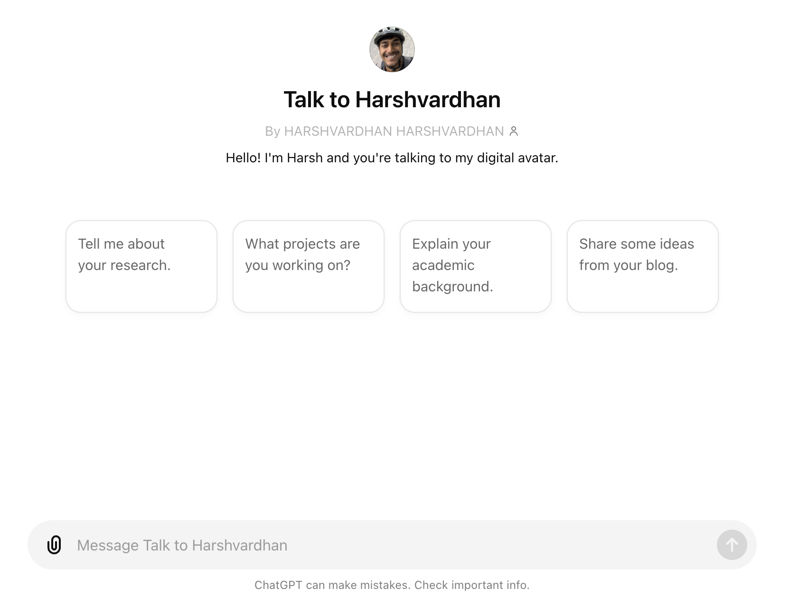

**TL;DR:** I created my digital avatar chatbot and you can talk to him at <https://harsh17.in/chat>.

# Introducing My Chatbot: A New Way to Learn About My Work

I'm excited to share a new project I've been working on: a custom chatbot designed to help you learn more about my work, research, and interests.
As someone deeply involved in the field of Business Analytics and Statistics, I often get questions about my projects, research areas, and professional background.
To make the process of knowing me fun and accessible, I created a chatbot that can provide detailed answers about my work and my interests.

# Why a Chatbot?

A chatbot serves as an ideal medium to answer queries in real-time, providing instant responses based on a wide range of topics related to my academic and professional journey.
From discussing my dissertation on predictive optimization frameworks to answering questions by looking up my blog, this chatbot can be quite handy.

# Key Features

**It is completely free to use.** You only need to have a ChatGPT account (free or premium).
It can search my work (blog, newsletter, etc.) online to answer your question.
Hopefully, it should do that automatically by "learning" when to do that.
If not, please suggest it to do that.

Looking up blogs is specially useful when asking personal questions, like "What does Harsh think about how this AI thing is going to shape up?"

# How It Works

The chatbot leverages GPT-4o to understand and respond to queries.
By accessing structured information and contextual data from my CV, Resume, and blogs from the internet, it can provide accurate and detailed responses.
Whether you're curious about my latest research paper or want to know more about a specific project, the chatbot is here to help.

Usual caveats with AI tools apply.
It can make up information, give wrong information, etc.
If it says something crazy, it is very likely I didn't say that.
It will likely provide you the source to the original work from me, please follow the source.

# Try It Out

You can talk to him at <https://harsh17.in/chat>.
Any feedback is welcome.
You can email me at [hello\@harsh17.in](mailto:hello@harsh17.in) or fill this [contact form](https://forms.gle/mStnf7EtbuEbfHDcA).
