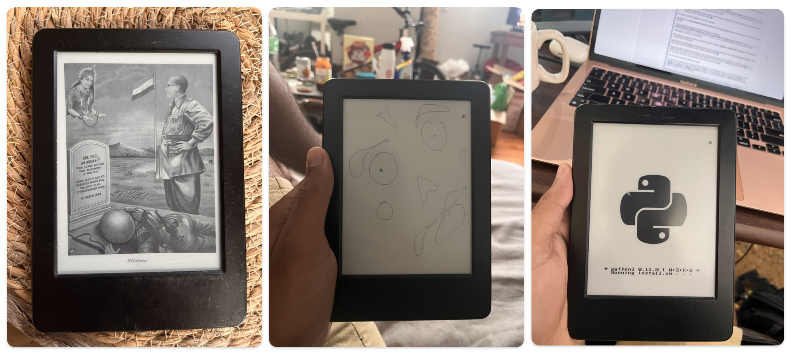
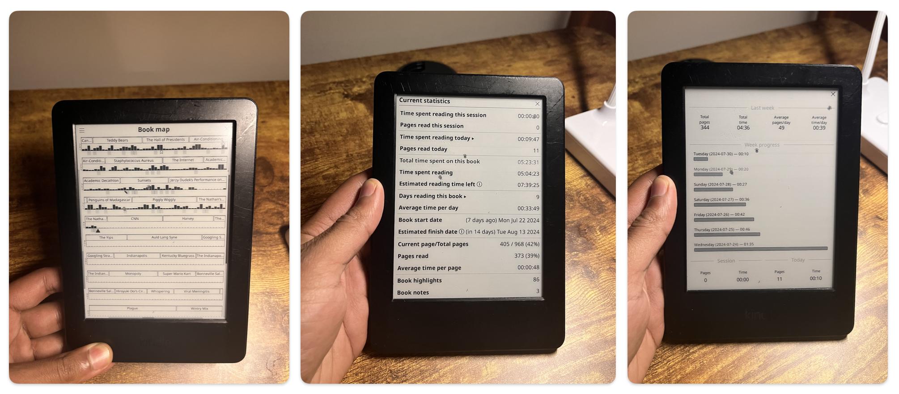

I never knew I could miss a piece of tech until I found myself longing for my old Kindle.
The compact 6" form factor that fit perfectly in my hand, easily slipped into my back pocket, and allowed me to read while walking was irreplaceable. The Kindle Scribe I upgraded to had its perks---now all my books and notebooks were with me all the time, no cloud sync needed. But, it was just too big to carry around all the time.

On a whim, I started looking for a replacement and found a Kindle 7th generation on eBay for \$30.
It lacked a backlight, but its small, lightweight design made it perfect for on-the-go reading.
(Though, my friends later snagged a Kindle Paperwhite for the same price, so maybe I overpaid a bit.)

With my new device in hand, I got curious---could I hack my Kindle?
Could I make it do more than it was designed to do?
I dove into the world of Kindle hacks and decided to jailbreak it, following detailed instructions on the [Mobileread forum](https://www.mobileread.com/forums/showthread.php?t=346037).
This allowed me to run Python, install apps like a hand-drawing tool, and even use a calculator on my Kindle.
("How-To" guide later.)

Additionally, I switched to using [KOReader](https://koreader.rocks/) instead of the default Kindle reader.
KOReader is a Kindle reader for nerds.
It offers more features and customization options, like a book map showing where I am in a book and reading analytics.

> *KOReader* is a document viewer for E Ink devices.
> Supported fileformats include EPUB, PDF, DjVu, XPS, CBT, CBZ, FB2, PDB, TXT, HTML, RTF, CHM, DOC, MOBI and ZIP files.
> It's available for Kindle, Kobo, PocketBook, Android and desktop Linux.

Full list of [KOReader features](https://github.com/koreader/koreader/wiki/Features-list) is here.

One of my favorite customizations was setting my own photo album as a screensaver.
The default screensavers are nice, but there's something special about seeing a random new, familiar photo every time I unlock my Kindle.

Since it's open-source and written in Lua, I even managed to modify it to block lockscreen ads---a simple yet satisfying tweak that kept my reading experience ad-free without paying Amazon's \$20 fee to remove ads.

Now, my Kindle feels truly mine, customized to my liking.



> My new Kindle is powerful.
> I have a collection of posters rotating as screensavers.
> I can draw.
> I can run Python scripts!



> Reading statistics on KOReader.

[Book maps](https://arc.net/l/quote/zaetaqeq) on KOReader show each chapter's length with titles like "Teddy Bears", "The Internet", "CNN", etc.
The dark bars are how much time I spent reading that section, shaded bars are my highlights, the triangle is current position.
It is a great example of data visualization and it makes me happy that its my own reading habits.

Other reading metrics, which can be analysed as daily, weekly, monthly metrics are amazing to have.
Contrast that with basic Kindle where none of such reading analytics are available.
Maybe something for the Amazon team?

## What is "jailbreaking"?

Jailbreaking is a process through which a user can get "admin" access to various functions of a device.
In practical terms, it gives you the ability to install apps on your Kindle.
You're not limited by what's allowed by Amazon on this device; rather, you are only limited by their low processing power.

Unlike Android or iPhones whose warranty gets void if you jailbreak them, and it is hard to "unjailbreak" them, jailbreaking on Kindle is quite risk-free.
Jailbreaking will only install a new app called [KUAL](https://www.mobileread.com/forums/showthread.php?t=203326) which is just an application launcher.
To "unjailbreak" a Kindle, you need to factory reset the device (Settings -\> Reset), and manually update your Kindle.
Plus, you never void any warranties.

**Nerdy Details:** Kindle isn't a very powerful device though.
It uses a Freescale i.MX6 SoloLite processor, which is a 1 GHz single-core ARM Cortex-A9 chip.
This processor is designed for low-power, high-efficiency applications, making it suitable for e-readers like the Kindle, which primarily handle text rendering and basic navigation tasks.

## Tutorial: How to Jailbreak?

I used [WatchThis](https://www.mobileread.com/forums/showthread.php?t=346037) tutorial for step by step instructions on jailbreaking my Kindle.
You will need a cable to connect your laptop to your Kindle and a working internet connection.

## How to remove ads?

When you buy a new Kindle, you have two options: buy a lockscreen ad-supported one or without it.
Typically, there is a price difference of \$20, which you can also pay later to remove the ads if you'd like.
The ads aren't intrusive; they're engaging and typically recommend you new books based on your reading/Goodreads history.

There used to be a time that you could call the customer care and request them to remove the ads, which they'd gladly do.
Not anymore.

Then, I realised I can create a [user patch](https://github.com/koreader/koreader/wiki/User-patches) with some [Lua code](https://github.com/koreader/koreader/issues/9992#issuecomment-1381062035) and lo behold there were no ads!
You should create a Lua file with the name as `2-i-m-not-special-need-no-offers.lua`:

```         
local Device = require("device")
Device.supportsScreensaver = function() return true end
Device.powerd:initWakeupMgr()
```

You can call it something else too but "2" in front is necessary.
Save this file inside `koreader\patches` folder.
(If you don't know what I'm talking about, know that you need to have jailbroken your Kindle AND installed KOReader already for this to work.)

## Some Book Shots

[Link to Are.na channel](https://www.are.na/harsh/book-shots).

## Sources

All related resources are in [this links folder](https://arc.net/folder/1DC73A1C-574D-4E88-86B7-5D655EB09F9E).
