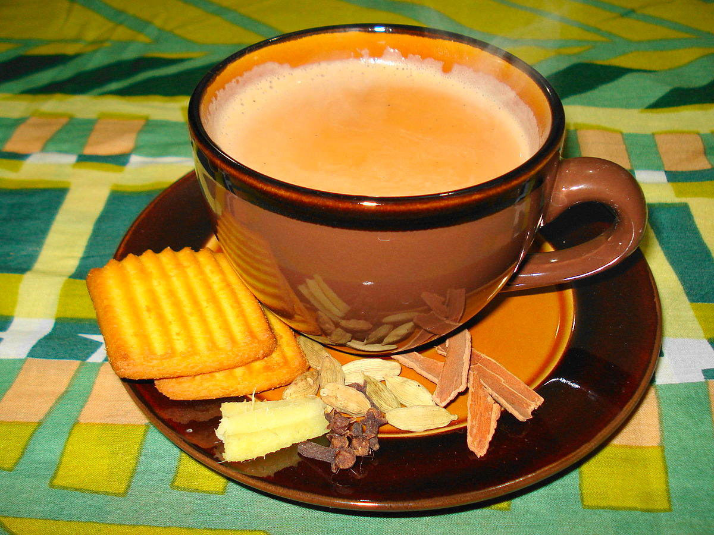
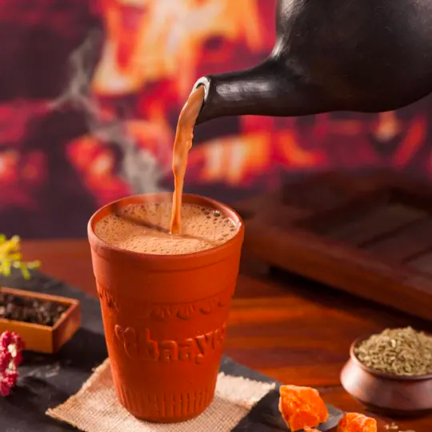
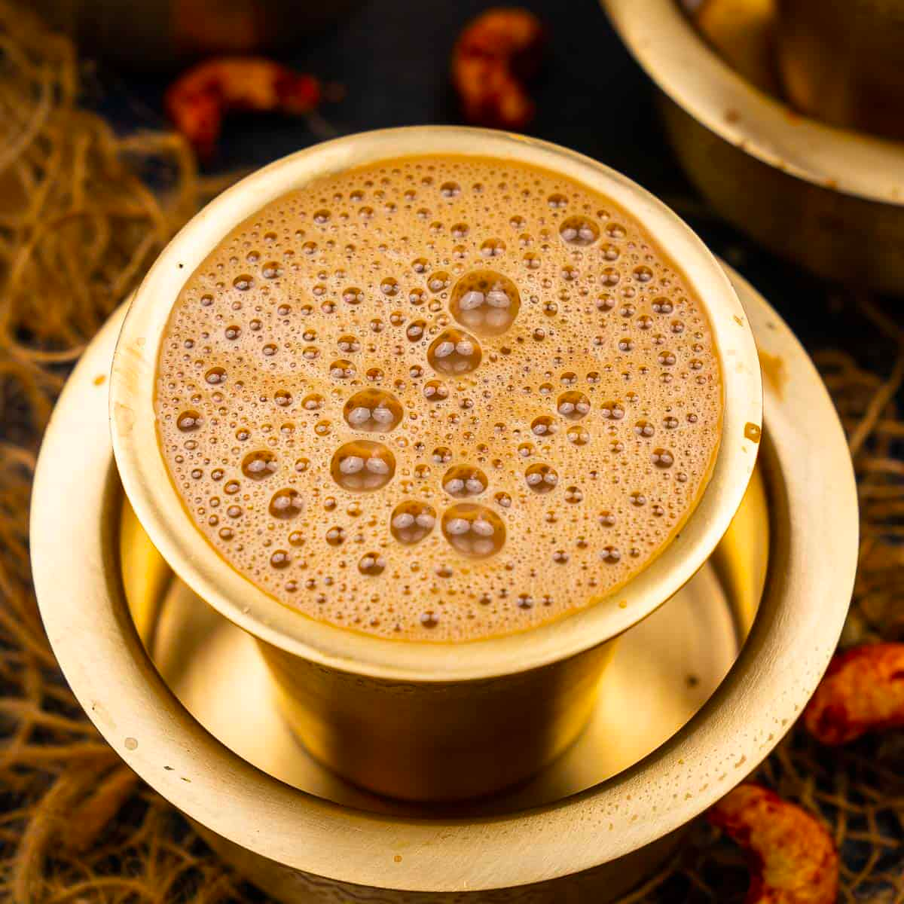
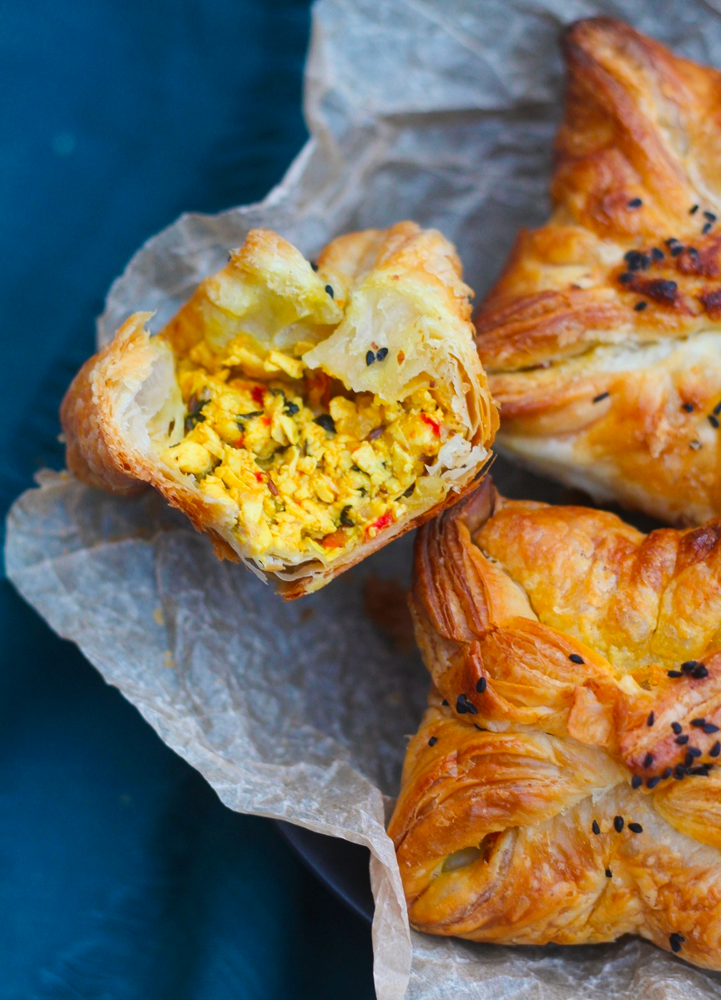
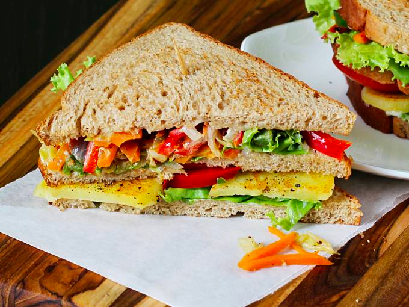
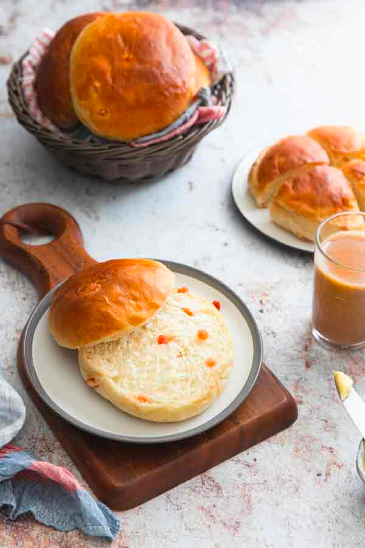

<script src="index_files/htmlwidgets/htmlwidgets.js"></script>
<link href="index_files/datatables-css/datatables-crosstalk.css" rel="stylesheet" />
<script src="index_files/datatables-binding/datatables.js"></script>
<script src="index_files/jquery/jquery-3.6.0.min.js"></script>
<link href="index_files/dt-core/css/jquery.dataTables.min.css" rel="stylesheet" />
<link href="index_files/dt-core/css/jquery.dataTables.extra.css" rel="stylesheet" />
<script src="index_files/dt-core/js/jquery.dataTables.min.js"></script>
<link href="index_files/crosstalk/css/crosstalk.min.css" rel="stylesheet" />
<script src="index_files/crosstalk/js/crosstalk.min.js"></script>
<script src="index_files/htmlwidgets/htmlwidgets.js"></script>
<link href="index_files/datatables-css/datatables-crosstalk.css" rel="stylesheet" />
<script src="index_files/datatables-binding/datatables.js"></script>
<script src="index_files/jquery/jquery-3.6.0.min.js"></script>
<link href="index_files/dt-core/css/jquery.dataTables.min.css" rel="stylesheet" />
<link href="index_files/dt-core/css/jquery.dataTables.extra.css" rel="stylesheet" />
<script src="index_files/dt-core/js/jquery.dataTables.min.js"></script>
<link href="index_files/nouislider/jquery.nouislider.min.css" rel="stylesheet" />
<script src="index_files/nouislider/jquery.nouislider.min.js"></script>
<link href="index_files/selectize/selectize.bootstrap3.css" rel="stylesheet" />
<script src="index_files/selectize/selectize.min.js"></script>
<link href="index_files/crosstalk/css/crosstalk.min.css" rel="stylesheet" />
<script src="index_files/crosstalk/js/crosstalk.min.js"></script>
<script src="index_files/htmlwidgets/htmlwidgets.js"></script>
<script src="index_files/plotly-binding/plotly.js"></script>
<script src="index_files/typedarray/typedarray.min.js"></script>
<script src="index_files/jquery/jquery.min.js"></script>
<link href="index_files/crosstalk/css/crosstalk.min.css" rel="stylesheet" />
<script src="index_files/crosstalk/js/crosstalk.min.js"></script>
<link href="index_files/plotly-htmlwidgets-css/plotly-htmlwidgets.css" rel="stylesheet" />
<script src="index_files/plotly-main/plotly-latest.min.js"></script>
<script src="index_files/htmlwidgets/htmlwidgets.js"></script>
<script src="index_files/plotly-binding/plotly.js"></script>
<script src="index_files/typedarray/typedarray.min.js"></script>
<script src="index_files/jquery/jquery.min.js"></script>
<link href="index_files/crosstalk/css/crosstalk.min.css" rel="stylesheet" />
<script src="index_files/crosstalk/js/crosstalk.min.js"></script>
<link href="index_files/plotly-htmlwidgets-css/plotly-htmlwidgets.css" rel="stylesheet" />
<script src="index_files/plotly-main/plotly-latest.min.js"></script>
<script src="index_files/htmlwidgets/htmlwidgets.js"></script>
<link href="index_files/vis/vis-network.min.css" rel="stylesheet" />
<script src="index_files/vis/vis-network.min.js"></script>
<script src="index_files/visNetwork-binding/visNetwork.js"></script>

# Context

In this lab session, I used the (anonymised) data from a project that I worked on in 2019.

CK is an Indian food and beverages chain with about 19 outlets in 5 cities. Their outlets are popular “hangout” places for young and old alike. People often go to their stores for meeting their friends, family or just getting their Chai-tea or coffee. Imagine a cafe, basically.

Their prices are not low for Indian standards but they aren’t a luxurious store either. They offer about 100 items at their store, though only about 20 generate most revenue.

Their two most popular items are the Chai (tea) and Coffee (which they like to call Kaapi). Chai can be of several types, depending on the spice in it. It could have ginger (Adrak) and be called Adrak Chai for example. In the table below, I’m providing some popular food items and their pictures/ details.

| Item                                                         | Description                                                                             | Picture                                                     |
|--------------------------------------------------------------|-----------------------------------------------------------------------------------------|-------------------------------------------------------------|
| Adrak Chai / Kadak Chai / Elaichi Chai / Other types of Chai | Chai-tea with Ginger / Chai-tea with strong spices / Chai-tea with Cardamom / etc.      |  |
| Kulhad Chai                                                  | Chai-tea served in earthen pot. Popular in Northern India, especially New Delhi         |                               |
| Indian Filter Kaapi                                          | Filter Coffee, popular in Southern India                                                |  |
| Paneer Puff                                                  | A croissant-like bread filled with Paneer (Indian cottage cheese)                       |  |
| Veg Club Sandwich                                            | Vegetarian sandwich with grated vegetables, cheese, etc.                                |  |
| Maska Bun                                                    | Bread and butter; commonly eaten with Chai                                              |  |
| Biryani                                                      | A slow-cooked rice dish made with Basmati rice, spices and choice of meat or vegetables |  |

# Data Analysis

You can find the dataset and codes on [my GitHub](https://github.com/harshvardhaniimi/bzan-542/tree/main/Association%20Mining%20LAB).

## Loading Packages and Setting Working Directory

Tidyverse for manipulation and visualisation. `arules` and `arulesViz` for association rules mining and visualisation. I like the theme `theme_clean()` from `ggthemes` package.

``` r
library(tidyverse)
```

    ## ── Attaching packages ─────────────────────────────────────── tidyverse 1.3.1 ──

    ## ✔ ggplot2 3.3.6.9000     ✔ purrr   0.3.4     
    ## ✔ tibble  3.1.7          ✔ dplyr   1.0.9     
    ## ✔ tidyr   1.2.0          ✔ stringr 1.4.1     
    ## ✔ readr   2.1.2          ✔ forcats 0.5.1

    ## ── Conflicts ────────────────────────────────────────── tidyverse_conflicts() ──
    ## ✖ dplyr::filter() masks stats::filter()
    ## ✖ dplyr::lag()    masks stats::lag()

``` r
library(arules)
```

    ## Loading required package: Matrix

    ## 
    ## Attaching package: 'Matrix'

    ## The following objects are masked from 'package:tidyr':
    ## 
    ##     expand, pack, unpack

    ## 
    ## Attaching package: 'arules'

    ## The following object is masked from 'package:dplyr':
    ## 
    ##     recode

    ## The following objects are masked from 'package:base':
    ## 
    ##     abbreviate, write

``` r
library(arulesViz)
library(DT)
theme_set(ggthemes::theme_clean())
```

## Loading Data

You can load the CSV data and then convert it to a list format as required by `arules` package. It will take about 3 minutes to process.

``` r
# NOT RUN
df = read_csv("CK_data_anon.csv") %>% 
   janitor::clean_names()
df1 = df %>% 
   select(invoice_name, item_name)


invoices = unique(df1$invoice_name)

all_items = list()

for (i in invoices)
{
   l = df1 %>% 
      filter(invoice_name == i) %>% 
      pull(item_name) %>% 
      as.character()
   
   all_items = append(all_items, list(l))
}
```

Here is how it looks. (Randomly sampling 200 entries; the complete data set is huge.)

``` r
read_csv("CK_data_anon.csv") %>% 
  janitor::clean_names() %>% 
  slice_sample(n = 200) %>% 
  datatable()
```

<div id="htmlwidget-1" style="width:100%;height:auto;" class="datatables html-widget"></div>
<script type="application/json" data-for="htmlwidget-1">{"x":{"filter":"none","vertical":false,"data":[["1","2","3","4","5","6","7","8","9","10","11","12","13","14","15","16","17","18","19","20","21","22","23","24","25","26","27","28","29","30","31","32","33","34","35","36","37","38","39","40","41","42","43","44","45","46","47","48","49","50","51","52","53","54","55","56","57","58","59","60","61","62","63","64","65","66","67","68","69","70","71","72","73","74","75","76","77","78","79","80","81","82","83","84","85","86","87","88","89","90","91","92","93","94","95","96","97","98","99","100","101","102","103","104","105","106","107","108","109","110","111","112","113","114","115","116","117","118","119","120","121","122","123","124","125","126","127","128","129","130","131","132","133","134","135","136","137","138","139","140","141","142","143","144","145","146","147","148","149","150","151","152","153","154","155","156","157","158","159","160","161","162","163","164","165","166","167","168","169","170","171","172","173","174","175","176","177","178","179","180","181","182","183","184","185","186","187","188","189","190","191","192","193","194","195","196","197","198","199","200"],["Inv_034560","Inv_032714","Inv_000956","Inv_053337","Inv_018370","Inv_054036","Inv_030837","Inv_038692","Inv_031578","Inv_032428","Inv_056540","Inv_034235","Inv_030729","Inv_048962","Inv_006336","Inv_032686","Inv_052601","Inv_019072","Inv_006409","Inv_011091","Inv_037506","Inv_044630","Inv_012332","Inv_041198","Inv_025699","Inv_052467","Inv_035675","Inv_009599","Inv_047469","Inv_033018","Inv_054938","Inv_049597","Inv_055055","Inv_030200","Inv_053689","Inv_029872","Inv_012270","Inv_026952","Inv_050166","Inv_048600","Inv_033108","Inv_052458","Inv_008855","Inv_024997","Inv_029612","Inv_026975","Inv_055880","Inv_042818","Inv_028519","Inv_019085","Inv_035702","Inv_019213","Inv_001696","Inv_047037","Inv_009004","Inv_031507","Inv_046937","Inv_007843","Inv_044099","Inv_011808","Inv_047733","Inv_045294","Inv_055014","Inv_007574","Inv_024862","Inv_038332","Inv_037929","Inv_001398","Inv_010570","Inv_034837","Inv_036823","Inv_016494","Inv_032632","Inv_039300","Inv_000985","Inv_042620","Inv_025726","Inv_052135","Inv_004737","Inv_053977","Inv_021833","Inv_034999","Inv_017638","Inv_056307","Inv_038099","Inv_040568","Inv_027454","Inv_027235","Inv_041444","Inv_035765","Inv_018107","Inv_012380","Inv_044743","Inv_041746","Inv_004108","Inv_008283","Inv_047843","Inv_013794","Inv_051038","Inv_024582","Inv_044624","Inv_041549","Inv_033050","Inv_040691","Inv_020832","Inv_034710","Inv_009140","Inv_009273","Inv_020327","Inv_037057","Inv_040277","Inv_020759","Inv_009414","Inv_055378","Inv_030938","Inv_049835","Inv_013193","Inv_022070","Inv_044256","Inv_052482","Inv_038296","Inv_016415","Inv_032367","Inv_002290","Inv_008147","Inv_019959","Inv_038057","Inv_016919","Inv_038026","Inv_009295","Inv_040502","Inv_042297","Inv_016389","Inv_023156","Inv_035656","Inv_031229","Inv_003444","Inv_035344","Inv_049806","Inv_015811","Inv_056603","Inv_048591","Inv_011925","Inv_027484","Inv_035425","Inv_013918","Inv_040309","Inv_037847","Inv_004072","Inv_030577","Inv_021800","Inv_050109","Inv_011611","Inv_003665","Inv_016480","Inv_009567","Inv_050517","Inv_051321","Inv_047989","Inv_054307","Inv_006539","Inv_030839","Inv_044336","Inv_034064","Inv_031975","Inv_010273","Inv_050191","Inv_039683","Inv_052819","Inv_022279","Inv_001811","Inv_013935","Inv_036211","Inv_032617","Inv_053547","Inv_046012","Inv_020777","Inv_033408","Inv_040694","Inv_006926","Inv_029811","Inv_041458","Inv_014313","Inv_010840","Inv_012259","Inv_005591","Inv_023720","Inv_011312","Inv_024194","Inv_030146","Inv_005961","Inv_053917","Inv_001790","Inv_033586","Inv_010400","Inv_022506","Inv_021690","Inv_040819","Inv_038789","Inv_047925"],["5/6/18","4/20/18","9/25/17","9/3/17","1/10/18","9/13/17","4/6/18","6/14/18","4/11/18","4/18/18","7/10/17","5/3/18","4/5/18","9/17/18","10/30/17","8/1/17","8/29/17","1/14/18","10/30/17","11/25/17","6/2/18","8/12/18","12/3/17","7/10/18","2/28/18","8/28/17","5/15/18","7/17/17","9/5/18","4/22/18","9/18/17","9/23/18","9/7/17","4/1/18","9/5/17","3/29/18","12/3/17","3/9/18","9/28/18","9/14/18","4/23/18","8/28/17","11/12/17","2/23/18","3/27/18","7/29/17","7/1/17","7/26/18","3/19/18","1/14/18","5/16/18","1/15/18","9/29/17","9/1/18","11/13/17","4/11/18","9/1/18","11/7/17","8/7/18","11/30/17","9/7/18","8/18/18","9/19/17","7/16/17","2/22/18","6/10/18","6/6/18","9/27/17","11/22/17","5/8/18","5/26/18","7/22/17","4/19/18","8/6/17","9/25/17","7/24/18","2/28/18","8/25/17","10/21/17","9/13/17","2/1/18","5/10/18","7/22/17","7/9/17","6/8/18","7/3/18","3/12/18","3/11/18","7/13/18","5/16/18","1/8/18","12/3/17","8/13/18","7/16/18","10/15/17","11/9/17","9/8/18","12/12/17","8/17/17","7/27/17","8/12/18","7/14/18","4/23/18","7/5/18","1/25/18","5/7/18","11/14/17","11/14/17","1/22/18","5/28/18","6/30/18","7/24/17","11/15/17","9/9/17","4/6/18","9/25/18","12/8/17","2/3/18","8/9/18","8/28/17","6/9/18","12/29/17","4/17/18","10/3/17","11/9/17","1/20/18","6/7/18","1/1/18","8/5/17","11/15/17","7/2/18","7/21/18","12/28/17","2/10/18","5/15/18","4/9/18","10/11/17","5/13/18","9/25/18","12/24/17","7/11/17","9/14/18","11/30/17","3/13/18","5/13/18","12/13/17","7/1/18","6/5/18","10/15/17","4/3/18","2/1/18","9/27/18","11/28/17","10/12/17","12/29/17","11/16/17","8/13/17","8/19/17","9/9/18","9/15/17","7/15/17","4/6/18","8/9/18","5/1/18","4/14/18","11/20/17","9/28/18","6/24/18","7/9/17","2/4/18","9/30/17","12/13/17","5/20/18","4/19/18","9/4/17","8/23/18","1/25/18","4/26/18","7/5/18","11/2/17","3/29/18","7/13/18","12/16/17","11/24/17","12/2/17","10/26/17","2/14/18","11/26/17","2/17/18","3/31/18","10/28/17","9/12/17","9/30/17","4/27/18","11/21/17","2/5/18","1/31/18","7/7/18","6/15/18","9/9/18"],["Bhayankar Thandi Chai","Biryani","Speaciali-Teas","Kaapi","Raw material","Chai","Kaapi","Chai","Chai","Chai","Kaapi","Shakes","Coolers","Kaapi","Kaapi","Bakery","Zara Hatke","Chai","Chai","Chai","Chai","Biryani","Chai","Chai","Ice Kaapi","Extras","Shakes","Kaapi","Extras","Chai","Chai","Maggi","Chai","Kaapi","Maggi","Maggi","Fries","Pasta","Shakes","Kaapi","Shakes","Extras","Maggi","Kaapi","Kaapi","Sandwich","Smoothies","Sandwich","Shakes","Kaapi","Extras","Bhayankar Thandi Chai","Biryani","Chai","Chai","Bhayankar Thandi Chai","Sandwich","Fries","Maggi","Extras","Chai","Kaapi","Chai","Chai","Bakery","Chai","Sandwich","Kaapi","Smoothies","Sandwich","Extras","Ice Kaapi","Chai","Sandwich","Coolers","Fries","Bakery","Chai","Biryani","Sandwich","Chai","Chai","Chai","Burger","Extras","Extras","Chai","Extras","Chai","Extras","Chai","Extras","Sandwich","Sandwich","Kaapi","Extras","Extras","Chai","Chai","Extras","Kaapi","Extras","Bhayankar Thandi Chai","Milk &amp; Chocolate","Zara Hatke","Bhayankar Thandi Chai","Bakery","Kaapi","Kaapi","Kaapi","Chai","Bakery","Bakery","Coolers","Sandwich","Bakery","Kaapi","Sandwich","Kaapi","Bhayankar Thandi Chai","Extras","Kaapi","Chai","Chai","Kaapi","Chai","Extras","Chai","Biryani","Extras","Extras","Chai","Sandwich","Chai","Bakery","Slush","Chai","Sandwich","Extras","Biryani","Chai","Fries","Raw material","Extras","Speaciali-Teas","Extras","Kaapi","Extras","Bhurji","Pasta","Chai","Zara Hatke","Chai","Biryani","Sandwich","Maggi","Chai","Extras","Coolers","Chai","Extras","Shakes","Bakery","Chai","Maggi","Chai","Chai","Burger","Extras","Kaapi","Chai","Kaapi","Shakes","Ice Kaapi","Speaciali-Teas","Sandwich","Chai","Bhayankar Thandi Chai","Smoothies","Chai","Chai","Shakes","Zara Hatke","Chai","Extras","Extras","soup","Extras","Chai","Kaapi","Chai","Chai","Sandwich","Chai","Extras","Chai","Shakes","Chai","Bhayankar Thandi Chai","Extras"],["22","73","13","76","RM262","6","77","7","4","4","76","167","272","76","76","109","58","5","4","4","4","73","4","10","82","93","45","76","93","4","6","39","4","76","42","42","62","71","119","77","167","93","39","76","76","32","51","35","45","76","108","22","174","4","6","22","33","62","38","98","6","76","1","4","109","6","35","76","49","30","93","81","6","33","54","173","106","6","73","32","4","4","5","25","93","96","4","93","7","282","6","93","35","32","122","93","93","5","1","93","76","93","23","261","57","22","106","78","76","76","6","107","109","121","252","125","77","35","76","22","93","76","6","6","76","7","282","6","73","93","93","4","35","4","106","86","4","35","93","174","9","62","RM262","93","17","93","76","93","226","71","12","64","4","174","252","42","4","93","52","6","93","273","125","4","42","6","6","26","94","76","6","76","45","80","16","35","4","22","49","4","253","45","64","124","98","93","251","93","6","76","6","6","117","4","99","124","167","6","22","93"],["Lemon Ice Tea","Veg Biryani","Green Tea","Indian Filter Kaapi","Small Kulladh","Adrak Chai","Indian Filter Kaapi Large","Masala Chai","Kadak Chai","Kadak Chai","Indian Filter Kaapi","CK Brownie Blast","Aam Panna","Indian Filter Kaapi","Indian Filter Kaapi","Corn Puff","Indori Upma","Elaichi Chai","Kadak Chai","Kadak Chai","Kadak Chai","Veg Biryani","Kadak Chai","Chocolate Chai","Vanilla Kaapi","Water Bottle 500 ML","Chocolate Shake","Indian Filter Kaapi","Water Bottle 500 ML","Kadak Chai","Adrak Chai","Burnt Garlic Maggi","Kadak Chai","Indian Filter Kaapi","Italian Noodles","Italian Noodles","French Fries – Piri Piri","White Sauce Pasta","Oreo Shake","Indian Filter Kaapi Large","CK Brownie Blast","Water Bottle 500 ML","Burnt Garlic Maggi","Indian Filter Kaapi","Indian Filter Kaapi","Exotic Corn Mayo","Berry Blast","Veg Club","Chocolate Shake","Indian Filter Kaapi","Bana Ke","Lemon Ice Tea","Employee Meal","Kadak Chai","Adrak Chai","Lemon Ice Tea","Cheese Chutney","French Fries – Piri Piri","Desi Noodle","Extra IFC Decoaction","Adrak Chai","Indian Filter Kaapi","Kadak Chai","Kadak Chai","Corn Puff","Adrak Chai","Veg Club","Indian Filter Kaapi","Kiwi Mint Banana","Egg Sandwich","Water Bottle 500 ML","Frappe","Adrak Chai","Cheese Chutney","Apple Mojito","French fries - Salted","Paneer Puff","Adrak Chai","Veg Biryani","Exotic Corn Mayo","Kadak Chai","Kadak Chai","Elaichi Chai","Egg Burger","Water Bottle 500 ML","Extra Cheese Grated","Kadak Chai","Water Bottle 500 ML","Masala Chai","Soda","Adrak Chai","Water Bottle 500 ML","Veg Club","Exotic Corn Mayo","Americano","Water Bottle 500 ML","Water Bottle 500 ML","Elaichi Chai","Kadak Chai","Water Bottle 500 ML","Indian Filter Kaapi","Water Bottle 500 ML","Peach Ice Tea","Hot Chocolate Small","Mexican Bhel Poori","Lemon Ice Tea","Paneer Puff","Sultan’s Kaapi","Indian Filter Kaapi","Indian Filter Kaapi","Adrak Chai","Baked Samosa","Corn Puff","CK Nimbu Pani","Paneer Sandwich","Maska Bun","Indian Filter Kaapi Large","Veg Club","Indian Filter Kaapi","Lemon Ice Tea","Water Bottle 500 ML","Indian Filter Kaapi","Adrak Chai","Adrak Chai","Indian Filter Kaapi","Masala Chai","Soda","Adrak Chai","Veg Biryani","Water Bottle 500 ML","Water Bottle 500 ML","Kadak Chai","Veg Club","Kadak Chai","Paneer Puff","Mango Slush","Kadak Chai","Veg Club","Water Bottle 500 ML","Employee Meal","Cinnamon Chai","French Fries – Piri Piri","Small Kulladh","Water Bottle 500 ML","Green Tea Lemon","Water Bottle 500 ML","Indian Filter Kaapi","Water Bottle 500 ML","Paneer Bhurji","White Sauce Pasta","Extra Elaichi Flavor","Chilli Garlic Cheese Toast","Kadak Chai","Employee Meal","Paneer Sandwich","Italian Noodles","Kadak Chai","Water Bottle 500 ML","Masala Lemonade","Adrak Chai","Water Bottle 500 ML","Kit Kat Shake","Maska Bun","Kadak Chai","Italian Noodles","Adrak Chai","Adrak Chai","Mr Fresher","Water Bottle 1 Ltr","Indian Filter Kaapi","Adrak Chai","Indian Filter Kaapi","Chocolate Shake","Thandi Kaapi","Kashmiri Kahwa","Veg Club","Kadak Chai","Lemon Ice Tea","Kiwi Mint Banana","Kadak Chai","Kulladh Chai","Chocolate Shake","Chilli Garlic Cheese Toast","Irani Chai","Extra IFC Decoaction","Water Bottle 500 ML","Sweet Corn Soup","Water Bottle 500 ML","Adrak Chai","Indian Filter Kaapi","Adrak Chai","Adrak Chai","Garlic Butter Bread Spread","Kadak Chai","Extra Dip","Irani Chai","CK Brownie Blast","Adrak Chai","Lemon Ice Tea","Water Bottle 500 ML"],[80,120,60,30,10,40,60,40,30,30,30,150,60,30,30,30,80,40,30,30,30,120,30,40,120,10,120,30,10,30,40,120,30,30,120,120,80,200,120,71,150,10,120,30,30,120,100,120,120,30,20,80,0,0,40,80,120,80,120,10,40,30,30,30,30,40,120,30,120,120,10,120,40,120,100,80,30,40,120,120,30,10,40,100,10,25,30,10,40,10,40,10,120,120,30,10,10,40,30,10,30,10,80,60,80,80,30,40,30,30,40,30,30,80,120,50,60,120,30,80,10,30,40,40,30,40,10,40,120,10,10,30,120,30,30,80,30,120,10,0,40,80,10,10,60,10,30,10,90,200,10,100,0,0,120,120,30,10,80,40,10,180,50,30,120,40,40,100,20,30,40,30,120,100,60,120,0,80,120,30,40,120,100,40,10,10,49,10,40,30,40,40,40,30,20,40,150,40,80,10]],"container":"<table class=\"display\">\n  <thead>\n    <tr>\n      <th> <\/th>\n      <th>invoice_name<\/th>\n      <th>invoice_date<\/th>\n      <th>category<\/th>\n      <th>item_code<\/th>\n      <th>item_name<\/th>\n      <th>price<\/th>\n    <\/tr>\n  <\/thead>\n<\/table>","options":{"columnDefs":[{"className":"dt-right","targets":6},{"orderable":false,"targets":0}],"order":[],"autoWidth":false,"orderClasses":false}},"evals":[],"jsHooks":[]}</script>

Or, you can directly import the list file I created for you after processing it. (I’m using permalink from GitHub repo for this.)

``` r
df = readRDS("CK_data_anon.RDS")
```

# Getting Ready for Analysis

All analysis with association rules has to be done on a list item. See `?transactions` for more details.

Converting the `df` to transactions file.

``` r
trans = transactions(df)
```

    ## Warning in asMethod(object): removing duplicated items in transactions

Let’s see a summary of what we have.

``` r
summary(trans)
```

    ## transactions as itemMatrix in sparse format with
    ##  56737 rows (elements/itemsets/transactions) and
    ##  211 columns (items) and a density of 0.00928914 
    ## 
    ## most frequent items:
    ##          Kadak Chai Water Bottle 500 ML          Adrak Chai Indian Filter Kaapi 
    ##               13910               10986                9748                8935 
    ##        Elaichi Chai             (Other) 
    ##                3301               64325 
    ## 
    ## element (itemset/transaction) length distribution:
    ## sizes
    ##     1     2     3     4     5     6     7     8     9    10    11    12    13 
    ## 24890 18374  7980  3315  1361   508   153    87    28    16    11     6     3 
    ##    17    19    20    30 
    ##     2     1     1     1 
    ## 
    ##    Min. 1st Qu.  Median    Mean 3rd Qu.    Max. 
    ##    1.00    1.00    2.00    1.96    2.00   30.00 
    ## 
    ## includes extended item information - examples:
    ##            labels
    ## 1       Aam Panna
    ## 2      Adrak Chai
    ## 3 Adrak Chai Full

Let’s look at the most frequent items. Note that on the y-axis, we have the **Support**.

``` r
itemFrequencyPlot(trans,topN = 20)
```

}}index_files/figure-html/unnamed-chunk-8-1.png" width="672" />

Another way to visualise the data.

``` r
ggplot(
  tibble(
    Support = sort(itemFrequency(trans, type = "absolute"), decreasing = TRUE),
    Item = seq_len(ncol(trans))
  ), aes(x = Item, y = Support)) + geom_line()
```

}}index_files/figure-html/unnamed-chunk-9-1.png" width="672" />

You can note that the most popular items are very popular and the rest of the items are not as popular.

### Number of Possible Associations

For this dataset, the number of possible associations is huge. But how much exactly?

``` r
2^ncol(trans)
```

    ## [1] 3.291009e+63

Woah.

## Frequent Itemsets

Let’s try to find the frequent itemsets.

``` r
its = apriori(trans, parameter=list(target = "frequent"))
```

    ## Apriori
    ## 
    ## Parameter specification:
    ##  confidence minval smax arem  aval originalSupport maxtime support minlen
    ##          NA    0.1    1 none FALSE            TRUE       5     0.1      1
    ##  maxlen            target  ext
    ##      10 frequent itemsets TRUE
    ## 
    ## Algorithmic control:
    ##  filter tree heap memopt load sort verbose
    ##     0.1 TRUE TRUE  FALSE TRUE    2    TRUE
    ## 
    ## Absolute minimum support count: 5673 
    ## 
    ## set item appearances ...[0 item(s)] done [0.00s].
    ## set transactions ...[211 item(s), 56737 transaction(s)] done [0.00s].
    ## sorting and recoding items ... [4 item(s)] done [0.00s].
    ## creating transaction tree ... done [0.00s].
    ## checking subsets of size 1 2 done [0.00s].
    ## sorting transactions ... done [0.00s].
    ## writing ... [4 set(s)] done [0.00s].
    ## creating S4 object  ... done [0.00s].

``` r
its
```

    ## set of 4 itemsets

**Support** is a parameter that needs to be optimised. To see all parameters that can be optimised, see `?ASparameter`.

The lower the support parameter, the higher the number of itemsets you can generate. For large datasets, you should start from higher support values and make your way down. In this case, I tried several values and found 0.1 gave me 4 itemsets, 0.01 gave me 52 itemsets, 0.005 gave me 104 itemsets, and 0.001 gave me 440 itemsets.

It will be your call to choose the right value of support.

``` r
its = apriori(trans, parameter=list(target = "frequent", support = 0.001))
```

    ## Apriori
    ## 
    ## Parameter specification:
    ##  confidence minval smax arem  aval originalSupport maxtime support minlen
    ##          NA    0.1    1 none FALSE            TRUE       5   0.001      1
    ##  maxlen            target  ext
    ##      10 frequent itemsets TRUE
    ## 
    ## Algorithmic control:
    ##  filter tree heap memopt load sort verbose
    ##     0.1 TRUE TRUE  FALSE TRUE    2    TRUE
    ## 
    ## Absolute minimum support count: 56 
    ## 
    ## set item appearances ...[0 item(s)] done [0.00s].
    ## set transactions ...[211 item(s), 56737 transaction(s)] done [0.00s].
    ## sorting and recoding items ... [123 item(s)] done [0.00s].
    ## creating transaction tree ... done [0.01s].
    ## checking subsets of size 1 2 3 4 done [0.00s].
    ## sorting transactions ... done [0.01s].
    ## writing ... [440 set(s)] done [0.00s].
    ## creating S4 object  ... done [0.00s].

``` r
its
```

    ## set of 440 itemsets

Let’s see what we find.

``` r
its = sort(its, by = "support")
inspect(head(its, n = 10))
```

    ##      items                             support    count
    ## [1]  {Kadak Chai}                      0.24516629 13910
    ## [2]  {Water Bottle 500 ML}             0.19363026 10986
    ## [3]  {Adrak Chai}                      0.17181028  9748
    ## [4]  {Indian Filter Kaapi}             0.15748101  8935
    ## [5]  {Elaichi Chai}                    0.05818073  3301
    ## [6]  {Lemon Ice Tea}                   0.04642473  2634
    ## [7]  {Kadak Chai, Water Bottle 500 ML} 0.04379858  2485
    ## [8]  {Masala Chai}                     0.03985054  2261
    ## [9]  {Paneer Puff}                     0.03831715  2174
    ## [10] {Extra Cheese Grated}             0.03646650  2069

Let’s see how many items are brought together.

``` r
ggplot(tibble(`Itemset Size` = factor(size(its))), aes(`Itemset Size`)) + geom_bar()
```

}}index_files/figure-html/unnamed-chunk-14-1.png" width="672" />

Most itemsets are of size two, followed by single items.

### Let’s see the most popular “couples”.

``` r
inspect(its[size(its) == 2])
```

    ##       items                             support count
    ## [1]   {Kadak Chai,                                   
    ##        Water Bottle 500 ML}         0.043798579  2485
    ## [2]   {Adrak Chai,                                   
    ##        Water Bottle 500 ML}         0.031372825  1780
    ## [3]   {Indian Filter Kaapi,                          
    ##        Water Bottle 500 ML}         0.027407159  1555
    ## [4]   {Indian Filter Kaapi,                          
    ##        Kadak Chai}                  0.025239262  1432
    ## [5]   {Employee Meal,                                
    ##        Kadak Chai}                  0.018700319  1061
    ## [6]   {Adrak Chai,                                   
    ##        Extra Elaichi Flavor}        0.017819060  1011
    ## [7]   {Adrak Chai,                                   
    ##        Kadak Chai}                  0.015774539   895
    ## [8]   {Adrak Chai,                                   
    ##        Indian Filter Kaapi}         0.015439660   876
    ## [9]   {Kadak Chai,                                   
    ##        Maska Bun}                   0.011667871   662
    ## [10]  {Indian Filter Kaapi Large,                    
    ##        Water Bottle 500 ML}         0.010451733   593
    ## [11]  {Elaichi Chai,                                 
    ##        Water Bottle 500 ML}         0.010345982   587
    ## [12]  {Extra Cheese Grated,                          
    ##        Water Bottle 500 ML}         0.010099230   573
    ## [13]  {Adrak Chai,                                   
    ##        Elaichi Chai}                0.009552849   542
    ## [14]  {Paneer Puff,                                  
    ##        Water Bottle 500 ML}         0.009535224   541
    ## [15]  {Lemon Ice Tea,                                
    ##        Water Bottle 500 ML}         0.008336711   473
    ## [16]  {Elaichi Chai,                                 
    ##        Kadak Chai}                  0.007614079   432
    ## [17]  {Kadak Chai,                                   
    ##        Paneer Puff}                 0.007120574   404
    ## [18]  {Masala Chai,                                  
    ##        Water Bottle 500 ML}         0.007050073   400
    ## [19]  {Adrak Chai,                                   
    ##        Maska Bun}                   0.007014823   398
    ## [20]  {CK Sandwich,                                  
    ##        Water Bottle 500 ML}         0.006820946   387
    ## [21]  {Adrak Chai,                                   
    ##        Extra Cheese Grated}         0.006627069   376
    ## [22]  {Extra Cheese Grated,                          
    ##        Veg Club}                    0.006538943   371
    ## [23]  {CK Sandwich,                                  
    ##        Extra Cheese Grated}         0.006433192   365
    ## [24]  {Bana Ke,                                      
    ##        Paneer Puff}                 0.005745810   326
    ## [25]  {Italian Noodles,                              
    ##        Water Bottle 500 ML}         0.005728184   325
    ## [26]  {French Fries – Piri Piri,                   
    ##        Water Bottle 500 ML}         0.005534307   314
    ## [27]  {Exotic Corn Mayo,                             
    ##        Extra Cheese Grated}         0.005305180   301
    ## [28]  {Elaichi Chai,                                 
    ##        Indian Filter Kaapi}         0.005199429   295
    ## [29]  {Adrak Chai,                                   
    ##        Masala Chai}                 0.005146553   292
    ## [30]  {Adrak Chai,                                   
    ##        CK Sandwich}                 0.005111303   290
    ## [31]  {Indian Filter Kaapi,                          
    ##        Paneer Puff}                 0.005111303   290
    ## [32]  {Exotic Corn Mayo,                             
    ##        Water Bottle 500 ML}         0.005093678   289
    ## [33]  {Adrak Chai,                                   
    ##        French Fries – Piri Piri}  0.005093678   289
    ## [34]  {Kadak Chai,                                   
    ##        Lemon Ice Tea}               0.004987927   283
    ## [35]  {Adrak Chai,                                   
    ##        Lemon Ice Tea}               0.004846925   275
    ## [36]  {Veg Biryani,                                  
    ##        Water Bottle 500 ML}         0.004794050   272
    ## [37]  {Cheese Chutney,                               
    ##        Water Bottle 500 ML}         0.004758799   270
    ## [38]  {Extra Cheese Grated,                          
    ##        Nachos with Dip}             0.004741174   269
    ## [39]  {Indian Filter Kaapi,                          
    ##        Indian Filter Kaapi Large}   0.004582548   260
    ## [40]  {Veg Club,                                     
    ##        Water Bottle 500 ML}         0.004582548   260
    ## [41]  {Adrak Chai,                                   
    ##        Veg Club}                    0.004547297   258
    ## [42]  {Indori Upma,                                  
    ##        Water Bottle 500 ML}         0.004423921   251
    ## [43]  {Adrak Chai,                                   
    ##        Exotic Corn Mayo}            0.004423921   251
    ## [44]  {Adrak Chai,                                   
    ##        Paneer Puff}                 0.004423921   251
    ## [45]  {CK Sandwich,                                  
    ##        Kadak Chai}                  0.004318170   245
    ## [46]  {Extra Cheese Grated,                          
    ##        White Sauce Pasta}           0.004300545   244
    ## [47]  {Adrak Chai,                                   
    ##        Italian Noodles}             0.004177168   237
    ## [48]  {Extra Elaichi Flavor,                         
    ##        Water Bottle 500 ML}         0.004124293   234
    ## [49]  {Adrak Chai,                                   
    ##        Chilli Garlic Cheese Toast}  0.004089042   232
    ## [50]  {Maska Bun,                                    
    ##        Water Bottle 500 ML}         0.004089042   232
    ## [51]  {Adrak Chai,                                   
    ##        Cheese Chutney}              0.004071417   231
    ## [52]  {Water Bottle 500 ML,                          
    ##        White Sauce Pasta}           0.004018542   228
    ## [53]  {Desi Noodle,                                  
    ##        Water Bottle 500 ML}         0.004000917   227
    ## [54]  {Extra Cheese Grated,                          
    ##        Kadak Chai}                  0.003965666   225
    ## [55]  {Adrak Chai,                                   
    ##        Small Kulladh}               0.003824665   217
    ## [56]  {Extra Cheese Grated,                          
    ##        Indian Filter Kaapi}         0.003807039   216
    ## [57]  {Chocolate Kaapi,                              
    ##        Water Bottle 500 ML}         0.003754164   213
    ## [58]  {Kadak Chai,                                   
    ##        Veg Club}                    0.003754164   213
    ## [59]  {Indori Upma,                                  
    ##        Kadak Chai}                  0.003736539   212
    ## [60]  {Indian Filter Kaapi,                          
    ##        Masala Chai}                 0.003666038   208
    ## [61]  {French Fries – Piri Piri,                   
    ##        Kadak Chai}                  0.003630788   206
    ## [62]  {French Fries – Piri Piri,                   
    ##        Indian Filter Kaapi}         0.003542662   201
    ## [63]  {Chilli Garlic Cheese Toast,                   
    ##        Water Bottle 500 ML}         0.003525037   200
    ## [64]  {Masala Omlette,                               
    ##        Water Bottle 500 ML}         0.003454536   196
    ## [65]  {Extra IFC Decoaction,                         
    ##        Indian Filter Kaapi}         0.003419285   194
    ## [66]  {Exotic Corn Mayo,                             
    ##        Kadak Chai}                  0.003278284   186
    ## [67]  {Kadak Chai,                                   
    ##        Masala Omlette}              0.003225408   183
    ## [68]  {Indian Filter Kaapi,                          
    ##        Lemon Ice Tea}               0.003190158   181
    ## [69]  {Italian Noodles,                              
    ##        Kadak Chai}                  0.003137283   178
    ## [70]  {Kadak Chai,                                   
    ##        Masala Chai}                 0.003137283   178
    ## [71]  {Adrak Chai,                                   
    ##        Indori Upma}                 0.003066782   174
    ## [72]  {Indian Filter Kaapi,                          
    ##        Italian Noodles}             0.003066782   174
    ## [73]  {Cheese Chutney,                               
    ##        Kadak Chai}                  0.003013906   171
    ## [74]  {Frappe,                                       
    ##        Water Bottle 500 ML}         0.002961031   168
    ## [75]  {Elaichi Chai,                                 
    ##        Paneer Puff}                 0.002961031   168
    ## [76]  {Egg Sandwich,                                 
    ##        Water Bottle 500 ML}         0.002802404   159
    ## [77]  {CK Brownie Blast,                             
    ##        Water Bottle 500 ML}         0.002802404   159
    ## [78]  {Adrak Chai,                                   
    ##        Masala Omlette}              0.002802404   159
    ## [79]  {Indian Filter Kaapi,                          
    ##        Veg Club}                    0.002784779   158
    ## [80]  {Adrak Chai,                                   
    ##        Chocolate Chai}              0.002731903   155
    ## [81]  {Green Tea,                                    
    ##        Water Bottle 500 ML}         0.002696653   153
    ## [82]  {Sprouts Sauted,                               
    ##        Water Bottle 500 ML}         0.002696653   153
    ## [83]  {Adrak Chai,                                   
    ##        Desi Noodle}                 0.002643777   150
    ## [84]  {Indian Filter Kaapi,                          
    ##        Maska Bun}                   0.002643777   150
    ## [85]  {Adrak Chai,                                   
    ##        Veg Biryani}                 0.002626152   149
    ## [86]  {Chilli Garlic Cheese Toast,                   
    ##        Kadak Chai}                  0.002590902   147
    ## [87]  {CK Sandwich,                                  
    ##        Indian Filter Kaapi}         0.002573277   146
    ## [88]  {Adrak Chai,                                   
    ##        Extra Adrak Flavor}          0.002538026   144
    ## [89]  {Thandi Kaapi,                                 
    ##        Water Bottle 500 ML}         0.002538026   144
    ## [90]  {Desi Noodle,                                  
    ##        Extra Cheese Grated}         0.002538026   144
    ## [91]  {Extra Adrak Flavor,                           
    ##        Kadak Chai}                  0.002485151   141
    ## [92]  {Adrak Chai,                                   
    ##        White Sauce Pasta}           0.002467526   140
    ## [93]  {Egg Sandwich,                                 
    ##        Kadak Chai}                  0.002449900   139
    ## [94]  {Adrak Chai,                                   
    ##        French fries - Salted}       0.002432275   138
    ## [95]  {Egg Sandwich,                                 
    ##        Extra Cheese Grated}         0.002397025   136
    ## [96]  {Extra Cheese Grated,                          
    ##        Lemon Ice Tea}               0.002397025   136
    ## [97]  {Desi Noodle,                                  
    ##        Kadak Chai}                  0.002379400   135
    ## [98]  {Indian Filter Kaapi Large,                    
    ##        Kadak Chai}                  0.002379400   135
    ## [99]  {Cheese Chutney,                               
    ##        Extra Cheese Grated}         0.002361775   134
    ## [100] {Exotic Corn Mayo,                             
    ##        Indian Filter Kaapi}         0.002361775   134
    ## [101] {French Fries – Piri Piri,                   
    ##        Lemon Ice Tea}               0.002291274   130
    ## [102] {Frappe,                                       
    ##        Indian Filter Kaapi}         0.002273649   129
    ## [103] {Adrak Chai,                                   
    ##        Paneer Sandwich}             0.002256023   128
    ## [104] {Nachos with Dip,                              
    ##        Water Bottle 500 ML}         0.002256023   128
    ## [105] {Kadak Chai,                                   
    ##        Veg Biryani}                 0.002238398   127
    ## [106] {Paneer Sandwich,                              
    ##        Water Bottle 500 ML}         0.002220773   126
    ## [107] {Masala Lemonade,                              
    ##        Water Bottle 500 ML}         0.002220773   126
    ## [108] {Irani Chai,                                   
    ##        Kadak Chai}                  0.002203148   125
    ## [109] {Extra Cheese Grated,                          
    ##        Paneer Sandwich}             0.002185523   124
    ## [110] {Adrak Chai,                                   
    ##        Irani Chai}                  0.002185523   124
    ## [111] {Adrak Chai,                                   
    ##        Frappe}                      0.002185523   124
    ## [112] {Extra Adrak Flavor,                           
    ##        Kulladh Chai}                0.002132647   121
    ## [113] {Chilli Garlic Cheese Toast,                   
    ##        Indian Filter Kaapi}         0.002132647   121
    ## [114] {Extra Cheese Grated,                          
    ##        Italian Noodles}             0.002115022   120
    ## [115] {Bana Ke,                                      
    ##        Water Bottle 500 ML}         0.002097397   119
    ## [116] {Extra Adrak Flavor,                           
    ##        Maska Bun}                   0.002097397   119
    ## [117] {Extra Cheese Grated,                          
    ##        French Fries – Piri Piri}  0.002097397   119
    ## [118] {Indian Filter Kaapi,                          
    ##        Indori Upma}                 0.002079772   118
    ## [119] {Egg Sandwich,                                 
    ##        Indian Filter Kaapi}         0.002062146   117
    ## [120] {Baked Samosa,                                 
    ##        Kadak Chai}                  0.002044521   116
    ## [121] {Adrak Chai,                                   
    ##        Sprouts Sauted}              0.002044521   116
    ## [122] {Adrak Chai,                                   
    ##        Egg Sandwich}                0.002026896   115
    ## [123] {Indian Filter Kaapi,                          
    ##        Masala Omlette}              0.002026896   115
    ## [124] {Americano,                                    
    ##        Indian Filter Kaapi}         0.001991646   113
    ## [125] {Baked Samosa,                                 
    ##        Water Bottle 500 ML}         0.001991646   113
    ## [126] {Frappe,                                       
    ##        Kadak Chai}                  0.001991646   113
    ## [127] {Elaichi Chai,                                 
    ##        Masala Chai}                 0.001974020   112
    ## [128] {Extra Cheese Grated,                          
    ##        Extra Elaichi Flavor}        0.001956395   111
    ## [129] {Anda Biryani,                                 
    ##        Water Bottle 500 ML}         0.001921145   109
    ## [130] {French fries - Salted,                        
    ##        Kadak Chai}                  0.001921145   109
    ## [131] {Chocolate Kaapi,                              
    ##        Extra Cheese Grated}         0.001921145   109
    ## [132] {Indian Filter Kaapi,                          
    ##        Thandi Kaapi}                0.001903520   108
    ## [133] {Kadak Chai,                                   
    ##        Thandi Kaapi}                0.001903520   108
    ## [134] {Chocolate Kaapi,                              
    ##        Indian Filter Kaapi}         0.001903520   108
    ## [135] {Cheese Chutney,                               
    ##        Indian Filter Kaapi}         0.001868269   106
    ## [136] {Chocolate Chai,                               
    ##        Water Bottle 500 ML}         0.001850644   105
    ## [137] {Italian Noodles,                              
    ##        Lemon Ice Tea}               0.001850644   105
    ## [138] {Adrak Chai,                                   
    ##        Garlic Butter Bread Spread}  0.001833019   104
    ## [139] {Extra Cheese Grated,                          
    ##        Masala Chai}                 0.001833019   104
    ## [140] {Indian Filter Kaapi,                          
    ##        Veg Biryani}                 0.001815394   103
    ## [141] {Adrak Chai,                                   
    ##        Chocolate Kaapi}             0.001815394   103
    ## [142] {Elaichi Chai,                                 
    ##        Maska Bun}                   0.001815394   103
    ## [143] {Burnt Garlic Maggi,                           
    ##        Water Bottle 500 ML}         0.001780143   101
    ## [144] {CK Cheesy Blast Omelette,                     
    ##        Water Bottle 500 ML}         0.001762518   100
    ## [145] {Adrak Chai,                                   
    ##        Thandi Kaapi}                0.001762518   100
    ## [146] {Aam Panna,                                    
    ##        Water Bottle 500 ML}         0.001744893    99
    ## [147] {Indian Filter Kaapi,                          
    ##        White Sauce Pasta}           0.001744893    99
    ## [148] {Adrak Chai,                                   
    ##        Green Tea}                   0.001727268    98
    ## [149] {Green Tea,                                    
    ##        Kadak Chai}                  0.001727268    98
    ## [150] {Oreo Shake,                                   
    ##        Water Bottle 500 ML}         0.001727268    98
    ## [151] {Irani Chai,                                   
    ##        Maska Bun}                   0.001727268    98
    ## [152] {French Fries – Piri Piri,                   
    ##        Masala Chai}                 0.001727268    98
    ## [153] {Mexican Maggi,                                
    ##        Water Bottle 500 ML}         0.001709643    97
    ## [154] {Chocolate Kaapi,                              
    ##        Kadak Chai}                  0.001709643    97
    ## [155] {Kadak Chai,                                   
    ##        White Sauce Pasta}           0.001709643    97
    ## [156] {Exotic Corn Mayo,                             
    ##        Lemon Ice Tea}               0.001709643    97
    ## [157] {Irani Chai,                                   
    ##        Water Bottle 500 ML}         0.001692018    96
    ## [158] {Chocolate Chai,                               
    ##        Kadak Chai}                  0.001674392    95
    ## [159] {Adrak Chai,                                   
    ##        Nachos with Dip}             0.001674392    95
    ## [160] {CK Brownie Blast,                             
    ##        Extra Cheese Grated}         0.001674392    95
    ## [161] {Bana Ke,                                      
    ##        Kadak Chai}                  0.001639142    93
    ## [162] {Extra Elaichi Flavor,                         
    ##        Indian Filter Kaapi}         0.001639142    93
    ## [163] {Masala Chai,                                  
    ##        Maska Bun}                   0.001639142    93
    ## [164] {French fries - Salted,                        
    ##        Water Bottle 500 ML}         0.001621517    92
    ## [165] {Extra Cheese Grated,                          
    ##        Frappe}                      0.001621517    92
    ## [166] {Adrak Chai,                                   
    ##        Indian Filter Kaapi Large}   0.001621517    92
    ## [167] {Americano,                                    
    ##        Kadak Chai}                  0.001603892    91
    ## [168] {CK Sandwich,                                  
    ##        Lemon Ice Tea}               0.001586266    90
    ## [169] {anda Ghotala,                                 
    ##        Water Bottle 500 ML}         0.001551016    88
    ## [170] {Baked Samosa,                                 
    ##        Bana Ke}                     0.001551016    88
    ## [171] {Elaichi Chai,                                 
    ##        Extra Cheese Grated}         0.001551016    88
    ## [172] {Elaichi Chai,                                 
    ##        French Fries – Piri Piri}  0.001533391    87
    ## [173] {Elaichi Chai,                                 
    ##        Lemon Ice Tea}               0.001533391    87
    ## [174] {Adrak Chai,                                   
    ##        Burnt Garlic Maggi}          0.001515766    86
    ## [175] {CK Sandwich,                                  
    ##        Elaichi Chai}                0.001515766    86
    ## [176] {Berry Blast,                                  
    ##        Water Bottle 500 ML}         0.001480515    84
    ## [177] {Lemon Ice Tea,                                
    ##        White Sauce Pasta}           0.001480515    84
    ## [178] {Indian Filter Kaapi,                          
    ##        Sprouts Sauted}              0.001462890    83
    ## [179] {Indian Filter Kaapi,                          
    ##        Nachos with Dip}             0.001445265    82
    ## [180] {Exotic Corn Mayo,                             
    ##        French Fries – Piri Piri}  0.001445265    82
    ## [181] {Vanilla Kaapi,                                
    ##        Water Bottle 500 ML}         0.001427640    81
    ## [182] {Adrak Chai,                                   
    ##        Baked Samosa}                0.001427640    81
    ## [183] {Cheese Chutney,                               
    ##        French Fries – Piri Piri}  0.001427640    81
    ## [184] {Kadak Chai,                                   
    ##        Small Kulladh}               0.001410015    80
    ## [185] {Adrak Chai,                                   
    ##        Mexican Maggi}               0.001410015    80
    ## [186] {Desi Noodle,                                  
    ##        Indian Filter Kaapi}         0.001410015    80
    ## [187] {CK Sandwich,                                  
    ##        French Fries – Piri Piri}  0.001410015    80
    ## [188] {Baked Samosa,                                 
    ##        Paneer Puff}                 0.001392389    79
    ## [189] {Kadak Chai,                                   
    ##        Sprouts Sauted}              0.001392389    79
    ## [190] {Frappe,                                       
    ##        Lemon Ice Tea}               0.001392389    79
    ## [191] {Chilli Garlic Cheese Toast,                   
    ##        Elaichi Chai}                0.001392389    79
    ## [192] {Chocolate Kaapi,                              
    ##        Lemon Ice Tea}               0.001374764    78
    ## [193] {Kiwi Mint Banana,                             
    ##        Water Bottle 500 ML}         0.001357139    77
    ## [194] {Extra Elaichi Flavor,                         
    ##        Kadak Chai}                  0.001357139    77
    ## [195] {Kadak Chai,                                   
    ##        Mexican Bhel Poori}          0.001339514    76
    ## [196] {CK Pasta,                                     
    ##        Water Bottle 500 ML}         0.001321889    75
    ## [197] {Chilli Garlic Cheese,                         
    ##        Water Bottle 500 ML}         0.001321889    75
    ## [198] {Mexican Bhel Poori,                           
    ##        Water Bottle 500 ML}         0.001321889    75
    ## [199] {Apple Mojito,                                 
    ##        Water Bottle 500 ML}         0.001304264    74
    ## [200] {Extra Elaichi Flavor,                         
    ##        Maska Bun}                   0.001304264    74
    ## [201] {Lemon Ice Tea,                                
    ##        Orange Ice Tea}              0.001286638    73
    ## [202] {Adrak Chai,                                   
    ##        Mexican Bhel Poori}          0.001286638    73
    ## [203] {Chocolate Shake,                              
    ##        Water Bottle 500 ML}         0.001286638    73
    ## [204] {Indori Upma,                                  
    ##        Sprouts Sauted}              0.001286638    73
    ## [205] {French Fries – Piri Piri,                   
    ##        Veg Club}                    0.001286638    73
    ## [206] {Extra IFC Decoaction,                         
    ##        Water Bottle 500 ML}         0.001269013    72
    ## [207] {Americano,                                    
    ##        Water Bottle 500 ML}         0.001269013    72
    ## [208] {French fries - Salted,                        
    ##        Indian Filter Kaapi}         0.001269013    72
    ## [209] {Exotic Corn Mayo,                             
    ##        Italian Noodles}             0.001269013    72
    ## [210] {Lemon Ice Tea,                                
    ##        Veg Club}                    0.001269013    72
    ## [211] {Garlic Butter Bread Spread,                   
    ##        Kadak Chai}                  0.001251388    71
    ## [212] {Lemon Ice Tea,                                
    ##        Peach Ice Tea}               0.001251388    71
    ## [213] {Peach Ice Tea,                                
    ##        Water Bottle 500 ML}         0.001251388    71
    ## [214] {Baked Samosa,                                 
    ##        Indian Filter Kaapi}         0.001251388    71
    ## [215] {Cheese Chutney,                               
    ##        Lemon Ice Tea}               0.001251388    71
    ## [216] {CK Cheesy Blast Fries,                        
    ##        Water Bottle 500 ML}         0.001233763    70
    ## [217] {Kadak Chai,                                   
    ##        Masala Lemonade}             0.001233763    70
    ## [218] {Frappe,                                       
    ##        French Fries – Piri Piri}  0.001233763    70
    ## [219] {Cheese Chutney,                               
    ##        Elaichi Chai}                0.001233763    70
    ## [220] {Lemon Ice Tea,                                
    ##        Masala Chai}                 0.001233763    70
    ## [221] {Chocolate Kaapi,                              
    ##        Vanilla Kaapi}               0.001216138    69
    ## [222] {Adrak Chai,                                   
    ##        CK Cheesy Blast Omelette}    0.001216138    69
    ## [223] {Indian Filter Kaapi,                          
    ##        Small Kulladh}               0.001216138    69
    ## [224] {Extra Cheese Grated,                          
    ##        Mexican Maggi}               0.001216138    69
    ## [225] {Adrak Chai,                                   
    ##        Chilli Garlic Cheese}        0.001216138    69
    ## [226] {Kadak Chai,                                   
    ##        Nachos with Dip}             0.001216138    69
    ## [227] {Chilli Garlic Cheese Toast,                   
    ##        Lemon Ice Tea}               0.001216138    69
    ## [228] {CK Sandwich,                                  
    ##        Masala Chai}                 0.001216138    69
    ## [229] {Chocolate Kaapi,                              
    ##        French Fries – Piri Piri}  0.001198512    68
    ## [230] {French Fries – Piri Piri,                   
    ##        Italian Noodles}             0.001198512    68
    ## [231] {Adrak Chai,                                   
    ##        CK Brownie Blast}            0.001180887    67
    ## [232] {Italian Noodles,                              
    ##        White Sauce Pasta}           0.001180887    67
    ## [233] {CK Nimbu Pani,                                
    ##        Water Bottle 500 ML}         0.001163262    66
    ## [234] {Chilli Garlic Cheese,                         
    ##        Kadak Chai}                  0.001163262    66
    ## [235] {Lemon Ice Tea,                                
    ##        Thandi Kaapi}                0.001163262    66
    ## [236] {Indori Upma,                                  
    ##        Masala Omlette}              0.001163262    66
    ## [237] {Chilli Garlic Cheese Toast,                   
    ##        Masala Chai}                 0.001163262    66
    ## [238] {Extra IFC Decoaction,                         
    ##        Indian Filter Kaapi Large}   0.001145637    65
    ## [239] {Masala Chai,                                  
    ##        Small Kulladh}               0.001145637    65
    ## [240] {Chocolate Wallnut Brownie,                    
    ##        Water Bottle 500 ML}         0.001128012    64
    ## [241] {Kadak Chai,                                   
    ##        Paneer Sandwich}             0.001128012    64
    ## [242] {Lemon Ice Tea,                                
    ##        Veg Biryani}                 0.001128012    64
    ## [243] {Lemon Ice Tea,                                
    ##        Paneer Puff}                 0.001128012    64
    ## [244] {CK Pasta,                                     
    ##        Extra Cheese Grated}         0.001110387    63
    ## [245] {French Fries – Piri Piri,                   
    ##        White Sauce Pasta}           0.001110387    63
    ## [246] {Chilli Garlic Cheese Toast,                   
    ##        Italian Noodles}             0.001110387    63
    ## [247] {Chilli Garlic Cheese,                         
    ##        Extra Cheese Grated}         0.001092761    62
    ## [248] {Green Tea,                                    
    ##        Indian Filter Kaapi}         0.001092761    62
    ## [249] {Extra Adrak Flavor,                           
    ##        Masala Chai}                 0.001092761    62
    ## [250] {Elaichi Chai,                                 
    ##        Extra Adrak Flavor}          0.001092761    62
    ## [251] {Lemon Ice Tea,                                
    ##        Nachos with Dip}             0.001092761    62
    ## [252] {Elaichi Chai,                                 
    ##        Masala Omlette}              0.001092761    62
    ## [253] {Chilli Garlic Cheese Toast,                   
    ##        Extra Cheese Grated}         0.001092761    62
    ## [254] {Masala Chai,                                  
    ##        Veg Club}                    0.001092761    62
    ## [255] {Small Kulladh,                                
    ##        Water Bottle 500 ML}         0.001075136    61
    ## [256] {Chocolate Chai,                               
    ##        Indian Filter Kaapi}         0.001075136    61
    ## [257] {Desi Noodle,                                  
    ##        French Fries – Piri Piri}  0.001075136    61
    ## [258] {Cheese Chutney,                               
    ##        Veg Club}                    0.001075136    61
    ## [259] {Elaichi Chai,                                 
    ##        Veg Club}                    0.001075136    61
    ## [260] {Adrak Chai,                                   
    ##        Green Tea Lemon}             0.001057511    60
    ## [261] {Indian Filter Kaapi,                          
    ##        Paneer Sandwich}             0.001057511    60
    ## [262] {Exotic Corn Mayo,                             
    ##        Masala Chai}                 0.001057511    60
    ## [263] {Adrak Chai,                                   
    ##        Adrak Chai Full}             0.001039886    59
    ## [264] {Green Tea Lemon,                              
    ##        Water Bottle 500 ML}         0.001039886    59
    ## [265] {Chocolate Wallnut Brownie,                    
    ##        Kadak Chai}                  0.001039886    59
    ## [266] {Adrak Chai,                                   
    ##        Peach Ice Tea}               0.001039886    59
    ## [267] {Adrak Chai,                                   
    ##        Masala Lemonade}             0.001039886    59
    ## [268] {Extra Cheese Grated,                          
    ##        Masala Omlette}              0.001039886    59
    ## [269] {Indian Filter Kaapi Large,                    
    ##        Lemon Ice Tea}               0.001039886    59
    ## [270] {Elaichi Chai,                                 
    ##        Exotic Corn Mayo}            0.001039886    59
    ## [271] {Masala Chai,                                  
    ##        Paneer Puff}                 0.001039886    59
    ## [272] {CK Tadka Burger,                              
    ##        Extra Cheese Slice}          0.001004635    57
    ## [273] {Elaichi Chai,                                 
    ##        Indori Upma}                 0.001004635    57
    ## [274] {Chilli Garlic Cheese Toast,                   
    ##        French Fries – Piri Piri}  0.001004635    57

### What items are consumed in groups of three?

``` r
inspect(its[size(its) == 3])
```

    ##      items                             support count
    ## [1]  {Indian Filter Kaapi,                          
    ##       Kadak Chai,                                   
    ##       Water Bottle 500 ML}         0.005587183   317
    ## [2]  {Adrak Chai,                                   
    ##       Kadak Chai,                                   
    ##       Water Bottle 500 ML}         0.004617798   262
    ## [3]  {Adrak Chai,                                   
    ##       Extra Elaichi Flavor,                         
    ##       Water Bottle 500 ML}         0.003771789   214
    ## [4]  {Adrak Chai,                                   
    ##       Indian Filter Kaapi,                          
    ##       Water Bottle 500 ML}         0.003525037   200
    ## [5]  {Kadak Chai,                                   
    ##       Paneer Puff,                                  
    ##       Water Bottle 500 ML}         0.002485151   141
    ## [6]  {Adrak Chai,                                   
    ##       Kadak Chai,                                   
    ##       Maska Bun}                   0.002220773   126
    ## [7]  {Elaichi Chai,                                 
    ##       Kadak Chai,                                   
    ##       Water Bottle 500 ML}         0.002185523   124
    ## [8]  {Kadak Chai,                                   
    ##       Maska Bun,                                    
    ##       Water Bottle 500 ML}         0.002150272   122
    ## [9]  {Adrak Chai,                                   
    ##       Extra Cheese Grated,                          
    ##       Water Bottle 500 ML}         0.002150272   122
    ## [10] {CK Sandwich,                                  
    ##       Extra Cheese Grated,                          
    ##       Water Bottle 500 ML}         0.002115022   120
    ## [11] {Extra Adrak Flavor,                           
    ##       Kadak Chai,                                   
    ##       Maska Bun}                   0.001956395   111
    ## [12] {Adrak Chai,                                   
    ##       Elaichi Chai,                                 
    ##       Water Bottle 500 ML}         0.001885895   107
    ## [13] {Extra Cheese Grated,                          
    ##       Veg Club,                                     
    ##       Water Bottle 500 ML}         0.001850644   105
    ## [14] {Adrak Chai,                                   
    ##       Extra Cheese Grated,                          
    ##       Extra Elaichi Flavor}        0.001833019   104
    ## [15] {Bana Ke,                                      
    ##       Paneer Puff,                                  
    ##       Water Bottle 500 ML}         0.001797769   102
    ## [16] {Exotic Corn Mayo,                             
    ##       Extra Cheese Grated,                          
    ##       Water Bottle 500 ML}         0.001709643    97
    ## [17] {Indian Filter Kaapi,                          
    ##       Indian Filter Kaapi Large,                    
    ##       Water Bottle 500 ML}         0.001639142    93
    ## [18] {Adrak Chai,                                   
    ##       Maska Bun,                                    
    ##       Water Bottle 500 ML}         0.001603892    91
    ## [19] {Adrak Chai,                                   
    ##       CK Sandwich,                                  
    ##       Water Bottle 500 ML}         0.001533391    87
    ## [20] {CK Sandwich,                                  
    ##       Kadak Chai,                                   
    ##       Water Bottle 500 ML}         0.001533391    87
    ## [21] {Adrak Chai,                                   
    ##       CK Sandwich,                                  
    ##       Extra Cheese Grated}         0.001498141    85
    ## [22] {Indian Filter Kaapi Large,                    
    ##       Kadak Chai,                                   
    ##       Water Bottle 500 ML}         0.001462890    83
    ## [23] {Adrak Chai,                                   
    ##       Extra Elaichi Flavor,                         
    ##       Indian Filter Kaapi}         0.001462890    83
    ## [24] {Bana Ke,                                      
    ##       Kadak Chai,                                   
    ##       Paneer Puff}                 0.001445265    82
    ## [25] {Adrak Chai,                                   
    ##       Indian Filter Kaapi,                          
    ##       Kadak Chai}                  0.001392389    79
    ## [26] {Indian Filter Kaapi,                          
    ##       Paneer Puff,                                  
    ##       Water Bottle 500 ML}         0.001304264    74
    ## [27] {Indian Filter Kaapi,                          
    ##       Kadak Chai,                                   
    ##       Maska Bun}                   0.001198512    68
    ## [28] {Adrak Chai,                                   
    ##       Italian Noodles,                              
    ##       Water Bottle 500 ML}         0.001198512    68
    ## [29] {Indori Upma,                                  
    ##       Kadak Chai,                                   
    ##       Water Bottle 500 ML}         0.001163262    66
    ## [30] {Extra Cheese Grated,                          
    ##       Water Bottle 500 ML,                          
    ##       White Sauce Pasta}           0.001163262    66
    ## [31] {Adrak Chai,                                   
    ##       Extra Adrak Flavor,                           
    ##       Kadak Chai}                  0.001145637    65
    ## [32] {Adrak Chai,                                   
    ##       Cheese Chutney,                               
    ##       Water Bottle 500 ML}         0.001145637    65
    ## [33] {Adrak Chai,                                   
    ##       Extra Cheese Grated,                          
    ##       Veg Club}                    0.001128012    64
    ## [34] {Adrak Chai,                                   
    ##       Extra Adrak Flavor,                           
    ##       Maska Bun}                   0.001110387    63
    ## [35] {Adrak Chai,                                   
    ##       French Fries – Piri Piri,                   
    ##       Water Bottle 500 ML}         0.001110387    63
    ## [36] {Adrak Chai,                                   
    ##       Masala Chai,                                  
    ##       Water Bottle 500 ML}         0.001110387    63
    ## [37] {Adrak Chai,                                   
    ##       Elaichi Chai,                                 
    ##       Kadak Chai}                  0.001092761    62
    ## [38] {Extra Cheese Grated,                          
    ##       Kadak Chai,                                   
    ##       Water Bottle 500 ML}         0.001092761    62
    ## [39] {Adrak Chai,                                   
    ##       Paneer Puff,                                  
    ##       Water Bottle 500 ML}         0.001075136    61
    ## [40] {Extra Cheese Grated,                          
    ##       Indian Filter Kaapi,                          
    ##       Water Bottle 500 ML}         0.001075136    61
    ## [41] {Adrak Chai,                                   
    ##       Veg Club,                                     
    ##       Water Bottle 500 ML}         0.001057511    60
    ## [42] {Adrak Chai,                                   
    ##       Chilli Garlic Cheese Toast,                   
    ##       Water Bottle 500 ML}         0.001004635    57

### What items are consumed in groups of four?

``` r
inspect(its[size(its) > 3])
```

    ##     items                     support count
    ## [1] {Adrak Chai,                           
    ##      Extra Adrak Flavor,                   
    ##      Kadak Chai,                           
    ##      Maska Bun}           0.001022261    58

## What are the business implications of these?

- Water 500 ml looks like its sold with a lot of items. As a business, consider adding this as a discounted pair? For example, a bottle of water costs \$5. If you buy with Chai, it will cost \$3.

## Representing Itemsets

### Maximal Itemsets

In the previously found itemsets, we included the itemsets and their supersets. However, it would not make a lot of business sense to do that.

For example, consider {Adrak Chai, Maska Bun, Water Bottle 500 ML} is one itemset. If we include this, should we also include {Adrak Chai, Water Bottle 500 ML}? Probably no.

The function `?is.maximal` keeps only those itemsets if no proper superset exists for it.

``` r
its_max = its[is.maximal(its)]
its_max
```

    ## set of 309 itemsets

Let’s look at them.

``` r
inspect(head(its_max, by = "support"))
```

    ##     items                      support count
    ## [1] {Employee Meal,                         
    ##      Kadak Chai}           0.018700319  1061
    ## [2] {Sultan’s Kaapi}     0.008389587   476
    ## [3] {Lemon Ice Tea,                         
    ##      Water Bottle 500 ML}  0.008336711   473
    ## [4] {Orange Slush}         0.006133564   348
    ## [5] {Cinnamon Kaapi}       0.005851561   332
    ## [6] {Indian Filter Kaapi,                   
    ##      Kadak Chai,                            
    ##      Water Bottle 500 ML}  0.005587183   317

## Association Rule Mining

These rules are to be interpreted as **If This Then That (IFTT)**.

``` r
rules = apriori(trans, parameter = list(support = 0.001, confidence = 0.2))
```

    ## Apriori
    ## 
    ## Parameter specification:
    ##  confidence minval smax arem  aval originalSupport maxtime support minlen
    ##         0.2    0.1    1 none FALSE            TRUE       5   0.001      1
    ##  maxlen target  ext
    ##      10  rules TRUE
    ## 
    ## Algorithmic control:
    ##  filter tree heap memopt load sort verbose
    ##     0.1 TRUE TRUE  FALSE TRUE    2    TRUE
    ## 
    ## Absolute minimum support count: 56 
    ## 
    ## set item appearances ...[0 item(s)] done [0.00s].
    ## set transactions ...[211 item(s), 56737 transaction(s)] done [0.00s].
    ## sorting and recoding items ... [123 item(s)] done [0.00s].
    ## creating transaction tree ... done [0.01s].
    ## checking subsets of size 1 2 3 4 done [0.00s].
    ## writing ... [131 rule(s)] done [0.00s].
    ## creating S4 object  ... done [0.00s].

``` r
length(rules)
```

    ## [1] 131

``` r
inspect(head(rules))
```

    ##     lhs                             rhs                  support     confidence
    ## [1] {}                           => {Kadak Chai}         0.245166294 0.2451663 
    ## [2] {Kulladh Chai}               => {Extra Adrak Flavor} 0.002132647 0.5845411 
    ## [3] {Extra Adrak Flavor}         => {Kulladh Chai}       0.002132647 0.2494845 
    ## [4] {Adrak Chai Full}            => {Adrak Chai}         0.001039886 0.2243346 
    ## [5] {Extra Cheese Slice}         => {CK Tadka Burger}    0.001004635 0.2968750 
    ## [6] {Garlic Butter Bread Spread} => {Adrak Chai}         0.001833019 0.3623693 
    ##     coverage    lift      count
    ## [1] 1.000000000  1.000000 13910
    ## [2] 0.003648413 68.381662   121
    ## [3] 0.008548214 68.381662   121
    ## [4] 0.004635423  1.305711    59
    ## [5] 0.003384035 48.263028    57
    ## [6] 0.005058427  2.109125   104

### Let’s see their quality

``` r
quality(head(rules))
```

    ##       support confidence    coverage      lift count
    ## 1 0.245166294  0.2451663 1.000000000  1.000000 13910
    ## 2 0.002132647  0.5845411 0.003648413 68.381662   121
    ## 3 0.002132647  0.2494845 0.008548214 68.381662   121
    ## 4 0.001039886  0.2243346 0.004635423  1.305711    59
    ## 5 0.001004635  0.2968750 0.003384035 48.263028    57
    ## 6 0.001833019  0.3623693 0.005058427  2.109125   104

### Rules with highest lift

``` r
rules = sort(rules, by = "lift")
inspect(head(rules, n = 10))
```

    ##      lhs                      rhs                      support confidence    coverage     lift count
    ## [1]  {Kulladh Chai}        => {Extra Adrak Flavor} 0.002132647  0.5845411 0.003648413 68.38166   121
    ## [2]  {Extra Adrak Flavor}  => {Kulladh Chai}       0.002132647  0.2494845 0.008548214 68.38166   121
    ## [3]  {Adrak Chai,                                                                                   
    ##       Kadak Chai,                                                                                   
    ##       Maska Bun}           => {Extra Adrak Flavor} 0.001022261  0.4603175 0.002220773 53.84955    58
    ## [4]  {Extra Cheese Slice}  => {CK Tadka Burger}    0.001004635  0.2968750 0.003384035 48.26303    57
    ## [5]  {Adrak Chai,                                                                                   
    ##       Extra Adrak Flavor,                                                                           
    ##       Kadak Chai}          => {Maska Bun}          0.001022261  0.8923077 0.001145637 37.30793    58
    ## [6]  {Extra Adrak Flavor,                                                                           
    ##       Kadak Chai}          => {Maska Bun}          0.001956395  0.7872340 0.002485151 32.91474   111
    ## [7]  {Kadak Chai,                                                                                   
    ##       Paneer Puff}         => {Bana Ke}            0.001445265  0.2029703 0.007120574 28.22531    82
    ## [8]  {Bana Ke,                                                                                      
    ##       Kadak Chai}          => {Paneer Puff}        0.001445265  0.8817204 0.001639142 23.01112    82
    ## [9]  {Bana Ke,                                                                                      
    ##       Water Bottle 500 ML} => {Paneer Puff}        0.001797769  0.8571429 0.002097397 22.36969   102
    ## [10] {Bana Ke}             => {Paneer Puff}        0.005745810  0.7990196 0.007191075 20.85279   326

# Visualisation

You can also visualise the rules you created, thanks to `arulesViz` package.

``` r
plot(rules)
```

    ## To reduce overplotting, jitter is added! Use jitter = 0 to prevent jitter.

}}index_files/figure-html/unnamed-chunk-23-1.png" width="672" />

Plot with order of the itemset.

``` r
plot(rules, shading = "order")
```

    ## To reduce overplotting, jitter is added! Use jitter = 0 to prevent jitter.

}}index_files/figure-html/unnamed-chunk-24-1.png" width="672" />

### Grouped plot

``` r
plot(rules, method = "grouped")
```

}}index_files/figure-html/unnamed-chunk-25-1.png" width="672" />

### Graph plot

``` r
plot(rules, method = "graph")
```

    ## Warning: Too many rules supplied. Only plotting the best 100 using
    ## 'lift' (change control parameter max if needed).

    ## Warning: ggrepel: 6 unlabeled data points (too many overlaps). Consider
    ## increasing max.overlaps

}}index_files/figure-html/unnamed-chunk-26-1.png" width="672" />

There are too many rules. Let’s retune the parameters for fewer rules.

``` r
rules = apriori(trans, parameter = list(support = 0.001, confidence = 0.4))
```

    ## Apriori
    ## 
    ## Parameter specification:
    ##  confidence minval smax arem  aval originalSupport maxtime support minlen
    ##         0.4    0.1    1 none FALSE            TRUE       5   0.001      1
    ##  maxlen target  ext
    ##      10  rules TRUE
    ## 
    ## Algorithmic control:
    ##  filter tree heap memopt load sort verbose
    ##     0.1 TRUE TRUE  FALSE TRUE    2    TRUE
    ## 
    ## Absolute minimum support count: 56 
    ## 
    ## set item appearances ...[0 item(s)] done [0.00s].
    ## set transactions ...[211 item(s), 56737 transaction(s)] done [0.00s].
    ## sorting and recoding items ... [123 item(s)] done [0.00s].
    ## creating transaction tree ... done [0.01s].
    ## checking subsets of size 1 2 3 4 done [0.00s].
    ## writing ... [26 rule(s)] done [0.00s].
    ## creating S4 object  ... done [0.00s].

``` r
plot(rules, method = "graph")
```

}}index_files/figure-html/unnamed-chunk-27-1.png" width="672" />

## Interactive Table and Visualisation

You can also see the rules interactively.

### Table of Rules

``` r
inspectDT(rules)
```

<div id="htmlwidget-2" style="width:100%;height:auto;" class="datatables html-widget"></div>
<script type="application/json" data-for="htmlwidget-2">{"x":{"filter":"top","vertical":false,"filterHTML":"<tr>\n  <td><\/td>\n  <td data-type=\"factor\" style=\"vertical-align: top;\">\n    <div class=\"form-group has-feedback\" style=\"margin-bottom: auto;\">\n      <input type=\"search\" placeholder=\"All\" class=\"form-control\" style=\"width: 100%;\"/>\n      <span class=\"glyphicon glyphicon-remove-circle form-control-feedback\"><\/span>\n    <\/div>\n    <div style=\"width: 100%; display: none;\">\n      <select multiple=\"multiple\" style=\"width: 100%;\" data-options=\"[&quot;{Kulladh Chai}&quot;,&quot;{Extra IFC Decoaction}&quot;,&quot;{Small Kulladh}&quot;,&quot;{Bana Ke}&quot;,&quot;{Employee Meal}&quot;,&quot;{Extra Elaichi Flavor}&quot;,&quot;{Maska Bun}&quot;,&quot;{Bana Ke,Kadak Chai}&quot;,&quot;{Bana Ke,Water Bottle 500 ML}&quot;,&quot;{Extra Adrak Flavor,Maska Bun}&quot;,&quot;{Adrak Chai,Extra Adrak Flavor}&quot;,&quot;{Extra Adrak Flavor,Kadak Chai}&quot;,&quot;{Indian Filter Kaapi Large,Kadak Chai}&quot;,&quot;{Extra Cheese Grated,Extra Elaichi Flavor}&quot;,&quot;{Extra Elaichi Flavor,Indian Filter Kaapi}&quot;,&quot;{Extra Elaichi Flavor,Water Bottle 500 ML}&quot;,&quot;{Indian Filter Kaapi,Maska Bun}&quot;,&quot;{Maska Bun,Water Bottle 500 ML}&quot;,&quot;{Veg Club,Water Bottle 500 ML}&quot;,&quot;{Adrak Chai,Extra Adrak Flavor,Maska Bun}&quot;,&quot;{Extra Adrak Flavor,Kadak Chai,Maska Bun}&quot;,&quot;{Adrak Chai,Extra Adrak Flavor,Kadak Chai}&quot;,&quot;{Adrak Chai,Kadak Chai,Maska Bun}&quot;]\"><\/select>\n    <\/div>\n  <\/td>\n  <td data-type=\"factor\" style=\"vertical-align: top;\">\n    <div class=\"form-group has-feedback\" style=\"margin-bottom: auto;\">\n      <input type=\"search\" placeholder=\"All\" class=\"form-control\" style=\"width: 100%;\"/>\n      <span class=\"glyphicon glyphicon-remove-circle form-control-feedback\"><\/span>\n    <\/div>\n    <div style=\"width: 100%; display: none;\">\n      <select multiple=\"multiple\" style=\"width: 100%;\" data-options=\"[&quot;{Extra Adrak Flavor}&quot;,&quot;{Indian Filter Kaapi}&quot;,&quot;{Adrak Chai}&quot;,&quot;{Paneer Puff}&quot;,&quot;{Kadak Chai}&quot;,&quot;{Maska Bun}&quot;,&quot;{Water Bottle 500 ML}&quot;,&quot;{Extra Cheese Grated}&quot;]\"><\/select>\n    <\/div>\n  <\/td>\n  <td data-type=\"number\" style=\"vertical-align: top;\">\n    <div class=\"form-group has-feedback\" style=\"margin-bottom: auto;\">\n      <input type=\"search\" placeholder=\"All\" class=\"form-control\" style=\"width: 100%;\"/>\n      <span class=\"glyphicon glyphicon-remove-circle form-control-feedback\"><\/span>\n    <\/div>\n    <div style=\"display: none;position: absolute;width: 200px;opacity: 1\">\n      <div data-min=\"0.001022260605953\" data-max=\"0.01870031901581\" data-scale=\"15\"><\/div>\n      <span style=\"float: left;\"><\/span>\n      <span style=\"float: right;\"><\/span>\n    <\/div>\n  <\/td>\n  <td data-type=\"number\" style=\"vertical-align: top;\">\n    <div class=\"form-group has-feedback\" style=\"margin-bottom: auto;\">\n      <input type=\"search\" placeholder=\"All\" class=\"form-control\" style=\"width: 100%;\"/>\n      <span class=\"glyphicon glyphicon-remove-circle form-control-feedback\"><\/span>\n    <\/div>\n    <div style=\"display: none;position: absolute;width: 200px;opacity: 1\">\n      <div data-min=\"0.403846153846153\" data-max=\"0.936936936936937\" data-scale=\"15\"><\/div>\n      <span style=\"float: left;\"><\/span>\n      <span style=\"float: right;\"><\/span>\n    <\/div>\n  <\/td>\n  <td data-type=\"number\" style=\"vertical-align: top;\">\n    <div class=\"form-group has-feedback\" style=\"margin-bottom: auto;\">\n      <input type=\"search\" placeholder=\"All\" class=\"form-control\" style=\"width: 100%;\"/>\n      <span class=\"glyphicon glyphicon-remove-circle form-control-feedback\"><\/span>\n    <\/div>\n    <div style=\"display: none;position: absolute;width: 200px;opacity: 1\">\n      <div data-min=\"0.00111038652026\" data-max=\"0.023917373142747\" data-scale=\"15\"><\/div>\n      <span style=\"float: left;\"><\/span>\n      <span style=\"float: right;\"><\/span>\n    <\/div>\n  <\/td>\n  <td data-type=\"number\" style=\"vertical-align: top;\">\n    <div class=\"form-group has-feedback\" style=\"margin-bottom: auto;\">\n      <input type=\"search\" placeholder=\"All\" class=\"form-control\" style=\"width: 100%;\"/>\n      <span class=\"glyphicon glyphicon-remove-circle form-control-feedback\"><\/span>\n    <\/div>\n    <div style=\"display: none;position: absolute;width: 200px;opacity: 1\">\n      <div data-min=\"1.84115394600208\" data-max=\"68.3816624333881\" data-scale=\"15\"><\/div>\n      <span style=\"float: left;\"><\/span>\n      <span style=\"float: right;\"><\/span>\n    <\/div>\n  <\/td>\n  <td data-type=\"integer\" style=\"vertical-align: top;\">\n    <div class=\"form-group has-feedback\" style=\"margin-bottom: auto;\">\n      <input type=\"search\" placeholder=\"All\" class=\"form-control\" style=\"width: 100%;\"/>\n      <span class=\"glyphicon glyphicon-remove-circle form-control-feedback\"><\/span>\n    <\/div>\n    <div style=\"display: none;position: absolute;width: 200px;opacity: 1\">\n      <div data-min=\"58\" data-max=\"1061\"><\/div>\n      <span style=\"float: left;\"><\/span>\n      <span style=\"float: right;\"><\/span>\n    <\/div>\n  <\/td>\n<\/tr>","data":[["[1]","[2]","[3]","[4]","[5]","[6]","[7]","[8]","[9]","[10]","[11]","[12]","[13]","[14]","[15]","[16]","[17]","[18]","[19]","[20]","[21]","[22]","[23]","[24]","[25]","[26]"],["{Kulladh Chai}","{Extra IFC Decoaction}","{Small Kulladh}","{Bana Ke}","{Employee Meal}","{Extra Elaichi Flavor}","{Maska Bun}","{Bana Ke,Kadak Chai}","{Bana Ke,Water Bottle 500 ML}","{Extra Adrak Flavor,Maska Bun}","{Adrak Chai,Extra Adrak Flavor}","{Extra Adrak Flavor,Maska Bun}","{Extra Adrak Flavor,Kadak Chai}","{Adrak Chai,Extra Adrak Flavor}","{Extra Adrak Flavor,Kadak Chai}","{Indian Filter Kaapi Large,Kadak Chai}","{Extra Cheese Grated,Extra Elaichi Flavor}","{Extra Elaichi Flavor,Indian Filter Kaapi}","{Extra Elaichi Flavor,Water Bottle 500 ML}","{Indian Filter Kaapi,Maska Bun}","{Maska Bun,Water Bottle 500 ML}","{Veg Club,Water Bottle 500 ML}","{Adrak Chai,Extra Adrak Flavor,Maska Bun}","{Extra Adrak Flavor,Kadak Chai,Maska Bun}","{Adrak Chai,Extra Adrak Flavor,Kadak Chai}","{Adrak Chai,Kadak Chai,Maska Bun}"],["{Extra Adrak Flavor}","{Indian Filter Kaapi}","{Adrak Chai}","{Paneer Puff}","{Kadak Chai}","{Adrak Chai}","{Kadak Chai}","{Paneer Puff}","{Paneer Puff}","{Adrak Chai}","{Maska Bun}","{Kadak Chai}","{Maska Bun}","{Kadak Chai}","{Adrak Chai}","{Water Bottle 500 ML}","{Adrak Chai}","{Adrak Chai}","{Adrak Chai}","{Kadak Chai}","{Kadak Chai}","{Extra Cheese Grated}","{Kadak Chai}","{Adrak Chai}","{Maska Bun}","{Extra Adrak Flavor}"],[0.00213264712621393,0.0034192854750868,0.00382466468089606,0.00574580961277473,0.0187003190158098,0.0178190598727462,0.0116678710541622,0.00144526499462432,0.00179776865184976,0.00111038652026015,0.00111038652026015,0.00195639529760121,0.00195639529760121,0.00114563688598269,0.00114563688598269,0.00146289017748559,0.00183301901757231,0.00146289017748559,0.00377178913231225,0.00119851243456651,0.00215027230907521,0.00185064420043358,0.00102226060595379,0.00102226060595379,0.00102226060595379,0.00102226060595379],[0.584541062801932,0.621794871794872,0.476923076923077,0.799019607843137,0.931518876207199,0.903485254691689,0.487840825350037,0.881720430107527,0.857142857142857,0.529411764705882,0.4375,0.932773109243697,0.787234042553192,0.451388888888889,0.460992907801418,0.614814814814815,0.936936936936937,0.89247311827957,0.914529914529915,0.453333333333333,0.525862068965517,0.403846153846154,0.920634920634921,0.522522522522523,0.892307692307692,0.46031746031746],[0.00364841285228334,0.00549905705271692,0.00801945820187884,0.00719107460739905,0.020075083278989,0.0197225796217636,0.0239173731427464,0.00163914200609831,0.00209739676049139,0.00209739676049139,0.0025380263320232,0.00209739676049139,0.00248515078343938,0.0025380263320232,0.00248515078343938,0.00237939968627175,0.00195639529760121,0.00163914200609831,0.00412429278953769,0.00264377742919083,0.00408904242381515,0.00458254754393077,0.00111038652026015,0.00195639529760121,0.00114563688598269,0.0022207730405203],[68.3816624333881,3.94838003816739,2.77587039550519,20.8527946137057,3.79953892734492,5.25862155267156,1.98983644197592,23.0111186950371,22.3696937836772,3.08137415819836,18.2921425939573,3.8046547734838,32.9147368256009,1.84115394600208,2.6831508627338,3.17520008630513,5.45332283452924,5.19452680671194,5.32290559711569,1.84908507069255,2.14491992860507,11.0744413875153,3.75514475140643,3.04127619617977,37.3079303894337,53.849549991818],[121,194,217,326,1061,1011,662,82,102,63,63,111,111,65,65,83,104,83,214,68,122,105,58,58,58,58]],"container":"<table class=\"display\">\n  <thead>\n    <tr>\n      <th> <\/th>\n      <th>LHS<\/th>\n      <th>RHS<\/th>\n      <th>support<\/th>\n      <th>confidence<\/th>\n      <th>coverage<\/th>\n      <th>lift<\/th>\n      <th>count<\/th>\n    <\/tr>\n  <\/thead>\n<\/table>","options":{"columnDefs":[{"targets":3,"render":"function(data, type, row, meta) {\n    return type !== 'display' ? data : DTWidget.formatRound(data, 3, 3, \",\", \".\", null);\n  }"},{"targets":4,"render":"function(data, type, row, meta) {\n    return type !== 'display' ? data : DTWidget.formatRound(data, 3, 3, \",\", \".\", null);\n  }"},{"targets":5,"render":"function(data, type, row, meta) {\n    return type !== 'display' ? data : DTWidget.formatRound(data, 3, 3, \",\", \".\", null);\n  }"},{"targets":6,"render":"function(data, type, row, meta) {\n    return type !== 'display' ? data : DTWidget.formatRound(data, 3, 3, \",\", \".\", null);\n  }"},{"targets":7,"render":"function(data, type, row, meta) {\n    return type !== 'display' ? data : DTWidget.formatRound(data, 3, 3, \",\", \".\", null);\n  }"},{"className":"dt-right","targets":[3,4,5,6,7]},{"orderable":false,"targets":0}],"order":[],"autoWidth":false,"orderClasses":false,"orderCellsTop":true}},"evals":["options.columnDefs.0.render","options.columnDefs.1.render","options.columnDefs.2.render","options.columnDefs.3.render","options.columnDefs.4.render"],"jsHooks":[]}</script>

### Plot of Rules

``` r
plot(rules, engine = "html")
```

<div id="htmlwidget-3" style="width:672px;height:480px;" class="plotly html-widget"></div>
<script type="application/json" data-for="htmlwidget-3">{"x":{"visdat":{"71f069df04f8":["function () ","plotlyVisDat"]},"cur_data":"71f069df04f8","attrs":{"71f069df04f8":{"x":[0.00102226060595379,0.00102226060595379,0.00102226060595379,0.00102226060595379,0.00185064420043358,0.00215027230907521,0.00119851243456651,0.00377178913231225,0.00146289017748559,0.00183301901757231,0.00146289017748559,0.00114563688598269,0.00114563688598269,0.00195639529760121,0.00195639529760121,0.00111038652026015,0.00111038652026015,0.00179776865184976,0.00144526499462432,0.0116678710541622,0.0178190598727462,0.0187003190158098,0.00574580961277473,0.00382466468089606,0.0034192854750868,0.00213264712621393],"y":[0.46031746031746,0.892307692307692,0.522522522522523,0.920634920634921,0.403846153846154,0.525862068965517,0.453333333333333,0.914529914529915,0.89247311827957,0.936936936936937,0.614814814814815,0.460992907801418,0.451388888888889,0.787234042553192,0.932773109243697,0.4375,0.529411764705882,0.857142857142857,0.881720430107527,0.487840825350037,0.903485254691689,0.931518876207199,0.799019607843137,0.476923076923077,0.621794871794872,0.584541062801932],"hoverinfo":"text","text":["[26]<BR> <B>{Adrak Chai,<BR>&nbsp;&nbsp;Kadak Chai,<BR>&nbsp;&nbsp;Maska Bun}<\/B><BR>&nbsp;&nbsp; => <B>{Extra Adrak Flavor}<\/B> <BR><BR>support: 0.00102 <BR>confidence: 0.46 <BR>lift: 53.8","[25]<BR> <B>{Adrak Chai,<BR>&nbsp;&nbsp;Extra Adrak Flavor,<BR>&nbsp;&nbsp;Kadak Chai}<\/B><BR>&nbsp;&nbsp; => <B>{Maska Bun}<\/B> <BR><BR>support: 0.00102 <BR>confidence: 0.892 <BR>lift: 37.3","[24]<BR> <B>{Extra Adrak Flavor,<BR>&nbsp;&nbsp;Kadak Chai,<BR>&nbsp;&nbsp;Maska Bun}<\/B><BR>&nbsp;&nbsp; => <B>{Adrak Chai}<\/B> <BR><BR>support: 0.00102 <BR>confidence: 0.523 <BR>lift: 3.04","[23]<BR> <B>{Adrak Chai,<BR>&nbsp;&nbsp;Extra Adrak Flavor,<BR>&nbsp;&nbsp;Maska Bun}<\/B><BR>&nbsp;&nbsp; => <B>{Kadak Chai}<\/B> <BR><BR>support: 0.00102 <BR>confidence: 0.921 <BR>lift: 3.76","[22]<BR> <B>{Veg Club,<BR>&nbsp;&nbsp;Water Bottle 500 ML}<\/B><BR>&nbsp;&nbsp; => <B>{Extra Cheese Grated}<\/B> <BR><BR>support: 0.00185 <BR>confidence: 0.404 <BR>lift: 11.1","[21]<BR> <B>{Maska Bun,<BR>&nbsp;&nbsp;Water Bottle 500 ML}<\/B><BR>&nbsp;&nbsp; => <B>{Kadak Chai}<\/B> <BR><BR>support: 0.00215 <BR>confidence: 0.526 <BR>lift: 2.14","[20]<BR> <B>{Indian Filter Kaapi,<BR>&nbsp;&nbsp;Maska Bun}<\/B><BR>&nbsp;&nbsp; => <B>{Kadak Chai}<\/B> <BR><BR>support: 0.0012 <BR>confidence: 0.453 <BR>lift: 1.85","[19]<BR> <B>{Extra Elaichi Flavor,<BR>&nbsp;&nbsp;Water Bottle 500 ML}<\/B><BR>&nbsp;&nbsp; => <B>{Adrak Chai}<\/B> <BR><BR>support: 0.00377 <BR>confidence: 0.915 <BR>lift: 5.32","[18]<BR> <B>{Extra Elaichi Flavor,<BR>&nbsp;&nbsp;Indian Filter Kaapi}<\/B><BR>&nbsp;&nbsp; => <B>{Adrak Chai}<\/B> <BR><BR>support: 0.00146 <BR>confidence: 0.892 <BR>lift: 5.19","[17]<BR> <B>{Extra Cheese Grated,<BR>&nbsp;&nbsp;Extra Elaichi Flavor}<\/B><BR>&nbsp;&nbsp; => <B>{Adrak Chai}<\/B> <BR><BR>support: 0.00183 <BR>confidence: 0.937 <BR>lift: 5.45","[16]<BR> <B>{Indian Filter Kaapi Large,<BR>&nbsp;&nbsp;Kadak Chai}<\/B><BR>&nbsp;&nbsp; => <B>{Water Bottle 500 ML}<\/B> <BR><BR>support: 0.00146 <BR>confidence: 0.615 <BR>lift: 3.18","[15]<BR> <B>{Extra Adrak Flavor,<BR>&nbsp;&nbsp;Kadak Chai}<\/B><BR>&nbsp;&nbsp; => <B>{Adrak Chai}<\/B> <BR><BR>support: 0.00115 <BR>confidence: 0.461 <BR>lift: 2.68","[14]<BR> <B>{Adrak Chai,<BR>&nbsp;&nbsp;Extra Adrak Flavor}<\/B><BR>&nbsp;&nbsp; => <B>{Kadak Chai}<\/B> <BR><BR>support: 0.00115 <BR>confidence: 0.451 <BR>lift: 1.84","[13]<BR> <B>{Extra Adrak Flavor,<BR>&nbsp;&nbsp;Kadak Chai}<\/B><BR>&nbsp;&nbsp; => <B>{Maska Bun}<\/B> <BR><BR>support: 0.00196 <BR>confidence: 0.787 <BR>lift: 32.9","[12]<BR> <B>{Extra Adrak Flavor,<BR>&nbsp;&nbsp;Maska Bun}<\/B><BR>&nbsp;&nbsp; => <B>{Kadak Chai}<\/B> <BR><BR>support: 0.00196 <BR>confidence: 0.933 <BR>lift: 3.8","[11]<BR> <B>{Adrak Chai,<BR>&nbsp;&nbsp;Extra Adrak Flavor}<\/B><BR>&nbsp;&nbsp; => <B>{Maska Bun}<\/B> <BR><BR>support: 0.00111 <BR>confidence: 0.438 <BR>lift: 18.3","[10]<BR> <B>{Extra Adrak Flavor,<BR>&nbsp;&nbsp;Maska Bun}<\/B><BR>&nbsp;&nbsp; => <B>{Adrak Chai}<\/B> <BR><BR>support: 0.00111 <BR>confidence: 0.529 <BR>lift: 3.08","[9]<BR> <B>{Bana Ke,<BR>&nbsp;&nbsp;Water Bottle 500 ML}<\/B><BR>&nbsp;&nbsp; => <B>{Paneer Puff}<\/B> <BR><BR>support: 0.0018 <BR>confidence: 0.857 <BR>lift: 22.4","[8]<BR> <B>{Bana Ke,<BR>&nbsp;&nbsp;Kadak Chai}<\/B><BR>&nbsp;&nbsp; => <B>{Paneer Puff}<\/B> <BR><BR>support: 0.00145 <BR>confidence: 0.882 <BR>lift: 23","[7]<BR> <B>{Maska Bun}<\/B><BR>&nbsp;&nbsp; => <B>{Kadak Chai}<\/B> <BR><BR>support: 0.0117 <BR>confidence: 0.488 <BR>lift: 1.99","[6]<BR> <B>{Extra Elaichi Flavor}<\/B><BR>&nbsp;&nbsp; => <B>{Adrak Chai}<\/B> <BR><BR>support: 0.0178 <BR>confidence: 0.903 <BR>lift: 5.26","[5]<BR> <B>{Employee Meal}<\/B><BR>&nbsp;&nbsp; => <B>{Kadak Chai}<\/B> <BR><BR>support: 0.0187 <BR>confidence: 0.932 <BR>lift: 3.8","[4]<BR> <B>{Bana Ke}<\/B><BR>&nbsp;&nbsp; => <B>{Paneer Puff}<\/B> <BR><BR>support: 0.00575 <BR>confidence: 0.799 <BR>lift: 20.9","[3]<BR> <B>{Small Kulladh}<\/B><BR>&nbsp;&nbsp; => <B>{Adrak Chai}<\/B> <BR><BR>support: 0.00382 <BR>confidence: 0.477 <BR>lift: 2.78","[2]<BR> <B>{Extra IFC Decoaction}<\/B><BR>&nbsp;&nbsp; => <B>{Indian Filter Kaapi}<\/B> <BR><BR>support: 0.00342 <BR>confidence: 0.622 <BR>lift: 3.95","[1]<BR> <B>{Kulladh Chai}<\/B><BR>&nbsp;&nbsp; => <B>{Extra Adrak Flavor}<\/B> <BR><BR>support: 0.00213 <BR>confidence: 0.585 <BR>lift: 68.4"],"mode":"markers","marker":[],"color":[53.849549991818,37.3079303894337,3.04127619617977,3.75514475140643,11.0744413875153,2.14491992860507,1.84908507069255,5.32290559711569,5.19452680671194,5.45332283452924,3.17520008630513,2.6831508627338,1.84115394600208,32.9147368256009,3.8046547734838,18.2921425939573,3.08137415819836,22.3696937836772,23.0111186950371,1.98983644197592,5.25862155267156,3.79953892734492,20.8527946137057,2.77587039550519,3.94838003816739,68.3816624333881],"colors":["#EEEEEEFF","#EE0000FF"],"alpha_stroke":1,"sizes":[10,100],"spans":[1,20],"type":"scatter"}},"layout":{"margin":{"b":40,"l":60,"t":25,"r":10},"xaxis":{"domain":[0,1],"automargin":true,"title":"support"},"yaxis":{"domain":[0,1],"automargin":true,"title":"confidence"},"hovermode":"closest","showlegend":false,"legend":{"yanchor":"top","y":0.5}},"source":"A","config":{"modeBarButtonsToAdd":["hoverclosest","hovercompare"],"showSendToCloud":false},"data":[{"x":[0.00102226060595379,0.00102226060595379,0.00102226060595379,0.00102226060595379,0.00185064420043358,0.00215027230907521,0.00119851243456651,0.00377178913231225,0.00146289017748559,0.00183301901757231,0.00146289017748559,0.00114563688598269,0.00114563688598269,0.00195639529760121,0.00195639529760121,0.00111038652026015,0.00111038652026015,0.00179776865184976,0.00144526499462432,0.0116678710541622,0.0178190598727462,0.0187003190158098,0.00574580961277473,0.00382466468089606,0.0034192854750868,0.00213264712621393],"y":[0.46031746031746,0.892307692307692,0.522522522522523,0.920634920634921,0.403846153846154,0.525862068965517,0.453333333333333,0.914529914529915,0.89247311827957,0.936936936936937,0.614814814814815,0.460992907801418,0.451388888888889,0.787234042553192,0.932773109243697,0.4375,0.529411764705882,0.857142857142857,0.881720430107527,0.487840825350037,0.903485254691689,0.931518876207199,0.799019607843137,0.476923076923077,0.621794871794872,0.584541062801932],"hoverinfo":["text","text","text","text","text","text","text","text","text","text","text","text","text","text","text","text","text","text","text","text","text","text","text","text","text","text"],"text":["[26]<BR> <B>{Adrak Chai,<BR>&nbsp;&nbsp;Kadak Chai,<BR>&nbsp;&nbsp;Maska Bun}<\/B><BR>&nbsp;&nbsp; => <B>{Extra Adrak Flavor}<\/B> <BR><BR>support: 0.00102 <BR>confidence: 0.46 <BR>lift: 53.8","[25]<BR> <B>{Adrak Chai,<BR>&nbsp;&nbsp;Extra Adrak Flavor,<BR>&nbsp;&nbsp;Kadak Chai}<\/B><BR>&nbsp;&nbsp; => <B>{Maska Bun}<\/B> <BR><BR>support: 0.00102 <BR>confidence: 0.892 <BR>lift: 37.3","[24]<BR> <B>{Extra Adrak Flavor,<BR>&nbsp;&nbsp;Kadak Chai,<BR>&nbsp;&nbsp;Maska Bun}<\/B><BR>&nbsp;&nbsp; => <B>{Adrak Chai}<\/B> <BR><BR>support: 0.00102 <BR>confidence: 0.523 <BR>lift: 3.04","[23]<BR> <B>{Adrak Chai,<BR>&nbsp;&nbsp;Extra Adrak Flavor,<BR>&nbsp;&nbsp;Maska Bun}<\/B><BR>&nbsp;&nbsp; => <B>{Kadak Chai}<\/B> <BR><BR>support: 0.00102 <BR>confidence: 0.921 <BR>lift: 3.76","[22]<BR> <B>{Veg Club,<BR>&nbsp;&nbsp;Water Bottle 500 ML}<\/B><BR>&nbsp;&nbsp; => <B>{Extra Cheese Grated}<\/B> <BR><BR>support: 0.00185 <BR>confidence: 0.404 <BR>lift: 11.1","[21]<BR> <B>{Maska Bun,<BR>&nbsp;&nbsp;Water Bottle 500 ML}<\/B><BR>&nbsp;&nbsp; => <B>{Kadak Chai}<\/B> <BR><BR>support: 0.00215 <BR>confidence: 0.526 <BR>lift: 2.14","[20]<BR> <B>{Indian Filter Kaapi,<BR>&nbsp;&nbsp;Maska Bun}<\/B><BR>&nbsp;&nbsp; => <B>{Kadak Chai}<\/B> <BR><BR>support: 0.0012 <BR>confidence: 0.453 <BR>lift: 1.85","[19]<BR> <B>{Extra Elaichi Flavor,<BR>&nbsp;&nbsp;Water Bottle 500 ML}<\/B><BR>&nbsp;&nbsp; => <B>{Adrak Chai}<\/B> <BR><BR>support: 0.00377 <BR>confidence: 0.915 <BR>lift: 5.32","[18]<BR> <B>{Extra Elaichi Flavor,<BR>&nbsp;&nbsp;Indian Filter Kaapi}<\/B><BR>&nbsp;&nbsp; => <B>{Adrak Chai}<\/B> <BR><BR>support: 0.00146 <BR>confidence: 0.892 <BR>lift: 5.19","[17]<BR> <B>{Extra Cheese Grated,<BR>&nbsp;&nbsp;Extra Elaichi Flavor}<\/B><BR>&nbsp;&nbsp; => <B>{Adrak Chai}<\/B> <BR><BR>support: 0.00183 <BR>confidence: 0.937 <BR>lift: 5.45","[16]<BR> <B>{Indian Filter Kaapi Large,<BR>&nbsp;&nbsp;Kadak Chai}<\/B><BR>&nbsp;&nbsp; => <B>{Water Bottle 500 ML}<\/B> <BR><BR>support: 0.00146 <BR>confidence: 0.615 <BR>lift: 3.18","[15]<BR> <B>{Extra Adrak Flavor,<BR>&nbsp;&nbsp;Kadak Chai}<\/B><BR>&nbsp;&nbsp; => <B>{Adrak Chai}<\/B> <BR><BR>support: 0.00115 <BR>confidence: 0.461 <BR>lift: 2.68","[14]<BR> <B>{Adrak Chai,<BR>&nbsp;&nbsp;Extra Adrak Flavor}<\/B><BR>&nbsp;&nbsp; => <B>{Kadak Chai}<\/B> <BR><BR>support: 0.00115 <BR>confidence: 0.451 <BR>lift: 1.84","[13]<BR> <B>{Extra Adrak Flavor,<BR>&nbsp;&nbsp;Kadak Chai}<\/B><BR>&nbsp;&nbsp; => <B>{Maska Bun}<\/B> <BR><BR>support: 0.00196 <BR>confidence: 0.787 <BR>lift: 32.9","[12]<BR> <B>{Extra Adrak Flavor,<BR>&nbsp;&nbsp;Maska Bun}<\/B><BR>&nbsp;&nbsp; => <B>{Kadak Chai}<\/B> <BR><BR>support: 0.00196 <BR>confidence: 0.933 <BR>lift: 3.8","[11]<BR> <B>{Adrak Chai,<BR>&nbsp;&nbsp;Extra Adrak Flavor}<\/B><BR>&nbsp;&nbsp; => <B>{Maska Bun}<\/B> <BR><BR>support: 0.00111 <BR>confidence: 0.438 <BR>lift: 18.3","[10]<BR> <B>{Extra Adrak Flavor,<BR>&nbsp;&nbsp;Maska Bun}<\/B><BR>&nbsp;&nbsp; => <B>{Adrak Chai}<\/B> <BR><BR>support: 0.00111 <BR>confidence: 0.529 <BR>lift: 3.08","[9]<BR> <B>{Bana Ke,<BR>&nbsp;&nbsp;Water Bottle 500 ML}<\/B><BR>&nbsp;&nbsp; => <B>{Paneer Puff}<\/B> <BR><BR>support: 0.0018 <BR>confidence: 0.857 <BR>lift: 22.4","[8]<BR> <B>{Bana Ke,<BR>&nbsp;&nbsp;Kadak Chai}<\/B><BR>&nbsp;&nbsp; => <B>{Paneer Puff}<\/B> <BR><BR>support: 0.00145 <BR>confidence: 0.882 <BR>lift: 23","[7]<BR> <B>{Maska Bun}<\/B><BR>&nbsp;&nbsp; => <B>{Kadak Chai}<\/B> <BR><BR>support: 0.0117 <BR>confidence: 0.488 <BR>lift: 1.99","[6]<BR> <B>{Extra Elaichi Flavor}<\/B><BR>&nbsp;&nbsp; => <B>{Adrak Chai}<\/B> <BR><BR>support: 0.0178 <BR>confidence: 0.903 <BR>lift: 5.26","[5]<BR> <B>{Employee Meal}<\/B><BR>&nbsp;&nbsp; => <B>{Kadak Chai}<\/B> <BR><BR>support: 0.0187 <BR>confidence: 0.932 <BR>lift: 3.8","[4]<BR> <B>{Bana Ke}<\/B><BR>&nbsp;&nbsp; => <B>{Paneer Puff}<\/B> <BR><BR>support: 0.00575 <BR>confidence: 0.799 <BR>lift: 20.9","[3]<BR> <B>{Small Kulladh}<\/B><BR>&nbsp;&nbsp; => <B>{Adrak Chai}<\/B> <BR><BR>support: 0.00382 <BR>confidence: 0.477 <BR>lift: 2.78","[2]<BR> <B>{Extra IFC Decoaction}<\/B><BR>&nbsp;&nbsp; => <B>{Indian Filter Kaapi}<\/B> <BR><BR>support: 0.00342 <BR>confidence: 0.622 <BR>lift: 3.95","[1]<BR> <B>{Kulladh Chai}<\/B><BR>&nbsp;&nbsp; => <B>{Extra Adrak Flavor}<\/B> <BR><BR>support: 0.00213 <BR>confidence: 0.585 <BR>lift: 68.4"],"mode":"markers","type":"scatter","marker":{"colorbar":{"title":"","ticklen":2},"cmin":1.84115394600208,"cmax":68.3816624333881,"colorscale":[["0","rgba(238,238,238,1)"],["0.0416666666666667","rgba(241,231,228,1)"],["0.0833333333333333","rgba(244,223,218,1)"],["0.125","rgba(247,216,208,1)"],["0.166666666666667","rgba(249,208,198,1)"],["0.208333333333333","rgba(251,201,188,1)"],["0.25","rgba(252,193,178,1)"],["0.291666666666667","rgba(253,186,168,1)"],["0.333333333333333","rgba(254,178,158,1)"],["0.375","rgba(255,170,149,1)"],["0.416666666666667","rgba(255,163,139,1)"],["0.458333333333333","rgba(255,155,130,1)"],["0.5","rgba(255,147,120,1)"],["0.541666666666667","rgba(255,139,111,1)"],["0.583333333333333","rgba(254,131,102,1)"],["0.625","rgba(253,123,92,1)"],["0.666666666666667","rgba(252,114,83,1)"],["0.708333333333333","rgba(251,105,74,1)"],["0.75","rgba(250,96,65,1)"],["0.791666666666667","rgba(248,86,56,1)"],["0.833333333333333","rgba(246,76,46,1)"],["0.875","rgba(245,65,37,1)"],["0.916666666666667","rgba(242,51,26,1)"],["0.958333333333333","rgba(240,34,14,1)"],["1","rgba(238,0,0,1)"]],"showscale":false,"color":[53.849549991818,37.3079303894337,3.04127619617977,3.75514475140643,11.0744413875153,2.14491992860507,1.84908507069255,5.32290559711569,5.19452680671194,5.45332283452924,3.17520008630513,2.6831508627338,1.84115394600208,32.9147368256009,3.8046547734838,18.2921425939573,3.08137415819836,22.3696937836772,23.0111186950371,1.98983644197592,5.25862155267156,3.79953892734492,20.8527946137057,2.77587039550519,3.94838003816739,68.3816624333881],"line":{"colorbar":{"title":"","ticklen":2},"cmin":1.84115394600208,"cmax":68.3816624333881,"colorscale":[["0","rgba(238,238,238,1)"],["0.0416666666666667","rgba(241,231,228,1)"],["0.0833333333333333","rgba(244,223,218,1)"],["0.125","rgba(247,216,208,1)"],["0.166666666666667","rgba(249,208,198,1)"],["0.208333333333333","rgba(251,201,188,1)"],["0.25","rgba(252,193,178,1)"],["0.291666666666667","rgba(253,186,168,1)"],["0.333333333333333","rgba(254,178,158,1)"],["0.375","rgba(255,170,149,1)"],["0.416666666666667","rgba(255,163,139,1)"],["0.458333333333333","rgba(255,155,130,1)"],["0.5","rgba(255,147,120,1)"],["0.541666666666667","rgba(255,139,111,1)"],["0.583333333333333","rgba(254,131,102,1)"],["0.625","rgba(253,123,92,1)"],["0.666666666666667","rgba(252,114,83,1)"],["0.708333333333333","rgba(251,105,74,1)"],["0.75","rgba(250,96,65,1)"],["0.791666666666667","rgba(248,86,56,1)"],["0.833333333333333","rgba(246,76,46,1)"],["0.875","rgba(245,65,37,1)"],["0.916666666666667","rgba(242,51,26,1)"],["0.958333333333333","rgba(240,34,14,1)"],["1","rgba(238,0,0,1)"]],"showscale":false,"color":[53.849549991818,37.3079303894337,3.04127619617977,3.75514475140643,11.0744413875153,2.14491992860507,1.84908507069255,5.32290559711569,5.19452680671194,5.45332283452924,3.17520008630513,2.6831508627338,1.84115394600208,32.9147368256009,3.8046547734838,18.2921425939573,3.08137415819836,22.3696937836772,23.0111186950371,1.98983644197592,5.25862155267156,3.79953892734492,20.8527946137057,2.77587039550519,3.94838003816739,68.3816624333881]}},"xaxis":"x","yaxis":"y","frame":null},{"x":[0.00102226060595379,0.0187003190158098],"y":[0.403846153846154,0.936936936936937],"type":"scatter","mode":"markers","opacity":0,"hoverinfo":"none","showlegend":false,"marker":{"colorbar":{"title":"lift","ticklen":2,"len":0.5,"lenmode":"fraction","y":1,"yanchor":"top"},"cmin":1.84115394600208,"cmax":68.3816624333881,"colorscale":[["0","rgba(238,238,238,1)"],["0.0416666666666667","rgba(241,231,228,1)"],["0.0833333333333333","rgba(244,223,218,1)"],["0.125","rgba(247,216,208,1)"],["0.166666666666667","rgba(249,208,198,1)"],["0.208333333333333","rgba(251,201,188,1)"],["0.25","rgba(252,193,178,1)"],["0.291666666666667","rgba(253,186,168,1)"],["0.333333333333333","rgba(254,178,158,1)"],["0.375","rgba(255,170,149,1)"],["0.416666666666667","rgba(255,163,139,1)"],["0.458333333333333","rgba(255,155,130,1)"],["0.5","rgba(255,147,120,1)"],["0.541666666666667","rgba(255,139,111,1)"],["0.583333333333333","rgba(254,131,102,1)"],["0.625","rgba(253,123,92,1)"],["0.666666666666667","rgba(252,114,83,1)"],["0.708333333333333","rgba(251,105,74,1)"],["0.75","rgba(250,96,65,1)"],["0.791666666666667","rgba(248,86,56,1)"],["0.833333333333333","rgba(246,76,46,1)"],["0.875","rgba(245,65,37,1)"],["0.916666666666667","rgba(242,51,26,1)"],["0.958333333333333","rgba(240,34,14,1)"],["1","rgba(238,0,0,1)"]],"showscale":true,"color":[1.84115394600208,68.3816624333881],"line":{"color":"rgba(255,127,14,1)"}},"xaxis":"x","yaxis":"y","frame":null}],"highlight":{"on":"plotly_click","persistent":false,"dynamic":false,"selectize":false,"opacityDim":0.2,"selected":{"opacity":1},"debounce":0},"shinyEvents":["plotly_hover","plotly_click","plotly_selected","plotly_relayout","plotly_brushed","plotly_brushing","plotly_clickannotation","plotly_doubleclick","plotly_deselect","plotly_afterplot","plotly_sunburstclick"],"base_url":"https://plot.ly"},"evals":[],"jsHooks":[]}</script>

### Matrix of Rules

``` r
plot(rules, method = "matrix", engine = "html") 
```

<div id="htmlwidget-4" style="width:672px;height:480px;" class="plotly html-widget"></div>
<script type="application/json" data-for="htmlwidget-4">{"x":{"visdat":{"71f06750efb3":["function () ","plotlyVisDat"]},"cur_data":"71f06750efb3","attrs":{"71f06750efb3":{"z":[[null,null,null,null,null,null,null,null,1.84115394600208,null,null,null,null,null,3.79953892734492,3.75514475140643,3.8046547734838,null,null,null,2.14491992860507,1.98983644197592,1.84908507069255],[null,null,null,null,null,null,null,null,null,null,null,null,null,null,null,null,null,3.17520008630513,null,null,null,null,null],[null,null,null,null,null,null,null,null,null,null,null,null,null,3.94838003816739,null,null,null,null,null,null,null,null,null],[null,null,null,null,null,null,2.6831508627338,null,null,5.45332283452924,5.32290559711569,5.25862155267156,5.19452680671194,null,null,null,3.08137415819836,null,3.04127619617977,2.77587039550519,null,null,null],[null,null,null,null,null,null,null,11.0744413875153,null,null,null,null,null,null,null,null,null,null,null,null,null,null,null],[null,null,null,23.0111186950371,22.3696937836772,20.8527946137057,null,null,null,null,null,null,null,null,null,null,null,null,null,null,null,null,null],[null,null,37.3079303894337,null,null,null,32.9147368256009,null,18.2921425939573,null,null,null,null,null,null,null,null,null,null,null,null,null,null],[68.3816624333881,53.849549991818,null,null,null,null,null,null,null,null,null,null,null,null,null,null,null,null,null,null,null,null,null]],"x":["{Kulladh Chai}","{Adrak Chai,Kadak Chai,Maska Bun}","{Adrak Chai,Extra Adrak Flavor,Kadak Chai}","{Bana Ke,Kadak Chai}","{Bana Ke,Water Bottle 500 ML}","{Bana Ke}","{Extra Adrak Flavor,Kadak Chai}","{Veg Club,Water Bottle 500 ML}","{Adrak Chai,Extra Adrak Flavor}","{Extra Cheese Grated,Extra Elaichi Flavor}","{Extra Elaichi Flavor,Water Bottle 500 ML}","{Extra Elaichi Flavor}","{Extra Elaichi Flavor,Indian Filter Kaapi}","{Extra IFC Decoaction}","{Employee Meal}","{Adrak Chai,Extra Adrak Flavor,Maska Bun}","{Extra Adrak Flavor,Maska Bun}","{Indian Filter Kaapi Large,Kadak Chai}","{Extra Adrak Flavor,Kadak Chai,Maska Bun}","{Small Kulladh}","{Maska Bun,Water Bottle 500 ML}","{Maska Bun}","{Indian Filter Kaapi,Maska Bun}"],"y":["{Kadak Chai}","{Water Bottle 500 ML}","{Indian Filter Kaapi}","{Adrak Chai}","{Extra Cheese Grated}","{Paneer Puff}","{Maska Bun}","{Extra Adrak Flavor}"],"colorbar":{"title":"lift"},"hoverinfo":"text","text":[[null,null,null,null,null,null,null,null,"<B>{Adrak Chai,Extra Adrak Flavor}<BR>&nbsp;&nbsp; => {Kadak Chai}<\/B><BR>lift: 1.84<BR>support: 0.00115<BR>confidence: 0.451",null,null,null,null,null,"<B>{Employee Meal}<BR>&nbsp;&nbsp; => {Kadak Chai}<\/B><BR>lift: 3.8<BR>support: 0.0187<BR>confidence: 0.932","<B>{Adrak Chai,Extra Adrak Flavor,Maska Bun}<BR>&nbsp;&nbsp; => {Kadak Chai}<\/B><BR>lift: 3.76<BR>support: 0.00102<BR>confidence: 0.921","<B>{Extra Adrak Flavor,Maska Bun}<BR>&nbsp;&nbsp; => {Kadak Chai}<\/B><BR>lift: 3.8<BR>support: 0.00196<BR>confidence: 0.933",null,null,null,"<B>{Maska Bun,Water Bottle 500 ML}<BR>&nbsp;&nbsp; => {Kadak Chai}<\/B><BR>lift: 2.14<BR>support: 0.00215<BR>confidence: 0.526","<B>{Maska Bun}<BR>&nbsp;&nbsp; => {Kadak Chai}<\/B><BR>lift: 1.99<BR>support: 0.0117<BR>confidence: 0.488","<B>{Indian Filter Kaapi,Maska Bun}<BR>&nbsp;&nbsp; => {Kadak Chai}<\/B><BR>lift: 1.85<BR>support: 0.0012<BR>confidence: 0.453"],[null,null,null,null,null,null,null,null,null,null,null,null,null,null,null,null,null,"<B>{Indian Filter Kaapi Large,Kadak Chai}<BR>&nbsp;&nbsp; => {Water Bottle 500 ML}<\/B><BR>lift: 3.18<BR>support: 0.00146<BR>confidence: 0.615",null,null,null,null,null],[null,null,null,null,null,null,null,null,null,null,null,null,null,"<B>{Extra IFC Decoaction}<BR>&nbsp;&nbsp; => {Indian Filter Kaapi}<\/B><BR>lift: 3.95<BR>support: 0.00342<BR>confidence: 0.622",null,null,null,null,null,null,null,null,null],[null,null,null,null,null,null,"<B>{Extra Adrak Flavor,Kadak Chai}<BR>&nbsp;&nbsp; => {Adrak Chai}<\/B><BR>lift: 2.68<BR>support: 0.00115<BR>confidence: 0.461",null,null,"<B>{Extra Cheese Grated,Extra Elaichi Flavor}<BR>&nbsp;&nbsp; => {Adrak Chai}<\/B><BR>lift: 5.45<BR>support: 0.00183<BR>confidence: 0.937","<B>{Extra Elaichi Flavor,Water Bottle 500 ML}<BR>&nbsp;&nbsp; => {Adrak Chai}<\/B><BR>lift: 5.32<BR>support: 0.00377<BR>confidence: 0.915","<B>{Extra Elaichi Flavor}<BR>&nbsp;&nbsp; => {Adrak Chai}<\/B><BR>lift: 5.26<BR>support: 0.0178<BR>confidence: 0.903","<B>{Extra Elaichi Flavor,Indian Filter Kaapi}<BR>&nbsp;&nbsp; => {Adrak Chai}<\/B><BR>lift: 5.19<BR>support: 0.00146<BR>confidence: 0.892",null,null,null,"<B>{Extra Adrak Flavor,Maska Bun}<BR>&nbsp;&nbsp; => {Adrak Chai}<\/B><BR>lift: 3.08<BR>support: 0.00111<BR>confidence: 0.529",null,"<B>{Extra Adrak Flavor,Kadak Chai,Maska Bun}<BR>&nbsp;&nbsp; => {Adrak Chai}<\/B><BR>lift: 3.04<BR>support: 0.00102<BR>confidence: 0.523","<B>{Small Kulladh}<BR>&nbsp;&nbsp; => {Adrak Chai}<\/B><BR>lift: 2.78<BR>support: 0.00382<BR>confidence: 0.477",null,null,null],[null,null,null,null,null,null,null,"<B>{Veg Club,Water Bottle 500 ML}<BR>&nbsp;&nbsp; => {Extra Cheese Grated}<\/B><BR>lift: 11.1<BR>support: 0.00185<BR>confidence: 0.404",null,null,null,null,null,null,null,null,null,null,null,null,null,null,null],[null,null,null,"<B>{Bana Ke,Kadak Chai}<BR>&nbsp;&nbsp; => {Paneer Puff}<\/B><BR>lift: 23<BR>support: 0.00145<BR>confidence: 0.882","<B>{Bana Ke,Water Bottle 500 ML}<BR>&nbsp;&nbsp; => {Paneer Puff}<\/B><BR>lift: 22.4<BR>support: 0.0018<BR>confidence: 0.857","<B>{Bana Ke}<BR>&nbsp;&nbsp; => {Paneer Puff}<\/B><BR>lift: 20.9<BR>support: 0.00575<BR>confidence: 0.799",null,null,null,null,null,null,null,null,null,null,null,null,null,null,null,null,null],[null,null,"<B>{Adrak Chai,Extra Adrak Flavor,Kadak Chai}<BR>&nbsp;&nbsp; => {Maska Bun}<\/B><BR>lift: 37.3<BR>support: 0.00102<BR>confidence: 0.892",null,null,null,"<B>{Extra Adrak Flavor,Kadak Chai}<BR>&nbsp;&nbsp; => {Maska Bun}<\/B><BR>lift: 32.9<BR>support: 0.00196<BR>confidence: 0.787",null,"<B>{Adrak Chai,Extra Adrak Flavor}<BR>&nbsp;&nbsp; => {Maska Bun}<\/B><BR>lift: 18.3<BR>support: 0.00111<BR>confidence: 0.438",null,null,null,null,null,null,null,null,null,null,null,null,null,null],["<B>{Kulladh Chai}<BR>&nbsp;&nbsp; => {Extra Adrak Flavor}<\/B><BR>lift: 68.4<BR>support: 0.00213<BR>confidence: 0.585","<B>{Adrak Chai,Kadak Chai,Maska Bun}<BR>&nbsp;&nbsp; => {Extra Adrak Flavor}<\/B><BR>lift: 53.8<BR>support: 0.00102<BR>confidence: 0.46",null,null,null,null,null,null,null,null,null,null,null,null,null,null,null,null,null,null,null,null,null]],"colors":["#EEEEEEFF","#EE0000FF"],"alpha_stroke":1,"sizes":[10,100],"spans":[1,20],"type":"heatmap"}},"layout":{"margin":{"b":40,"l":60,"t":25,"r":10},"xaxis":{"domain":[0,1],"automargin":true,"title":"LHS","showticklabels":false,"showgrid":true,"ticks":""},"yaxis":{"domain":[0,1],"automargin":true,"title":"RHS","showticklabels":false,"showgrid":true,"ticks":""},"scene":{"zaxis":{"title":[]}},"hovermode":"closest","showlegend":false,"legend":{"yanchor":"top","y":0.5}},"source":"A","config":{"modeBarButtonsToAdd":["hoverclosest","hovercompare"],"showSendToCloud":false},"data":[{"colorbar":{"title":"lift","ticklen":2,"len":0.5,"lenmode":"fraction","y":1,"yanchor":"top"},"colorscale":[["0","rgba(238,238,238,1)"],["0.0416666666666667","rgba(241,231,228,1)"],["0.0833333333333333","rgba(244,223,218,1)"],["0.125","rgba(247,216,208,1)"],["0.166666666666667","rgba(249,208,198,1)"],["0.208333333333333","rgba(251,201,188,1)"],["0.25","rgba(252,193,178,1)"],["0.291666666666667","rgba(253,186,168,1)"],["0.333333333333333","rgba(254,178,158,1)"],["0.375","rgba(255,170,149,1)"],["0.416666666666667","rgba(255,163,139,1)"],["0.458333333333333","rgba(255,155,130,1)"],["0.5","rgba(255,147,120,1)"],["0.541666666666667","rgba(255,139,111,1)"],["0.583333333333333","rgba(254,131,102,1)"],["0.625","rgba(253,123,92,1)"],["0.666666666666667","rgba(252,114,83,1)"],["0.708333333333333","rgba(251,105,74,1)"],["0.75","rgba(250,96,65,1)"],["0.791666666666667","rgba(248,86,56,1)"],["0.833333333333333","rgba(246,76,46,1)"],["0.875","rgba(245,65,37,1)"],["0.916666666666667","rgba(242,51,26,1)"],["0.958333333333333","rgba(240,34,14,1)"],["1","rgba(238,0,0,1)"]],"showscale":true,"z":[[null,null,null,null,null,null,null,null,1.84115394600208,null,null,null,null,null,3.79953892734492,3.75514475140643,3.8046547734838,null,null,null,2.14491992860507,1.98983644197592,1.84908507069255],[null,null,null,null,null,null,null,null,null,null,null,null,null,null,null,null,null,3.17520008630513,null,null,null,null,null],[null,null,null,null,null,null,null,null,null,null,null,null,null,3.94838003816739,null,null,null,null,null,null,null,null,null],[null,null,null,null,null,null,2.6831508627338,null,null,5.45332283452924,5.32290559711569,5.25862155267156,5.19452680671194,null,null,null,3.08137415819836,null,3.04127619617977,2.77587039550519,null,null,null],[null,null,null,null,null,null,null,11.0744413875153,null,null,null,null,null,null,null,null,null,null,null,null,null,null,null],[null,null,null,23.0111186950371,22.3696937836772,20.8527946137057,null,null,null,null,null,null,null,null,null,null,null,null,null,null,null,null,null],[null,null,37.3079303894337,null,null,null,32.9147368256009,null,18.2921425939573,null,null,null,null,null,null,null,null,null,null,null,null,null,null],[68.3816624333881,53.849549991818,null,null,null,null,null,null,null,null,null,null,null,null,null,null,null,null,null,null,null,null,null]],"x":["{Kulladh Chai}","{Adrak Chai,Kadak Chai,Maska Bun}","{Adrak Chai,Extra Adrak Flavor,Kadak Chai}","{Bana Ke,Kadak Chai}","{Bana Ke,Water Bottle 500 ML}","{Bana Ke}","{Extra Adrak Flavor,Kadak Chai}","{Veg Club,Water Bottle 500 ML}","{Adrak Chai,Extra Adrak Flavor}","{Extra Cheese Grated,Extra Elaichi Flavor}","{Extra Elaichi Flavor,Water Bottle 500 ML}","{Extra Elaichi Flavor}","{Extra Elaichi Flavor,Indian Filter Kaapi}","{Extra IFC Decoaction}","{Employee Meal}","{Adrak Chai,Extra Adrak Flavor,Maska Bun}","{Extra Adrak Flavor,Maska Bun}","{Indian Filter Kaapi Large,Kadak Chai}","{Extra Adrak Flavor,Kadak Chai,Maska Bun}","{Small Kulladh}","{Maska Bun,Water Bottle 500 ML}","{Maska Bun}","{Indian Filter Kaapi,Maska Bun}"],"y":["{Kadak Chai}","{Water Bottle 500 ML}","{Indian Filter Kaapi}","{Adrak Chai}","{Extra Cheese Grated}","{Paneer Puff}","{Maska Bun}","{Extra Adrak Flavor}"],"hoverinfo":"text","text":[[null,null,null,null,null,null,null,null,"<B>{Adrak Chai,Extra Adrak Flavor}<BR>&nbsp;&nbsp; => {Kadak Chai}<\/B><BR>lift: 1.84<BR>support: 0.00115<BR>confidence: 0.451",null,null,null,null,null,"<B>{Employee Meal}<BR>&nbsp;&nbsp; => {Kadak Chai}<\/B><BR>lift: 3.8<BR>support: 0.0187<BR>confidence: 0.932","<B>{Adrak Chai,Extra Adrak Flavor,Maska Bun}<BR>&nbsp;&nbsp; => {Kadak Chai}<\/B><BR>lift: 3.76<BR>support: 0.00102<BR>confidence: 0.921","<B>{Extra Adrak Flavor,Maska Bun}<BR>&nbsp;&nbsp; => {Kadak Chai}<\/B><BR>lift: 3.8<BR>support: 0.00196<BR>confidence: 0.933",null,null,null,"<B>{Maska Bun,Water Bottle 500 ML}<BR>&nbsp;&nbsp; => {Kadak Chai}<\/B><BR>lift: 2.14<BR>support: 0.00215<BR>confidence: 0.526","<B>{Maska Bun}<BR>&nbsp;&nbsp; => {Kadak Chai}<\/B><BR>lift: 1.99<BR>support: 0.0117<BR>confidence: 0.488","<B>{Indian Filter Kaapi,Maska Bun}<BR>&nbsp;&nbsp; => {Kadak Chai}<\/B><BR>lift: 1.85<BR>support: 0.0012<BR>confidence: 0.453"],[null,null,null,null,null,null,null,null,null,null,null,null,null,null,null,null,null,"<B>{Indian Filter Kaapi Large,Kadak Chai}<BR>&nbsp;&nbsp; => {Water Bottle 500 ML}<\/B><BR>lift: 3.18<BR>support: 0.00146<BR>confidence: 0.615",null,null,null,null,null],[null,null,null,null,null,null,null,null,null,null,null,null,null,"<B>{Extra IFC Decoaction}<BR>&nbsp;&nbsp; => {Indian Filter Kaapi}<\/B><BR>lift: 3.95<BR>support: 0.00342<BR>confidence: 0.622",null,null,null,null,null,null,null,null,null],[null,null,null,null,null,null,"<B>{Extra Adrak Flavor,Kadak Chai}<BR>&nbsp;&nbsp; => {Adrak Chai}<\/B><BR>lift: 2.68<BR>support: 0.00115<BR>confidence: 0.461",null,null,"<B>{Extra Cheese Grated,Extra Elaichi Flavor}<BR>&nbsp;&nbsp; => {Adrak Chai}<\/B><BR>lift: 5.45<BR>support: 0.00183<BR>confidence: 0.937","<B>{Extra Elaichi Flavor,Water Bottle 500 ML}<BR>&nbsp;&nbsp; => {Adrak Chai}<\/B><BR>lift: 5.32<BR>support: 0.00377<BR>confidence: 0.915","<B>{Extra Elaichi Flavor}<BR>&nbsp;&nbsp; => {Adrak Chai}<\/B><BR>lift: 5.26<BR>support: 0.0178<BR>confidence: 0.903","<B>{Extra Elaichi Flavor,Indian Filter Kaapi}<BR>&nbsp;&nbsp; => {Adrak Chai}<\/B><BR>lift: 5.19<BR>support: 0.00146<BR>confidence: 0.892",null,null,null,"<B>{Extra Adrak Flavor,Maska Bun}<BR>&nbsp;&nbsp; => {Adrak Chai}<\/B><BR>lift: 3.08<BR>support: 0.00111<BR>confidence: 0.529",null,"<B>{Extra Adrak Flavor,Kadak Chai,Maska Bun}<BR>&nbsp;&nbsp; => {Adrak Chai}<\/B><BR>lift: 3.04<BR>support: 0.00102<BR>confidence: 0.523","<B>{Small Kulladh}<BR>&nbsp;&nbsp; => {Adrak Chai}<\/B><BR>lift: 2.78<BR>support: 0.00382<BR>confidence: 0.477",null,null,null],[null,null,null,null,null,null,null,"<B>{Veg Club,Water Bottle 500 ML}<BR>&nbsp;&nbsp; => {Extra Cheese Grated}<\/B><BR>lift: 11.1<BR>support: 0.00185<BR>confidence: 0.404",null,null,null,null,null,null,null,null,null,null,null,null,null,null,null],[null,null,null,"<B>{Bana Ke,Kadak Chai}<BR>&nbsp;&nbsp; => {Paneer Puff}<\/B><BR>lift: 23<BR>support: 0.00145<BR>confidence: 0.882","<B>{Bana Ke,Water Bottle 500 ML}<BR>&nbsp;&nbsp; => {Paneer Puff}<\/B><BR>lift: 22.4<BR>support: 0.0018<BR>confidence: 0.857","<B>{Bana Ke}<BR>&nbsp;&nbsp; => {Paneer Puff}<\/B><BR>lift: 20.9<BR>support: 0.00575<BR>confidence: 0.799",null,null,null,null,null,null,null,null,null,null,null,null,null,null,null,null,null],[null,null,"<B>{Adrak Chai,Extra Adrak Flavor,Kadak Chai}<BR>&nbsp;&nbsp; => {Maska Bun}<\/B><BR>lift: 37.3<BR>support: 0.00102<BR>confidence: 0.892",null,null,null,"<B>{Extra Adrak Flavor,Kadak Chai}<BR>&nbsp;&nbsp; => {Maska Bun}<\/B><BR>lift: 32.9<BR>support: 0.00196<BR>confidence: 0.787",null,"<B>{Adrak Chai,Extra Adrak Flavor}<BR>&nbsp;&nbsp; => {Maska Bun}<\/B><BR>lift: 18.3<BR>support: 0.00111<BR>confidence: 0.438",null,null,null,null,null,null,null,null,null,null,null,null,null,null],["<B>{Kulladh Chai}<BR>&nbsp;&nbsp; => {Extra Adrak Flavor}<\/B><BR>lift: 68.4<BR>support: 0.00213<BR>confidence: 0.585","<B>{Adrak Chai,Kadak Chai,Maska Bun}<BR>&nbsp;&nbsp; => {Extra Adrak Flavor}<\/B><BR>lift: 53.8<BR>support: 0.00102<BR>confidence: 0.46",null,null,null,null,null,null,null,null,null,null,null,null,null,null,null,null,null,null,null,null,null]],"type":"heatmap","xaxis":"x","yaxis":"y","frame":null}],"highlight":{"on":"plotly_click","persistent":false,"dynamic":false,"selectize":false,"opacityDim":0.2,"selected":{"opacity":1},"debounce":0},"shinyEvents":["plotly_hover","plotly_click","plotly_selected","plotly_relayout","plotly_brushed","plotly_brushing","plotly_clickannotation","plotly_doubleclick","plotly_deselect","plotly_afterplot","plotly_sunburstclick"],"base_url":"https://plot.ly"},"evals":[],"jsHooks":[]}</script>

### Graph of Rules

``` r
plot(rules, method = "graph", engine = "html")
```

<div id="htmlwidget-5" style="width:672px;height:480px;" class="visNetwork html-widget"></div>
<script type="application/json" data-for="htmlwidget-5">{"x":{"nodes":{"id":[1,2,3,4,5,6,7,8,9,10,11,12,13,14,15,16,17,18,19,20,21,22,23,24,25,26,27,28,29,30,31,32,33,34,35,36,37,38,39,40,41,42],"label":["Adrak Chai","Bana Ke","Employee Meal","Extra Adrak Flavor","Extra Cheese Grated","Extra Elaichi Flavor","Extra IFC Decoaction","Indian Filter Kaapi","Indian Filter Kaapi Large","Kadak Chai","Kulladh Chai","Maska Bun","Paneer Puff","Small Kulladh","Veg Club","Water Bottle 500 ML","rule 1","rule 2","rule 3","rule 4","rule 5","rule 6","rule 7","rule 8","rule 9","rule 10","rule 11","rule 12","rule 13","rule 14","rule 15","rule 16","rule 17","rule 18","rule 19","rule 20","rule 21","rule 22","rule 23","rule 24","rule 25","rule 26"],"group":[1,1,1,1,1,1,1,1,1,1,1,1,1,1,1,1,2,2,2,2,2,2,2,2,2,2,2,2,2,2,2,2,2,2,2,2,2,2,2,2,2,2],"value":[1,1,1,1,1,1,1,1,1,1,1,1,1,1,1,1,7.21834496510469,14.4237288135593,16.6939182452642,27.4526420737787,100,95.0648055832502,60.617148554337,3.36889332003988,5.34297108673978,1.49351944167498,1.49351944167498,6.23130608175473,6.23130608175473,1.69092721834497,1.69092721834497,3.46759720837488,5.54037886340977,3.46759720837488,16.3978065802592,1.98703888334995,7.31704885343968,5.63908275174477,1,1,1,1],"color":["#CBD2FC","#CBD2FC","#CBD2FC","#CBD2FC","#CBD2FC","#CBD2FC","#CBD2FC","#CBD2FC","#CBD2FC","#CBD2FC","#CBD2FC","#CBD2FC","#CBD2FC","#CBD2FC","#CBD2FC","#CBD2FC","#EE1B1B","#EED7D7","#EED9D9","#EEB5B5","#EED7D7","#EED5D5","#EEDBDB","#EEB0B0","#EEB1B1","#EED9D9","#EEBABA","#EED7D7","#EE9D9D","#EEDCDC","#EEDBDB","#EED9D9","#EED4D4","#EED5D5","#EED4D4","#EEDCDC","#EEDBDB","#EEC9C9","#EED7D7","#EED9D9","#EE8E8E","#EE5353"],"title":["Adrak Chai","Bana Ke","Employee Meal","Extra Adrak Flavor","Extra Cheese Grated","Extra Elaichi Flavor","Extra IFC Decoaction","Indian Filter Kaapi","Indian Filter Kaapi Large","Kadak Chai","Kulladh Chai","Maska Bun","Paneer Puff","Small Kulladh","Veg Club","Water Bottle 500 ML","<B>[1]<\/B><BR><B>{Kulladh Chai}<\/B><BR>&nbsp;&nbsp; => <B>{Extra Adrak Flavor}<\/B><BR><BR>support = 0.00213<BR>confidence = 0.585<BR>coverage = 0.00365<BR>lift = 68.4<BR>count = 121<BR>order = 2<BR>id = 1","<B>[2]<\/B><BR><B>{Extra IFC Decoaction}<\/B><BR>&nbsp;&nbsp; => <B>{Indian Filter Kaapi}<\/B><BR><BR>support = 0.00342<BR>confidence = 0.622<BR>coverage = 0.0055<BR>lift = 3.95<BR>count = 194<BR>order = 2<BR>id = 2","<B>[3]<\/B><BR><B>{Small Kulladh}<\/B><BR>&nbsp;&nbsp; => <B>{Adrak Chai}<\/B><BR><BR>support = 0.00382<BR>confidence = 0.477<BR>coverage = 0.00802<BR>lift = 2.78<BR>count = 217<BR>order = 2<BR>id = 3","<B>[4]<\/B><BR><B>{Bana Ke}<\/B><BR>&nbsp;&nbsp; => <B>{Paneer Puff}<\/B><BR><BR>support = 0.00575<BR>confidence = 0.799<BR>coverage = 0.00719<BR>lift = 20.9<BR>count = 326<BR>order = 2<BR>id = 4","<B>[5]<\/B><BR><B>{Employee Meal}<\/B><BR>&nbsp;&nbsp; => <B>{Kadak Chai}<\/B><BR><BR>support = 0.0187<BR>confidence = 0.932<BR>coverage = 0.0201<BR>lift = 3.8<BR>count = 1060<BR>order = 2<BR>id = 5","<B>[6]<\/B><BR><B>{Extra Elaichi Flavor}<\/B><BR>&nbsp;&nbsp; => <B>{Adrak Chai}<\/B><BR><BR>support = 0.0178<BR>confidence = 0.903<BR>coverage = 0.0197<BR>lift = 5.26<BR>count = 1010<BR>order = 2<BR>id = 6","<B>[7]<\/B><BR><B>{Maska Bun}<\/B><BR>&nbsp;&nbsp; => <B>{Kadak Chai}<\/B><BR><BR>support = 0.0117<BR>confidence = 0.488<BR>coverage = 0.0239<BR>lift = 1.99<BR>count = 662<BR>order = 2<BR>id = 7","<B>[8]<\/B><BR><B>{Bana Ke,<BR>&nbsp;&nbsp;Kadak Chai}<\/B><BR>&nbsp;&nbsp; => <B>{Paneer Puff}<\/B><BR><BR>support = 0.00145<BR>confidence = 0.882<BR>coverage = 0.00164<BR>lift = 23<BR>count = 82<BR>order = 3<BR>id = 8","<B>[9]<\/B><BR><B>{Bana Ke,<BR>&nbsp;&nbsp;Water Bottle 500 ML}<\/B><BR>&nbsp;&nbsp; => <B>{Paneer Puff}<\/B><BR><BR>support = 0.0018<BR>confidence = 0.857<BR>coverage = 0.0021<BR>lift = 22.4<BR>count = 102<BR>order = 3<BR>id = 9","<B>[10]<\/B><BR><B>{Extra Adrak Flavor,<BR>&nbsp;&nbsp;Maska Bun}<\/B><BR>&nbsp;&nbsp; => <B>{Adrak Chai}<\/B><BR><BR>support = 0.00111<BR>confidence = 0.529<BR>coverage = 0.0021<BR>lift = 3.08<BR>count = 63<BR>order = 3<BR>id = 10","<B>[11]<\/B><BR><B>{Adrak Chai,<BR>&nbsp;&nbsp;Extra Adrak Flavor}<\/B><BR>&nbsp;&nbsp; => <B>{Maska Bun}<\/B><BR><BR>support = 0.00111<BR>confidence = 0.438<BR>coverage = 0.00254<BR>lift = 18.3<BR>count = 63<BR>order = 3<BR>id = 11","<B>[12]<\/B><BR><B>{Extra Adrak Flavor,<BR>&nbsp;&nbsp;Maska Bun}<\/B><BR>&nbsp;&nbsp; => <B>{Kadak Chai}<\/B><BR><BR>support = 0.00196<BR>confidence = 0.933<BR>coverage = 0.0021<BR>lift = 3.8<BR>count = 111<BR>order = 3<BR>id = 12","<B>[13]<\/B><BR><B>{Extra Adrak Flavor,<BR>&nbsp;&nbsp;Kadak Chai}<\/B><BR>&nbsp;&nbsp; => <B>{Maska Bun}<\/B><BR><BR>support = 0.00196<BR>confidence = 0.787<BR>coverage = 0.00249<BR>lift = 32.9<BR>count = 111<BR>order = 3<BR>id = 13","<B>[14]<\/B><BR><B>{Adrak Chai,<BR>&nbsp;&nbsp;Extra Adrak Flavor}<\/B><BR>&nbsp;&nbsp; => <B>{Kadak Chai}<\/B><BR><BR>support = 0.00115<BR>confidence = 0.451<BR>coverage = 0.00254<BR>lift = 1.84<BR>count = 65<BR>order = 3<BR>id = 14","<B>[15]<\/B><BR><B>{Extra Adrak Flavor,<BR>&nbsp;&nbsp;Kadak Chai}<\/B><BR>&nbsp;&nbsp; => <B>{Adrak Chai}<\/B><BR><BR>support = 0.00115<BR>confidence = 0.461<BR>coverage = 0.00249<BR>lift = 2.68<BR>count = 65<BR>order = 3<BR>id = 15","<B>[16]<\/B><BR><B>{Indian Filter Kaapi Large,<BR>&nbsp;&nbsp;Kadak Chai}<\/B><BR>&nbsp;&nbsp; => <B>{Water Bottle 500 ML}<\/B><BR><BR>support = 0.00146<BR>confidence = 0.615<BR>coverage = 0.00238<BR>lift = 3.18<BR>count = 83<BR>order = 3<BR>id = 16","<B>[17]<\/B><BR><B>{Extra Cheese Grated,<BR>&nbsp;&nbsp;Extra Elaichi Flavor}<\/B><BR>&nbsp;&nbsp; => <B>{Adrak Chai}<\/B><BR><BR>support = 0.00183<BR>confidence = 0.937<BR>coverage = 0.00196<BR>lift = 5.45<BR>count = 104<BR>order = 3<BR>id = 17","<B>[18]<\/B><BR><B>{Extra Elaichi Flavor,<BR>&nbsp;&nbsp;Indian Filter Kaapi}<\/B><BR>&nbsp;&nbsp; => <B>{Adrak Chai}<\/B><BR><BR>support = 0.00146<BR>confidence = 0.892<BR>coverage = 0.00164<BR>lift = 5.19<BR>count = 83<BR>order = 3<BR>id = 18","<B>[19]<\/B><BR><B>{Extra Elaichi Flavor,<BR>&nbsp;&nbsp;Water Bottle 500 ML}<\/B><BR>&nbsp;&nbsp; => <B>{Adrak Chai}<\/B><BR><BR>support = 0.00377<BR>confidence = 0.915<BR>coverage = 0.00412<BR>lift = 5.32<BR>count = 214<BR>order = 3<BR>id = 19","<B>[20]<\/B><BR><B>{Indian Filter Kaapi,<BR>&nbsp;&nbsp;Maska Bun}<\/B><BR>&nbsp;&nbsp; => <B>{Kadak Chai}<\/B><BR><BR>support = 0.0012<BR>confidence = 0.453<BR>coverage = 0.00264<BR>lift = 1.85<BR>count = 68<BR>order = 3<BR>id = 20","<B>[21]<\/B><BR><B>{Maska Bun,<BR>&nbsp;&nbsp;Water Bottle 500 ML}<\/B><BR>&nbsp;&nbsp; => <B>{Kadak Chai}<\/B><BR><BR>support = 0.00215<BR>confidence = 0.526<BR>coverage = 0.00409<BR>lift = 2.14<BR>count = 122<BR>order = 3<BR>id = 21","<B>[22]<\/B><BR><B>{Veg Club,<BR>&nbsp;&nbsp;Water Bottle 500 ML}<\/B><BR>&nbsp;&nbsp; => <B>{Extra Cheese Grated}<\/B><BR><BR>support = 0.00185<BR>confidence = 0.404<BR>coverage = 0.00458<BR>lift = 11.1<BR>count = 105<BR>order = 3<BR>id = 22","<B>[23]<\/B><BR><B>{Adrak Chai,<BR>&nbsp;&nbsp;Extra Adrak Flavor,<BR>&nbsp;&nbsp;Maska Bun}<\/B><BR>&nbsp;&nbsp; => <B>{Kadak Chai}<\/B><BR><BR>support = 0.00102<BR>confidence = 0.921<BR>coverage = 0.00111<BR>lift = 3.76<BR>count = 58<BR>order = 4<BR>id = 23","<B>[24]<\/B><BR><B>{Extra Adrak Flavor,<BR>&nbsp;&nbsp;Kadak Chai,<BR>&nbsp;&nbsp;Maska Bun}<\/B><BR>&nbsp;&nbsp; => <B>{Adrak Chai}<\/B><BR><BR>support = 0.00102<BR>confidence = 0.523<BR>coverage = 0.00196<BR>lift = 3.04<BR>count = 58<BR>order = 4<BR>id = 24","<B>[25]<\/B><BR><B>{Adrak Chai,<BR>&nbsp;&nbsp;Extra Adrak Flavor,<BR>&nbsp;&nbsp;Kadak Chai}<\/B><BR>&nbsp;&nbsp; => <B>{Maska Bun}<\/B><BR><BR>support = 0.00102<BR>confidence = 0.892<BR>coverage = 0.00115<BR>lift = 37.3<BR>count = 58<BR>order = 4<BR>id = 25","<B>[26]<\/B><BR><B>{Adrak Chai,<BR>&nbsp;&nbsp;Kadak Chai,<BR>&nbsp;&nbsp;Maska Bun}<\/B><BR>&nbsp;&nbsp; => <B>{Extra Adrak Flavor}<\/B><BR><BR>support = 0.00102<BR>confidence = 0.46<BR>coverage = 0.00222<BR>lift = 53.8<BR>count = 58<BR>order = 4<BR>id = 26"],"shape":["box","box","box","box","box","box","box","box","box","box","box","box","box","box","box","box","circle","circle","circle","circle","circle","circle","circle","circle","circle","circle","circle","circle","circle","circle","circle","circle","circle","circle","circle","circle","circle","circle","circle","circle","circle","circle"],"x":[0.117340998132466,-0.498957611786217,0.234780282805119,0.362585664515189,-0.579198145897982,-0.179195561839314,0.0922706183999427,0.0634958532912941,-0.613629817471331,0.0384831809437076,1,0.125475467533106,-0.559671148762867,0.595495919997943,-1,-0.470643218673316,0.738529277975576,0.0798490650868873,0.395036381675825,-0.640008869850293,0.149374208026362,-0.0248450553090455,0.0692393281842905,-0.292742983873879,-0.571659020244603,0.354938327119251,0.296904405477026,0.288538756522999,0.226801566983225,0.250512079089807,0.274956367164249,-0.343190474094806,-0.259128981863325,0.030804842417236,-0.235303948135018,0.0425673897397794,-0.173628494314774,-0.741419203353757,0.151057999366872,0.205961389229961,0.184616091339052,0.0872736896109076],"y":[0.0152139909214914,0.849903418847313,1,0.278209039885941,-0.103460323667476,-0.215596739519128,-1,-0.420654486167882,0.473980453888306,0.383811363602982,0.43124759128883,0.271993726731476,0.815434993355422,-0.427049386930508,0.012090092582298,0.284887042572355,0.367355272553149,-0.761025379874916,-0.248882804553564,0.992938307179999,0.749181553532691,-0.19755873529724,0.51720366495615,0.687301989584331,0.625112296831445,0.123952915218627,0.0793466434170849,0.423010815384909,0.455835658845356,0.271934679141058,0.202549433815971,0.423575756040608,-0.116301418420334,-0.272092998542687,0.0324576733072348,-0.00337333226932512,0.328455827284774,0.0746160642462046,0.194313034360432,0.179222088724444,0.293668689312647,0.206025053460987]},"edges":{"from":[11,7,14,2,3,6,12,2,10,2,16,4,12,1,4,4,12,4,10,1,4,4,10,9,10,5,6,6,8,6,16,8,12,12,16,15,16,1,4,12,4,10,12,1,4,10,1,10,12,17,18,19,20,21,22,23,24,25,26,27,28,29,30,31,32,33,34,35,36,37,38,39,40,41,42],"to":[17,18,19,20,21,22,23,24,24,25,25,26,26,27,27,28,28,29,29,30,30,31,31,32,32,33,33,34,34,35,35,36,36,37,37,38,38,39,39,39,40,40,40,41,41,41,42,42,42,4,8,1,13,10,1,10,13,13,1,12,10,12,10,1,16,1,1,1,10,10,5,10,1,12,4],"arrows":["to","to","to","to","to","to","to","to","to","to","to","to","to","to","to","to","to","to","to","to","to","to","to","to","to","to","to","to","to","to","to","to","to","to","to","to","to","to","to","to","to","to","to","to","to","to","to","to","to","to","to","to","to","to","to","to","to","to","to","to","to","to","to","to","to","to","to","to","to","to","to","to","to","to","to"]},"nodesToDataframe":true,"edgesToDataframe":true,"options":{"width":"100%","height":"100%","nodes":{"shape":"dot","physics":false},"manipulation":{"enabled":false},"edges":{"smooth":false},"physics":{"stabilization":false},"interaction":{"hover":true,"zoomSpeed":1}},"groups":["1","2"],"width":null,"height":null,"idselection":{"enabled":true,"style":"width: 150px; height: 26px","useLabels":true,"main":"Select by id"},"byselection":{"enabled":false,"style":"width: 150px; height: 26px","multiple":false,"hideColor":"rgba(200,200,200,0.5)","highlight":false},"main":null,"submain":null,"footer":null,"background":"rgba(0, 0, 0, 0)","igraphlayout":{"type":"square"},"tooltipStay":300,"tooltipStyle":"position: fixed;visibility:hidden;padding: 5px;white-space: nowrap;font-family: verdana;font-size:14px;font-color:#000000;background-color: #f5f4ed;-moz-border-radius: 3px;-webkit-border-radius: 3px;border-radius: 3px;border: 1px solid #808074;box-shadow: 3px 3px 10px rgba(0, 0, 0, 0.2);","highlight":{"enabled":true,"hoverNearest":true,"degree":1,"algorithm":"all","hideColor":"rgba(200,200,200,0.5)","labelOnly":true},"collapse":{"enabled":false,"fit":false,"resetHighlight":true,"clusterOptions":null,"keepCoord":true,"labelSuffix":"(cluster)"}},"evals":[],"jsHooks":[]}</script>

# Single-shot Analysis

You can simply pass the data here to visualise the rules directly.

``` r
ruleExplorer(df)
```

## Reference

A large part of this tutorial follows the book chapter, [Association Analysis: Basic Concepts and Algorithms](https://mhahsler.github.io/Introduction_to_Data_Mining_R_Examples/book/association-analysis-basic-concepts-and-algorithms.html).
