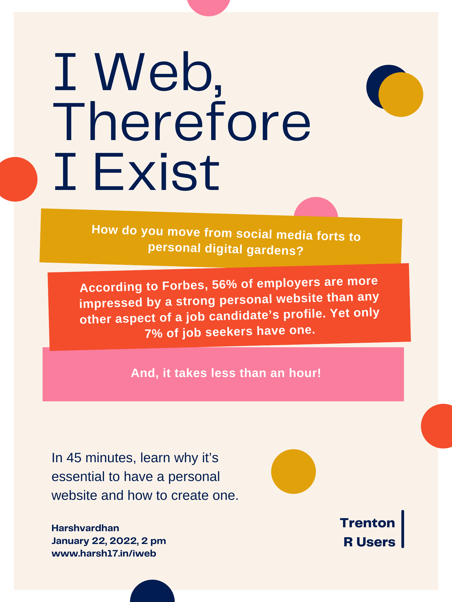

Animated Slides: [Keynote](https://drive.google.com/file/d/1grOse1OGVCaTnT_DX_rGTrxSTCUTUjz1/view?usp=sharing)

Static Slides: [PDF](/docs/talks/iweb-talk.pdf)

Session Recording: [YouTube](https://www.youtube.com/watch?v=qZJ9lusozvo)

------------------------------------------------------------------------

#### Abstract

Websites used to be developed by groups of people to meet the needs of other groups of people. Today, as the internet grows more personalised than an encyclopedia of information, I argue we need more personal websites. Social media platforms are limited and occupational in treating your content. Your message might be curtailed by what LinkedIn allows or 280 characters on Twitter. Contrary to what many think, maintaining a personal website is neither difficult nor expensive. Unfortunately, creating a website is approached as a "technology problem" to be solved. Projects are coloured from the beginning by enthusiasms for or fear for HTML, CSS and other fancy jargon --- when it doesn't have to be so.

I was thrilled to present this talk at the Trenton R Users group. Generally speaking, I discussed ideas on why having a personal website is critical and how one can create it easily.

#### Poster

**TRU Meetup Link: <https://www.meetup.com/TRUgroup/events/282732043/>**
